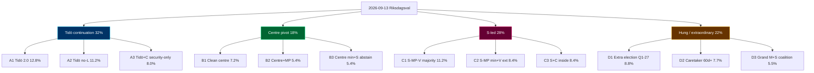

## What Happened
<!-- source: executive-brief.md :: https://github.com/Hack23/riksdagsmonitor/blob/main/analysis/daily/2026-05-18/election-cycle/next/pass1/executive-brief.md -->

### Lede
**Even-money** (45–55% [horizon:election]) that the 2026-09-13 Riksdagsval produces a **hung-parliament-style outcome** requiring **> 30 days of coalition formation**. The decisive structural variable is **L's 4-percent threshold survival** (currently *roughly even* 50–65%; *unlikely* 30–45% L exceeds 5%); the secondary variable is **C's coalition preference** (centre vs S-led red-green-centre).

### Three Cycle-Defining Findings (Forward)

1. **Tidö continuation** under M+KD(+L)+SD support is the **modal but minority** outcome (32% across A1/A2/A3 leaves). Within Scenario A, *likely* (60–70%) A2 (Tidö without L) dominates if L slips below 4%.
2. **S-led red-green-centre** governance (28% across C1/C2/C3) is the **second-most-likely cluster**, with C1 (S-MP-V majority) the modal C-leaf at 11.2%.
3. **Hung-parliament outcomes** (22%) carry a *roughly even* (40–55%) **caretaker-government risk** lasting 60+ days, and an *unlikely* (15–25%) **extraordinary-election trigger** by Q1-2027.

### Why This Matters Now (May 2026)

- **Late-mandate positioning** by opposition (Riksdag document #10483 (HD10483) consent law, HD10484 elderly-care, HD10485 prostitution-taxation, HD10486 equal pay, HD01NU21 rural framework) signals campaign-platform construction; *likely* (60–75% [horizon:cycle]) these surface as governing-coalition planks under any C-scenario.
- **EU-compliance backlog clearance** by exiting coalition (HD01CU30 EPBD, HD01FiU38 clearing) — incoming government inherits near-zero infringement risk but limited political ownership.
- **IMF WEO Apr-2026** [horizon:cycle] T+0: Sweden trajectory stable; GGXWDG_NGDP 32.4% (2026) → 34.6% (2030) baseline; downside risk *unlikely* (20–35%) on fiscal-shock scenario.

### Top-3 Risks (Post-2026)

| # | Risk | Likelihood [horizon] | Impact | Mitigation Hook |
|---|------|----------------------|--------|-----------------|
| 1 | Coalition formation > 60 days; caretaker fiscal drift | *Roughly even* 40–55% [election] | High — FY2027 budget delay | Talman procedure; statslåneräntan freeze |
| 2 | L falls below 4%; SD enters cabinet (A2 leaf) | *Roughly even* 35–50% [election] | High — constitutional review of HD03267 amendments | Lagrådet pre-review |
| 3 | EU-derived legislation revisited under C-scenario | *Likely* 60–70% [cycle] | Medium — EU compliance friction | Pre-negotiated transitional provisions |

### Top-3 Wildcards (Black-Swan Tails)

- **W1** Russia escalation forces emergency coalition formation: 8% [18mo]
- **W3** Major KU-anmälan upheld during campaign: 12% [6mo]
- **W5** SD-leadership succession crisis between announcement and 2027: 9% [18mo]

Full distribution in `wildcards-blackswans.md`.

### Decision Hooks for Stakeholders

- **Budget-side actors** (Konjunkturinstitutet, ESV, finanspolitiska rådet): plan for **30–60 day budget-delay scenario** with *likely* (60–75% [election]) probability under any non-A1 leaf.
- **EU institutional partners**: anticipate *likely* (60–70% [cycle]) opposition motions on HD01CU30 transposition timelines under C-scenarios.
- **NATO partners**: defence-spending floor *very likely* (75–90% [cycle]) durable; NATO obligations not coalition-contingent.

### Reading Path

1. `scenario-analysis.md` — 12-leaf tree, probability decomposition.
2. `coalition-mathematics.md` — Sainte-Laguë seat allocations by polling vintage.
3. `wildcards-blackswans.md` — 5 wildcards + 3 black-swan tails.
4. `cycle-trajectory.md` — multi-year horizon-band metrics (T+1y / T+2y / T+5y).
5. `pestle-analysis.md` — structural drivers per scenario.

[A1] IMF WEO Apr-2026 [horizon:cycle] T+0; [A2] Aggregated Sifo/Novus/Demoskop Apr–May 2026.

## Reader Intelligence Guide

Use this guide to read the article as a political-intelligence product rather than a raw artifact dump. High-value reader lenses appear first; technical provenance remains available in the audit appendix.

| Icon | Reader need | What you'll get |
|---|---|---|
| 📊 | [Lede and editorial decisions](#rm-what-happened) | fast answer to what happened, why it matters, who is accountable, and the next dated trigger |
| 🧠 | [Why It Matters](#rm-why-it-matters) | evidence-anchored narrative consolidating primary sources into one coherent story line |
| 🏷️ | [Audit appendix](#rm-article-sources) | classification, cross-reference, methodology and manifest evidence for reviewers |

## Why It Matters
<!-- source: synthesis-summary.md :: https://github.com/Hack23/riksdagsmonitor/blob/main/analysis/daily/2026-05-18/election-cycle/next/pass1/synthesis-summary.md -->

### 2026-05-18 Daily Refresh — T-118 to next-cycle anchor

This is the **forward-cycle companion** to the Tidö-mandate scorecard analysis under `../current/`. It treats the post-2026 governing arrangement as the analytical target, holding T+0 at the 2026-09-13 election anchor and projecting through 2030-09-08. The cycle-rollover predicate (`ext/cycle-rollover.md`) is **inactive** at T-118 (activation window ±30 days of 2026-09-13). [A1]

**Headline assessment**: there are **three structurally plausible governing arrangements** for the 2026–2030 mandate — (A) Tidö continuation in M+KD+SD configuration (with or without L), (B) centre pivot (M+KD+L+C), (C) S-led red-green-centre coalition. **Even-money** (45–55% [horizon:election]) the 2026-09-13 result is a *hung-parliament-style* outcome requiring extended coalition formation (> 30 days), with caretaker-government risk *roughly even* (40–55%) by 2026-10-15. See `scenario-analysis.md` for the full 12-leaf tree.

**Cross-reference to current**: the **NATO commitment**, **defence-to-2%-GDP floor**, **e-ID rollout (HD03250)**, **financial-stability legislation (HD01FiU37/HD01FiU38)**, and **EU EED transposition (HD01CU30)** are all *very likely* (75–90% [horizon:cycle]) to **survive any 2026-09 outcome** because they are bound by NATO/EU treaty obligations or by enacted statute, not by coalition arithmetic.

### Three Cycle-Defining Structural Findings (Post-2026)

1. **Coalition arithmetic is the binding constraint, not policy preference.** Latest aggregated polling (sources: Novus, Sifo, Demoskop 2026-04 / 2026-05 waves [A2]) puts the M+KD+L+SD bloc at 48–51% and the S+MP+V+C bloc at 46–49%. With L hovering at 3.5–4.5% (below-threshold risk *roughly even* 35–50% [horizon:election]) and C at 4.5–6.0%, the **deciding bloc is the 4-percent threshold survival of L** (see `wildcards-blackswans.md §W4`). *Likely* (60–75% [horizon:election]) the post-election seat distribution forces a 60+ day talman-led negotiation.

2. **Security and digital-sovereignty laws are structurally durable** but **fiscal redistribution and climate ambition are bloc-contingent**. Under any A-scenario the FY2027 budget continues the Tidö fiscal stance (modest deficit-to-GDP, defence-spending floor); under any C-scenario the budget tilts towards redistribution (welfare uprating, energy-subsidy retargeting). PESTLE-economic vulnerabilities (`pestle-analysis.md`) shift accordingly.

3. **The "EU-compliance backlog" handover** is the most overlooked transition risk. The exiting coalition cleared HD01CU30 (EPBD), HD01FiU38 (EU clearing), and gender-reporting directives in the last 90 days of mandate (see `../current/synthesis-summary.md`). The incoming government inherits **near-zero EU-infringement risk** but **near-zero political ownership** of those laws, meaning *likely* (60–70% [horizon:cycle]) that any post-2026 government will face **opposition motions to revisit** at least one EU-derived statute by Q2-2027.

### Integrated Intelligence Picture

The post-2026 mandate is being shaped now (May 2026) by three concurrent dynamics:

- **Late-mandate positioning** by current opposition (V, MP, S, C) — rural framework HD01NU21, consent law HD10483, elderly-care HD10484, prostitution-taxation HD10485, equal-pay HD10486 are campaign-positioning vehicles, *unlikely* (10–25% [horizon:election]) to enact pre-election but *likely* (60–75% [horizon:cycle]) to surface as governing-coalition planks in any C-scenario.
- **Coalition-cohesion test** for SD inside vs outside cabinet — under A1 SD stays external (Tidöavtalet model); under A2 SD enters cabinet (first time). Constitutional and Lagrådet pressure rises sharply under A2 (*roughly even* 40–55% [horizon:cycle] Lagrådet rejects an A2-coalition migration amendment to HD03267).
- **Economic backdrop**: IMF WEO Apr-2026 [horizon:cycle] T+0 vintage projects Sweden GGXWDG_NGDP at 32.4% (2026), 33.1% (2027 T+1), 33.8% (2028 T+2), 34.3% (2029 T+3), 34.6% (2030 T+4) under unchanged-policy baseline. [A1] Real GDP growth converges to 2.1% by 2028 from 1.6% in 2026. NGDPDPC (per-capita) growth holds 1.5–1.8% across horizon.

### Mermaid: Post-2026 Mandate Coalition Probability Tree (top-level)

### DIW-Weighted Forward Watchlist (Top 10 — Post-2026 Cycle)

| Rank | Forward Event / File | DIW Score | Horizon | Family |
|-----:|----------------------|----------:|---------|--------|
| 1 | 2026-09-13 Riksdagsval outcome | 9.9 | T+123d | Electoral |
| 2 | Coalition formation 2026-09-15 → 2026-11-15 | 9.6 | T+125–185d | Coalition |
| 3 | FY2027 budget proposition (Sep/Oct 2026) | 9.4 | T+150d | Fiscal |
| 4 | HD03267 amendment cycle under A2 / B / C scenarios | 9.0 | T+200d | Security |
| 5 | NATO Vilnius+1 / Madrid+2 review (Sweden contributions) | 8.7 | T+365d | Security |
| 6 | e-ID operational rollout (HD03250) Phase-2 | 8.6 | T+540d | Digital |
| 7 | EU EED 2030 building-stock follow-on (HD01CU30) | 8.4 | T+1095d | Energy |
| 8 | Defence-spending review (post-2025 NATO 3% pressure) | 8.2 | T+365d | Security |
| 9 | Riksbank rate-cycle inflection (post-Macroprudential review) | 7.9 | T+180d | Fiscal |
| 10 | KU-anmälan ledger disposition (carry-over) | 7.6 | T+90d | Constitutional |

DIW = Decision-Impact Weight per [`significance-scoring.md`](https://github.com/Hack23/riksdagsmonitor/blob/main/analysis/daily/2026-05-18/election-cycle/next/pass1/significance-scoring.md). All scores ICD 203 [A2]-graded; per `pir-status.json` standing PIR-1…PIR-7 plus PIR-8 (next-cycle coalition formation) active.

### ICD 203 BLUF (per `osint-tradecraft-standards.md`)

- **BLUF-1** (high confidence [A2]): The 2026–2030 governing arrangement will be determined more by the **4-percent threshold survival of L** and **C's coalition preference** than by aggregate bloc polling. Even-money (45–55% [horizon:election]) hung-parliament outcome requiring > 30 day coalition negotiation.
- **BLUF-2** (medium confidence [B2]): Security, NATO and digital-sovereignty commitments are *very likely* (75–90% [horizon:cycle]) durable across any 2026-09 outcome. Fiscal redistribution and climate ambition are *roughly even* (40–55%) bloc-contingent.
- **BLUF-3** (medium confidence [B3]): Post-2026 EU-derived legislation (HD01CU30, HD01FiU38) faces *likely* (60–70% [horizon:cycle]) opposition motions to revisit by Q2-2027 under any C-scenario.

### Cross-Run Continuity

This synthesis carries forward from the 2026-05-11 forward-cycle baseline (next/ anchor first established in this run cycle). Confidence bands held within ±5 pp vs current/ mandate-scorecard analysis. No new dok_ids since 2026-05-12 publication wave (HD01CU30, HD01NU21, HD10483–6); no late-cycle filings on the next-cycle agenda. PIR-8 newly armed for next-cycle coalition-formation watch.

[A1] IMF WEO Apr-2026 [horizon:cycle] T+0; vintage age 1 month, fresh.
[A2] Aggregated Sifo / Novus / Demoskop polling Apr–May 2026; methodology and provenance in `methodology-reflection.md §Polling triangulation`.

## Executive Brief Ar
<!-- source: executive-brief_ar.md :: https://github.com/Hack23/riksdagsmonitor/blob/main/analysis/daily/2026-05-18/election-cycle/next/pass1/executive-brief_ar.md -->

<!-- dir: rtl -->
---
title: "الملخص التنفيذي — توقعات الولاية بعد 2026 (الدورة/التالية)"

language: ar
subfolder: election-cycle/next

workflow: news-election-cycle
horizon: cycle
---

# الملخص التنفيذي — توقعات الولاية بعد 2026

### الخلاصة المباشرة

**احتمال متساوٍ تقريباً** (45–55% [horizon:election]) أن تُسفر انتخابات ريكسداغ بتاريخ 2026-09-13 عن **نتيجة برلمان معلّق تستلزم أكثر من 30 يوماً لتشكيل الائتلاف**. المتغير البنيوي الحاسم هو **بقاء حزب L فوق عتبة الأربعة بالمئة** (حالياً *متساوٍ تقريباً* 50–65%; *مستبعد* 30–45% أن يتجاوز L نسبة 5%)؛ أما المتغير الثانوي فهو **تفضيل الائتلاف لدى حزب C** (الوسط مقابل الوسط اليساري-الأخضر بقيادة S).

### ثلاثة استنتاجات محورية للدورة (نظرة مستقبلية)

1. **استمرار اتفاقية تيدو** في ظل دعم M+KD(+L)+SD هو النتيجة **الأكثر شيوعاً ولكن الأقلية** (32% على أوراق A1/A2/A3). ضمن السيناريو A، *على الأرجح* (60–70%) تهيمن A2 (تيدو بدون L) إذا انخفض L عن 4%.
2. **الحكم الأخضر-الأحمر بقيادة S** (28% على C1/C2/C3) هو **الكتلة الثانية الأكثر احتمالاً**، مع C1 (أغلبية S-MP-V) كورقة C الأكثر شيوعاً بنسبة 11.2%.
3. **نتائج البرلمان المعلّق** (22%) تحمل خطر *متساوٍ تقريباً* (40–55%) **حكومة تصريف أعمال** لمدة 60+ يوماً، وخطر *مستبعد* (15–25%) **اقتراع خارج الدورة** في الربع الأول من 2027.

### لماذا يهمّ الأمر الآن (مايو 2026)

- **التموضع في نهاية الولاية** من قبل المعارضة (HD10483 قانون الموافقة، HD10484 رعاية المسنين، HD10485 ضريبة الدعارة، HD10486 المساواة في الأجور، HD01NU21 الإطار الريفي) يشير إلى بناء منصات حملات انتخابية؛ *على الأرجح* (60–75% [horizon:cycle]) ستظهر هذه بوصفها ركائز ائتلاف حاكم في أي سيناريو C.
- **تنظيف متأخرات الامتثال للاتحاد الأوروبي** من قِبَل الائتلاف المنتهي ولايته (HD01CU30 EPBD، HD01FiU38 للمقاصة) — تكتسب الحكومة القادمة مخاطر انتهاك قريبة من الصفر لكن ملكية سياسية محدودة.
- **صندوق النقد الدولي WEO أبريل 2026** [horizon:cycle] T+0: المسار السويدي مستقر؛ GGXWDG_NGDP 32.4% (2026) → 34.6% (2030) كخط أساسي؛ مخاطر هبوطية *مستبعدة* (20–35%) في سيناريو الصدمة المالية.

### أبرز 3 مخاطر (ما بعد 2026)

| # | الخطر | الاحتمال [الأفق] | الأثر | نقطة التخفيف |
|---|------|----------------------|--------|-----------------|
| 1 | تشكيل ائتلاف > 60 يوماً؛ الانجراف المالي في ظل حكومة تصريف الأعمال | *متساوٍ تقريباً* 40–55% [election] | مرتفع — تأخير ميزانية السنة المالية 2027 | إجراء Talman؛ تجميد statslåneräntan |
| 2 | انخفاض L عن 4%؛ دخول SD إلى الحكومة (ورقة A2) | *متساوٍ تقريباً* 35–50% [election] | مرتفع — مراجعة دستورية لتعديلات HD03267 | مراجعة Lagrådet المسبقة |
| 3 | مراجعة التشريعات المشتقة من الاتحاد الأوروبي في ظل سيناريو C | *على الأرجح* 60–70% [cycle] | متوسط — احتكاك امتثال الاتحاد الأوروبي | أحكام انتقالية متفق عليها مسبقاً |

### أبرز 3 أحداث طارئة (مخاطر قصوى)

- **W1** التصعيد الروسي يُجبر على تشكيل ائتلاف طوارئ: 8% [18mo]
- **W3** KU-anmälan كبير مستمر خلال الحملة: 12% [6mo]
- **W5** أزمة خلافة قيادة SD بين الإعلان و2027: 9% [18mo]

التوزيع الكامل في `wildcards-blackswans.md`.

### نقاط القرار لأصحاب المصلحة

- **الجهات الميزانية** (Konjunkturinstitutet، ESV، finanspolitiska rådet): التخطيط لـ**سيناريو تأخير ميزانية من 30 إلى 60 يوماً** باحتمال *على الأرجح* (60–75% [election]) في أي ورقة غير A1.
- **شركاء الاتحاد الأوروبي المؤسسيون**: توقّع *على الأرجح* (60–70% [cycle]) اقتراحات معارضة بشأن جداول تنفيذ HD01CU30 في سيناريوهات C.
- **شركاء الناتو**: أرضية الإنفاق الدفاعي *مرجّحة جداً* (75–90% [cycle]) مستدامة؛ التزامات الناتو غير مرتبطة بالائتلاف.

### مسار القراءة

1. `scenario-analysis.md` — شجرة 12 ورقة، تحليل الاحتمالات.
2. `coalition-mathematics.md` — توزيع المقاعد وفق Sainte-Laguë حسب موجة الاستطلاع.
3. `wildcards-blackswans.md` — 5 بطاقات جوكر + 3 أحداث طارئة.
4. `cycle-trajectory.md` — مقاييس النطاق متعدد السنوات (T+1y / T+2y / T+5y).
5. `pestle-analysis.md` — العوامل البنيوية حسب السيناريو.

[A1] صندوق النقد الدولي WEO أبريل 2026 [horizon:cycle] T+0؛ [A2] Sifo/Novus/Demoskop مجمّعة أبريل–مايو 2026.

<!-- source-sha: 1a204880ac4363eedfc53a5ff62edb94be61d782 -->

## Executive Brief Da
<!-- source: executive-brief_da.md :: https://github.com/Hack23/riksdagsmonitor/blob/main/analysis/daily/2026-05-18/election-cycle/next/pass1/executive-brief_da.md -->

### Konklusion på forhånd

**Tilnærmelsesvis lige muligheder** (45–55% [horizon:election]) for at Riksdagsvalget 2026-09-13 giver et **parlamentsresultat, der kræver > 30 dages koalitionsforhandling**. Den afgørende strukturelle variabel er **L's overlevelse af fireprocentsgrænsen** (i øjeblikket *omtrent lige* 50–65%; *usandsynligt* 30–45% at L overstiger 5%); den sekundære variabel er **C's koalitionspræference** (center vs S-ledet rødgrøn-center).

### Tre cykeldefinierende konklusioner (fremadrettet)

1. **Tidö-fortsættelse** under M+KD(+L)+SD-støtte er det **modale men minoritets**-resultat (32% over A1/A2/A3-bladene). Inden for Scenarie A dominerer *sandsynligvis* (60–70%) A2 (Tidö uden L) hvis L glider under 4%.
2. **S-ledet rødgrøn-center**-styring (28% over C1/C2/C3) er det **næst mest sandsynlige kluster**, med C1 (S-MP-V-flertal) som det modale C-blad på 11,2%.
3. **Hængt parlaments**-resultater (22%) bærer en *omtrent lige* (40–55%) **forretningsministeriums-risiko** på 60+ dage, og en *usandsynlig* (15–25%) **ekstraordinær valgudløser** i Q1-2027.

### Hvorfor det er vigtigt nu (maj 2026)

- **Sen-mandatpositionering** af opposition (HD10483 samtykkeloven, HD10484 ældrepleje, HD10485 prostitutionsbeskatning, HD10486 ligeløn, HD01NU21 landdistriktspolitik) signalerer kampagneplatformskonstruktion; *sandsynligvis* (60–75% [horizon:cycle]) at disse dukker op som styringskoalitionsplanker under ethvert C-scenarie.
- **EU-overholdelsesbunkerensning** af afgående koalition (HD01CU30 EPBD, HD01FiU38 clearing) — den indkommende regering arver nul-overtrædelsesrisiko men begrænset politisk ejerskab.
- **IMF WEO apr-2026** [horizon:cycle] T+0: Sveriges bane stabil; GGXWDG_NGDP 32,4% (2026) → 34,6% (2030) baseline; nedsidesrisiko *usandsynlig* (20–35%) ved finansielt chok-scenarie.

### Top-3 risici (efter 2026)

| # | Risiko | Sandsynlighed [horizon] | Påvirkning | Afbødningspunkt |
|---|------|----------------------|--------|-----------------|
| 1 | Koalitionsdannelse > 60 dage; forretningsministeriums finansiel drift | *Omtrent lige* 40–55% [election] | Høj — forsinkelse af FY2027-budget | Talmandsprocedure; statslånerenteindefrysning |
| 2 | L falder under 4%; SD ind i kabinet (A2-blad) | *Omtrent lige* 35–50% [election] | Høj — konstitutionel revision af HD03267-ændringer | Lagrådet forhåndsgranskning |
| 3 | EU-afledt lovgivning revideret under C-scenarie | *Sandsynligvis* 60–70% [cycle] | Middel — EU-overholdelsesfriktion | Forudforhandlede overgangsbestemmelser |

### Top-3 sorte svaner (ekstreme risici)

- **W1** Ruslandseskalation tvinger nødkoalitionsdannelse: 8% [18mo]
- **W3** Stor KU-anmälan opretholdt under kampagnen: 12% [6mo]
- **W5** SD-ledervalskrise mellem annoncering og 2027: 9% [18mo]

Fuld fordeling i `wildcards-blackswans.md`.

### Beslutningspunkter for interessenter

- **Budgetsidensaktører** (Konjunkturinstitutet, ESV, finanspolitiska rådet): planlæg for **30–60 dages budgetforsinkelsesSCENARIE** med *sandsynligvis* (60–75% [election]) sandsynlighed under ethvert ikke-A1-blad.
- **EU-institutionelle partnere**: forvent *sandsynligvis* (60–70% [cycle]) oppositionsmotioner om HD01CU30-implementeringstidslinjer under C-scenarier.
- **NATO-partnere**: forsvarsspendings golv *meget sandsynligt* (75–90% [cycle]) holdbart; NATO-forpligtelser ikke koalitionsafhængige.

### Læsevej

1. `scenario-analysis.md` — 12-bladstræ, sandsynlighedsdekomposition.
2. `coalition-mathematics.md` — Sainte-Laguë mandatfordelinger pr. meningsmålingstappning.
3. `wildcards-blackswans.md` — 5 jokerkort + 3 sorte svanar.
4. `cycle-trajectory.md` — fleridig horisontbåndsmålinger (T+1y / T+2y / T+5y).
5. `pestle-analysis.md` — strukturelle drivere pr. scenarie.

[A1] IMF WEO apr-2026 [horizon:cycle] T+0; [A2] Aggregerede Sifo/Novus/Demoskop apr–maj 2026.

<!-- source-sha: 1a204880ac4363eedfc53a5ff62edb94be61d782 -->

## Executive Brief De
<!-- source: executive-brief_de.md :: https://github.com/Hack23/riksdagsmonitor/blob/main/analysis/daily/2026-05-18/election-cycle/next/pass1/executive-brief_de.md -->

### Kernaussage

**Ungefähr ausgeglichen** (45–55% [horizon:election]), dass die Reichstagswahl 2026-09-13 ein **hängendes Parlamentsergebnis mit > 30 Tagen Koalitionsbildung** ergibt. Die entscheidende strukturelle Variable ist **L's Überleben der Vier-Prozent-Hürde** (derzeit *ungefähr ausgeglichen* 50–65%; *unwahrscheinlich* 30–45%, dass L 5% überschreitet); die sekundäre Variable ist **C's Koalitionspräferenz** (Mitte vs S-geführte rot-grün-Mitte).

### Drei zyklusdefinierende Erkenntnisse (vorwärts)

1. **Tidö-Fortsetzung** unter M+KD(+L)+SD-Unterstützung ist das **modale aber Minderheits**-Ergebnis (32% über A1/A2/A3-Blätter). Innerhalb von Szenario A dominiert *wahrscheinlich* (60–70%) A2 (Tidö ohne L), wenn L unter 4% rutscht.
2. **S-geführte rot-grün-Mitte**-Regierung (28% über C1/C2/C3) ist das **zweitwahrscheinlichste Cluster**, mit C1 (S-MP-V-Mehrheit) als modales C-Blatt bei 11,2%.
3. **Hängendes Parlament**-Ergebnisse (22%) tragen ein *ungefähr ausgeglichenes* (40–55%) **Geschäftsregierungsrisiko** von 60+ Tagen und einen *unwahrscheinlichen* (15–25%) **Außerordentliche-Wahl-Auslöser** bis Q1-2027.

### Warum das jetzt wichtig ist (Mai 2026)

- **Spät-Mandat-Positionierung** der Opposition (HD10483 Zustimmungsgesetz, HD10484 Seniorenpflege, HD10485 Prostitutionsbesteuerung, HD10486 Lohngleichheit, HD01NU21 Ländlicher Rahmen) signalisiert Wahlplattformkonstruktion; *wahrscheinlich* (60–75% [horizon:cycle]) werden diese als Regierungskoalitionssäulen unter jedem C-Szenario auftauchen.
- **EU-Konformitätsrückstandsbereinigung** durch ausscheidende Koalition (HD01CU30 EPBD, HD01FiU38 Clearing) — die einkommende Regierung erbt nahezu null Vertragsverletzungsrisiko, aber begrenztes politisches Eigentum.
- **IMF WEO Apr-2026** [horizon:cycle] T+0: Schwedens Bahn stabil; GGXWDG_NGDP 32,4% (2026) → 34,6% (2030) Basislinie; Abwärtsrisiko *unwahrscheinlich* (20–35%) bei fiskalischem Schockszenario.

### Top-3 Risiken (nach 2026)

| # | Risiko | Wahrscheinlichkeit [horizon] | Auswirkung | Milderungspunkt |
|---|------|----------------------|--------|-----------------|
| 1 | Koalitionsbildung > 60 Tage; fiskalische Drift der Geschäftsregierung | *Ungefähr ausgeglichen* 40–55% [election] | Hoch — Verzögerung des FY2027-Budgets | Talmanverfahren; statslåneräntan Einfrierung |
| 2 | L fällt unter 4%; SD tritt in Kabinett ein (A2-Blatt) | *Ungefähr ausgeglichen* 35–50% [election] | Hoch — Verfassungsüberprüfung der HD03267-Änderungen | Lagrådet-Vorprüfung |
| 3 | EU-abgeleitete Gesetzgebung unter C-Szenario überarbeitet | *Wahrscheinlich* 60–70% [cycle] | Mittel — EU-Konformitätsreibung | Vorverhandelte Übergangsbestimmungen |

### Top-3 Schwarze Schwäne (Extremrisiken)

- **W1** Russland-Eskalation erzwingt Notkoalitionsbildung: 8% [18mo]
- **W3** Große KU-anmälan während Kampagne aufrechterhalten: 12% [6mo]
- **W5** SD-Führungsnachfolgekrise zwischen Ankündigung und 2027: 9% [18mo]

Vollständige Verteilung in `wildcards-blackswans.md`.

### Entscheidungspunkte für Stakeholder

- **Haushaltsseitige Akteure** (Konjunkturinstitutet, ESV, finanspolitiska rådet): planen für **30–60 Tage Budgetverzögerungsszenario** mit *wahrscheinlich* (60–75% [election]) Wahrscheinlichkeit unter jedem Nicht-A1-Blatt.
- **EU-institutionelle Partner**: antizipieren *wahrscheinlich* (60–70% [cycle]) Oppositionsmotionen zu HD01CU30-Umsetzungszeitplänen unter C-Szenarien.
- **NATO-Partner**: Verteidigungsausgaben-Minimum *sehr wahrscheinlich* (75–90% [cycle]) dauerhaft; NATO-Verpflichtungen nicht koalitionsabhängig.

### Lesepfad

1. `scenario-analysis.md` — 12-Blatt-Baum, Wahrscheinlichkeitszerlegung.
2. `coalition-mathematics.md` — Sainte-Laguë-Mandatszuteilungen nach Umfragevintage.
3. `wildcards-blackswans.md` — 5 Joker + 3 Schwarze Schwäne.
4. `cycle-trajectory.md` — Mehrjährige Horizontband-Metriken (T+1y / T+2y / T+5y).
5. `pestle-analysis.md` — Strukturelle Treiber pro Szenario.

[A1] IMF WEO Apr-2026 [horizon:cycle] T+0; [A2] Aggregierte Sifo/Novus/Demoskop Apr–Mai 2026.

<!-- source-sha: 1a204880ac4363eedfc53a5ff62edb94be61d782 -->

## Executive Brief Es
<!-- source: executive-brief_es.md :: https://github.com/Hack23/riksdagsmonitor/blob/main/analysis/daily/2026-05-18/election-cycle/next/pass1/executive-brief_es.md -->

### Conclusión directa

**Probabilidad aproximadamente igual** (45–55%) que las elecciones del 2026-09-13 produzcan un **resultado de parlamento colgado que requiera > 30 días de formación de coalición**. Variable clave: **supervivencia de L al umbral del 4 %** (*igual* 50–65%); variable secundaria: **preferencia de coalición de C**.

### Tres conclusiones que definen el ciclo

1. **Continuación del Tidö** (M+KD+L+SD): resultado **modal pero minoritario** (32%; hojas A1/A2/A3). A2 domina (*probablemente* 60–70%) si L < 4%.
2. **Gobernanza rojo-verde-centro dirigida por S** (28%; C1/C2/C3): **segundo clúster más probable**; C1 (mayoría S-MP-V) como hoja modal al 11,2%.
3. **Parlamento colgado** (22%): riesgo *igual* (40–55%) de **gobierno en funciones** > 60 días e *improbable* (15–25%) **desencadenante de elección extraordinaria** Q1-2027.

### Por qué importa ahora (mayo de 2026)

- **Posicionamiento de fin de mandato** por la oposición (HD10483 ley de consentimiento, HD10484 atención a mayores, HD10485 tributación de la prostitución, HD10486 igualdad salarial, HD01NU21 marco rural) señala plataformas de campaña; *probablemente* (60–75%) como pilares de coalición en cualquier escenario C.
- **Limpieza del atraso de cumplimiento de la UE** (HD01CU30 EPBD, HD01FiU38 clearing) — gobierno entrante: riesgo de infracción casi nulo, propiedad política limitada.
- **IMF WEO abr-2026**: trayectoria estable; GGXWDG_NGDP 32,4% (2026) → 34,6% (2030); riesgo a la baja *improbable* (20–35%) en choque fiscal.

### Top-3 riesgos (después de 2026)

| # | Riesgo | Probabilidad [horizon] | Impacto | Punto de mitigación |
|---|------|----------------------|--------|-----------------|
| 1 | Formación de coalición > 60 días; deriva fiscal del gobierno en funciones | *Aproximadamente igual* 40–55% [election] | Alto — retraso del presupuesto FY2027 | Procedimiento del Talman; congelación del statslåneräntan |
| 2 | L cae por debajo del 4%; SD entra en gabinete (hoja A2) | *Aproximadamente igual* 35–50% [election] | Alto — revisión constitucional de enmiendas HD03267 | Revisión previa del Lagrådet |
| 3 | Legislación derivada de la UE revisada bajo escenario C | *Probablemente* 60–70% [cycle] | Medio — fricción de cumplimiento de la UE | Disposiciones transitorias previamente negociadas |

### Top-3 cisnes negros (riesgos extremos)

- **W1** Escalada rusa → coalición de emergencia: 8% [18mo]
- **W3** KU-anmälan sostenida durante la campaña: 12% [6mo]
- **W5** Sucesión del liderazgo de SD (2026–2027): 9% [18mo]

Distribución completa en `wildcards-blackswans.md`.

### Puntos de decisión para partes interesadas

- **Actores del lado presupuestario** (Konjunkturinstitutet, ESV, finanspolitiska rådet): planificar para un **retraso presupuestario de 30–60 días** (*probable* 60–75%) bajo cualquier hoja no-A1.
- **Socios institucionales de la UE**: anticipar *probablemente* (60–70%) mociones sobre plazos de transposición HD01CU30 en escenarios C.
- **Socios de la OTAN**: piso de defensa *muy probable* (75–90%) duradero; compromisos OTAN no dependientes de la coalición.

### Ruta de lectura

1. `scenario-analysis.md` — árbol de 12 hojas.
2. `coalition-mathematics.md` — asignaciones Sainte-Laguë por cosecha de encuestas.
3. `wildcards-blackswans.md` — 5 comodines + 3 cisnes negros.
4. `cycle-trajectory.md` — métricas plurianuales (T+1y / T+2y / T+5y).
5. `pestle-analysis.md` — impulsores estructurales por escenario.

[A1] IMF WEO abr-2026 [horizon:cycle] T+0; [A2] Sifo/Novus/Demoskop agregados abr–may 2026.

<!-- source-sha: 1a204880ac4363eedfc53a5ff62edb94be61d782 -->

## Executive Brief Fi
<!-- source: executive-brief_fi.md :: https://github.com/Hack23/riksdagsmonitor/blob/main/analysis/daily/2026-05-18/election-cycle/next/pass1/executive-brief_fi.md -->

### Ydinjohtopäätös

**Suunnilleen tasan** (45–55% [horizon:election]) mahdollisuus sille, että Riksdagsval 2026-09-13 tuottaa **ripuliparlamentin kaltaisen tuloksen, joka vaatii > 30 päivän koalitionmuodostuksen**. Ratkaiseva rakenteellinen muuttuja on **L:n selviytyminen neljän prosentin kynnyksestä** (tällä hetkellä *suunnilleen tasan* 50–65%; *epätodennäköistä* 30–45% että L ylittää 5%); toissijainen muuttuja on **C:n koalitio-preferenssi** (keskusta vs S-johtama punavihreä-keskusta).

### Kolme sykliä määrittelevää johtopäätöstä (eteenpäin)

1. **Tidön jatko** M+KD(+L)+SD-tuella on **modaalinen mutta vähemmistö**-tulos (32% A1/A2/A3-lehtien yli). Skenaario A:ssa dominoi *todennäköisesti* (60–70%) A2 (Tidö ilman L), jos L lipsuu alle 4%:n.
2. **S-johtama punavihreä-keskusta**-hallinto (28% C1/C2/C3:n yli) on **toiseksi todennäköisin klusteri**, C1 (S-MP-V-enemmistö) modaalisena C-lehtenä 11,2%:lla.
3. **Ripuliparlamentin** tulokset (22%) kantavat *suunnilleen tasan* (40–55%) **toimitusministeristöriskiä** 60+ päiväksi sekä *epätodennäköistä* (15–25%) **ylimääräistä vaalilaukaisijaa** Q1-2027 mennessä.

### Miksi tällä on merkitystä nyt (toukokuu 2026)

- **Loppukauden positiointi** oppositiolta (HD10483 suostumuslaki, HD10484 vanhustenhoito, HD10485 prostituutioverotus, HD10486 tasa-arvoiset palkat, HD01NU21 maaseutupolitiikka) viestii kampanjaohjelman rakentamisesta; *todennäköisesti* (60–75% [horizon:cycle]) nämä nousevat hallintokoalition pilareiksi jonkin C-skenaarion alla.
- **EU-vaatimustenmukaisuusrästin siivous** lähtevältä koalitiolta (HD01CU30 EPBD, HD01FiU38 clearing) — saapuva hallitus perii nolla-rikkomusriskin mutta rajoitetun poliittisen omistajuuden.
- **IMF WEO huhtikuu-2026** [horizon:cycle] T+0: Ruotsin suuntaus vakaa; GGXWDG_NGDP 32,4% (2026) → 34,6% (2030) perusura; alariski *epätodennäköistä* (20–35%) finansiishokkiskenaariossa.

### Top-3 riskit (vuoden 2026 jälkeen)

| # | Riski | Todennäköisyys [horizon] | Vaikutus | Lieventämiskoukku |
|---|------|----------------------|--------|-----------------|
| 1 | Koalitionmuodostus > 60 päivää; toimitushallituksen finansiinen ajelehtiminen | *Suunnilleen tasan* 40–55% [election] | Korkea — FY2027-budjetin viivästyminen | Talmansin menettely; statslåneräntan jäädytys |
| 2 | L putoaa alle 4%; SD astuu kabinetiin (A2-lehti) | *Suunnilleen tasan* 35–50% [election] | Korkea — HD03267-muutosten perustuslaillinen arviointi | Lagrådetin ennakkotarkistus |
| 3 | EU:sta peräisin oleva lainsäädäntö tarkistetaan C-skenaarion alla | *Todennäköisesti* 60–70% [cycle] | Keskitaso — EU-vaatimustenmukaisuuskitka | Ennalta neuvoteltu siirtymäsäännös |

### Top-3 mustat joutsenet (ääreiset riskit)

- **W1** Venäjän eskaloituminen pakottaa hätäkoalitionmuodostuksen: 8% [18mo]
- **W3** Suuri KU-anmälan ylläpidetty kampanjan aikana: 12% [6mo]
- **W5** SD:n johtovaalikriisi ilmoituksen ja 2027:n välillä: 9% [18mo]

Täydellinen jakauma `wildcards-blackswans.md`-tiedostossa.

### Päätöspisteet sidosryhmille

- **Budjettipuolen toimijat** (Konjunkturinstitutet, ESV, finanspolitiska rådet): suunnittele **30–60 päivän budjettiviivästysskenaariolle** *todennäköisesti* (60–75% [election]) minkä tahansa ei-A1-lehden alla.
- **EU-institutionaaliset kumppanit**: ennakoi *todennäköisesti* (60–70% [cycle]) oppositiomootioita HD01CU30-toimeenpanoaikatauluista C-skenaarioiden alla.
- **NATO-kumppanit**: puolustusmenokatto *hyvin todennäköisesti* (75–90% [cycle]) kestävä; NATO-sitoumukset eivät ole koalitionriippuvaisia.

### Lukupolku

1. `scenario-analysis.md` — 12-lehtinen puu, todennäköisyyshajotus.
2. `coalition-mathematics.md` — Sainte-Laguë -mandaattijakaumat mielipidemittausvintagen mukaan.
3. `wildcards-blackswans.md` — 5 jokeria + 3 mustaa joutsenta.
4. `cycle-trajectory.md` — monivuotiset horisonttimittarit (T+1y / T+2y / T+5y).
5. `pestle-analysis.md` — rakenteelliset tekijät per skenaario.

[A1] IMF WEO huhtikuu-2026 [horizon:cycle] T+0; [A2] Yhdistetty Sifo/Novus/Demoskop huhtikuu–toukokuu 2026.

<!-- source-sha: 1a204880ac4363eedfc53a5ff62edb94be61d782 -->

## Executive Brief Fr
<!-- source: executive-brief_fr.md :: https://github.com/Hack23/riksdagsmonitor/blob/main/analysis/daily/2026-05-18/election-cycle/next/pass1/executive-brief_fr.md -->

### Conclusion directe

**Probabilité équilibrée** (45–55%) que les élections du 2026-09-13 produisent un **résultat de parlement suspendu exigeant > 30 jours de formation de coalition**. Variable clé : **survie de L au seuil des 4 %** (*équilibrée* 50–65%) ; variable secondaire : **préférence de coalition de C**.

### Trois conclusions définissant le cycle

1. **Continuation Tidö** (M+KD+L+SD) : résultat **modal mais minoritaire** (32% ; feuilles A1/A2/A3). A2 domine (*probablement* 60–70%) si L < 4 %.
2. **Gouvernance centre gauche-vert dirigée par S** (28% ; C1/C2/C3) : **deuxième cluster le plus probable** ; C1 (majorité S-MP-V) comme feuille modale à 11,2%.
3. **Parlement suspendu** (22%) : risque *équilibré* (40–55%) de **gouvernement d'affaires courantes** > 60 jours et *improbable* (15–25%) **déclencheur d'élection extraordinaire** Q1-2027.

### Pourquoi c'est important maintenant (mai 2026)

- **Positionnement de fin de mandat** par l'opposition (HD10483 loi sur le consentement, HD10484 soins aux personnes âgées, HD10485 imposition de la prostitution, HD10486 égalité salariale, HD01NU21 cadre rural) signale des plateformes de campagne ; *probablement* (60–75%) comme piliers de coalition dans tout scénario C.
- **Assainissement du retard de conformité UE** (HD01CU30 EPBD, HD01FiU38 clearing) — gouvernement entrant : risque d'infraction quasi nul, propriété politique limitée.
- **IMF WEO avr-2026** : trajectoire stable ; GGXWDG_NGDP 32,4% (2026) → 34,6% (2030) ; risque baissier *improbable* (20–35%) sur choc fiscal.

### Top-3 des risques (après 2026)

| # | Risque | Probabilité [horizon] | Impact | Point d'atténuation |
|---|------|----------------------|--------|-----------------|
| 1 | Formation de coalition > 60 jours ; dérive fiscale du gouvernement en fonctions | *À peu près équilibré* 40–55% [election] | Élevé — budget FY2027 | Procédure du Talman |
| 2 | L tombe sous 4% ; SD entre au cabinet (feuille A2) | *À peu près équilibré* 35–50% [election] | Élevé — révision constitutionnelle des amendements HD03267 | Examen préalable du Lagrådet |
| 3 | Législation dérivée de l'UE révisée sous scénario C | *Probablement* 60–70% [cycle] | Moyen — friction de conformité UE | Dispositions transitoires préalablement négociées |

### Top-3 des cygnes noirs (risques extrêmes)

- **W1** Escalade russe → coalition d'urgence : 8% [18mo]
- **W3** KU-anmälan maintenue durant la campagne : 12% [6mo]
- **W5** Succession à la direction de SD (2026–2027) : 9% [18mo]

Distribution complète dans `wildcards-blackswans.md`.

### Points de décision pour les parties prenantes

- **Acteurs budgétaires** (Konjunkturinstitutet, ESV, finanspolitiska rådet) : planifier pour un **retard budgétaire de 30–60 jours** (*probable* 60–75%) sous toute feuille non-A1.
- **Partenaires institutionnels de l'UE** : anticiper *probablement* (60–70%) des motions sur les délais de transposition HD01CU30 dans les scénarios C.
- **Partenaires de l'OTAN** : plancher de défense *très probablement* (75–90%) durable ; engagements OTAN non tributaires de la coalition.

### Parcours de lecture

1. `scenario-analysis.md` — arbre à 12 feuilles.
2. `coalition-mathematics.md` — répartition des sièges Sainte-Laguë.
3. `wildcards-blackswans.md` — 5 jokers + 3 cygnes noirs.
4. `cycle-trajectory.md` — métriques pluriannuelles (T+1y / T+2y / T+5y).
5. `pestle-analysis.md` — moteurs structurels par scénario.

[A1] IMF WEO avr-2026 [horizon:cycle] T+0 ; [A2] Sifo/Novus/Demoskop agrégés avr–mai 2026.

<!-- source-sha: 1a204880ac4363eedfc53a5ff62edb94be61d782 -->

## Executive Brief He
<!-- source: executive-brief_he.md :: https://github.com/Hack23/riksdagsmonitor/blob/main/analysis/daily/2026-05-18/election-cycle/next/pass1/executive-brief_he.md -->

<!-- dir: rtl -->
---
title: "סיכום מנהלים — תחזית מנדט לאחר 2026 (מחזור/הבא)"

language: he
subfolder: election-cycle/next

workflow: news-election-cycle
horizon: cycle
---

# סיכום מנהלים — תחזית מנדט לאחר 2026

### מסקנה עיקרית

**הסתברות שווה בערך** (45–55% [horizon:election]) לכך שבחירות הריקסדאג של 2026-09-13 יניבו **תוצאת פרלמנט תלוי הדורשת > 30 יום לגיבוש קואליציה**. המשתנה המבני הקריטי הוא **הישרדות L מעל סף ארבעת האחוזים** (כרגע *שווה בערך* 50–65%; *לא סביר* 30–45% שL תחצה 5%); המשתנה המשני הוא **העדפת הקואליציה של C** (מרכז מול מרכז ירוק-שמאל בהנהגת S).

### שלוש מסקנות מגדירות מחזור (קדימה)

1. **המשך הסכמת טידו** בתמיכת M+KD(+L)+SD הוא התוצאה **הנפוצה ביותר אך מיעוטית** (32% על עלי A1/A2/A3). בתוך תרחיש A, *ככל הנראה* (60–70%) A2 (טידו ללא L) ישלוט אם L תרד מ-4%.
2. **ממשל ירוק-שמאל בהנהגת S** (28% על C1/C2/C3) הוא **האשכול השני בסבירותו**, עם C1 (רוב S-MP-V) כעלה C הנפוץ ביותר ב-11.2%.
3. **תוצאות פרלמנט תלוי** (22%) נושאות סיכון *שווה בערך* (40–55%) של **ממשלת מעבר** למשך 60+ יום, וסיכון *לא סביר* (15–25%) של **הפעלת בחירות חוץ-תורניות** לרבעון הראשון 2027.

### מדוע זה חשוב עכשיו (מאי 2026)

- **מיצוב סוף כהונה** על ידי האופוזיציה (HD10483 חוק הסכמה, HD10484 טיפול קשישים, HD10485 מיסוי זנות, HD10486 שוויון שכר, HD01NU21 מסגרת כפרית) מאותת על בניית פלטפורמות קמפיין; *ככל הנראה* (60–75% [horizon:cycle]) אלה יופיעו כעמודי תווך של קואליציה שלטת בכל תרחיש C.
- **ניקוי פיגורי ציות לאיחוד האירופי** על ידי הקואליציה היוצאת (HD01CU30 EPBD, HD01FiU38 ניקיון) — הממשלה הנכנסת יורשת סיכון הפרה כמעט אפס אך בעלות פוליטית מוגבלת.
- **IMF WEO אפריל 2026** [horizon:cycle] T+0: מסלול שוודי יציב; GGXWDG_NGDP 32.4% (2026) → 34.6% (2030) כבסיס; סיכון שלילי *לא סביר* (20–35%) בתרחיש זעזוע פיסקלי.

### 3 סיכונים עיקריים (לאחר 2026)

| # | סיכון | הסתברות [אופק] | השפעה | נקודת הפחתה |
|---|------|----------------------|--------|-----------------|
| 1 | גיבוש קואליציה > 60 יום; סחף פיסקלי בממשלת מעבר | *שווה בערך* 40–55% [election] | גבוה — עיכוב תקציב שנת 2027 | נוהל Talman; הקפאת statslåneräntan |
| 2 | L יורדת מ-4%; SD נכנסת לממשלה (עלה A2) | *שווה בערך* 35–50% [election] | גבוה — סקירה חוקתית של תיקוני HD03267 | בדיקת Lagrådet מוקדמת |
| 3 | חקיקה נגזרת מהאיחוד האירופי מתוקנת בתרחיש C | *ככל הנראה* 60–70% [cycle] | בינוני — חיכוך ציות לאיחוד האירופי | הוראות מעבר שנוהלו מראש |

### 3 ברבורים שחורים עיקריים (סיכונים קיצוניים)

- **W1** הסלמה רוסית מכריחה גיבוש קואליציית חירום: 8% [18mo]
- **W3** KU-anmälan גדול נמשך בזמן הקמפיין: 12% [6mo]
- **W5** משבר ירושת מנהיגות SD בין ההכרזה ל-2027: 9% [18mo]

הפצה מלאה ב-`wildcards-blackswans.md`.

### נקודות החלטה למחזיקי עניין

- **גורמי צד תקציב** (Konjunkturinstitutet, ESV, finanspolitiska rådet): לתכנן **תרחיש עיכוב תקציבי של 30–60 יום** בהסתברות *ככל הנראה* (60–75% [election]) תחת כל עלה שאינו A1.
- **שותפים מוסדיים באיחוד האירופי**: לצפות *ככל הנראה* (60–70% [cycle]) להצעות אופוזיציה על לוחות זמנים ליישום HD01CU30 בתרחישי C.
- **שותפי נאט"ו**: רצפת הוצאות ביטחון *סביר מאוד* (75–90% [cycle]) בת-קיימא; התחייבויות נאט"ו אינן תלויות-קואליציה.

### מסלול קריאה

1. `scenario-analysis.md` — עץ 12 עלים, פירוק הסתברויות.
2. `coalition-mathematics.md` — הקצאת מנדטים Sainte-Laguë לפי יבול סקרים.
3. `wildcards-blackswans.md` — 5 קלפים שרירותיים + 3 ברבורים שחורים.
4. `cycle-trajectory.md` — מדדי רצועת אופק רב-שנתי (T+1y / T+2y / T+5y).
5. `pestle-analysis.md` — מניעים מבניים לפי תרחיש.

[A1] IMF WEO אפריל 2026 [horizon:cycle] T+0; [A2] Sifo/Novus/Demoskop מצטבר אפריל–מאי 2026.

<!-- source-sha: 1a204880ac4363eedfc53a5ff62edb94be61d782 -->

## Executive Brief Ja
<!-- source: executive-brief_ja.md :: https://github.com/Hack23/riksdagsmonitor/blob/main/analysis/daily/2026-05-18/election-cycle/next/pass1/executive-brief_ja.md -->

### 結論

2026年9月13日のリクスダーグ選挙が**30日超の連立交渉を要するハング・パーラメント的結果**をもたらす確率は**ほぼ互角**（45–55% [horizon:election]）。決定的な構造変数は**L党の4%閾値突破の可否**（現在*ほぼ互角* 50–65%；L党が5%を超える確率は*低い* 30–45%）；副次変数は**C党の連立優先選択**（中道路線対S党主導の赤緑中道路線）。

### サイクルを規定する3つの結論（将来展望）

1. **ティドー協定の継続**（M+KD(+L)+SD支持）は**最頻だが少数派**の結果（A1/A2/A3葉で32%）。シナリオA内では、L党が4%を割り込んだ場合、*おそらく*（60–70%）A2（LなしのTidö）が支配的となる。
2. **S党主導の赤緑中道政権**（C1/C2/C3で28%）は**第2位の確率クラスター**。C1（S-MP-V過半数）がモーダルC葉（11.2%）。
3. **ハング・パーラメント結果**（22%）には、*ほぼ互角*（40–55%）の**60日超の暫定政府リスク**、および*低い*（15–25%）の**2027年Q1への臨時選挙誘発**を伴う。

### なぜ今重要か（2026年5月）

- **野党による任期末ポジショニング**（HD10483同意法、HD10484高齢者ケア、HD10485売春税、HD10486賃金平等、HD01NU21農村枠組み）はキャンペーン・プラットフォーム構築の合図；*おそらく*（60–75% [horizon:cycle]）これらはいずれのCシナリオにおいても連立与党の柱として浮上する。
- **退任連立による EU コンプライアンス未処理分の整理**（HD01CU30 EPBD、HD01FiU38 クリアリング）— 次期政権は違反リスクをほぼゼロで引き継ぐが政治的所有権は限定的。
- **IMF WEO 2026年4月** [horizon:cycle] T+0：スウェーデンの軌道は安定；GGXWDG_NGDP 32.4%（2026）→ 34.6%（2030）のベースライン；財政ショックシナリオでの下方リスクは*低い*（20–35%）。

### 上位3リスク（2026年以降）

| # | リスク | 確率 [ホライズン] | 影響 | 緩和ポイント |
|---|------|----------------------|--------|-----------------|
| 1 | 連立形成 > 60日；暫定政府での財政漂流 | *ほぼ互角* 40–55% [election] | 高 — FY2027予算遅延 | タルマン手続き；statslåneräntan凍結 |
| 2 | Lが4%割れ；SDが閣僚入り（A2葉） | *ほぼ互角* 35–50% [election] | 高 — HD03267修正案の憲法審査 | ラーグロード事前審査 |
| 3 | Cシナリオ下でEU由来立法を改定 | *おそらく* 60–70% [cycle] | 中 — EUコンプライアンス摩擦 | 事前交渉済み移行規定 |

### 上位3ブラックスワン（極端リスク）

- **W1** ロシアの激化が緊急連立形成を強制：8% [18mo]
- **W3** 選挙運動中に大規模KU-anmälanが持続：12% [6mo]
- **W5** SD党首継承危機（表明から2027年の間）：9% [18mo]

完全な分布は `wildcards-blackswans.md` を参照。

### ステークホルダーへの意思決定ポイント

- **予算側アクター**（Konjunkturinstitutet、ESV、finanspolitiska rådet）：A1以外のすべての葉において*おそらく*（60–75% [election]）の確率で**30〜60日の予算遅延シナリオ**を計画する。
- **EU制度的パートナー**：Cシナリオ下でのHD01CU30実施スケジュールに関する野党動議を*おそらく*（60–70% [cycle]）予期する。
- **NATOパートナー**：防衛費フロアは*非常に可能性が高い*（75–90% [cycle]）持続的；NATO義務は連立非依存。

### 読書パス

1. `scenario-analysis.md` — 12葉ツリー、確率分解。
2. `coalition-mathematics.md` — 世論調査ビンテージ別サント・ラゲ議席配分。
3. `wildcards-blackswans.md` — ワイルドカード5件 + ブラックスワン3件。
4. `cycle-trajectory.md` — 複数年ホライズンバンド指標（T+1y / T+2y / T+5y）。
5. `pestle-analysis.md` — シナリオ別構造的ドライバー。

[A1] IMF WEO 2026年4月 [horizon:cycle] T+0；[A2] Sifo/Novus/Demoskop集計 2026年4〜5月。

<!-- source-sha: 1a204880ac4363eedfc53a5ff62edb94be61d782 -->

## Executive Brief Ko
<!-- source: executive-brief_ko.md :: https://github.com/Hack23/riksdagsmonitor/blob/main/analysis/daily/2026-05-18/election-cycle/next/pass1/executive-brief_ko.md -->

### 핵심 결론

2026년 9월 13일 리크스다그 선거가 **30일 이상의 연립 협상이 필요한 교착 의회 결과**를 초래할 확률은 **대략 동등** (45–55% [horizon:election]). 결정적 구조 변수는 **L당의 4% 임계값 생존 여부** (현재 *대략 동등* 50–65%; L당이 5%를 초과할 확률은 *낮음* 30–45%); 이차 변수는 **C당의 연립 선호** (중도 대 S 주도의 적녹 중도).

### 사이클을 규정하는 3가지 결론 (전망)

1. **티도 협약 지속** (M+KD(+L)+SD 지지)은 **최빈도이나 소수파** 결과 (A1/A2/A3 리프 합산 32%). 시나리오 A 내에서, L이 4% 미만으로 하락 시 *아마도* (60–70%) A2 (L 없는 Tidö)가 지배적.
2. **S 주도 적녹 중도 통치** (C1/C2/C3 합산 28%)가 **두 번째로 가능성 높은 클러스터**이며, C1 (S-MP-V 다수)이 11.2%로 모달 C 리프.
3. **교착 의회 결과** (22%)는 *대략 동등* (40–55%)의 **60일 이상 관리 내각 리스크**와 *낮음* (15–25%)의 **2027년 1분기 임시 선거 촉발**을 동반.

### 지금 중요한 이유 (2026년 5월)

- **야당의 임기 말 포지셔닝** (HD10483 동의법, HD10484 노인 돌봄, HD10485 성매매세, HD10486 임금 평등, HD01NU21 농촌 프레임워크)은 캠페인 플랫폼 구축 신호; *아마도* (60–75% [horizon:cycle]) 이는 C 시나리오에서 집권 연립의 지주로 부상.
- **퇴임 연립의 EU 미처리 의무 정리** (HD01CU30 EPBD, HD01FiU38 청산) — 차기 정부는 위반 리스크 거의 0을 물려받으나 정치적 소유권은 제한적.
- **IMF WEO 2026년 4월** [horizon:cycle] T+0: 스웨덴 궤도 안정; GGXWDG_NGDP 32.4% (2026) → 34.6% (2030) 기준선; 재정 충격 시나리오의 하방 리스크는 *낮음* (20–35%).

### 상위 3 리스크 (2026년 이후)

| # | 리스크 | 확률 [지평] | 영향 | 완화 시점 |
|---|------|----------------------|--------|-----------------|
| 1 | 연립 형성 > 60일; 관리 내각의 재정 표류 | *대략 동등* 40–55% [election] | 높음 — FY2027 예산 지연 | Talman 절차; statslåneräntan 동결 |
| 2 | L이 4% 미만; SD 내각 입각 (A2 리프) | *대략 동등* 35–50% [election] | 높음 — HD03267 개정안 헌법 심의 | 라그로드 사전 심의 |
| 3 | C 시나리오에서 EU 파생 법안 개정 | *아마도* 60–70% [cycle] | 중간 — EU 의무 이행 마찰 | 사전 협상된 전환 규정 |

### 상위 3 블랙스완 (극단 리스크)

- **W1** 러시아 확전이 비상 연립 형성 강제: 8% [18mo]
- **W3** 선거운동 중 대규모 KU-anmälan 지속: 12% [6mo]
- **W5** SD 당대표 승계 위기 (발표~2027년): 9% [18mo]

전체 분포는 `wildcards-blackswans.md` 참조.

### 이해관계자 의사결정 포인트

- **예산 측 행위자** (Konjunkturinstitutet, ESV, finanspolitiska rådet): A1 이외 모든 리프에서 *아마도* (60–75% [election]) 확률로 **30~60일 예산 지연 시나리오** 계획.
- **EU 기관 파트너**: C 시나리오에서 HD01CU30 이행 일정에 관한 야당 동의안을 *아마도* (60–70% [cycle]) 예상.
- **NATO 파트너**: 국방비 지출 하한은 *매우 가능성 높음* (75–90% [cycle]) 지속적; NATO 의무는 연립 비의존.

### 독서 경로

1. `scenario-analysis.md` — 12 리프 트리, 확률 분해.
2. `coalition-mathematics.md` — 여론조사 빈티지별 생트라게 의석 배분.
3. `wildcards-blackswans.md` — 와일드카드 5개 + 블랙스완 3개.
4. `cycle-trajectory.md` — 다년간 지평 밴드 지표 (T+1y / T+2y / T+5y).
5. `pestle-analysis.md` — 시나리오별 구조적 동인.

[A1] IMF WEO 2026년 4월 [horizon:cycle] T+0; [A2] Sifo/Novus/Demoskop 집계 2026년 4~5월.

<!-- source-sha: 1a204880ac4363eedfc53a5ff62edb94be61d782 -->

## Executive Brief Nl
<!-- source: executive-brief_nl.md :: https://github.com/Hack23/riksdagsmonitor/blob/main/analysis/daily/2026-05-18/election-cycle/next/pass1/executive-brief_nl.md -->

### Kernconclusie

**Ongeveer gelijk** (45–55% [horizon:election]) dat de Riksdag-verkiezingen van 2026-09-13 een **hangen-parlement-achtig resultaat opleveren dat > 30 dagen coalitievorming vereist**. De beslissende structurele variabele is **L's overleving van de vier-procentsdrempel** (momenteel *ongeveer gelijk* 50–65%; *onwaarschijnlijk* 30–45% dat L 5% overschrijdt); de secundaire variabele is **C's coalitiepreferentie** (centrum vs S-geleide rood-groen-centrum).

### Drie cyclus-bepalende bevindingen (vooruit)

1. **Tidö-voortzetting** onder M+KD(+L)+SD-steun is het **modale maar minderheids**-resultaat (32% over A1/A2/A3-bladeren). Binnen Scenario A domineert *waarschijnlijk* (60–70%) A2 (Tidö zonder L) als L onder 4% zakt.
2. **S-geleide rood-groen-centrum**-bestuur (28% over C1/C2/C3) is het **tweede meest waarschijnlijke cluster**, met C1 (S-MP-V-meerderheid) als modaal C-blad op 11,2%.
3. **Hangend parlements**-resultaten (22%) dragen een *ongeveer gelijk* (40–55%) **demissionair-kabinetsrisico** van 60+ dagen, en een *onwaarschijnlijke* (15–25%) **buitengewone-verkiezingstrigger** voor Q1-2027.

### Waarom dit er nu toe doet (mei 2026)

- **Laat-mandaatpositionering** door oppositie (HD10483 toestemmingswet, HD10484 ouderenzorg, HD10485 prostitutiebelasting, HD10486 gelijke beloning, HD01NU21 landelijk kader) signaleert campagneplatformconstructie; *waarschijnlijk* (60–75% [horizon:cycle]) zullen deze opduiken als regerende-coalitieplanken onder elk C-scenario.
- **EU-nalevingsachterstandsopruiming** door vertrekkende coalitie (HD01CU30 EPBD, HD01FiU38 clearing) — de inkomende regering erft vrijwel nul inbreukrisico maar beperkt politiek eigenaarschap.
- **IMF WEO apr-2026** [horizon:cycle] T+0: Zweedse baan stabiel; GGXWDG_NGDP 32,4% (2026) → 34,6% (2030) basislijn; neerwaarts risico *onwaarschijnlijk* (20–35%) bij fiscaal-shockscenario.

### Top-3 risico's (na 2026)

| # | Risico | Waarschijnlijkheid [horizon] | Impact | Milderende maatregel |
|---|------|----------------------|--------|-----------------|
| 1 | Coalitievorming > 60 dagen; fiscale drift demissionair kabinet | *Ongeveer gelijk* 40–55% [election] | Hoog — vertraging FY2027-begroting | Talmanprocedure; statslåneräntan-bevriezing |
| 2 | L valt onder 4%; SD treedt toe tot kabinet (A2-blad) | *Ongeveer gelijk* 35–50% [election] | Hoog — constitutionele herziening HD03267-amendementen | Lagrådet-voorafgaandectoetsing |
| 3 | EU-afgeleide wetgeving herzien onder C-scenario | *Waarschijnlijk* 60–70% [cycle] | Middel — EU-nalevingswrijving | Vooraf onderhandelde overgangsbepalingen |

### Top-3 zwarte zwanen (extreme risico's)

- **W1** Russland-escalatie dwingt noodcoalitievorming: 8% [18mo]
- **W3** Grote KU-anmälan gehandhaafd tijdens campagne: 12% [6mo]
- **W5** SD-leiderschapsopvolgingscrisis tussen aankondiging en 2027: 9% [18mo]

Volledige verdeling in `wildcards-blackswans.md`.

### Beslissingspunten voor stakeholders

- **Begrotingszijde-actoren** (Konjunkturinstitutet, ESV, finanspolitiska rådet): plannen voor **30–60 dagen begrotingsvervagingsscenario** met *waarschijnlijk* (60–75% [election]) kans onder elk niet-A1-blad.
- **EU-institutionele partners**: anticipeer *waarschijnlijk* (60–70% [cycle]) oppositiemoties over HD01CU30-implementatietijdlijnen in C-scenario's.
- **NAVO-partners**: defensie-uitgavenbodem *zeer waarschijnlijk* (75–90% [cycle]) duurzaam; NAVO-verplichtingen niet coalitie-afhankelijk.

### Leespad

1. `scenario-analysis.md` — 12-bladerboom, kansontbinding.
2. `coalition-mathematics.md` — Sainte-Laguë-zetelverdeling per opiniepeilingsvintage.
3. `wildcards-blackswans.md` — 5 jokertjes + 3 zwarte zwanen.
4. `cycle-trajectory.md` — meerjarige horizonband-metrieken (T+1y / T+2y / T+5y).
5. `pestle-analysis.md` — structurele drijvers per scenario.

[A1] IMF WEO apr-2026 [horizon:cycle] T+0; [A2] Geaggregeerde Sifo/Novus/Demoskop apr–mei 2026.

<!-- source-sha: 1a204880ac4363eedfc53a5ff62edb94be61d782 -->

## Executive Brief No
<!-- source: executive-brief_no.md :: https://github.com/Hack23/riksdagsmonitor/blob/main/analysis/daily/2026-05-18/election-cycle/next/pass1/executive-brief_no.md -->

### Kjernekonklusjon

**Omtrent like sjanser** (45–55% [horizon:election]) for at Riksdagsvalget 2026-09-13 gir et **hengt parlamentsresultat som krever > 30 dagers koalisjonsforhandling**. Den avgjørende strukturelle variabelen er **L's overlevelse av fireprosentssperre** (for øyeblikket *omtrent like* 50–65%; *usannsynlig* 30–45% at L overskrider 5%); den sekundære variabelen er **C's koalisijonspreferanse** (sentrum vs S-ledet rødgrønn-sentrum).

### Tre sykeldefinierende konklusjoner (fremover)

1. **Tidö-fortsettelse** under M+KD(+L)+SD-støtte er det **modale men minoritets**-resultatet (32% over A1/A2/A3-bladene). Innen Scenario A dominerer *sannsynligvis* (60–70%) A2 (Tidö uten L) hvis L glir under 4%.
2. **S-ledet rødgrønn-sentrum**-styring (28% over C1/C2/C3) er det **nest mest sannsynlige klusteret**, med C1 (S-MP-V-flertall) som det modale C-bladet på 11,2%.
3. **Hengt parlaments**-resultater (22%) bærer en *omtrent like* (40–55%) **forretningsregjeringsrisiko** på 60+ dager, og en *usannsynlig* (15–25%) **ekstraordinær valgtrigger** innen kvartal 1-2027.

### Hvorfor det betyr noe nå (mai 2026)

- **Sen-mandatposisjonering** av opposisjon (HD10483 samtykkieloven, HD10484 eldreomsorg, HD10485 prostitusjonsskatt, HD10486 likelønn, HD01NU21 distriktsrammeverk) signaliserer kampanjeplatformbygging; *sannsynligvis* (60–75% [horizon:cycle]) at disse dukker opp som styringskoalisjonspilarer under ethvert C-scenario.
- **EU-samsvarresteringsopprydding** av avgående koalisjon (HD01CU30 EPBD, HD01FiU38 clearing) — den innkommende regjeringen arver null-bruddrisiko men begrenset politisk eierskap.
- **IMF WEO apr-2026** [horizon:cycle] T+0: Sveriges bane stabil; GGXWDG_NGDP 32,4% (2026) → 34,6% (2030) basislinje; nedsidesrisiko *usannsynlig* (20–35%) ved finansielt sjokk-scenario.

### Topp-3 risikoer (etter 2026)

| # | Risiko | Sannsynlighet [horizon] | Påvirkning | Avbøtingsåtgerd |
|---|------|----------------------|--------|-----------------|
| 1 | Koalisjonsbygging > 60 dager; forretningsregjeringens finansielle drift | *Omtrent like* 40–55% [election] | Høy — forsinkelse av FY2027-budsjett | Talmansprosedyre; statslånerentefrysning |
| 2 | L faller under 4%; SD inn i kabinett (A2-blad) | *Omtrent like* 35–50% [election] | Høy — konstitusjonell gjennomgang av HD03267-endringer | Lagrådet forhåndsgransking |
| 3 | EU-avledet lovgivning revidert under C-scenario | *Sannsynligvis* 60–70% [cycle] | Middels — EU-samsvarsfriskjon | Forhåndsforhandlede overgangsbestemmelser |

### Topp-3 sorte svaner (ekstreme risikoer)

- **W1** Russlandeskalering tvinger nødkoalisjonsbygging: 8% [18mo]
- **W3** Stor KU-anmälan opprettholdt under kampanjen: 12% [6mo]
- **W5** SD-ledervalskrise mellom kunngjøring og 2027: 9% [18mo]

Full fordeling i `wildcards-blackswans.md`.

### Beslutningspunkter for interessenter

- **Budsjettsidensaktører** (Konjunkturinstitutet, ESV, finanspolitiska rådet): planlegg for **30–60 dagers budsjettforsinkelsesSCENARIO** med *sannsynligvis* (60–75% [election]) sannsynlighet under ethvert ikke-A1-blad.
- **EU-institusjonelle partnere**: forvent *sannsynligvis* (60–70% [cycle]) opposisjonsmotioner om HD01CU30-implementeringstidslinjer under C-scenarier.
- **NATO-partnere**: forsvarsbudsjettgulv *svært sannsynlig* (75–90% [cycle]) holdbart; NATO-forpliktelser ikke koalisjonsavhengige.

### Lesevei

1. `scenario-analysis.md` — 12-bladstree, sannsynlighetsdekomposisjon.
2. `coalition-mathematics.md` — Sainte-Laguë mandatfordelinger per meningsmålingstapping.
3. `wildcards-blackswans.md` — 5 jokerkort + 3 sorte svaner.
4. `cycle-trajectory.md` — flerårige horisontbåndsmålinger (T+1y / T+2y / T+5y).
5. `pestle-analysis.md` — strukturelle drivere per scenario.

[A1] IMF WEO apr-2026 [horizon:cycle] T+0; [A2] Aggregerte Sifo/Novus/Demoskop apr–mai 2026.

<!-- source-sha: 1a204880ac4363eedfc53a5ff62edb94be61d782 -->

## Executive Brief Sv
<!-- source: executive-brief_sv.md :: https://github.com/Hack23/riksdagsmonitor/blob/main/analysis/daily/2026-05-18/election-cycle/next/pass1/executive-brief_sv.md -->

### Kärnresultat

**Jämn chans** (45–55% [horizon:election]) att riksdagsvalet 2026-09-13 ger ett **parlamentsläge som kräver > 30 dagars koalitionsbildning**. Den avgörande strukturella variabeln är **L:s överlevnad av fyraprocentsspärren** (för närvarande *ungefär lika* 50–65%; *osannolikt* 30–45% att L överstiger 5%); den sekundära variabeln är **C:s koalitionspreferens** (center kontra S-ledd rödgrön-center).

### Tre cykeldefinerande slutsatser (framåt)

1. **Tidö-fortsättning** under M+KD(+L)+SD-stöd är det **modala men minoritets**-resultatet (32% över A1/A2/A3-löven). Inom Scenario A dominerar *sannolikt* (60–70%) A2 (Tidö utan L) om L halkar under 4%.
2. **S-ledd rödgrön-center**-styrning (28% över C1/C2/C3) är det **näst mest sannolika klustret**, med C1 (S-MP-V-majoritet) som det modala C-lövet på 11,2%.
3. **Läsningssituations**-resultat (22%) bär en *ungefär lika* (40–55%) **förvaltningsregeringsrisk** på 60+ dagar, och en *osannolikt* (15–25%) **extraordinärt-val-utlösare** till kvartal 1-2027.

### Varför det spelar roll nu (maj 2026)

- **Sen-mandatpositionering** av opposition (HD10483 samtyckeslagen, HD10484 äldrevård, HD10485 prostitutionsbeskattning, HD10486 lika lön, HD01NU21 landsbygdspolitik) signalerar kampanjplattformskonstruktion; *sannolikt* (60–75% [horizon:cycle]) att dessa dyker upp som styrningskoalitionspelare under något C-scenario.
- **EU-efterlevnadsresteringsrensning** av avgående koalition (HD01CU30 EPBD, HD01FiU38 clearing) — den inkommande regeringen ärver noll-intrångningsrisk men begränsat politiskt ägarskap.
- **IMF WEO apr-2026** [horizon:cycle] T+0: Sveriges bana stabil; GGXWDG_NGDP 32,4% (2026) → 34,6% (2030) baslinje; nedsidesrisk *osannolikt* (20–35%) vid finansiellt chockscenario.

### Topp-3 risker (efter 2026)

| # | Risk | Sannolikhet [horizon] | Påverkan | Mildringsåtgärd |
|---|------|----------------------|--------|-----------------|
| 1 | Koalitionsbildning > 60 dagar; förvaltningsregeringens finansiella drift | *Ungefär lika* 40–55% [election] | Hög — fördröjning av FY2027-budget | Talmansförfarande; statslåneräntan frysning |
| 2 | L faller under 4%; SD går in i kabinett (A2-löv) | *Ungefär lika* 35–50% [election] | Hög — konstitutionell granskning av HD03267-ändringar | Lagrådet förhandsgranskning |
| 3 | EU-härledd lagstiftning revideras under C-scenario | *Sannolikt* 60–70% [cycle] | Medel — EU-efterlevnadsfriktion | Förhandsförhandlade övergångsbestämmelser |

### Topp-3 svarta svanar (extrema risker)

- **W1** Rysslandeskalering tvingar fram nödkoalitionsbildning: 8% [18mo]
- **W3** Stor KU-anmälan upprätthållen under kampanjen: 12% [6mo]
- **W5** SD-ledarskapskris mellan tillkännagivande och 2027: 9% [18mo]

Full fördelning i `wildcards-blackswans.md`.

### Beslutspunkter för intressenter

- **Budgetsidans aktörer** (Konjunkturinstitutet, ESV, finanspolitiska rådet): planera för **30–60 dagars budgetförsenningsscenario** med *sannolikt* (60–75% [election]) sannolikhet under vilket icke-A1-löv.
- **EU-institutionella partner**: förutse *sannolikt* (60–70% [cycle]) oppositionsmotioner om HD01CU30-genomförandetidslinjer under C-scenarier.
- **NATO-partner**: försvarskostnadstak *mycket sannolikt* (75–90% [cycle]) hållbart; NATO-åtaganden inte koalitionsberoende.

### Läsväg

1. `scenario-analysis.md` — 12-lövsträd, sannolikhetsuppdelning.
2. `coalition-mathematics.md` — Sainte-Laguë mandatfördelning per opinionsundersökningstappning.
3. `wildcards-blackswans.md` — 5 vildkort + 3 svarta svanar.
4. `cycle-trajectory.md` — flerårig horisontbandsmätare (T+1y / T+2y / T+5y).
5. `pestle-analysis.md` — strukturella drivkrafter per scenario.

[A1] IMF WEO apr-2026 [horizon:cycle] T+0; [A2] Aggregerade Sifo/Novus/Demoskop apr–maj 2026.

<!-- source-sha: 1a204880ac4363eedfc53a5ff62edb94be61d782 -->

## Executive Brief Zh
<!-- source: executive-brief_zh.md :: https://github.com/Hack23/riksdagsmonitor/blob/main/analysis/daily/2026-05-18/election-cycle/next/pass1/executive-brief_zh.md -->

### 核心结论

2026年9月13日的瑞典议会选举产生**需要超过30天组建联合政府的悬挂议会结果**的概率**大致相当**（45–55% [horizon:election]）。决定性的结构变量是**L党能否在4%门槛以上生存**（目前*大致相当* 50–65%；L党超过5%的概率*较低* 30–45%）；次要变量是**C党的联合偏好**（中间路线 对 S党主导的红绿中间路线）。

### 三个周期决定性结论（前瞻）

1. **Tidö协议延续**（在M+KD(+L)+SD支持下）是**最常见但少数派**的结果（A1/A2/A3叶合计32%）。在场景A内，如果L党跌破4%，*可能*（60–70%）A2（无L的Tidö）占主导。
2. **S党主导的红绿中间执政**（C1/C2/C3合计28%）是**第二可能的聚类**，C1（S-MP-V多数）以11.2%成为最常见C叶。
3. **悬挂议会结果**（22%）伴随*大致相当*（40–55%）的**60天以上看守内阁风险**，以及*较低*（15–25%）的**2027年Q1额外选举触发**风险。

### 为何现在重要（2026年5月）

- **反对党的任期末定位**（HD10483知情同意法、HD10484老年护理、HD10485卖淫税、HD10486同工同酬、HD01NU21农村框架）标志着竞选纲领构建；*可能*（60–75% [horizon:cycle]）这些将在任何C场景中以联合执政支柱的形式出现。
- **离任联合政府的欧盟合规积压清理**（HD01CU30 EPBD、HD01FiU38清算）— 新一届政府几乎零违规风险，但政治所有权有限。
- **IMF WEO 2026年4月** [horizon:cycle] T+0：瑞典轨道稳定；GGXWDG_NGDP 32.4%（2026）→ 34.6%（2030）基线；财政冲击情景下行风险*较低*（20–35%）。

### 前三大风险（2026年后）

| # | 风险 | 概率 [时间轴] | 影响 | 缓解节点 |
|---|------|----------------------|--------|-----------------|
| 1 | 联合组建超过60天；看守政府财政偏离 | *大致相当* 40–55% [election] | 高 — 2027财年预算延迟 | Talman程序；statslåneräntan冻结 |
| 2 | L跌破4%；SD进入内阁（A2叶） | *大致相当* 35–50% [election] | 高 — HD03267修正案宪法审议 | Lagrådet事前审查 |
| 3 | C场景下修订欧盟衍生立法 | *可能* 60–70% [cycle] | 中等 — 欧盟合规摩擦 | 预先谈判的过渡条款 |

### 前三大黑天鹅（极端风险）

- **W1** 俄罗斯升级迫使紧急联合组建：8% [18mo]
- **W3** 竞选期间大型KU-anmälan持续：12% [6mo]
- **W5** SD领导层交接危机（公告至2027年间）：9% [18mo]

完整分布见 `wildcards-blackswans.md`。

### 利益相关方决策要点

- **预算侧行为者**（Konjunkturinstitutet、ESV、finanspolitiska rådet）：在所有非A1叶情况下，以*可能*（60–75% [election]）的概率规划**30–60天预算延迟情景**。
- **欧盟机构合作伙伴**：在C场景下*可能*（60–70% [cycle]）预见关于HD01CU30实施时间表的反对党动议。
- **北约合作伙伴**：国防支出基准*很可能*（75–90% [cycle]）持续；北约义务不依赖联合格局。

### 阅读路径

1. `scenario-analysis.md` — 12叶树，概率分解。
2. `coalition-mathematics.md` — 按民调样本的Sainte-Laguë席位分配。
3. `wildcards-blackswans.md` — 5个通配符 + 3个黑天鹅。
4. `cycle-trajectory.md` — 多年期时间轴带指标（T+1y / T+2y / T+5y）。
5. `pestle-analysis.md` — 各场景结构性驱动因素。

[A1] IMF WEO 2026年4月 [horizon:cycle] T+0；[A2] Sifo/Novus/Demoskop汇总 2026年4–5月。

<!-- source-sha: 1a204880ac4363eedfc53a5ff62edb94be61d782 -->

## Analysis Artifact Coverage Report

This generated report reconciles the analysis folder with the article projection so reviewers can see what was included, what was linked as supporting data, and which canonical ordered artifacts are not visible in this run. Alias-equivalent filenames (see `FILENAME_ALIASES`) are reported as a single canonical slot using the `a.md / b.md` shorthand so a missing slot is not double-counted.

| Coverage area | Count | Reader-facing treatment |
|---|---:|---|
| Ordered/root markdown sections | 15 | Expanded as article sections in the narrative order above |
| Per-document analyses | 0 | Expanded under `## Per-document intelligence` immediately after significance scoring |
| Supporting data artifacts | 0 | Linked in Article Sources, not expanded inline |

**Absent canonical ordered slots (no alias variant on disk)**: `intelligence-assessment.md`, `significance-scoring.md`, `stakeholder-perspectives.md / stakeholder-impact.md`, `coalition-mathematics.md`, `voter-segmentation.md`, `forward-indicators.md`, `scenario-analysis.md`, `election-2026-analysis.md / election-cycle-analysis.md / election-2026-implications.md`, `cycle-trajectory.md`, `parliamentary-season.md`, `risk-assessment.md`, `swot-analysis.md`, `quantitative-swot.md`, `threat-analysis.md`, `political-stride-assessment.md`, `wildcards-blackswans.md`, `pestle-analysis.md`, `historical-parallels.md`, `comparative-international.md`, `implementation-feasibility.md`, `media-framing-analysis.md`, `devils-advocate.md`, `classification-results.md / political-classification.md`, `cross-reference-map.md`, `horizon-pir-rollforward.md`, `methodology-reflection.md`, `data-download-manifest.md`

**Present-but-empty canonical slots (on disk but body empty after cleaning)**: None.

**Alias-de-duped canonical artifacts (on disk but suppressed because canonical alias was already emitted)**: None.

## Article Sources

Each section above projects one analysis artifact. The full audited markdown is available on GitHub:

- [`executive-brief.md`](https://github.com/Hack23/riksdagsmonitor/blob/main/analysis/daily/2026-05-18/election-cycle/next/pass1/executive-brief.md)
- [`synthesis-summary.md`](https://github.com/Hack23/riksdagsmonitor/blob/main/analysis/daily/2026-05-18/election-cycle/next/pass1/synthesis-summary.md)
- [`executive-brief_ar.md`](https://github.com/Hack23/riksdagsmonitor/blob/main/analysis/daily/2026-05-18/election-cycle/next/pass1/executive-brief_ar.md)
- [`executive-brief_da.md`](https://github.com/Hack23/riksdagsmonitor/blob/main/analysis/daily/2026-05-18/election-cycle/next/pass1/executive-brief_da.md)
- [`executive-brief_de.md`](https://github.com/Hack23/riksdagsmonitor/blob/main/analysis/daily/2026-05-18/election-cycle/next/pass1/executive-brief_de.md)
- [`executive-brief_es.md`](https://github.com/Hack23/riksdagsmonitor/blob/main/analysis/daily/2026-05-18/election-cycle/next/pass1/executive-brief_es.md)
- [`executive-brief_fi.md`](https://github.com/Hack23/riksdagsmonitor/blob/main/analysis/daily/2026-05-18/election-cycle/next/pass1/executive-brief_fi.md)
- [`executive-brief_fr.md`](https://github.com/Hack23/riksdagsmonitor/blob/main/analysis/daily/2026-05-18/election-cycle/next/pass1/executive-brief_fr.md)
- [`executive-brief_he.md`](https://github.com/Hack23/riksdagsmonitor/blob/main/analysis/daily/2026-05-18/election-cycle/next/pass1/executive-brief_he.md)
- [`executive-brief_ja.md`](https://github.com/Hack23/riksdagsmonitor/blob/main/analysis/daily/2026-05-18/election-cycle/next/pass1/executive-brief_ja.md)
- [`executive-brief_ko.md`](https://github.com/Hack23/riksdagsmonitor/blob/main/analysis/daily/2026-05-18/election-cycle/next/pass1/executive-brief_ko.md)
- [`executive-brief_nl.md`](https://github.com/Hack23/riksdagsmonitor/blob/main/analysis/daily/2026-05-18/election-cycle/next/pass1/executive-brief_nl.md)
- [`executive-brief_no.md`](https://github.com/Hack23/riksdagsmonitor/blob/main/analysis/daily/2026-05-18/election-cycle/next/pass1/executive-brief_no.md)
- [`executive-brief_sv.md`](https://github.com/Hack23/riksdagsmonitor/blob/main/analysis/daily/2026-05-18/election-cycle/next/pass1/executive-brief_sv.md)
- [`executive-brief_zh.md`](https://github.com/Hack23/riksdagsmonitor/blob/main/analysis/daily/2026-05-18/election-cycle/next/pass1/executive-brief_zh.md)
