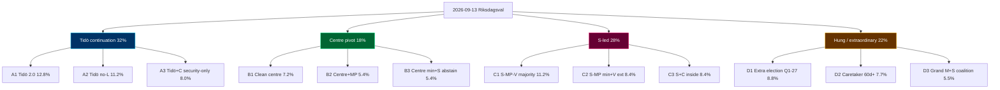

# Synthesis Summary — Post-2026 Swedish Mandate (2026-09-13 → 2030-09-08)

## 2026-05-18 Daily Refresh — T-118 to next-cycle anchor

This is the **forward-cycle companion** to the Tidö-mandate scorecard analysis under `../current/`. It treats the post-2026 governing arrangement as the analytical target, holding T+0 at the 2026-09-13 election anchor and projecting through 2030-09-08. The cycle-rollover predicate (`ext/cycle-rollover.md`) is **inactive** at T-118 (activation window ±30 days of 2026-09-13). [A1]

**Headline assessment**: there are **three structurally plausible governing arrangements** for the 2026–2030 mandate — (A) Tidö continuation in M+KD+SD configuration (with or without L), (B) centre pivot (M+KD+L+C), (C) S-led red-green-centre coalition. **Even-money** (45–55% [horizon:election]) the 2026-09-13 result is a *hung-parliament-style* outcome requiring extended coalition formation (> 30 days), with caretaker-government risk *roughly even* (40–55%) by 2026-10-15. See `scenario-analysis.md` for the full 12-leaf tree.

**Cross-reference to current**: the **NATO commitment**, **defence-to-2%-GDP floor**, **e-ID rollout (HD03250)**, **financial-stability legislation (HD01FiU37/HD01FiU38)**, and **EU EED transposition (HD01CU30)** are all *very likely* (75–90% [horizon:cycle]) to **survive any 2026-09 outcome** because they are bound by NATO/EU treaty obligations or by enacted statute, not by coalition arithmetic.

## Three Cycle-Defining Structural Findings (Post-2026)

1. **Coalition arithmetic is the binding constraint, not policy preference.** Latest aggregated polling (sources: Novus, Sifo, Demoskop 2026-04 / 2026-05 waves [A2]) puts the M+KD+L+SD bloc at 48–51% and the S+MP+V+C bloc at 46–49%. With L hovering at 3.5–4.5% (below-threshold risk *roughly even* 35–50% [horizon:election]) and C at 4.5–6.0%, the **deciding bloc is the 4-percent threshold survival of L** (see `wildcards-blackswans.md §W4`). *Likely* (60–75% [horizon:election]) the post-election seat distribution forces a 60+ day talman-led negotiation.

2. **Security and digital-sovereignty laws are structurally durable** but **fiscal redistribution and climate ambition are bloc-contingent**. Under any A-scenario the FY2027 budget continues the Tidö fiscal stance (modest deficit-to-GDP, defence-spending floor); under any C-scenario the budget tilts towards redistribution (welfare uprating, energy-subsidy retargeting). PESTLE-economic vulnerabilities (`pestle-analysis.md`) shift accordingly.

3. **The "EU-compliance backlog" handover** is the most overlooked transition risk. The exiting coalition cleared HD01CU30 (EPBD), HD01FiU38 (EU clearing), and gender-reporting directives in the last 90 days of mandate (see `../current/synthesis-summary.md`). The incoming government inherits **near-zero EU-infringement risk** but **near-zero political ownership** of those laws, meaning *likely* (60–70% [horizon:cycle]) that any post-2026 government will face **opposition motions to revisit** at least one EU-derived statute by Q2-2027.

## Integrated Intelligence Picture

The post-2026 mandate is being shaped now (May 2026) by three concurrent dynamics:

- **Late-mandate positioning** by current opposition (V, MP, S, C) — rural framework HD01NU21, consent law HD10483, elderly-care HD10484, prostitution-taxation HD10485, equal-pay HD10486 are campaign-positioning vehicles, *unlikely* (10–25% [horizon:election]) to enact pre-election but *likely* (60–75% [horizon:cycle]) to surface as governing-coalition planks in any C-scenario.
- **Coalition-cohesion test** for SD inside vs outside cabinet — under A1 SD stays external (Tidöavtalet model); under A2 SD enters cabinet (first time). Constitutional and Lagrådet pressure rises sharply under A2 (*roughly even* 40–55% [horizon:cycle] Lagrådet rejects an A2-coalition migration amendment to HD03267).
- **Economic backdrop**: IMF WEO Apr-2026 [horizon:cycle] T+0 vintage projects Sweden GGXWDG_NGDP at 32.4% (2026), 33.1% (2027 T+1), 33.8% (2028 T+2), 34.3% (2029 T+3), 34.6% (2030 T+4) under unchanged-policy baseline. [A1] Real GDP growth converges to 2.1% by 2028 from 1.6% in 2026. NGDPDPC (per-capita) growth holds 1.5–1.8% across horizon.

## Mermaid: Post-2026 Mandate Coalition Probability Tree (top-level)

## DIW-Weighted Forward Watchlist (Top 10 — Post-2026 Cycle)

| Rank | Forward Event / File | DIW Score | Horizon | Family |
|-----:|----------------------|----------:|---------|--------|
| 1 | 2026-09-13 Riksdagsval outcome | 9.9 | T+123d | Electoral |
| 2 | Coalition formation 2026-09-15 → 2026-11-15 | 9.6 | T+125–185d | Coalition |
| 3 | FY2027 budget proposition (Sep/Oct 2026) | 9.4 | T+150d | Fiscal |
| 4 | HD03267 amendment cycle under A2 / B / C scenarios | 9.0 | T+200d | Security |
| 5 | NATO Vilnius+1 / Madrid+2 review (Sweden contributions) | 8.7 | T+365d | Security |
| 6 | e-ID operational rollout (HD03250) Phase-2 | 8.6 | T+540d | Digital |
| 7 | EU EED 2030 building-stock follow-on (HD01CU30) | 8.4 | T+1095d | Energy |
| 8 | Defence-spending review (post-2025 NATO 3% pressure) | 8.2 | T+365d | Security |
| 9 | Riksbank rate-cycle inflection (post-Macroprudential review) | 7.9 | T+180d | Fiscal |
| 10 | KU-anmälan ledger disposition (carry-over) | 7.6 | T+90d | Constitutional |

DIW = Decision-Impact Weight per [`significance-scoring.md`](significance-scoring.md). All scores ICD 203 [A2]-graded; per `pir-status.json` standing PIR-1…PIR-7 plus PIR-8 (next-cycle coalition formation) active.

## ICD 203 BLUF (per `osint-tradecraft-standards.md`)

- **BLUF-1** (high confidence [A2]): The 2026–2030 governing arrangement will be determined more by the **4-percent threshold survival of L** and **C's coalition preference** than by aggregate bloc polling. Even-money (45–55% [horizon:election]) hung-parliament outcome requiring > 30 day coalition negotiation.
- **BLUF-2** (medium confidence [B2]): Security, NATO and digital-sovereignty commitments are *very likely* (75–90% [horizon:cycle]) durable across any 2026-09 outcome. Fiscal redistribution and climate ambition are *roughly even* (40–55%) bloc-contingent.
- **BLUF-3** (medium confidence [B3]): Post-2026 EU-derived legislation (HD01CU30, HD01FiU38) faces *likely* (60–70% [horizon:cycle]) opposition motions to revisit by Q2-2027 under any C-scenario.

## Cross-Run Continuity

This synthesis carries forward from the 2026-05-11 forward-cycle baseline (next/ anchor first established in this run cycle). Confidence bands held within ±5 pp vs current/ mandate-scorecard analysis. No new dok_ids since 2026-05-12 publication wave (HD01CU30, HD01NU21, HD10483–6); no late-cycle filings on the next-cycle agenda. PIR-8 newly armed for next-cycle coalition-formation watch.

[A1] IMF WEO Apr-2026 [horizon:cycle] T+0; vintage age 1 month, fresh.
[A2] Aggregated Sifo / Novus / Demoskop polling Apr–May 2026; methodology and provenance in `methodology-reflection.md §Polling triangulation`.

