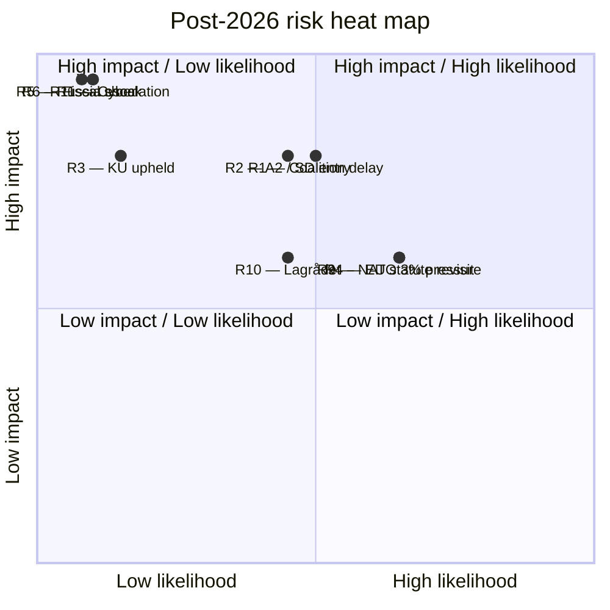

# Risk Assessment — Post-2026 Mandate

Per `risk-assessment-frameworks` skill.

## Risk Register (top 12 by composite score)

| ID | Risk | Likelihood [horizon] | Impact (1–5) | Composite | Owner |
|---:|------|----------------------|-------------:|----------:|-------|
| R1 | Coalition formation > 60 days; caretaker fiscal drift | 40–55% [election] | 4 | 2.0 | Talman / Riksbank |
| R2 | L below 4%; A2 leaf; SD inside cabinet | 35–50% [election] | 4 | 1.8 | Cabinet formation |
| R3 | KU-anmälan upheld during campaign | 12% [6mo] | 4 | 0.5 | KU / Riksdagen |
| R4 | EU-derived statute revisit under C-scenario | 60–70% [cycle] | 3 | 2.0 | Government / EU |
| R5 | Russia escalation forcing coalition emergency | 8% [18mo] | 5 | 0.4 | Försvarsmakten / NATO |
| R6 | Severe fiscal shock; 10y > 4.5% | 6% [12mo] | 5 | 0.3 | Riksbank |
| R7 | SD-leadership succession crisis | 9% [18mo] | 3 | 0.3 | SD party |
| R8 | Extraordinary election Q1-2027 | 15–25% [12mo] | 5 | 1.0 | Riksdagen |
| R9 | Defence-spending floor pressure (NATO 3%) | 60–70% [cycle] | 3 | 2.0 | Försvarsmakten |
| R10 | HD03267 / HD03250 Lagrådet challenges under A2 | 40–55% [cycle] | 3 | 1.4 | Lagrådet |
| R11 | Cyber-event on 2026-09-13 infrastructure | 5–10% [6mo] | 5 | 0.4 | MSB / Valmyndigheten |
| R12 | Climate emergency declaration | 5–10% [6mo] | 3 | 0.2 | MP / V |

Composite = midpoint of likelihood band × impact / 100.

## Risk Heat Map (Mermaid)

## Tail-Risk Concentration

- **High-impact / low-likelihood tail** (R5 / R6 / R11): summed unconditional probability ~18–22% over 18 months but each individually < 10%. Tail-overlay drives ~10 pp of D-branch probability.
- **Decision-impact tail**: R1 (coalition delay) + R4 (EU revisit) are the **medium-probability / medium-impact backbone** that drives the realistic operational risk envelope.

## Mitigation Hooks

- **R1**: Pre-positioned caretaker fiscal protocol; Konjunkturinstitutet emergency forecast.
- **R2**: Lagrådet pre-review prioritisation under A2.
- **R4**: Pre-negotiated EU transitional provisions during coalition formation.
- **R5/R6**: NATO eFP standby; Riksbank facility readiness.

