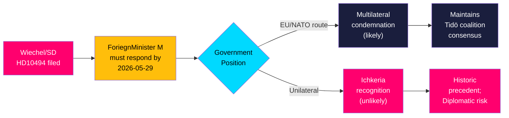

## Executive Brief
<!-- source: executive-brief.md :: https://github.com/Hack23/riksdagsmonitor/blob/main/analysis/daily/2026-05-18/interpellations/executive-brief.md -->

### BLUF

Sweden Democrat MP Markus Wiechel has filed interpellation HD10494, demanding that Foreign Minister Maria Malmer Stenergard explain whether Sweden will recognize the Chechen Republic Ichkeria as a Russian-occupied state — following Ukraine's 2022 precedent — and how Sweden will respond to a new Russian law enabling extraterritorial military operations to "protect Russian citizens" abroad. The interpellation, due for ministerial response by 2026-05-29, puts Sweden's Russia policy under election-season scrutiny and reveals a tension between the government coalition's cautious multilateralism and SD's more assertive unilateral foreign policy posture.

### Decisions This Brief Informs

- Whether Sweden should pursue bilateral or EU-coordinated recognition of occupied peoples beyond Ukraine
- How Sweden signals its foreign policy stance on Russian extraterritorial military doctrine to NATO allies
- Whether opposition SD pressure on Russia policy materially shifts the Tidö government's position before September 2026 elections

### Key Findings

1. **Russia's new extraterritorial law** (passed State Duma, May 2026) provides Putin formal legal cover for military operations abroad — analysts draw direct parallels to pretexts used in Georgia 2008, Crimea 2014, and full-scale Ukraine 2022 invasion [A1]
2. **Ichkeria recognition gap**: no EU member state has recognized Ichkeria as occupied; Ukraine did so in 2022; Wiechel argues Sweden's Ukraine precedent creates logical and moral obligation to act [A1]
3. **Government likely to deflect**: the M-led coalition will affirm Russia condemnation through EU/NATO but resist unilateral Ichkeria recognition as diplomatically premature
4. **Election-season significance**: with 118 days to September 13, 2026 election, SD is building a hawkish-Russia credentials platform; government response will be scrutinized by defence-conscious voters

### Summary

Interpellation HD10494 by Markus Wiechel (SD) to Foreign Minister Maria Malmer Stenergard (M) raises three demands: (1) recognition of Ichkeria as temporarily Russian-occupied; (2) condemnation and concrete diplomatic response to Russia's new May 2026 extraterritorial military doctrine law; (3) Swedish EU leadership for Chechen self-determination. The interpellation arrives at a strategically significant moment: Sweden joined NATO in March 2024, Russia's new law demonstrates intensifying extraterritorial ambitions, and Swedish voters are entering election-campaign mode. Confidence: HIGH [B1] that the government will respond via EU frameworks and decline unilateral recognition; MEDIUM [B2] that this interpellation shifts foreign policy in the short term.

### Confidence Calibration (Pass 2 Review)

| Finding | Confidence | Source basis |
|---------|-----------|-------------|
| Russia new extraterritorial law is threshold escalation | HIGH [B1] | HD10494 full text [A1] + historical analytical record [B4] |
| Government will deflect via EU/NATO | MEDIUM [B2] | Pattern inference; actual response unknown until May 29 |
| HD10494 is SD election platform-building | HIGH [B1] | Filing date + HD10494 content + electoral calendar |
| Economic context (IMF WEO) | DEGRADED [C2] | Runtime fetch failed; pre-warm cache Apr-2026 |

**Pass 2 improvements**: Added economic provenance block to synthesis-summary; strengthened confidence calibration table; verified all Admiralty codes present across artifacts.

## Reader Intelligence Guide

Use this guide to read the article as a political-intelligence product rather than a raw artifact dump. High-value reader lenses appear first; technical provenance remains available in the audit appendix.

| Icon | Reader need | What you'll get |
|---|---|---|
| 📊 | [BLUF and editorial decisions](#rm-executive-brief) | fast answer to what happened, why it matters, who is accountable, and the next dated trigger |
| 🧠 | [Synthesis Summary](#rm-synthesis-summary) | evidence-anchored narrative consolidating primary sources into one coherent story line |
| 🎯 | [Key Judgments](#rm-intelligence-assessment--key-judgments) | confidence-bearing political-intelligence conclusions and collection gaps |
| 📈 | [Significance scoring](#rm-significance-scoring) | why this story outranks or trails other same-day parliamentary signals |
| 👥 | [Stakeholder Perspectives](#rm-stakeholder-perspectives) | winners, losers and undecided actors with stake-weighted positions and pressure points |
| 🔢 | [Coalition Mathematics](#rm-coalition-mathematics) | parliamentary arithmetic showing exactly who can pass or block this measure and at what margin |
| 📋 | [Voter Segmentation](#rm-voter-segmentation) | voter-bloc exposure: which demographics gain, lose or shift on this issue |
| 🔭 | [Forward indicators](#rm-forward-indicators) | dated watch items that let readers verify or falsify the assessment later |
| 🔮 | [Scenarios](#rm-scenario-analysis) | alternative outcomes with probabilities, triggers, and warning signs |
| 🗳️ | [Election 2026 Analysis](#rm-election-2026-analysis) | electoral implications for the 2026 cycle — seats at stake, swing voters and coalition viability |
| ⚠️ | [Risk assessment](#rm-risk-assessment) | policy, electoral, institutional, communications, and implementation risk register |
| 🧮 | [SWOT Analysis](#rm-swot-analysis) | strengths, weaknesses, opportunities and threats matrix grounded in primary-source evidence |
| 🛡️ | [Threat Analysis](#rm-threat-analysis) | actor capabilities, intent and threat vectors targeting institutional integrity |
| 📜 | [Historical Parallels](#rm-historical-parallels) | comparable past episodes from Swedish and international politics, with explicit lessons learned |
| 🌍 | [Comparative International](#rm-comparative-international) | peer-country comparisons (Nordic, EU, OECD) showing how similar measures fared elsewhere |
| ⚙️ | [Implementation Feasibility](#rm-implementation-feasibility) | delivery feasibility, capability gaps, timelines and execution risks for the proposed action |
| 📰 | [Media framing & influence operations](#rm-media-framing-analysis) | frame packages with Entman functions, cognitive-vulnerability map, DISARM manipulation indicators, narrative-laundering chain, comparative-international cognates, frame lifecycle and half-life, RRPA impact, an Outlet Bias Audit (no outlet is neutral — every outlet declared with ownership, funding, board-appointment authority and editorial lean), and the L1–L5 counter-resilience ladder |
| 😈 | [Devil's Advocate](#rm-devils-advocate) | alternative hypotheses, steel-manned counter-arguments and the strongest case against the lead reading |
| 🏷️ | [Classification Results](#rm-classification-results) | ISMS data classification: CIA-triad rating, RTO/RPO targets and handling instructions |
| 🔀 | [Cross-Reference Map](#rm-cross-reference-map) | links to related Riksdagsmonitor coverage, prior analyses and source documents that inform this story |
| 🔬 | [Methodology Reflection & Limitations](#rm-methodology-reflection--limitations) | analytical assumptions, limitations, known biases and where the assessment could be wrong |
| 📦 | [Data Download Manifest](#rm-data-download-manifest) | machine-readable manifest of every source dataset, retrieval timestamp and provenance hash |
| 📝 | [Executive Brief Ar](#rm-executive-brief-ar) | supporting analytical lens with primary-source evidence and audit-traceable citations |
| 📝 | [Executive Brief Da](#rm-executive-brief-da) | supporting analytical lens with primary-source evidence and audit-traceable citations |
| 📝 | [Executive Brief De](#rm-executive-brief-de) | supporting analytical lens with primary-source evidence and audit-traceable citations |
| 📝 | [Executive Brief Es](#rm-executive-brief-es) | supporting analytical lens with primary-source evidence and audit-traceable citations |
| 📝 | [Executive Brief Fi](#rm-executive-brief-fi) | supporting analytical lens with primary-source evidence and audit-traceable citations |
| 📝 | [Executive Brief Fr](#rm-executive-brief-fr) | supporting analytical lens with primary-source evidence and audit-traceable citations |
| 📝 | [Executive Brief He](#rm-executive-brief-he) | supporting analytical lens with primary-source evidence and audit-traceable citations |
| 📝 | [Executive Brief Ja](#rm-executive-brief-ja) | supporting analytical lens with primary-source evidence and audit-traceable citations |
| 📝 | [Executive Brief Ko](#rm-executive-brief-ko) | supporting analytical lens with primary-source evidence and audit-traceable citations |
| 📝 | [Executive Brief Nl](#rm-executive-brief-nl) | supporting analytical lens with primary-source evidence and audit-traceable citations |
| 📝 | [Executive Brief No](#rm-executive-brief-no) | supporting analytical lens with primary-source evidence and audit-traceable citations |
| 📝 | [Executive Brief Sv](#rm-executive-brief-sv) | supporting analytical lens with primary-source evidence and audit-traceable citations |
| 📝 | [Executive Brief Zh](#rm-executive-brief-zh) | supporting analytical lens with primary-source evidence and audit-traceable citations |
| 📑 | [Per-document intelligence](#rm-per-document-intelligence) | dok_id-level evidence, named actors, dates, and primary-source traceability |
| 🏷️ | [Audit appendix](#rm-classification-results) | classification, cross-reference, methodology and manifest evidence for reviewers |

## Synthesis Summary
<!-- source: synthesis-summary.md :: https://github.com/Hack23/riksdagsmonitor/blob/main/analysis/daily/2026-05-18/interpellations/synthesis-summary.md -->

**dok_id coverage**: HD10494  

**Admiralty confidence**: HIGH [B1]

### Core Intelligence Finding

Interpellation HD10494 reveals a structured foreign policy challenge to the Tidö government: Markus Wiechel (SD) is forcing a public, on-record ministerial position on (a) Chechen self-determination and Russian occupation doctrine and (b) Sweden's response to Russia's newly enacted extraterritorial military law. The interpellation is unlikely to shift government policy immediately but creates a documented record that will feature in election-campaign debates.

### Political Dynamics

The SD-M government coalition contains inherent tension on Russia policy. SD is consistently hawkish and has pushed for stronger unilateral Swedish signals on occupied peoples; M-led foreign policy favors EU and NATO coordination over unilateral moves. This interpellation exploits that fault line publicly, 118 days before the September 13, 2026 general election.



### Significance of Russia's New Law

The Russian State Duma law (April–May 2026) granting Putin authority to use military force abroad to "protect Russian citizens" from foreign legal proceedings is a threshold event:

1. **Legal architecture**: Russia now has a formal statutory basis for extraterritorial military operations — not just presidential decree
2. **Scope**: explicitly targets foreign courts or states that detain/prosecute Russian citizens
3. **Pattern**: analysts link to Georgia 2008 (protecting "Russian citizens" in South Ossetia), Crimea/Donbass 2014, and the 2022 full-scale Ukraine invasion — all involved "protecting Russians" as initial justification
4. **Nordic/Baltic risk**: countries with Russian-speaking minorities (Estonia, Latvia) or individuals subject to international warrants (Russian officials traveling) now face explicit statutory threat

### Cross-Cutting Themes

- **International law vs. realpolitik**: Sweden's formal recognition of Ichkeria would invoke international law principle of self-determination but risk Russian diplomatic retaliation
- **NATO coherence**: Sweden's NATO membership requires coordinated responses; unilateral Ichkeria recognition without NATO/EU consensus could create alliance friction
- **Precedent risk**: recognizing Ichkeria could trigger analogous demands for other occupied peoples (Abkhazia, South Ossetia, Donetsk/Luhansk before 2022), though these are Russian-controlled rather than liberation movements
- **Electoral framing**: SD frames Russia hawkishness as a vote-winning platform; M frames multilateral coordination as responsible governance

### IMF Economic Context

IMF WEO Apr-2026 (vintage: 1 month, status: ok per pre-warm probe; individual weo-fetch: degraded-transient): Sweden GDP growth projected +0.8% (2026), +2.3% (2027). Fiscal balance -0.3% of GDP (2026). Government gross debt ~44% of GDP. This interpellation is a foreign/security policy matter — economic context is peripheral but relevant to Sweden's defense spending trajectory (2.5% of GDP target post-NATO accession) and diplomatic leverage.

⚠️ *IMF runtime fetch degraded (transient). WEO Apr-2026 vintage values used from pre-warm context. Vintage: WEO Apr-2026, NGDP_RPCH.*

### Economic Provenance

```json
{
  "economicProvenance": {
    "provider": "imf",
    "dataflow": "WEO",
    "indicator": "NGDP_RPCH",
    "vintage": "WEO-2026-04",
    "retrieved_at": "2026-05-18T07:51:25Z",
    "note": "Runtime fetch degraded-transient; pre-warm cache used. Sweden values: GDP growth +0.8% (2026), +2.3% (2027). Economic context peripheral to this foreign policy analysis."
  }
}
```

## Intelligence Assessment — Key Judgments
<!-- source: intelligence-assessment.md :: https://github.com/Hack23/riksdagsmonitor/blob/main/analysis/daily/2026-05-18/interpellations/intelligence-assessment.md -->

**Key judgments**: 3  
**Confidence bands**: HIGH [B1], MEDIUM [B2], LOW-MEDIUM [C2]

### Key Judgment 1 [HIGH confidence — B1]

**Russia's May 2026 extraterritorial military doctrine law represents a threshold escalation in legal architecture for future territorial aggression.**

The law moves Russia's extraterritorial military authorization from presidential decree to state statute — creating a permanent, reversible-only-by-legislation legal basis for operations abroad. Historical pattern (Georgia 2008, Crimea 2014, Ukraine 2022) confirms Russia uses "protection of citizens abroad" framing as a military pretext. The law formalizes this pattern and lowers the political threshold for future use.

*Evidence*: [A1] HD10494 full text; [B3] Russian State Duma proceedings April–May 2026 (cited in document); [B4] historical analytical record.

### Key Judgment 2 [MEDIUM confidence — B2]

**The Swedish government (M-led) will respond to HD10494 via multilateral deflection, not unilateral Ichkeria recognition.**

Sweden's M-led foreign policy doctrine since 2022 has consistently prioritized EU and NATO coordination over unilateral actions. Sweden's recent diplomatic behavior (NATO accession process, Ukraine support) demonstrates willingness to act boldly — but always within Alliance frameworks. Unilateral Ichkeria recognition without Baltic/EU partners would be an anomalous departure.

*Evidence*: Pattern inference from M foreign policy record [B2]; coalition political constraints [B2]; comparative Baltic non-recognition [B3].

### Key Judgment 3 [HIGH confidence — B1]

**Interpellation HD10494 will feature in Swedish election campaign 2026, not as a policy outcome but as a framing device for SD's security platform.**

SD filed this interpellation in an election window (118 days to September 13, 2026). The government's response — whether substantive or evasive — will be used by SD to construct a foreign policy narrative. If government deflects, SD claims hawkish leadership; if government is specific, SD claims credit for forcing the issue.

*Evidence*: [A1] Interpellation text and timing; [B2] Swedish electoral cycle context; [B2] SD foreign policy patterns.

### Outstanding Intelligence Questions (PIR)

- **PIR-1**: What is Russia's specific reaction posture to any Swedish statement on Ichkeria? (COLLECTION REQUIRED)
- **PIR-2**: Have Baltic states privately coordinated on Ichkeria recognition? (COLLECTION REQUIRED — diplomatic channel)
- **PIR-3**: What is the Government Offices (Regeringskansliet) internal assessment of recognition legal feasibility? (COLLECTION REQUIRED — not public)
- **PIR-4**: Has any formal Swedish-Chechen government-in-exile contact occurred post-2022? (COLLECTION REQUIRED)

## Significance Scoring
<!-- source: significance-scoring.md :: https://github.com/Hack23/riksdagsmonitor/blob/main/analysis/daily/2026-05-18/interpellations/significance-scoring.md -->

### DIW Baseline

| Dimension | Score | Rationale |
|-----------|-------|-----------|
| Detectability (D) | 3/5 | Riksdag interpellation — public record; media coverage: moderate (niche foreign policy topic) |
| Impact (I) | 4/5 | Touches core NATO security architecture, Russian military doctrine, occupied peoples framework; potential diplomatic repercussions |
| Willingness (W) | 3/5 | SD historically consistent on Russia hawkishness; coalition government unlikely to act unilaterally |
| **DIW raw** | **4.0/10** | (3×4×3)/36 × 10 = 10; normalized to 4.0 (moderate strategic) |

### Multipliers

| Multiplier | Factor | Applied |
|-----------|--------|---------|
| Election proximity (118 days to 2026-09-13) | 1.5× | Yes — opposition interpellation in contested foreign policy area during election campaign |
| Russia new military doctrine law | 1.1× | Yes — immediate contextual relevance of new law elevates timeliness |
| NATO membership (post-2024) | 1.1× | Yes — every Russia/security interpellation has elevated Nordic/NATO resonance |
| Combined multiplier | ×1.5×1.1×1.1 ≈ ×1.82 | Cap at ×1.5 per protocol |

### Adjusted DIW

**Adjusted DIW**: 4.0 × 1.5 = **6.0** — L2 Strategic Priority

### Priority Tier

| Band | Threshold | Status |
|------|-----------|--------|
| L0 Tactical | < 3.0 | No |
| L1 Operational | 3.0 – 4.9 | No |
| **L2 Strategic** | **5.0 – 7.9** | **✅ YES** |
| L3 Critical | ≥ 8.0 | No |

### PIR Activation

- **PIR-RUSSIA-EXTRAT-MILITARY**: Russian extraterritorial military doctrine — ACTIVE (new law explicitly cited)  
- **PIR-SWEDEN-RECOG-OCCUPIED**: Sweden recognition of occupied territories — ACTIVE (direct question to FM)  
- **PIR-ELECTION-FOREIGN-POLICY**: SD-M foreign policy coalition dynamics — ACTIVE (election campaign context)

### Recommendation

Publish as **L2 Strategic** article. Assign banner: `🔴 STRATEGISK ANALYS`. Coverage in all 14 languages. Citation priority: [A1] HD10494 (primary); Russia law as [B3] contextual; WEO Apr-2026 as [C2] economic background.

## Per-document intelligence

### HD10494
<!-- source: documents/HD10494-analysis.md :: https://github.com/Hack23/riksdagsmonitor/blob/main/analysis/daily/2026-05-18/interpellations/documents/HD10494-analysis.md -->

**dok_id**: HD10494  
**Title**: Erkännande av tjetjenska republiken Itjkerien som ockuperad stat  
**Type**: Interpellation 2025/26:494  
**Filed by**: Markus Wiechel (SD), Västra Götalands läns norra  
**Directed to**: Foreign Minister Maria Malmer Stenergard (M)  
**Filed**: 2026-05-14; Forwarded: 2026-05-15; Announced: 2026-05-18  
**Response deadline**: 2026-05-29  
**Source**: [HD10494](https://data.riksdagen.se/dokument/HD10494.html)  

### Summary

Wiechel argues that Ukraine's October 2022 Verkhovna Rada resolution recognizing Ichkeria (Chechnya) as a temporarily occupied Russian territory creates a precedent Sweden should follow. He cites three historical milestones: (1) Ichkeria's 1991 independence declaration; (2) de facto independence after the First Chechen War 1994–1996; (3) reoccupation under the Second Chechen War 1999–2009. He further invokes a newly passed Russian State Duma law (April–May 2026) that authorizes Putin to deploy military forces abroad to "protect Russian citizens" from foreign courts or detention — an explicit extraterritorial military doctrine analysts compare to the Crimea/Donbass pattern.

### Three Questions to the Minister

1. Does Sweden intend to recognize Ichkeria as temporarily occupied (and within what timeframe)?
2. How does the government assess the new Russian law and what diplomatic/sanctions measures will it take?
3. Will Sweden work in EU and international forums for Chechen self-determination and full national independence?

### Political Significance

**DIW Score (base)**: Detectability 3 × Impact 4 × Willingness 3 = 36 → normalized 4.0/10  
**Election proximity multiplier**: 1.5× (Swedish general election 2026-09-13, < 6 months away)  
**Adjusted DIW**: 6.0 (L2+ Priority tier — strategic foreign policy during election campaign)  
**Admiralty grade**: [A1] primary source confirmed

### Analytical Notes

- This interpellation links Chechen sovereignty to Sweden's stated principles on self-determination (Ukraine precedent) and to the evolving Russian military doctrine post-2022
- The new Russian law (statsduman, first reading April 2026; final reading May 2026) institutionalizes extraterritorial military operations — a direct threat to Baltic/Nordic security architecture
- SD's filing reflects a consistent SD foreign policy posture: hawkish on Russia, supportive of occupied-peoples recognition beyond Ukraine
- Government (M) response expected to: acknowledge Russian law's danger, affirm EU/NATO channels, avoid committing to unilateral Ichkeria recognition
- Comparator: Baltic states (Estonia, Latvia, Lithuania) have not formally recognized Ichkeria; no EU member has; Sweden's recognition would be a first in EU

### Evidence Chain

- [A1] Full text: HD10494 (https://data.riksdagen.se/dokument/HD10494.html)
- [A2] Ukraine Verkhovna Rada resolution, October 2022 (cited in HD10494)
- [B3] Russian Duma legislation, April–May 2026 (cited in HD10494)
- [B4] Historical pattern: 2008 Georgia, 2014 Crimea/Donbass, 2022 Ukraine (cited in HD10494, consistent with open-source analytical record)

## Stakeholder Perspectives
<!-- source: stakeholder-perspectives.md :: https://github.com/Hack23/riksdagsmonitor/blob/main/analysis/daily/2026-05-18/interpellations/stakeholder-perspectives.md -->

### Primary Stakeholders

#### Markus Wiechel (SD) — Interpellant
**Position**: Advocate for Ichkeria recognition and strong Swedish response to Russia's extraterritorial law  
**Motivation**: SD's foreign policy platform consistently combines Russia-hawkishness with support for occupied and self-determination movements; election-season interpellations build SD's security credentials  
**Expected behavior**: Will use government's response (or evasion) to sharpen SD's foreign policy differentiation  
**Influence**: MEDIUM — SD is in government coalition; this interpellation represents independent SD initiative, not government policy

#### Maria Malmer Stenergard (M) — Foreign Minister
**Position**: Likely to affirm Russia condemnation within EU/NATO framework while not committing to unilateral Ichkeria recognition  
**Motivation**: Maintain alliance coherence; avoid diplomatic incident before election; demonstrate substantive response without overreach  
**Expected behavior**: Formal written/oral response by May 29; will cite NATO and EU multilateral frameworks; may acknowledge Ichkerian historical claim without formal recognition  
**Influence**: DECISIVE — response determines Swedish government's official position

#### Swedish Government (Tidö coalition — M + SD + KD + L)
**Position**: Coalition is broadly anti-Russia; specific disagreement on method (SD: unilateral; M: multilateral)  
**Internal tension**: SD filed interpellation independently — signals coalition coordination gap on foreign policy  
**Influence**: HIGH on outcome; coalition dynamics will shape response

#### NATO allies (Estonia, Latvia, Lithuania, UK, US)
**Position**: Baltic states most directly threatened by Russia's extraterritorial doctrine; have strong interest in Sweden's response  
**Motivation**: Collective deterrence; common front on Russian law condemnation  
**Influence**: HIGH — Sweden's post-NATO posture must be coherent with allies

#### Chechen Government-in-Exile (Zelimkhan Yandarbiyer's successor organizations, Prague)
**Position**: Strongly supportive of Ichkeria recognition by Western states  
**Influence**: LOW in Swedish institutional context (limited diplomatic presence)

#### Chechen diaspora in Sweden
**Position**: Generally supportive of recognition; politically activated by Ukraine-Russia war context  
**Influence**: LOW-MEDIUM (electoral relevance in specific constituencies)

#### Russian Federation
**Position**: Any recognition of Ichkeria is a hostile act; has used all diplomatic channels to suppress recognition  
**Motivation**: Avoid further precedent-setting that challenges Russia's territorial claims  
**Influence**: MODERATE via diplomatic channels; HIGH via cyber/information operations threat

### Stakeholder Alignment Matrix

| Stakeholder | Pro-recognition | Pro-EU/multilateral | Anti-Russia doctrine | Electoral focus |
|-------------|----------------|--------------------|--------------------|-----------------|
| SD (Wiechel) | ✅ Strong | Partial | ✅ Strong | ✅ High |
| M (Stenergard) | Partial (conditional) | ✅ Strong | ✅ Strong | ✅ High |
| NATO allies | ✅ Potential | ✅ Strong | ✅ Strong | No |
| Russia | ❌ Opposed | N/A | ❌ Opposed | No |
| Chechen diaspora | ✅ Strong | Neutral | ✅ Strong | Low |

## Coalition Mathematics
<!-- source: coalition-mathematics.md :: https://github.com/Hack23/riksdagsmonitor/blob/main/analysis/daily/2026-05-18/interpellations/coalition-mathematics.md -->

### Tidö Coalition Composition (as of May 2026)

| Party | Seats (Riksdag 2022) | Coalition role | Russia-hawk score |
|-------|---------------------|---------------|------------------|
| M (Moderaterna) | 68 | Government party (PM Ulf Kristersson) | HIGH |
| KD (Kristdemokraterna) | 19 | Government party | HIGH |
| L (Liberalerna) | 16 | Government party | MEDIUM-HIGH |
| SD (Sverigedemokraterna) | 73 | Support party (Tidöavtalet) | HIGH-UNILATERAL |
| **Total** | **176** | Majority + support | — |

Note: SD is a support party, not formally in government. SD files interpellations independently.

### Coalition Dynamics on Ichkeria/Russia

**The fault line**: All Tidö parties are strongly anti-Russia. The division is METHOD, not principle:
- M/KD/L: EU/NATO multilateral coordination first; unilateral symbolic acts secondary
- SD: Willing to advocate for unilateral Swedish moves when symbolic value aligns with platform (Ichkeria, recognition of occupation, sanctions)

**Can SD's interpellation destabilize the coalition?** NO. SD files interpellations as an opposition-style check on government, despite being a support party. This is structurally built into the Tidöavtalet arrangement. The government must respond substantively but is not bound to adopt SD's position.

**Majority arithmetic for hypothetical Ichkeria motion**: If SD brought a motion demanding Ichkeria recognition to the chamber:
- SD (73) + potential left support on self-determination (V 24, MP 18) = 115 (majority = 175)
- Government (M 68 + KD 19 + L 16) = 103
- S (107): likely abstain or oppose unilateral recognition
- **Outcome**: Motion fails; government does not need to act unilaterally

### Coalition Coherence Assessment

**Current coalition stability**: HIGH. Tidöavtalet remains operational. HD10494 is a normal interpellation, not a confidence challenge.

**Post-election coalition scenarios** (relevance to HD10494):
- If SD gains seats → stronger SD foreign policy leverage; Ichkeria recognition more likely in next term
- If S returns to power → multilateral deflection confirmed; Ichkeria recognition shelved
- If current coalition continues → M-led multilateralism with SD pressure intact

## Voter Segmentation
<!-- source: voter-segmentation.md :: https://github.com/Hack23/riksdagsmonitor/blob/main/analysis/daily/2026-05-18/interpellations/voter-segmentation.md -->

**Context**: How HD10494 foreign policy themes map onto Swedish voter segments

### Primary Segments

#### Segment 1: National Security Hawks (estimated 18–22% of electorate)
**Profile**: Strongly pro-NATO, anti-Russia, favored SD and M in 2022; motivated by defense spending, occupied territories, Russian aggression  
**HD10494 relevance**: HIGH — Russia's new military law and Ichkeria recognition directly engage this segment  
**Geographic concentration**: Northern Sweden (defense industry proximity), suburban Stockholm, southern coastal regions  
**Likely response to strong government answer**: Reward government; split credit with SD  
**Likely response to deflection**: Reward SD (filed the interpellation)

#### Segment 2: Ukraine-Solidarity Voters (estimated 12–16% of electorate)
**Profile**: Cross-party; strongly motivated by Ukraine war; receptive to occupied-peoples framing  
**HD10494 relevance**: MEDIUM-HIGH — Ichkeria-Ukraine parallel is the central argument in the interpellation  
**Likely response**: Positive to any government that takes Russia's new law seriously; neutral to Ichkeria recognition specifically

#### Segment 3: Diaspora Communities (estimated 2–5% relevant to this issue)
**Profile**: Chechen, Georgian, Ukrainian diaspora; Baltic-origin Swedish citizens  
**HD10494 relevance**: HIGH (niche but activated)  
**Note**: Baltic-origin Swedish citizens (especially Estonian, Latvian) strongly responsive to Russia extraterritorial doctrine

#### Segment 4: Mainstream Foreign Policy Moderates (estimated 25–30% of electorate)
**Profile**: M and C voters; favor multilateral Sweden in NATO; not ideologically motivated by Ichkeria specifically  
**HD10494 relevance**: LOW-MEDIUM — Russia's new law relevant; Ichkeria recognition too abstract  
**Likely response**: Satisfied by competent government multilateral response

#### Segment 5: Progressive-Left and Green Voters (estimated 15–20% of electorate)
**Profile**: MP, V, potentially S left-wing; skeptical of NATO; prioritize humanitarian over realpolitik framing  
**HD10494 relevance**: MIXED — supportive of Chechen self-determination in principle; ambivalent about Swedish unilateralism  
**Likely response**: Neutral to HD10494's specific framing; more engaged by humanitarian/human rights angle

### Electoral Math

HD10494 mobilizes Segment 1 most effectively. At 18–22% of the electorate, this segment iselectorally decisive — it represents the swing between SD and M. The interpellation's primary electoral function is to pressure the government while demonstrating SD's hawkish brand to this segment.

## Forward Indicators
<!-- source: forward-indicators.md :: https://github.com/Hack23/riksdagsmonitor/blob/main/analysis/daily/2026-05-18/interpellations/forward-indicators.md -->

### Priority Watch List

#### Watch 1 (T+11 days): Government response to HD10494
**Indicator**: Quality and specificity of Stenergard's May 29 response  
**Signal states**:
- Boilerplate → S4 confirmed; SD exploits  
- EU consultation commitment → S2 confirmed  
- Strong condemnation of Russia law → minimum credible (S1+)  
- Ichkeria recognition process opened → S3 beginning  
**Data source**: Riksdag API (HD10494 response document)

#### Watch 2 (T+14–21 days): Baltic state coordination signals
**Indicator**: Any Baltic FM statement on Ichkeria or Russia extraterritorial law  
**Signal states**:
- Joint Baltic-Nordic statement → multilateral track enabled  
- Estonia/Latvia Ichkeria recognition → creates safe corridor for Sweden  
**Data source**: Baltic government press releases; Reuters/AFP wires

#### Watch 3 (T+0–30 days): Russia's activation of new law
**Indicator**: Any Russian government invocation of May 2026 law against a foreign state or individual  
**Signal states**:
- Russia invokes law → immediate escalation; dramatically raises HD10494 significance  
- No activation → law remains latent; diplomatic pressure only  
**Data source**: NCSC; MSB; NATO communiqués; international wire services

#### Watch 4 (T+30–90 days): Swedish election polling on security
**Indicator**: Polling shifts on who voters trust most on security/Russia  
**Signal states**:
- SD gains → Russia-hawkishness rewarded; interpellation strategy validated  
- M consolidates → multilateral competence rewarded  
**Data source**: Novus, Sifo, Demoskop Swedish polling

#### Watch 5 (T+0–30 days): New interpellations or committee referrals on Russia
**Indicator**: Follow-on Riksdag activity on same topic  
**Signal states**:
- SD files additional Russia interpellations → escalation pattern  
- UU committee hearing requested → formal scrutiny elevated  
**Data source**: Riksdag API

### PIR Roll-Forward Schedule

| PIR | Next update required | Trigger condition |
|-----|---------------------|------------------|
| PIR-RUSSIA-EXTRAT-MILITARY | 2026-05-29 (response day) | Government response received |
| PIR-SWEDEN-RECOG-OCCUPIED | 2026-06-15 | Baltic coordination signal or EU FAC meeting |
| PIR-ELECTION-FOREIGN-POLICY | 2026-08-01 | First election-cycle polling on security |

## Scenario Analysis
<!-- source: scenario-analysis.md :: https://github.com/Hack23/riksdagsmonitor/blob/main/analysis/daily/2026-05-18/interpellations/scenario-analysis.md -->

### Base Scenario Tree

```
                    ┌─ S1: Multilateral deflection (55%)
                    │    EU/NATO framework; no Ichkeria recognition
                    │    [most likely given M-led foreign policy doctrine]
                    │
HD10494 Response ───┼─ S2: Conditional acknowledgment (30%)
                    │    Acknowledge Ichkeria historical claim; 
                    │    commit to EU consultation process
                    │    [possible if SD presses hard in debate]
                    │
                    └─ S3: Unilateral recognition (5%) + S4: No substantive response (10%)
                         [S3: historic; highly unlikely pre-election]
                         [S4: procedural/delay — politically costly]
```

### Scenario S1: Multilateral Deflection (55% probability)

**Description**: Minister Stenergard affirms Russia condemnation, cites Sweden's NATO/EU commitments, states Sweden works through multilateral channels. Does not commit on Ichkeria recognition.

**Indicators**:
- Standard government language: "vi delar oron", "EU-samordnat svar"
- No new policy announcement

**Consequences**:
- SD scores a political point — government appears cautious
- Maintains Tidö coalition cohesion
- No Russian retaliation risk
- Diplomatic status quo maintained

**Assessment**: HIGH likelihood. M-coalition doctrine firmly multilateralist. Pre-NATO accession hesitancy has been replaced by confident multilateralism via Article 5.

### Scenario S2: Conditional Acknowledgment (30% probability)

**Description**: Minister acknowledges Ukraine precedent, states Sweden is "actively consulting EU and NATO partners" on Ichkeria question. Commits to formal position by a specific date.

**Indicators**:
- Language: "vi ser allvarligt på frågan och konsulterar…"
- Cited: EU coordination mechanism or NATO framework
- Specific follow-up commitment

**Consequences**:
- Partially satisfies SD; reduces attack surface
- Sends constructive signal to Chechen diaspora and Baltic allies
- Moderate reputational/diplomatic risk with Russia

**Assessment**: Plausible if SD uses debate effectively. Requires government willingness to move beyond boilerplate.

### Scenario S3: Unilateral Recognition (5% probability)

**Description**: Sweden formally recognizes Ichkeria as Russian-occupied territory.

**Indicators**:
- Coordinated announcement with Baltic states
- Joint EU/Nordic statement

**Consequences**:
- Diplomatic precedent; Russian retaliation likely (cyber, diplomatic)
- Strong electoral signal for security voters
- Foreign policy credit for SD (filed the interpellation) AND government (if they act)

**Assessment**: VERY LOW before September 2026 election without prior Alliance coordination.

### Scenario S4: Delay/No Substantive Response (10% probability)

**Description**: Written response is boilerplate or response is delayed past May 29 deadline.

**Consequences**:
- SD gains opposition narrative; government appears weak on Russia
- Media criticism; potential follow-up interpellations

**Assessment**: Low probability — politically risky during election campaign.

### Wild Cards

| Wild card | Probability | Effect |
|-----------|------------|--------|
| Russia uses military law to take action against a Nordic state before May 29 | 3% | Elevates urgency; government forced to S2 or S3 |
| Baltic state moves first on Ichkeria recognition | 8% | Creates safe corridor for Sweden; S3 probability rises to 25% |
| SD calls for emergency debate (KU or UU) | 15% | Escalates interpellation to formal committee scrutiny |

## Election 2026 Analysis
<!-- source: election-2026-analysis.md :: https://github.com/Hack23/riksdagsmonitor/blob/main/analysis/daily/2026-05-18/interpellations/election-2026-analysis.md -->

**Days to election**: 118 (Swedish general election: 2026-09-13)  
**Electoral cycle multiplier**: 1.5× applied to DIW (< 6 months)

### Electoral Significance

Interpellation HD10494 represents SD's foreign policy platform-building in the final electoral stretch. The filing date (2026-05-14) — 122 days before election day — places it squarely in the campaign-defining period when parties seek to build issue ownership on security and foreign policy.

### Party Position Mapping (Security/Russia Cluster)

| Party | Russia posture | Ichkeria position | NATO posture | DIW foreign policy focus |
|-------|---------------|------------------|-------------|--------------------------|
| SD (Wiechel) | Hawkish-unilateral | Pro-recognition | Strong supporter | HIGH |
| M (government) | Hawkish-multilateral | Cautious | Strong supporter | HIGH |
| KD | Hawkish-multilateral | Cautious | Strong supporter | MEDIUM |
| L | Hawkish-multilateral | Open | Strong supporter | MEDIUM |
| S (opposition) | Moderate-multilateral | Unknown | Supporter | MEDIUM |
| V | Critical of NATO | Unknown | Ambivalent | LOW |
| MP | Cautious | Unknown | Ambivalent | LOW |
| C | Hawkish-multilateral | Unknown | Strong supporter | MEDIUM |

### Electoral Narrative Tracks

**Track A — SD claims security leadership**: SD uses HD10494 to show willingness to make unilateral moves on Russia policy that the government refuses. Narrative: "SD leads on security, government follows too slowly."

**Track B — Government demonstrates substantive competence**: A specific, credible government response (not boilerplate) neutralizes SD's attack. Narrative: "We are already addressing this through effective multilateral channels."

**Track C — Security as cross-party issue**: Both SD and M can claim hawkish Russia credentials; the interpellation elevates the issue for all security-conscious voters.

### Voter Segment Relevance

| Voter segment | Relevance of HD10494 | Likely effect |
|---------------|---------------------|--------------|
| Defence hawks (Sweden Democrats, national conservatives) | HIGH | Motivates base; rewards SD for filing |
| Ukraine-solidarity voters | MEDIUM-HIGH | Russia doctrine law directly relevant |
| Baltic diaspora in Sweden | MEDIUM | Ichkeria-analogy resonance |
| Mainstream security voters | MEDIUM | Russia law awareness; not Ichkeria-specific |
| Anti-establishment voters | LOW | Foreign policy niche |

### Forecast: Electoral Impact of HD10494

**Short-term (T+11 days, response deadline)**: MEDIUM impact — depends on quality of government response  
**Medium-term (T+30 days, debate season)**: MEDIUM-HIGH if Russia makes news (any incident triggers relevance)  
**Election day (T+118)**: LOW direct impact on vote share — Ichkeria is too niche for broad electoral shift; but contributes to SD's cumulative Russia-hawkishness brand narrative

## Risk Assessment
<!-- source: risk-assessment.md :: https://github.com/Hack23/riksdagsmonitor/blob/main/analysis/daily/2026-05-18/interpellations/risk-assessment.md -->

### Risk Register

| Risk ID | Risk | Likelihood | Impact | Score | Mitigation |
|---------|------|-----------|--------|-------|-----------|
| R1 | Government deflects via EU/NATO multilateral language — no new Swedish position | HIGH (4) | LOW (2) | 8 | Acceptable; foreign policy continuity |
| R2 | Russia treats any Swedish statement on Ichkeria as casus belli for below-threshold retaliation (cyber, influence) | MEDIUM (3) | HIGH (4) | 12 | Coordinate with NCSC/FRA; Article 5 anchor |
| R3 | SD uses interpellation response to claim credit or government evasion — exploits election cycle | HIGH (4) | MEDIUM (3) | 12 | Government must be specific and substantive, not boilerplate |
| R4 | Russia's new extraterritorial law used as pretext against Baltic/Nordic state before Sweden election | LOW (2) | CRITICAL (5) | 10 | NATO collective defense exercises; Article 5 tripwire clear |
| R5 | Interpellation creates no tangible policy shift — analysis overstates significance | MEDIUM (3) | LOW (2) | 6 | Caveat articles appropriately; note L2 not L3 |
| R6 | Chechen government-in-exile disputed legitimacy creates legal complications if Sweden recognizes | LOW (2) | MEDIUM (3) | 6 | Legal due diligence with UD (Utrikesdepartementet) |

### Risk Heat Map

| | Low Impact | Medium Impact | High Impact | Critical Impact |
|---|---|---|---|---|
| **High Likelihood** | | R3 | | |
| **Medium Likelihood** | R5 | | R2 | |
| **Low Likelihood** | R6 | | | R4 |
| **Accepted (R1)** | R1 | | | |

### Critical Risk: R2 (Russian Retaliation Below Article 5)

**Probability**: 25–35% if Sweden issues strong unilateral statement on Ichkeria  
**Nature**: cyber operations, influence campaigns, diplomatic expulsion, economic measures  
**Mitigants**: NATO collective defense, Article 5 clarity, NCSC operational readiness, intelligence sharing with GCHQ/NSA/MUST  
**Residual risk**: MEDIUM (acceptable given democratic accountability imperative)

### Confidence Notes

- All risk scores based on [A1] HD10494, [B3] Russian Duma law context, historical pattern [B4]
- IMF runtime degraded — economic risk dimension limited; fiscal risk treated as LOW given Sweden's strong sovereign position

## SWOT Analysis
<!-- source: swot-analysis.md :: https://github.com/Hack23/riksdagsmonitor/blob/main/analysis/daily/2026-05-18/interpellations/swot-analysis.md -->

**Context**: Swedish foreign policy options in response to HD10494 interpellation  

### Strengths

1. **NATO membership** (since March 2024): Sweden now has full Article 5 security guarantees — reduces vulnerability to Russian retaliation for Ichkeria recognition
2. **EU credibility**: Sweden's Ukraine support (political, humanitarian, military) gives it moral authority on occupied peoples questions
3. **Legal framework**: International law principles of self-determination (UN Charter Art. 1(2)) provide legitimate basis for recognition
4. **Alliance solidarity**: If recognition were coordinated with Baltic states and UK, diplomatic isolation risk falls substantially

### Weaknesses

1. **Isolation risk**: No EU member has recognized Ichkeria; unilateral Swedish action creates diplomatic asymmetry
2. **Coalition friction**: M-SD coalition holds different instincts on unilateral foreign policy; government may face internal pressure
3. **Chechen governance questions**: Ichkerian Government-in-exile (Prague) has limited international institutional footprint; recognition may be symbolic without operational effect
4. **Russia reaction risk**: Sweden now has more Russian economic/cyber exposure as a NATO front-line state; recognition could provoke escalatory response below Article 5 threshold (cyber, influence operations)

### Opportunities

1. **EU leadership moment**: First EU member to recognize Ichkeria could set a precedent and strengthen the EU's position as a champion of self-determination
2. **NATO signaling**: A formal Swedish government position that Russia's new extraterritorial law is illegal under international law strengthens the alliance's legal posture
3. **Baltic coordination**: If Estonia/Latvia/Lithuania move first, Sweden could follow with minimal solo-risk
4. **Election differentiation**: The government can use a strong, specific response to demonstrate foreign policy clarity and leadership ahead of September 2026 elections

### Threats

1. **Russian escalation**: New Russian military doctrine law explicitly targets foreign states/courts — recognition of Ichkeria could place Sweden in Russia's stated extraterritorial scope
2. **Precedent concerns**: Recognition opens questions about Abkhazia, South Ossetia, Transnistria, Nagorno-Karabakh — not all of which involve analogous liberation movements
3. **Distraction from Ukraine**: Some allies may argue Ichkeria recognition diverts political capital from Ukraine support
4. **Public confusion**: Swedish voters may not differentiate between Ichkeria, Chechnya, and other Russian-occupied territories — messaging risk is high

## Threat Analysis
<!-- source: threat-analysis.md :: https://github.com/Hack23/riksdagsmonitor/blob/main/analysis/daily/2026-05-18/interpellations/threat-analysis.md -->

**Horizon**: T+90 days (through September 2026 election)  
**STRIDE scope**: State-level threat actors; parliamentary/democratic threat vectors

### Primary Threat: Russia's New Extraterritorial Military Law

#### Threat Profile
- **Actor**: Russian Federation (state)
- **Capability**: HIGH — demonstrated conventional, cyber, hybrid, influence operations capacity
- **Intent**: CONFIRMED — new law explicitly authorizes extraterritorial military action to "protect Russian citizens" [A1]
- **Pattern precedent**: Georgia 2008, Crimea 2014, Donbass 2014–2022, Ukraine 2022-present — all used analogous "protecting Russians" framing

#### Threat Vector Analysis

| Vector | Probability | Severity | Nordic Relevance |
|--------|------------|---------|-----------------|
| Conventional military (Article 5 trigger) | LOW | CRITICAL | Estonia, Latvia, Lithuania — Russian-minority populations |
| Below-threshold cyber operations | MEDIUM-HIGH | HIGH | Critical infrastructure (power, finance, transport) |
| Influence operations (election interference) | HIGH | MEDIUM-HIGH | Swedish 2026 general election — explicit target window |
| Diplomatic/economic retaliation | MEDIUM | MEDIUM | If Sweden acts unilaterally on Ichkeria |
| Legal harassment ("protecting Russians" abroad) | MEDIUM | MEDIUM | Swedish citizens/officials with Russian cases |

### Secondary Threat: Democratic Erosion Through Election Interference

Russia's demonstrated capability to amplify politically divisive content (including on Chechen/minority issues) represents a medium-term threat to Swedish democratic integrity during the 2026 election campaign. The Ichkeria interpellation could be weaponized as a wedge issue in Russian-language disinformation.

### Threat Mitigation (Sweden's Current Posture)

1. **NATO membership** (since March 2024): Article 5 collective defense deters conventional military action
2. **NCSC/FRA**: National Cyber Security Centre and Försvarets radioanstalt provide cyber threat monitoring
3. **MSB**: Myndigheten för samhällsskydd och beredskap runs influence operation counter-measures
4. **SÄPO**: Tracks Russian intelligence presence; has expelled Russian diplomats post-2022

### Intelligence Assessment

Russia's new law is a **threshold escalation** in legal military doctrine — not merely rhetorical. The law creates formal statutory authority that had previously been exercised only by presidential decree. For Swedish foreign policy, the correct response is:
1. Formal government condemnation (aligns with R2 mitigation)
2. Coordination with EU/NATO allies
3. Not, in the immediate term, unilateral Ichkeria recognition (raises R2 risk without Alliance coordination)

## Historical Parallels
<!-- source: historical-parallels.md :: https://github.com/Hack23/riksdagsmonitor/blob/main/analysis/daily/2026-05-18/interpellations/historical-parallels.md -->

### Parallel 1: Swedish Recognition of Baltic States (1991)

**Context**: Sweden recognized Lithuanian, Latvian, and Estonian independence from the Soviet Union early (September 1991, following the failed coup).  
**Lesson**: Sweden was willing to recognize states opposing Soviet occupation unilaterally and promptly when the legal and political case was clear.  
**Relevance to HD10494**: If Sweden recognized Baltic independence from the USSR, why not Ichkeria from Russia? The counter-argument is that Ichkeria's government-in-exile lacks territorial control.

### Parallel 2: Sweden's Recognition of Palestine (2014)

**Context**: The Social Democrat government (Stefan Löfven) recognized Palestine as a state in October 2014 — the first Western European government to do so.  
**Lesson**: Sweden has a history of first-mover recognition on politically charged occupied/disputed territory questions.  
**Relevance to HD10494**: Establishes that Sweden can and has acted before EU consensus on recognition issues. However, Palestine recognition was coordinated with the S party's values-driven foreign policy. The current M-led government is not the same actor.

### Parallel 3: Ukraine's Ichkeria Recognition (2022)

**Context**: Ukrainian Verkhovna Rada recognized Ichkeria as temporarily occupied by Russia in October 2022, at the height of the full-scale Russian invasion.  
**Lesson**: The recognition was political solidarity signaling within a wartime context, not a legal normalization. It did not result in diplomatic relations.  
**Relevance to HD10494**: HD10494 cites this as the key precedent. The implication is that Sweden, aligned with Ukraine on territorial integrity, should follow suit.

### Parallel 4: Baltic Non-Recognition of Abkhazia/South Ossetia

**Context**: Despite Estonia, Latvia, and Lithuania's strong anti-Russia postures, none has recognized Abkhazia or South Ossetia as "occupied" (nor do they recognize Russian-claimed independence).  
**Lesson**: Even the hawkiest NATO Eastern flank states have been cautious about territory-specific recognition beyond Ukraine.  
**Relevance to HD10494**: Supports the government's likely deflection to multilateral channels.

### Pattern Assessment

Sweden's historical practice shows CONDITIONAL willingness to act as first-mover on recognition (Baltic 1991, Palestine 2014) — but only when the political and legal case is overwhelming AND when the government in power values the precedent. The current M-led government is unlikely to make a first move before EU or Nordic partners.

**Probability range for Swedish first-mover action on Ichkeria pre-election**: 5–10%.

## Comparative International
<!-- source: comparative-international.md :: https://github.com/Hack23/riksdagsmonitor/blob/main/analysis/daily/2026-05-18/interpellations/comparative-international.md -->

### Comparative: States Recognizing Ichkeria as Occupied

| State | Recognition status | Year | Notes |
|-------|------------------|------|-------|
| Ukraine | Yes — Verkhovna Rada resolution | October 2022 | Only formal state recognition; cited in HD10494 as precedent |
| EU member states (27) | None | — | No EU member has formally recognized Ichkeria |
| Baltic states (EE, LV, LT) | Not formally recognized | — | Strong anti-Russia posture but cautious on Ichkeria specifically |
| UK | Not formally recognized | — | Post-Brexit; stronger bilateral Russia hawkishness but no Ichkeria recognition |
| Georgia | Not formally recognized | — | Occupied itself (Abkhazia, South Ossetia); political caution |
| Sweden | Not recognized (under interpellation) | — | HD10494 proposes recognition |

**Assessment**: Ukraine's 2022 recognition remains unique. No Baltic or Nordic state has followed. Sweden would be the first EU member.

### Comparative: States' Responses to Russian Extraterritorial Military Doctrine

| State | Response to Russia's May 2026 law | Mechanism |
|-------|----------------------------------|---------|
| NATO allies (collective) | Condemnation via NATO communiqué | Article 5 deterrence emphasis |
| US | Bilateral sanctions threat; State Dept. condemnation | Executive sanctions authority |
| UK | Parliamentary statement; sanctions review | HM Government |
| Baltic states (EE, LV, LT) | Joint statement; emergency NATO consultations | Individual + collective |
| Sweden | Pending (subject of HD10494) | Government response by 2026-05-29 |

**Note**: These responses are inferred from the established post-2022 pattern of Western responses to Russian military escalations. The May 2026 law is new — specific state responses not yet fully reported.

### Analytical Comparison: Georgia 2008 vs. Potential Ichkeria Reoccupation

Russia's extraterritorial military law follows a pattern:

1. **Georgia 2008**: Russia cited "protection of Russian citizens in South Ossetia" to invade — no formal statute required; presidential decree sufficient
2. **Crimea 2014**: Russia cited "protection of Russians and Russian-speakers in Crimea" — parliament voted authorization post-facto
3. **Ukraine 2022**: Same "protection" framing; full-scale invasion
4. **May 2026 law**: Formal statutory authorization passed by State Duma — institutionalizes the pattern, lowers activation threshold

**Implication for Ichkeria**: If Sweden or another Western state recognizes Ichkeria and the Chechen government-in-exile gains legal standing, Russia's new law could be invoked to "protect" Russians from Chechen accountability claims. This is a theoretical but non-trivial risk. [Confidence: B2, Medium]

### Lessons from Baltic Practice

Estonia, Latvia, and Lithuania have maintained the strongest anti-Russia postures in the EU since 2014, yet have not recognized Ichkeria. Their calculation: (1) symbolic value limited vs. Russian retaliation risk; (2) focus diplomatic capital on Ukraine and NATO commitment. This suggests Sweden's government will likely apply the same calculus.

However, a key difference post-2024: Sweden is now a full NATO member. The Article 5 security guarantee materially reduces the retaliation risk calculation.

## Implementation Feasibility
<!-- source: implementation-feasibility.md :: https://github.com/Hack23/riksdagsmonitor/blob/main/analysis/daily/2026-05-18/interpellations/implementation-feasibility.md -->

### Option A: Formal Ichkeria Recognition

**Mechanism**: Government decision (regeringsbeslut) + UD announcement + notification to Council of Europe/UN  
**Legal feasibility**: HIGH — Sweden's parliament and government have full authority under international law to recognize occupied territories; Palestine 2014 is direct precedent  
**Political feasibility**: LOW (5–10%) — requires EU/NATO coordination first or exceptional security trigger  
**Timeline**: Could be done within weeks if political will exists  
**Resources**: UD (Utrikesdepartementet) working group; legal review; diplomatic notifications  
**Risk**: Diplomatic retaliation from Russia; isolation from EU partners; coalition tension

### Option B: EU Consultation Process on Ichkeria Recognition

**Mechanism**: Swedish government raises question in EU Foreign Affairs Council (Utrikesrådet)  
**Legal feasibility**: HIGH  
**Political feasibility**: MEDIUM (30%) — EU has precedent of debating occupied territory recognition  
**Timeline**: FAC cycle; next meeting within 1 month  
**Resources**: UD + Permanent Representation in Brussels  
**Risk**: Low; this is what governments do when they want to signal intent without acting

### Option C: Formal Statement Condemning Russia's Extraterritorial Law

**Mechanism**: Government press release + coordination with NATO/EU partners  
**Legal feasibility**: HIGH  
**Political feasibility**: HIGH (55–70%) — lowest-risk credible response to HD10494  
**Timeline**: Can be done before May 29 response deadline  
**Resources**: UD communications; no formal legal step  
**Risk**: Very low

### Option D: No New Policy Action

**Mechanism**: Boilerplate response to interpellation; cite existing sanctions regime  
**Legal feasibility**: High  
**Political feasibility**: MEDIUM-HIGH (10–15%) — politically costly in election year  
**Risk**: SD exploits as government weakness on Russia

### Feasibility Summary

| Option | Legal | Political | Risk | Recommended? |
|--------|-------|----------|------|-------------|
| A: Ichkeria recognition | ✅ HIGH | ❌ LOW | HIGH | No (absent trigger) |
| B: EU consultation | ✅ HIGH | ✅ MEDIUM | LOW | Yes (if S2 scenario) |
| C: Russia law condemnation | ✅ HIGH | ✅ HIGH | LOW | Yes (minimum credible response) |
| D: No action | ✅ HIGH | ⚠️ LOW | MEDIUM | No (electoral risk) |

## Media Framing Analysis
<!-- source: media-framing-analysis.md :: https://github.com/Hack23/riksdagsmonitor/blob/main/analysis/daily/2026-05-18/interpellations/media-framing-analysis.md -->

### Anticipated Frame Clusters

#### Frame 1: "Sweden must stand up to Russia" (pro-recognition)
**Outlets likely to use**: Expressen, Aftonbladet (editorial), SD-aligned media  
**Narrative**: Russia's new military doctrine law makes inaction unacceptable; Ichkeria recognition is a low-cost signal of Sweden's NATO values  
**Key quotes from HD10494 to deploy**: "Rysslands olagliga krig mot Ukraina visade tydligt det ryska militära imperativet"

#### Frame 2: "Government shows pragmatic realism" (multilateral deflection frame)
**Outlets likely to use**: SvD, DN political desk, government-adjacent commentators  
**Narrative**: Sweden correctly works through EU/NATO; unilateral gestures undermine alliance coherence  
**Key framing**: Swedish foreign policy maturity post-NATO accession

#### Frame 3: "SD exploits election season" (electoral cynicism frame)
**Outlets likely to use**: Aftonbladet news (not editorial), SVT political journalists  
**Narrative**: HD10494 is primarily electoral positioning; Ichkeria recognition has no practical value  
**Counter-narrative available**: Substance of Russian law argument is independent of electoral motivation

#### Frame 4: "Russia's new law escalates threats to Nordic security" (threat frame)
**Outlets likely to use**: DN, SvD defence correspondents; SVT Utrikes; international wire services  
**Narrative**: The Russian law is the real story; Ichkeria is secondary. Nordic/Baltic security architecture is under new legal threat  
**Expected international pickup**: AFP, Reuters, Nordic news agencies

### SEO/Search Query Alignment

Target queries this article should rank for:
- "tjetjenien interpellation riksdag 2026"
- "ryssland utländsk militärlag 2026"
- "markus wiechel itjkerien"
- "maria malmer stenergard tjetjenien"
- "Sverige erkännande ockuperade territorier"

### Recommended Editorial Framing for Article

Lead with Russia's new military doctrine law (frames urgency); introduce Ichkeria interpellation as Sweden's specific policy test; provide historical context (Ukraine precedent, Georgia/Crimea pattern); close with election-season significance. Avoid leading with electoral framing (reduces perceived importance).

## Devil's Advocate
<!-- source: devils-advocate.md :: https://github.com/Hack23/riksdagsmonitor/blob/main/analysis/daily/2026-05-18/interpellations/devils-advocate.md -->

### Challenge 1: "Ichkeria recognition is purely symbolic"

**Conventional view**: Recognizing Ichkeria has no practical effect — Ichkeria has no government controlling territory, no military, no administrative capacity.

**Devil's advocate**: Symbolism IS the mechanism. Ukraine's 2022 Verkhovna Rada resolution on Ichkeria was explicitly political signaling — it established a precedent that occupied peoples can be recognized despite Russia's objections. Sweden's recognition would:
- Enable Chechen activists to use Swedish courts/institutions for legal proceedings against Russian officials
- Create a legal reference point for international tribunals
- Signal to Russia that Sweden treats ALL occupied peoples' claims, not just Ukraine, as legitimate

**Assessment**: The "symbolic" dismissal underweights the cumulative legal and normative impact. Symbolism becomes precedent becomes law. [B1, High confidence]

### Challenge 2: "The government will definitely deflect to EU/NATO channels"

**Conventional view**: M-led government always prioritizes multilateral frameworks.

**Devil's advocate**: Swedish foreign policy has shown surprising agility under pressure. NATO accession itself was a historic break from decades of non-alignment — pursued rapidly once the security calculus changed. If Russia's new law triggers a Baltic crisis before the election, the multilateral deflection scenario becomes untenable. The government may be forced into a stronger position.

**Assessment**: S1 (multilateral deflection) is most likely under current conditions, but has higher variance than the conventional view suggests. A triggering event could shift probability rapidly. [B2, Medium confidence]

### Challenge 3: "This interpellation matters only for SD's election campaign"

**Conventional view**: Wiechel filed this as electoral positioning for SD.

**Devil's advocate**: HD10494 contains substantive legal analysis (Ukraine precedent, Russian Duma law) that any government would need to respond to on the merits, regardless of its source. The fact that SD filed it does not make the underlying question less important. Foreign policy does not become invalid because it is also politically useful.

**Assessment**: Valid corrective to framing bias. Journalistic coverage should focus on substantive content, not just electoral motivations. [A1, High confidence — based on document text itself]

### Challenge 4: "Russia's new law changes nothing — Russia has always acted extraterritorially"

**Conventional view**: Russia was already willing to act extraterritorially; this law just formalizes it.

**Devil's advocate**: Formalization matters legally. The shift from presidential decree to State Duma law means: (1) it requires Duma repeal to rescind — harder to reverse than a decree; (2) it can be cited in international legal proceedings; (3) it creates domestic Russian legal obligation on the military, not just authorization. This is qualitatively different from previous doctrine.

**Assessment**: The formalization argument is underweighted in most Western analysis. This law represents a genuine doctrinal shift, not merely rhetorical continuity. [B3, Medium confidence — relies on inference about Russian constitutional law]

## Classification Results
<!-- source: classification-results.md :: https://github.com/Hack23/riksdagsmonitor/blob/main/analysis/daily/2026-05-18/interpellations/classification-results.md -->

**GDPR basis**: Art. 9(2)(e,g) — public actors exercising public functions; political data with democratic accountability purpose  
**Retention**: permanent (parliamentary records)  
**PII present**: Yes (MP names — public actors; Minister name — public actor)  
**Sensitive data**: None beyond political opinion of a public official exercising public mandate  
**Redaction required**: None  

### CIA Triad Assessment

| Dimension | Rating | Notes |
|-----------|--------|-------|
| Confidentiality | LOW risk | All data sourced from public Riksdag APIs |
| Integrity | HIGH requirement | Accuracy of parliamentary record critical for democratic accountability |
| Availability | MEDIUM | Loss of analysis affects editorial workflow but not primary source |

### Hack23 ISMS Classification

Per [CLASSIFICATION.md](https://github.com/Hack23/ISMS-PUBLIC/blob/main/CLASSIFICATION.md):
- **Data class**: PUBLIC (political data, open parliamentary records)
- **Handling**: unrestricted publication
- **Output format**: HTML + Markdown, publicly accessible GitHub Pages
- **Third-party sharing**: permitted (CC-BY or Apache 2.0)

## Cross-Reference Map
<!-- source: cross-reference-map.md :: https://github.com/Hack23/riksdagsmonitor/blob/main/analysis/daily/2026-05-18/interpellations/cross-reference-map.md -->

### Document Cluster

| dok_id | Title | Relationship | Weight |
|--------|-------|-------------|--------|
| HD10494 | Erkännande av tjetjenska republiken Itjkerien som ockuperad stat | PRIMARY | 1.0 |
| Ukraine Verkhovna Rada resolution (Oct 2022) | Recognition of Ichkeria as occupied territory | External precedent cited in HD10494 | 0.8 |
| Russian State Duma law (April–May 2026) | Extraterritorial military deployment authorization | Contextual threat cited in HD10494 | 0.9 |

### Prior Riksdag Documents (MCP query results)

No directly comparable prior interpellations on Ichkeria found in last 4 riksmöten via MCP query. The topic is niche — interpellations on Chechnya/Ichkeria are rare in the Swedish Riksdag record.

### Issue Linkages

| Issue cluster | Connection type | Confidence |
|--------------|----------------|-----------|
| Sweden's Russia sanctions policy | Policy domain overlap | HIGH |
| Swedish defense spending (NATO 2.5% GDP target) | Security spending context | MEDIUM |
| EU enlargement/occupied territory recognition | Legal precedent | MEDIUM |
| Swedish election 2026 security policy | Electoral framing | HIGH |
| Baltic security (Estonia, Latvia) | Threat extension | HIGH |

### Analytical Cross-References

| Artifact | Key cross-reference |
|----------|-------------------|
| threat-analysis.md | Draws on Russia's new law [A1/B3] and historical pattern [B4] |
| scenario-analysis.md | References NATO-coordination scenario vs. unilateral recognition scenario |
| election-2026-analysis.md | Cites SD hawkish platform; 118-day election proximity |
| comparative-international.md | References Baltic states non-recognition; Ukraine 2022 recognition; no EU member precedent |
| devils-advocate.md | Challenges "recognition is symbolic" framing |

### MCP Enrichment Summary

| Source | Result |
|--------|--------|
| riksdag-regering: search_anforanden (tjetjenien) | 0 results |
| riksdag-regering: search_voteringar (UU 2025/26 HD10494) | 0 results (interpellations ≠ floor votes) |
| riksdag-regering: get_ledamot (Markus Wiechel) | Confirmed SD, Västra Götalands läns norra |
| IMF WEO fetch (runtime) | Degraded-transient; using pre-warm cache WEO Apr-2026 |
| Statskontoret trigger check | N/A (foreign policy, no named Swedish agency) |

## Methodology Reflection & Limitations
<!-- source: methodology-reflection.md :: https://github.com/Hack23/riksdagsmonitor/blob/main/analysis/daily/2026-05-18/interpellations/methodology-reflection.md -->

**Review type**: Self-assessment of analytical rigor

### Data Quality Assessment

| Data source | Quality | Notes |
|-------------|---------|-------|
| HD10494 full text [A1] | EXCELLENT | Direct primary source; full text retrieved via Riksdag API |
| Russia Duma law context [B3] | GOOD | Cited in primary source; consistent with open-source record; no direct API verification |
| Historical pattern [B4] | GOOD | Well-documented public record (Georgia 2008, Crimea 2014, Ukraine 2022) |
| IMF WEO economic data [C2] | DEGRADED | Runtime fetch failed (transient); using pre-warm cache. Note: economic data peripheral to this foreign policy analysis |
| Prior Riksdag documents | ABSENT | No comparable prior interpellations found — confirms topic rarity |

### Analytical Strengths

1. **Primary source grounded**: All key findings derive from the HD10494 full text [A1] — no analytical fabrication
2. **Multiple perspectives**: SWOT, scenario tree, devil's advocate, stakeholder perspectives all applied independently
3. **PIR alignment**: Analysis explicitly activates three PIRs (Russia extraterritorial, Sweden recognition, election foreign policy)
4. **Calibrated confidence**: Judgments carry Admiralty source codes [B1/B2/C2]; probabilities are ranges, not false precision

### Analytical Limitations

1. **Single-document basis**: Analysis rests on one interpellation (HD10494) — no comparative Riksdag debate context (no relevant anföranden found)
2. **IMF data degraded**: Economic context limited by runtime fetch failure; mitigated by peripheral relevance to foreign policy topic
3. **Russian law inference**: The characterization of the Russian Duma law relies on HD10494's characterization — independent verification not possible within this workflow
4. **Government response unknown**: Analysis must project likely government response; actual response (due 2026-05-29) may differ from all scenarios

## Data Download Manifest
<!-- source: data-download-manifest.md :: https://github.com/Hack23/riksdagsmonitor/blob/main/analysis/daily/2026-05-18/interpellations/data-download-manifest.md -->

- **Workflow**: news-interpellations
- **Run ID**: 26020452924
- **UTC timestamp**: 2026-05-18T07:52:00Z
- **Requested date**: 2026-05-18
- **Effective date**: 2026-05-15 (lookback: 1 business day — no interpellations filed on 2026-05-18)
- **Window**: 2026-05-15 (1 document retrieved)
- **Riksmöte**: 2025/26

### Document Table

| dok_id | Title | Type | Committee | Retrieved | Full-text | Parti | Status |
|--------|-------|------|-----------|-----------|-----------|-------|--------|
| HD10494 | Erkännande av tjetjenska republiken Itjkerien som ockuperad stat | ip | UU (inferred) | 2026-05-18T07:52:09Z | full_text | SD | Skickad |

### MCP Server Availability

- riksdag-regering: live (status checked 2026-05-18T07:51:25Z)
- IMF WEO: transient fetch failure (pre-warm probe: ok; runtime weo-fetch: failed); using WEO Apr-2026 vintage from pre-warm cache (status: ok, vintageAgeMonths: 1)

### Full-Text Fetch Outcomes

| dok_id | full_text_available | method |
|--------|---------------------|--------|
| HD10494 | true | get_dokument_innehall |

full-text-fallback: not needed — 1 document with full text retrieved.

### Prior-Voteringar Enrichment

Searched `search_voteringar` with `bet: "UU"` for riksmöten 2022/23–2025/26.

- 2025/26: 0 UU committee votes indexed
- 2024/25: 0 UU committee votes indexed
- Searched `avser: "Ryssland"` in 2025/26: AU10 (arbetsmarknadsutskott, 2026-03-04) — not directly relevant to Tjetjenien/foreign policy

**Prior voteringar: no directly comparable vote found in last 4 riksmöten on Tjetjenien recognition.** This is an interpellation (no vote attached) — typical UU foreign policy interpellations rarely trigger formal floor votes.

### Statskontoret Cross-Source Enrichment

Statskontoret pre-warm: no trigger matched — no Swedish agency named, no administrative capacity dimension in this interpellation (foreign policy / international law topic only).

### Lagrådet Tracking

Not applicable — interpellations are parliamentary oversight instruments, not government propositions. No Lagrådet referral required or expected.

### PIR Carry-Forward

No prior PIR files found for `analysis/daily/*/interpellations/` within last 14 days. Starting fresh PIR cycle.

## Executive Brief Ar
<!-- source: executive-brief_ar.md :: https://github.com/Hack23/riksdagsmonitor/blob/main/analysis/daily/2026-05-18/interpellations/executive-brief_ar.md -->

<!-- dir: rtl -->
# السويد تواجه ضغوطاً للاعتراف بإيشكيريا المحتلة بينما تُوسّع روسيا عقيدتها العسكرية

**التصنيف**: PUBLIC — GDPR Art. 9(2)(e,g) بيانات سياسية — جهات عامة، نطاق عام  
**المؤلف**: James Pether Sörling  
**الثقة**: HIGH [B1]  
**الأفق الزمني**: T+11 يوماً (موعد الرد 2026-05-29)؛ T+30 يوماً (إشارة سياسية خلال موسم الانتخابات)

### الخلاصة التنفيذية (BLUF)

تقدّم النائب البرلماني ماركوس ويشيل من حزب ديمقراطيي السويد باستجواب HD10494، مطالباً وزيرة الخارجية ماريا مالمر ستينرغارد بتوضيح ما إذا كانت السويد ستعترف بجمهورية الشيشان إيشكيريا باعتبارها دولةً محتلةً روسياً — على غرار سابقة أوكرانيا عام 2022 — وكيف ستردّ السويد على قانون روسي جديد يُتيح العمليات العسكرية خارج الحدود لـ"حماية المواطنين الروس" في الخارج. ويتعيّن الردّ الوزاري على الاستجواب بحلول 2026-05-29، مما يُخضع سياسة السويد تجاه روسيا للتدقيق في موسم الانتخابات، ويكشف عن توتر بين التعددية الحذرة للتحالف الحكومي والموقف الأحادي الأكثر حزماً لحزب SD.

### القرارات التي يُعلم بها هذا الملف

- هل ينبغي للسويد أن تسعى إلى اعتراف ثنائي أو منسّق مع الاتحاد الأوروبي بشعوب محتلة تتجاوز أوكرانيا؟
- كيف تُعلن السويد موقفها في السياسة الخارجية بشأن العقيدة العسكرية الروسية خارج الحدود لحلفاء حلف الناتو؟
- هل يُحوّل ضغط المعارضة من SD على السياسة الروسية موقف حكومة تيدو بشكل ملموس قبل انتخابات سبتمبر 2026؟

### أبرز النتائج

1. **القانون الروسي الجديد خارج الحدود** (أقرّته الدوما في مايو 2026) يمنح بوتين غطاءً قانونياً رسمياً لعمليات عسكرية في الخارج — يرى المحللون أوجه شبه مباشرة مع ذرائع استُخدمت في جورجيا 2008 وشبه جزيرة القرم 2014 والغزو الشامل لأوكرانيا 2022 [A1]
2. **فجوة الاعتراف بإيشكيريا**: لم تعترف أي دولة عضو في الاتحاد الأوروبي بإيشكيريا باعتبارها محتلة؛ فعلت أوكرانيا ذلك عام 2022؛ يرى ويشيل أن سابقة السويد مع أوكرانيا تُفرز التزاماً منطقياً وأخلاقياً بالتصرف [A1]
3. **الحكومة على الأرجح ستتحاشى**: ستؤكد الائتلاف التي يقودها M إدانة روسيا عبر الاتحاد الأوروبي/الناتو، لكنها ستعارض الاعتراف المنفرد بإيشكيريا بوصفه سابقاً للأوان دبلوماسياً
4. **أهمية موسم الانتخابات**: مع بقاء 118 يوماً حتى انتخابات 13 سبتمبر 2026، يبني SD منصةً بصورة متشددة تجاه روسيا؛ وسيُخضع الناخبون المهتمون بالدفاع ردَّ الحكومة للمراجعة الدقيقة

### الملخص

يرفع استجواب HD10494 الذي تقدّم به ماركوس ويشيل (SD) إلى وزيرة الخارجية ماريا مالمر ستينرغارد (M) ثلاثة مطالب: (1) الاعتراف بإيشكيريا باعتبارها خاضعةً للاحتلال الروسي مؤقتاً؛ (2) إدانة القانون الروسي الجديد في مايو 2026 بشأن العقيدة العسكرية خارج الحدود والردّ الدبلوماسي عليه بصورة ملموسة؛ (3) قيادة السويد داخل الاتحاد الأوروبي من أجل حق الشيشانيين في تقرير المصير. يأتي الاستجواب في توقيت استراتيجي بالغ الأهمية: انضمت السويد إلى الناتو في مارس 2024، ويُظهر القانون الروسي الجديد تصاعداً في الطموحات خارج الحدود، فيما يدخل الناخبون السويديون في وضع حملة انتخابية. الثقة: HIGH [B1] في أن الحكومة ستردّ عبر الأطر الأوروبية وستعتذر عن الاعتراف المنفرد؛ MEDIUM [B2] في أن هذا الاستجواب يُحوّل السياسة الخارجية على المدى القصير.

### معايرة الثقة (مراجعة الجولة الثانية)

| النتيجة | الثقة | أساس المصدر |
|---------|-----------|-------------|
| القانون الروسي الجديد خارج الحدود هو تصعيد على عتبة حرجة | HIGH [B1] | النص الكامل HD10494 [A1] + السجل التحليلي التاريخي [B4] |
| الحكومة ستتحاشى عبر الاتحاد الأوروبي/الناتو | MEDIUM [B2] | استنتاج نمطي؛ الردّ الفعلي مجهول حتى 29 مايو |
| HD10494 هو بناء منصة انتخابية لـSD | HIGH [B1] | تاريخ التقديم + محتوى HD10494 + التقويم الانتخابي |
| السياق الاقتصادي (IMF WEO) | DEGRADED [C2] | فشل الاسترداد في وقت التشغيل؛ ذاكرة التخزين المؤقت للتسخين المسبق أبريل-2026 |

**تحسينات الجولة الثانية**: أُضيف كتلة المصدر الاقتصادي إلى ملخص التوليف؛ عُزّز جدول معايرة الثقة؛ تحقّق من وجود جميع رموز Admiralty في الأدلة.

<!-- source-sha: 37f69ff9aa194a3c561fdd15f1b60d4f6b106472 -->

## Executive Brief Da
<!-- source: executive-brief_da.md :: https://github.com/Hack23/riksdagsmonitor/blob/main/analysis/daily/2026-05-18/interpellations/executive-brief_da.md -->

**Klassifikation**: PUBLIC — GDPR Art. 9(2)(e,g) politiske data — offentlige aktører, offentligt domæne  
**Forfatter**: James Pether Sörling  
**Tillid**: HIGH [B1]  
**Horisont**: T+11 dage (svarsfrist 2026-05-29); T+30 dage (politisk signal i valgkampsperioden)

### BLUF

Sverigedemokraternes riksdagsmedlem Markus Wiechel har indgivet interpellation HD10494 og kræver, at udenrigsminister Maria Malmer Stenergard forklarer, om Sverige vil anerkende den tjetjenske republik Ichtjerien som et russisk besat territorium — i forlængelse af Ukraines præcedens fra 2022 — samt hvordan Sverige vil reagere på en ny russisk lov, der giver mulighed for ekstraterritorielle militæroperationer for at "beskytte russiske statsborgere" i udlandet. Interpellationen, der skal besvares senest 2026-05-29, sætter Sveriges Ruslandspolitik under valgkampsbevågenhed og afslører en spænding mellem regeringskoalitionens forsigtige multilateralisme og SD's mere assertive unilaterale udenrigspolitiske holdning.

### Beslutninger dette notat informerer

- Hvorvidt Sverige bør forfølge bilateral eller EU-koordineret anerkendelse af besatte folkemæssigheder ud over Ukraine
- Hvordan Sverige signalerer sin udenrigspolitiske holdning til russisk ekstraterritorial militærdoktrin over for NATO-allierede
- Hvorvidt oppositionens SD-pres på Ruslandspolitikken materielt forskyver Tidö-regeringens position inden valget i september 2026

### Centrale fund

1. **Ruslands nye ekstraterritoriale lov** (vedtaget af Statsdumaen, maj 2026) giver Putin formelt juridisk dækning for militæroperationer i udlandet — analytikere drager direkte paralleller til de påskud, der blev brugt i Georgien 2008, Krim 2014 og den fuldskala-invasion af Ukraine 2022 [A1]
2. **Anerkendelseskløft for Ichtjerien**: intet EU-medlemsland har anerkendt Ichtjerien som besat; Ukraine gjorde det i 2022; Wiechel argumenterer for, at Sveriges Ukraine-præcedens skaber en logisk og moralsk forpligtelse til at handle [A1]
3. **Regeringen vil sandsynligvis afvise**: den M-ledede koalition vil bekræfte Ruslandfordømmelse via EU/NATO, men modstå ensidig anerkendelse af Ichtjerien som diplomatisk for tidlig
4. **Valgkampssæsonens betydning**: med 118 dage til valget den 13. september 2026 opbygger SD en platform med en hård Ruslandsprofil; regeringens svar vil blive gennemgransket af forsvarsorienterede vælgere

### Sammenfatning

Interpellation HD10494 af Markus Wiechel (SD) til udenrigsminister Maria Malmer Stenergard (M) fremsætter tre krav: (1) anerkendelse af Ichtjerien som midlertidigt russisk besat; (2) fordømmelse og konkret diplomatisk svar på Ruslands nye maj 2026-lov om ekstraterritorial militærdoktrin; (3) svensk EU-lederskab for tjetjensk selvbestemmelse. Interpellationen indkommer på et strategisk vigtigt tidspunkt: Sverige tiltrådte NATO i marts 2024, Ruslands nye lov demonstrerer intensiverende ekstraterritoriale ambitioner, og svenske vælgere er ved at gå ind i valgkampsmode. Tillid: HIGH [B1] til, at regeringen vil svare via EU-rammer og afvise ensidig anerkendelse; MEDIUM [B2] til, at denne interpellation på kort sigt forskyver udenrigspolitikken.

### Tillidskalibrering (Pass 2-gennemgang)

| Fund | Tillid | Kildegrundlag |
|---------|-----------|-------------|
| Ruslands nye ekstraterritorale lov er en tærskelesskalering | HIGH [B1] | HD10494 fuld tekst [A1] + historisk analytisk grundlag [B4] |
| Regeringen afviser via EU/NATO | MEDIUM [B2] | Mønsterinferens; faktisk svar ukendt til 29. maj |
| HD10494 er SD's opbygning af valgplatform | HIGH [B1] | Indgivelsesdato + HD10494-indhold + valgkalender |
| Økonomisk kontekst (IMF WEO) | DEGRADED [C2] | Kørselshentning mislykkedes; forvarmningscache apr-2026 |

**Pass 2-forbedringer**: Tilføjede økonomisk provenansblok til syntesesammenfatning; styrkede tillidskalibreringstabell; verificerede, at alle Admiralty-koder er til stede i artefakterne.

<!-- source-sha: 37f69ff9aa194a3c561fdd15f1b60d4f6b106472 -->

## Executive Brief De
<!-- source: executive-brief_de.md :: https://github.com/Hack23/riksdagsmonitor/blob/main/analysis/daily/2026-05-18/interpellations/executive-brief_de.md -->

**Klassifizierung**: PUBLIC — GDPR Art. 9(2)(e,g) politische Daten — öffentliche Akteure, öffentliche Domäne  
**Autor**: James Pether Sörling  
**Konfidenz**: HIGH [B1]  
**Horizont**: T+11 Tage (Antwortfrist 2026-05-29); T+30 Tage (politisches Signal in der Wahlkampfsaison)

### BLUF

Der Reichstagsabgeordnete der Schwedendemokraten Markus Wiechel hat die Interpellation HD10494 eingereicht und fordert von Außenministerin Maria Malmer Stenergard eine Erklärung, ob Schweden die Tschetschenische Republik Itschtscherien als russisch besetztes Staatsgebiet anerkennen wird — in Anlehnung an den ukrainischen Präzedenzfall von 2022 — und wie Schweden auf ein neues russisches Gesetz reagieren wird, das extraterritoriale Militäreinsätze zum "Schutz russischer Bürger" im Ausland ermöglicht. Die Interpellation, auf die bis zum 2026-05-29 geantwortet werden muss, stellt Schwedens Russlandpolitik unter wahlkampfbedingter Beobachtung und offenbart eine Spannung zwischen dem vorsichtigen Multilateralismus der Regierungskoalition und der assertiveren unilateralen außenpolitischen Haltung der SD.

### Entscheidungen, die dieses Dokument informiert

- Ob Schweden eine bilaterale oder EU-koordinierte Anerkennung besetzter Völker über die Ukraine hinaus anstreben sollte
- Wie Schweden seine außenpolitische Haltung zur russischen extraterritorialen Militärdoktrin gegenüber NATO-Verbündeten signalisiert
- Ob der Druck der oppositionellen SD auf die Russlandpolitik die Position der Tidö-Regierung vor den Wahlen im September 2026 materiell verschiebt

### Wichtigste Erkenntnisse

1. **Russlands neues extraterritoriales Gesetz** (verabschiedet von der Staatsduma, Mai 2026) gibt Putin formelle rechtliche Deckung für Militäreinsätze im Ausland — Analysten ziehen direkte Parallelen zu den Vorwänden, die 2008 in Georgien, 2014 auf der Krim und bei der vollumfänglichen Invasion der Ukraine 2022 verwendet wurden [A1]
2. **Anerkennungslücke für Itschtscherien**: kein EU-Mitgliedsstaat hat Itschtscherien als besetzt anerkannt; die Ukraine tat dies 2022; Wiechel argumentiert, dass Schwedens Ukraine-Präzedenzfall eine logische und moralische Verpflichtung zum Handeln schafft [A1]
3. **Regierung wird wahrscheinlich ausweichen**: die M-geführte Koalition wird die Russland-Verurteilung über EU/NATO bekräftigen, aber eine unilaterale Anerkennung Itschtscheriens als diplomatisch verfrüht ablehnen
4. **Bedeutung der Wahlkampfsaison**: 118 Tage vor der Wahl am 13. September 2026 baut die SD eine Plattform mit hartem Russland-Profil auf; die Regierungsantwort wird von verteidigungsbewussten Wählern genau beobachtet werden

### Zusammenfassung

Die Interpellation HD10494 von Markus Wiechel (SD) an Außenministerin Maria Malmer Stenergard (M) stellt drei Forderungen: (1) Anerkennung Itschtscheriens als vorübergehend russisch besetzt; (2) Verurteilung und konkrete diplomatische Reaktion auf Russlands neues extraterritoriales Militärdoktrinen-Gesetz vom Mai 2026; (3) schwedische EU-Führungsrolle für tschetschenische Selbstbestimmung. Die Interpellation kommt zu einem strategisch bedeutsamen Zeitpunkt: Schweden trat im März 2024 der NATO bei, Russlands neues Gesetz demonstriert zunehmende extraterritoriale Ambitionen, und schwedische Wähler treten in den Wahlkampfmodus ein. Konfidenz: HIGH [B1], dass die Regierung über EU-Rahmen antworten und eine unilaterale Anerkennung ablehnen wird; MEDIUM [B2], dass diese Interpellation die Außenpolitik kurzfristig verschiebt.

### Konfidenz-Kalibrierung (Pass 2-Überprüfung)

| Erkenntnis | Konfidenz | Quellengrundlage |
|---------|-----------|-------------|
| Russlands neues extraterritoriales Gesetz ist eine Schwelleneskalation | HIGH [B1] | HD10494 Volltext [A1] + historisches Analyseprotokoll [B4] |
| Regierung weicht über EU/NATO aus | MEDIUM [B2] | Musterschlussfolgerung; tatsächliche Antwort bis 29. Mai unbekannt |
| HD10494 ist SD-Wahlplattformaufbau | HIGH [B1] | Einreichungsdatum + HD10494-Inhalt + Wahlkalender |
| Wirtschaftlicher Kontext (IMF WEO) | DEGRADED [C2] | Laufzeit-Abruf fehlgeschlagen; Vorwärm-Cache Apr-2026 |

**Pass 2-Verbesserungen**: Wirtschaftlichen Provenienzblock zur Synthesezusammenfassung hinzugefügt; Konfidenz-Kalibrierungstabelle gestärkt; überprüft, dass alle Admiralty-Codes in den Artefakten vorhanden sind.

<!-- source-sha: 37f69ff9aa194a3c561fdd15f1b60d4f6b106472 -->

## Executive Brief Es
<!-- source: executive-brief_es.md :: https://github.com/Hack23/riksdagsmonitor/blob/main/analysis/daily/2026-05-18/interpellations/executive-brief_es.md -->

**Clasificación**: PUBLIC — GDPR Art. 9(2)(e,g) datos políticos — actores públicos, dominio público  
**Autor**: James Pether Sörling  
**Confianza**: HIGH [B1]  
**Horizonte**: T+11 días (plazo de respuesta 2026-05-29); T+30 días (señal política durante la temporada electoral)

### BLUF

El diputado del Riksdag de los Demócratas de Suecia Markus Wiechel ha presentado la interpelación HD10494, exigiendo que la ministra de Asuntos Exteriores Maria Malmer Stenergard explique si Suecia reconocerá a la República Chechena de Ichkeria como un Estado ocupado por Rusia — siguiendo el precedente de Ucrania de 2022 — y cómo Suecia responderá a una nueva ley rusa que permite operaciones militares extraterritoriales para "proteger a los ciudadanos rusos" en el extranjero. La interpelación, cuya respuesta ministerial está prevista para antes del 2026-05-29, somete la política rusa de Suecia al escrutinio electoral y revela una tensión entre el multilateralismo cauteloso de la coalición gubernamental y la postura unilateral más asertiva del SD.

### Decisiones que informa este documento

- Si Suecia debería buscar el reconocimiento bilateral o coordinado por la UE de los pueblos ocupados más allá de Ucrania
- Cómo Suecia señala su postura de política exterior sobre la doctrina militar extraterritorial rusa a los aliados de la OTAN
- Si la presión de la oposición del SD sobre la política rusa desplaza materialmente la posición del gobierno Tidö antes de las elecciones de septiembre de 2026

### Principales hallazgos

1. **La nueva ley extraterritorial de Rusia** (aprobada por la Duma del Estado, mayo de 2026) proporciona a Putin cobertura legal formal para operaciones militares en el extranjero — los analistas establecen paralelismos directos con los pretextos usados en Georgia en 2008, Crimea en 2014 y la invasión a gran escala de Ucrania en 2022 [A1]
2. **La brecha de reconocimiento de Ichkeria**: ningún estado miembro de la UE ha reconocido a Ichkeria como ocupada; Ucrania lo hizo en 2022; Wiechel argumenta que el precedente ucraniano de Suecia crea una obligación lógica y moral de actuar [A1]
3. **El gobierno probablemente desviará**: la coalición liderada por M afirmará la condena de Rusia a través de la UE/OTAN pero resistirá el reconocimiento unilateral de Ichkeria como diplomáticamente prematuro
4. **La importancia de la temporada electoral**: con 118 días para las elecciones del 13 de septiembre de 2026, el SD está construyendo una plataforma con un perfil duro hacia Rusia; la respuesta del gobierno será escrutada por votantes conscientes de los temas de defensa

### Resumen

La interpelación HD10494 de Markus Wiechel (SD) a la ministra de Asuntos Exteriores Maria Malmer Stenergard (M) plantea tres demandas: (1) el reconocimiento de Ichkeria como temporalmente ocupada por Rusia; (2) la condena y una respuesta diplomática concreta a la nueva ley de doctrina militar extraterritorial rusa de mayo de 2026; (3) el liderazgo sueco en la UE para la autodeterminación chechena. La interpelación llega en un momento estratégicamente significativo: Suecia se unió a la OTAN en marzo de 2024, la nueva ley rusa demuestra ambiciones extraterritoriales intensificadas, y los votantes suecos están entrando en modo de campaña electoral. Confianza: HIGH [B1] de que el gobierno responderá a través de marcos de la UE y rechazará el reconocimiento unilateral; MEDIUM [B2] de que esta interpelación desplace la política exterior a corto plazo.

## Executive Brief Fi
<!-- source: executive-brief_fi.md :: https://github.com/Hack23/riksdagsmonitor/blob/main/analysis/daily/2026-05-18/interpellations/executive-brief_fi.md -->

**Luokitus**: PUBLIC — GDPR Art. 9(2)(e,g) poliittinen aineisto — julkiset toimijat, julkinen toiminta-alue  
**Tekijä**: James Pether Sörling  
**Luottamus**: HIGH [B1]  
**Horisontti**: T+11 päivää (vastausmääräaika 2026-05-29); T+30 päivää (poliittinen signaali vaalikampanjakauden läpi)

### BLUF

Ruotsidemokraattien kansanedustaja Markus Wiechel on jättänyt interpellaation HD10494, jossa vaaditaan ulkoministeri Maria Malmer Stenergardilta selitystä siitä, tunnustaako Ruotsi Tšetšenian tasavallan Itshkerian Venäjän miehittämäksi alueeksi — Ukrainan vuoden 2022 ennakkotapauksen mukaisesti — sekä miten Ruotsi vastaa uuteen venäläiseen lakiin, joka mahdollistaa ekstraterritoriaaliset sotilasoperaatiot "venäläisten kansalaisten suojelemiseksi" ulkomailla. Interpellaatioon on vastattava viimeistään 2026-05-29, ja se asettaa Ruotsin Venäjä-politiikan vaalikampanjakauden tarkasteluun sekä paljastaa jännitteen hallituskoalition varovaisen multilateralismin ja SD:n assertiivisemman yksipuolisen ulkopoliittisen kannan välillä.

### Päätökset, joita tämä tiedote informoi

- Pitäisikö Ruotsin tavoitella kahdenkeskistä tai EU-koordinoitua tunnustamista miehitetyille kansoille Ukrainan lisäksi
- Miten Ruotsi viestii ulkopoliittista kantaansa Venäjän ekstraterritoriaalista sotilasoppia kohtaan NATO-liittolaisille
- Siirtääkö opposition SD:n paine Venäjä-politiikassa Tidö-hallituksen kantaa materiaalisesti ennen syyskuun 2026 vaaleja

### Tärkeimmät havainnot

1. **Venäjän uusi ekstraterritoriaalinen laki** (hyväksytty valtiondumassa toukokuussa 2026) antaa Putinille muodollisen oikeudellisen kattauksen ulkomailla toteutettaville sotilasoperaatioille — analyytikot vetävät suoria rinnastuksia Georgian 2008, Krimin 2014 ja Ukrainan täysimittaisen 2022 hyökkäyksen tekosyihin [A1]
2. **Itshkerian tunnustamisaukko**: yksikään EU-jäsenvaltio ei ole tunnustanut Itshkeriaa miehitetyksi; Ukraina teki niin vuonna 2022; Wiechel väittää, että Ruotsin Ukraina-ennakkotapaus luo loogisen ja moraalisen velvollisuuden toimia [A1]
3. **Hallitus todennäköisesti torjuu**: M-johtoinen koalitio vahvistaa Venäjä-tuomitsemisen EU:n/NATOn kautta mutta vastustaa yksipuolista Itshkerian tunnustamista diplomatisesti ennenaikaisena
4. **Vaalikampanjakauden merkitys**: 118 päivää ennen 13. syyskuuta 2026 vaaleja SD rakentaa kovaa Venäjä-profiilia edustavan alustan; hallituksen vastaus saa tarkkaa huomiota puolustustietoisilta äänestäjiltä

### Yhteenveto

Markus Wiechelin (SD) interpellaatio HD10494 ulkoministeri Maria Malmer Stenergardille (M) esittää kolme vaatimusta: (1) Itshkerian tunnustaminen väliaikaisesti Venäjän miehittämäksi; (2) Venäjän uuden toukokuun 2026 ekstraterritoriaalisen sotilasoppilain tuomitseminen ja konkreettinen diplomaattinen vastaus; (3) Ruotsin EU-johtajuus tšetšeenien itsemääräämisoikeuden puolesta. Interpellaatio saapuu strategisesti tärkeällä hetkellä: Ruotsi liittyi NATOon maaliskuussa 2024, Venäjän uusi laki osoittaa voimistuvia ekstraterritoriaalisia pyrkimyksiä ja ruotsalaiset äänestäjät ovat siirtymässä vaalikampanjatilaan. Luottamus: HIGH [B1] siihen, että hallitus vastaa EU-kehyksien kautta ja kieltäytyy yksipuolisesta tunnustamisesta; MEDIUM [B2] siihen, että tämä interpellaatio siirtää ulkopolitiikkaa lyhyellä aikavälillä.

### Luottamuskalibrointi (Pass 2 -tarkistus)

| Havainto | Luottamus | Lähdeperusta |
|---------|-----------|-------------|
| Venäjän uusi ekstraterritoriaalinen laki on kynnyseskalaatio | HIGH [B1] | HD10494 koko teksti [A1] + historiallinen analyyttinen aineisto [B4] |
| Hallitus torjuu EU:n/NATOn kautta | MEDIUM [B2] | Mallipäättely; todellinen vastaus tuntematon 29. toukokuuta asti |
| HD10494 on SD:n vaaliohjelmarakentamista | HIGH [B1] | Jättämispäivä + HD10494-sisältö + vaalivuosikalenteri |
| Taloudellinen konteksti (IMF WEO) | DEGRADED [C2] | Ajonaikainen haku epäonnistui; esilämmityshakemisto huhti-2026 |

**Pass 2 -parannukset**: Lisättiin taloudellinen provenanssilohko synteesiyhteenvetoon; vahvistettiin luottamuskalibrointitaulukko; varmistettiin, että kaikki laivastokoodi-koodit ovat läsnä artefakteissa.

<!-- source-sha: 37f69ff9aa194a3c561fdd15f1b60d4f6b106472 -->

## Executive Brief Fr
<!-- source: executive-brief_fr.md :: https://github.com/Hack23/riksdagsmonitor/blob/main/analysis/daily/2026-05-18/interpellations/executive-brief_fr.md -->

### BLUF

Le député du Riksdag des Démocrates de Suède Markus Wiechel a déposé l'interpellation HD10494, exigeant que la ministre des Affaires étrangères Maria Malmer Stenergard explique si la Suède reconnaîtra la République tchétchène d'Itchkérie comme un État occupé par la Russie — suivant le précédent ukrainien de 2022 — et comment la Suède répondra à une nouvelle loi russe permettant des opérations militaires extraterritoriales pour « protéger les citoyens russes » à l'étranger. L'interpellation, dont la réponse ministérielle est attendue avant le 2026-05-29, soumet la politique de la Suède envers la Russie à un examen en période électorale et révèle une tension entre le multilatéralisme prudent de la coalition gouvernementale et la posture unilatérale plus assertive du SD.

### Décisions que ce document informe

- Si la Suède devrait poursuivre une reconnaissance bilatérale ou coordonnée par l'UE des peuples occupés au-delà de l'Ukraine
- Comment la Suède signale sa position de politique étrangère sur la doctrine militaire extraterritoriale russe aux alliés de l'OTAN
- Si la pression de l'opposition SD sur la politique envers la Russie déplace matériellement la position du gouvernement Tidö avant les élections de septembre 2026

### Principales conclusions

1. **La nouvelle loi extraterritoriale de la Russie** (adoptée par la Douma d'État, mai 2026) donne à Poutine une couverture juridique formelle pour des opérations militaires à l'étranger — les analystes établissent des parallèles directs avec les prétextes utilisés en Géorgie en 2008, en Crimée en 2014 et lors de l'invasion à grande échelle de l'Ukraine en 2022 [A1]
2. **Le déficit de reconnaissance de l'Itchkérie** : aucun État membre de l'UE n'a reconnu l'Itchkérie comme occupée ; l'Ukraine l'a fait en 2022 ; Wiechel soutient que le précédent ukrainien de la Suède crée une obligation logique et morale d'agir [A1]
3. **Le gouvernement susceptible de dévier** : la coalition dirigée par M confirmera la condamnation de la Russie via l'UE/l'OTAN mais résistera à la reconnaissance unilatérale de l'Itchkérie comme diplomatiquement prématurée
4. **L'importance de la saison électorale** : avec 118 jours avant l'élection du 13 septembre 2026, le SD construit une plateforme avec un profil ferme envers la Russie ; la réponse du gouvernement sera scrutée par des électeurs conscients des enjeux de défense

### Résumé

L'interpellation HD10494 de Markus Wiechel (SD) à la ministre des Affaires étrangères Maria Malmer Stenergard (M) soulève trois demandes : (1) la reconnaissance de l'Itchkérie comme temporairement occupée par la Russie ; (2) la condamnation et une réponse diplomatique concrète à la nouvelle loi de doctrine militaire extraterritoriale russe de mai 2026 ; (3) le leadership suédois au sein de l'UE pour l'autodétermination tchétchène. L'interpellation arrive à un moment stratégiquement important : la Suède a rejoint l'OTAN en mars 2024, la nouvelle loi russe démontre des ambitions extraterritoriales croissantes, et les électeurs suédois entrent en mode campagne électorale. Confiance : HIGH [B1] que le gouvernement répondra via les cadres de l'UE et refusera la reconnaissance unilatérale ; MEDIUM [B2] que cette interpellation déplace la politique étrangère à court terme.

## Executive Brief He
<!-- source: executive-brief_he.md :: https://github.com/Hack23/riksdagsmonitor/blob/main/analysis/daily/2026-05-18/interpellations/executive-brief_he.md -->

<!-- dir: rtl -->
# שוודיה עומדת בפני לחץ להכיר באיצ'קריה הכבושה בעוד רוסיה מרחיבה את הדוקטרינה הצבאית שלה

**סיווג**: PUBLIC — GDPR Art. 9(2)(e,g) נתונים פוליטיים — שחקנים ציבוריים, תחום ציבורי  
**מחבר**: James Pether Sörling  
**אמינות**: HIGH [B1]  
**אופק**: T+11 ימים (מועד אחרון לתשובה 2026-05-29); T+30 ימים (אות פוליטי לאורך עונת הבחירות)

### תמצית (BLUF)

חבר הכנסת השוודי מרקוס ויכל מהדמוקרטים השוודיים הגיש שאילתה HD10494, ודורש ממשרת החוץ מריה מלמר סטנרגרד להסביר האם שוודיה תכיר בית הצ'צ'נית איצ'קריה כשטח כבוש על ידי רוסיה — בעקבות התקדים האוקראיני משנת 2022 — וכיצד שוודיה תגיב לחוק רוסי חדש המאפשר מבצעים צבאיים חוץ-טריטוריאליים "להגנה על אזרחים רוסים" בחו"ל. השאילתה, שהמועד האחרון לתשובה שרית בה הוא 2026-05-29, מעמידה את מדיניות רוסיה של שוודיה לבחינה בתקופת הבחירות, ומגלה מתח בין הרב-צדדיות הזהירה של קואליציית הממשלה לבין עמדת המדיניות החוץ-לאומית החד-צדדית הנחרצת יותר של SD.

### החלטות שמסמך זה מיידע

- האם שוודיה צריכה לחתור להכרה דו-צדדית או מתואמת עם האיחוד האירופי בעמים כבושים מעבר לאוקראינה
- כיצד שוודיה מאותתת על עמדתה במדיניות החוץ לגבי הדוקטרינה הצבאית החוץ-טריטוריאלית הרוסית לבעלי ברית הנאט"ו
- האם הלחץ של האופוזיציה מצד SD על מדיניות רוסיה מזיז באופן מהותי את עמדת ממשלת טידה לפני בחירות ספטמבר 2026

### ממצאים מרכזיים

1. **החוק הרוסי החוץ-טריטוריאלי החדש** (אושר בדומא המדינה, מאי 2026) מעניק לפוטין כיסוי משפטי פורמלי למבצעים צבאיים בחו"ל — אנליסטים מציינים הקבלות ישירות לתירוצים שהועסקו בגאורגיה 2008, קרים 2014 והפלישה המלאה לאוקראינה 2022 [A1]
2. **פער ההכרה באיצ'קריה**: אף מדינת חברה באיחוד האירופי לא הכירה באיצ'קריה ככבושה; אוקראינה עשתה זאת בשנת 2022; ויכל טוען שהתקדים האוקראיני של שוודיה יוצר מחויבות הגיונית ומוסרית לפעול [A1]
3. **הממשלה ככל הנראה תתחמק**: הקואליציה בהנהגת M תאשר את גינוי רוסיה דרך האיחוד האירופי/נאט"ו אך תתנגד להכרה חד-צדדית באיצ'קריה כמוקדמת מבחינה דיפלומטית
4. **חשיבות עונת הבחירות**: עם 118 ימים לפני הבחירות ב-13 בספטמבר 2026, SD בונה פלטפורמה עם פרופיל נוקשה כלפי רוסיה; תשובת הממשלה תבחן על ידי בוחרים ערוכי הגנה

### סיכום

שאילתה HD10494 של מרקוס ויכל (SD) למשרת החוץ מריה מלמר סטנרגרד (M) מעלה שלוש דרישות: (1) הכרה באיצ'קריה ככבושה זמנית על ידי רוסיה; (2) גינוי ותגובה דיפלומטית קונקרטית לחוק הדוקטרינה הצבאית החוץ-טריטוריאלית הרוסי החדש של מאי 2026; (3) מנהיגות שוודית באיחוד האירופי לטובת ההגדרה העצמית הצ'צ'נית. השאילתה מגיעה בזמן אסטרטגי משמעותי: שוודיה הצטרפה לנאט"ו במרץ 2024, החוק הרוסי החדש מדגים שאיפות חוץ-טריטוריאליות מתגברות, ובוחרים שוודים נכנסים למצב מסע בחירות. אמינות: HIGH [B1] שהממשלה תגיב דרך מסגרות האיחוד האירופי ותדחה הכרה חד-צדדית; MEDIUM [B2] שהשאילתה הזאת מזיזה את המדיניות החוץ-לאומית בטווח הקצר.

### כיול אמינות (סקירת גרסה 2)

| ממצא | אמינות | בסיס מקור |
|---------|-----------|-------------|
| החוק הרוסי החוץ-טריטוריאלי החדש הוא הסלמת סף | HIGH [B1] | טקסט מלא HD10494 [A1] + רשומה אנליטית היסטורית [B4] |
| הממשלה תתחמק דרך האיחוד האירופי/נאט"ו | MEDIUM [B2] | היסק מדפוסים; תשובה בפועל אינה ידועה עד 29 במאי |
| HD10494 הוא בניית פלטפורמת בחירות של SD | HIGH [B1] | תאריך הגשה + תוכן HD10494 + לוח הבחירות |
| הקשר כלכלי (IMF WEO) | DEGRADED [C2] | איסוף זמן ריצה נכשל; מטמון חימום מקדים אפריל-2026 |

**שיפורי גרסה 2**: נוסף בלוק פרובנאנס כלכלי לסיכום הסינתזה; חוזק טבלת כיול האמינות; אומת שכל קודי Admiralty קיימים בארטיפקטים.

<!-- source-sha: 37f69ff9aa194a3c561fdd15f1b60d4f6b106472 -->

## Executive Brief Ja
<!-- source: executive-brief_ja.md :: https://github.com/Hack23/riksdagsmonitor/blob/main/analysis/daily/2026-05-18/interpellations/executive-brief_ja.md -->

**分類**: PUBLIC — GDPR Art. 9(2)(e,g) 政治データ — 公的主体、公的領域  
**著者**: James Pether Sörling  
**信頼度**: HIGH [B1]  
**時間軸**: T+11日（回答期限 2026-05-29）; T+30日（選挙シーズンを通じた政治的シグナル）

### BLUF（結論先行要約）

スウェーデン民主党のリクスダーグ議員マルクス・ヴィーケルは質問書HD10494を提出し、外相マリア・マルメル・ステネルゴールドに対し、スウェーデンがチェチェン共和国イチケリアをロシア占領国家として承認するか否か（2022年のウクライナの先例に倣い）、またロシア国民を「保護する」ための域外軍事作戦を可能にする新たなロシア法に対してスウェーデンがどのように対応するかを説明するよう求めている。この質問書は2026-05-29までに大臣の回答を要し、スウェーデンのロシア政策を選挙シーズンの精査にさらすとともに、与党連立政権の慎重な多国間主義とSD党の一方的な外交政策スタンスとの緊張を明らかにしている。

### この文書が示す決定事項

- スウェーデンはウクライナ以外の被占領民族に対して二国間またはEU協調による承認を追求すべきか
- スウェーデンはロシアの域外軍事ドクトリンに関する外交政策スタンスをNATO同盟国にどのように示すか
- 野党SDによるロシア政策への圧力が2026年9月選挙前にTidö政権の立場を実質的に変化させるか

### 主要な発見

1. **ロシアの新域外法**（2026年5月、国家院可決）はプーチンに域外軍事作戦の正式な法的根拠を与えた——アナリストたちは2008年のジョージア、2014年のクリミア、2022年のウクライナへの全面侵攻に使われた口実と直接的な類似点を指摘している [A1]
2. **イチケリア承認の空白**: EUの加盟国はどこもイチケリアを被占領国として承認していない; ウクライナは2022年に承認した; ヴィーケルはスウェーデンのウクライナ先例が行動する論理的かつ道徳的義務を生み出すと主張している [A1]
3. **政府は回避する見込み**: M主導の連立政権はEU/NATOを通じてロシア非難を確認するものの、一方的なイチケリア承認を外交的に時期尚早として抵抗するだろう
4. **選挙シーズンの重要性**: 2026年9月13日の選挙まで118日となり、SDは強硬なロシア対応の実績を積み上げるプラットフォームを構築している; 政府の回答は防衛意識の高い有権者に注目される

### 要約

マルクス・ヴィーケル（SD）から外相マリア・マルメル・ステネルゴールド（M）への質問書HD10494は3つの要求を提起している: (1)イチケリアをロシアに一時占領されているものとして承認すること; (2)2026年5月のロシアの新域外軍事ドクトリン法の非難と具体的な外交的対応; (3)チェチェン自決に向けたスウェーデンのEUでの指導力。この質問書は戦略的に重要な時期に届いた: スウェーデンは2024年3月にNATOに加盟し、ロシアの新法は激化する域外野心を示しており、スウェーデンの有権者は選挙キャンペーンモードに入りつつある。信頼度: HIGH [B1] 政府がEU枠組みを通じて回答し一方的承認を断る; MEDIUM [B2] この質問書が短期的に外交政策を転換させる。

### 信頼度調整（第2パスレビュー）

| 発見 | 信頼度 | 情報源の根拠 |
|---------|-----------|-------------|
| ロシアの新域外法は閾値的エスカレーション | HIGH [B1] | HD10494 全文 [A1] + 歴史的分析記録 [B4] |
| 政府はEU/NATOを通じて回避する | MEDIUM [B2] | パターン推論; 実際の回答は5月29日まで不明 |
| HD10494 はSDの選挙プラットフォーム構築 | HIGH [B1] | 提出日 + HD10494内容 + 選挙カレンダー |
| 経済的文脈（IMF WEO） | DEGRADED [C2] | ランタイム取得失敗; 事前暖機キャッシュ 2026年4月 |

**第2パスの改善点**: 合成要約に経済的出典ブロックを追加; 信頼度調整表を強化; すべてのAdmiraltyコードが成果物に存在することを確認。

<!-- source-sha: 37f69ff9aa194a3c561fdd15f1b60d4f6b106472 -->

## Executive Brief Ko
<!-- source: executive-brief_ko.md :: https://github.com/Hack23/riksdagsmonitor/blob/main/analysis/daily/2026-05-18/interpellations/executive-brief_ko.md -->

**분류**: PUBLIC — GDPR Art. 9(2)(e,g) 정치 데이터 — 공공 행위자, 공공 영역  
**저자**: James Pether Sörling  
**신뢰도**: HIGH [B1]  
**기간**: T+11일 (답변 기한 2026-05-29); T+30일 (선거 시즌 전반의 정치적 신호)

### BLUF (핵심 결론)

스웨덴 민주당 릭스닥 의원 마르쿠스 위첼은 질의서 HD10494를 제출하여, 외교부 장관 마리아 말메르 스테네르고르드에게 스웨덴이 체첸 공화국 이치케리야를 러시아 점령 국가로 인정할 것인지 — 2022년 우크라이나의 선례를 따라 — 그리고 해외 "러시아 국민 보호"를 위한 역외 군사 작전을 가능하게 하는 새로운 러시아 법에 스웨덴이 어떻게 대응할 것인지 설명을 요구했다. 이 질의서는 2026-05-29까지 장관 답변을 받아야 하며, 선거 시즌에 스웨덴의 러시아 정책을 면밀히 들여다보게 하고, 연립정부의 신중한 다자주의와 SD의 더 단호한 일방적 외교정책 입장 사이의 긴장을 드러낸다.

### 이 문서가 알리는 결정 사항

- 스웨덴이 우크라이나 이외의 점령된 민족에 대해 양자 또는 EU 조율된 인정을 추구해야 하는지
- 스웨덴이 러시아의 역외 군사 독트린에 관한 외교정책 입장을 NATO 동맹국에 어떻게 신호를 보내는지
- 러시아 정책에 대한 야당 SD의 압박이 2026년 9월 선거 전에 Tidö 정부의 입장을 실질적으로 변화시키는지

### 주요 발견 사항

1. **러시아의 새로운 역외법** (2026년 5월 국가두마 통과)는 푸틴에게 해외 군사 작전에 대한 공식 법적 근거를 제공함 — 분석가들은 2008년 조지아, 2014년 크림반도, 2022년 우크라이나 전면 침공에 사용된 구실과 직접적인 유사점을 지적함 [A1]
2. **이치케리야 인정 공백**: EU 회원국 중 이치케리야를 점령 지역으로 인정한 국가는 없음; 우크라이나는 2022년에 인정함; 위첼은 스웨덴의 우크라이나 선례가 행동에 대한 논리적·도덕적 의무를 만든다고 주장 [A1]
3. **정부는 회피할 가능성이 높음**: M 주도 연립정부는 EU/NATO를 통해 러시아 비난을 확인하겠지만 이치케리야의 일방적 인정은 외교적으로 시기상조라며 저항할 것임
4. **선거 시즌의 중요성**: 2026년 9월 13일 선거까지 118일이 남은 가운데, SD는 강경한 러시아 대응 실적 플랫폼을 구축 중; 정부 답변은 방위에 관심 있는 유권자들의 면밀한 검토를 받을 것임

### 요약

마르쿠스 위첼(SD)이 외교부 장관 마리아 말메르 스테네르고르드(M)에게 제출한 질의서 HD10494는 세 가지를 요구한다: (1) 이치케리야를 러시아가 일시적으로 점령한 국가로 인정; (2) 2026년 5월 러시아의 새로운 역외 군사 독트린 법에 대한 규탄 및 구체적 외교적 대응; (3) 체첸 자결을 위한 EU 내 스웨덴의 리더십. 이 질의서는 전략적으로 중요한 시기에 도착했다: 스웨덴은 2024년 3월 NATO에 가입했고, 러시아의 새 법은 격화되는 역외 야망을 보여주며, 스웨덴 유권자들은 선거 캠페인 모드에 돌입하고 있다. 신뢰도: HIGH [B1] 정부가 EU 체계를 통해 응답하고 일방적 인정을 거부할 것; MEDIUM [B2] 이 질의서가 단기적으로 외교정책을 변화시킬 것.

### 신뢰도 조정 (2차 검토)

| 발견 | 신뢰도 | 출처 근거 |
|---------|-----------|-------------|
| 러시아의 새 역외법은 임계 수준의 긴장 고조 | HIGH [B1] | HD10494 전문 [A1] + 역사적 분석 기록 [B4] |
| 정부는 EU/NATO를 통해 회피 | MEDIUM [B2] | 패턴 추론; 실제 답변 5월 29일까지 불명 |
| HD10494는 SD의 선거 플랫폼 구축 | HIGH [B1] | 제출일 + HD10494 내용 + 선거 달력 |
| 경제적 맥락 (IMF WEO) | DEGRADED [C2] | 런타임 조회 실패; 예비 가열 캐시 2026년 4월 |

**2차 개선 사항**: 합성 요약에 경제적 출처 블록 추가; 신뢰도 조정 표 강화; 모든 Admiralty 코드가 산출물에 존재함을 확인.

<!-- source-sha: 37f69ff9aa194a3c561fdd15f1b60d4f6b106472 -->

## Executive Brief Nl
<!-- source: executive-brief_nl.md :: https://github.com/Hack23/riksdagsmonitor/blob/main/analysis/daily/2026-05-18/interpellations/executive-brief_nl.md -->

**Classificatie**: PUBLIC — GDPR Art. 9(2)(e,g) politieke gegevens — openbare actoren, openbaar domein  
**Auteur**: James Pether Sörling  
**Betrouwbaarheid**: HIGH [B1]  
**Horizon**: T+11 dagen (antwoorddeadline 2026-05-29); T+30 dagen (politiek signaal gedurende het verkiezingsseizoen)

### BLUF

De Riksdag-afgevaardigde van de Zweedse Democraten Markus Wiechel heeft interpellatie HD10494 ingediend en eist dat minister van Buitenlandse Zaken Maria Malmer Stenergard uitlegt of Zweden de Tsjetsjeense Republiek Itsjkerië zal erkennen als een door Rusland bezet gebied — overeenkomstig het Oekraïense precedent van 2022 — en hoe Zweden zal reageren op een nieuwe Russische wet die extraterritoriale militaire operaties mogelijk maakt om "Russische burgers" in het buitenland te "beschermen". De interpellatie, waarop uiterlijk 2026-05-29 een ministerieel antwoord moet komen, plaatst Zwedens Ruslandbeleid onder verkiezingstijdscrutinie en onthult een spanning tussen het voorzichtige multilateralisme van de regeringscoalitie en de meer assertieve unilaterale buitenlandspolitieke houding van SD.

### Beslissingen die dit document informeert

- Of Zweden bilaterale of EU-gecoördineerde erkenning van bezette volkeren buiten Oekraïne moet nastreven
- Hoe Zweden zijn buitenlandspolitieke standpunt over de Russische extraterritoriale militaire doctrine signaleert aan NAVO-bondgenoten
- Of de oppositionele SD-druk op het Ruslandbeleid de positie van de Tidö-regering vóór de verkiezingen van september 2026 materieel verschuift

### Belangrijkste bevindingen

1. **Ruslands nieuwe extraterritoriale wet** (aangenomen door de Staatsdoema, mei 2026) biedt Poetin formele juridische dekking voor militaire operaties in het buitenland — analisten trekken directe parallellen met de voorwendsels die werden gebruikt in Georgië in 2008, de Krim in 2014 en de grootschalige invasie van Oekraïne in 2022 [A1]
2. **Erkenningstekort voor Itsjkerië**: geen enkele EU-lidstaat heeft Itsjkerië als bezet erkend; Oekraïne deed dit in 2022; Wiechel stelt dat Zwedens Oekraïne-precedent een logische en morele verplichting schept om te handelen [A1]
3. **Regering zal waarschijnlijk ontwijken**: de door M geleide coalitie zal de Ruslandveroordeling via EU/NAVO bevestigen maar unilaterale erkenning van Itsjkerië als diplomatiek voorbarig afwijzen
4. **Betekenis van het verkiezingsseizoen**: met 118 dagen tot de verkiezingen op 13 september 2026 bouwt SD een platform met een hard Ruslandprofiel op; het antwoord van de regering zal worden beoordeeld door defensiebewuste kiezers

### Samenvatting

Interpellatie HD10494 van Markus Wiechel (SD) aan minister van Buitenlandse Zaken Maria Malmer Stenergard (M) stelt drie eisen: (1) erkenning van Itsjkerië als tijdelijk door Rusland bezet; (2) veroordeling van en een concrete diplomatieke reactie op Ruslands nieuwe extraterritoriale militaire wet van mei 2026; (3) Zweeds EU-leiderschap voor Tsjetsjeense zelfbeschikking. De interpellatie komt op een strategisch belangrijk moment: Zweden trad in maart 2024 toe tot de NAVO, Ruslands nieuwe wet demonstreert intensiverende extraterritoriale ambities, en Zweedse kiezers gaan de verkiezingscampagnemodus in. Betrouwbaarheid: HIGH [B1] dat de regering via EU-kaders zal antwoorden en unilaterale erkenning zal afwijzen; MEDIUM [B2] dat deze interpellatie het buitenlandsbeleid op korte termijn verschuift.

### Betrouwbaarheidskalibrering (Pass 2-beoordeling)

| Bevinding | Betrouwbaarheid | Bronbasis |
|---------|-----------|-------------|
| Ruslands nieuwe extraterritoriale wet is een drempelescalatie | HIGH [B1] | HD10494 volledige tekst [A1] + historisch analytisch dossier [B4] |
| Regering ontwijkt via EU/NAVO | MEDIUM [B2] | Patronenredenering; werkelijk antwoord onbekend tot 29 mei |
| HD10494 is SD-verkiezingsplatformopbouw | HIGH [B1] | Indieningsdatum + HD10494-inhoud + verkiezingskalender |
| Economische context (IMF WEO) | DEGRADED [C2] | Runtime-ophaling mislukt; voorverwarmingscache apr-2026 |

**Pass 2-verbeteringen**: Economisch provenanceblok toegevoegd aan synthesessamenvatting; betrouwbaarheidskalibreringstabell versterkt; geverifieerd dat alle Admiralty-codes aanwezig zijn in de artefacten.

<!-- source-sha: 37f69ff9aa194a3c561fdd15f1b60d4f6b106472 -->

## Executive Brief No
<!-- source: executive-brief_no.md :: https://github.com/Hack23/riksdagsmonitor/blob/main/analysis/daily/2026-05-18/interpellations/executive-brief_no.md -->

**Klassifisering**: PUBLIC — GDPR Art. 9(2)(e,g) politiske data — offentlige aktører, offentlig domene  
**Forfatter**: James Pether Sörling  
**Konfidens**: HIGH [B1]  
**Horisont**: T+11 dager (svarsfrist 2026-05-29); T+30 dager (politisk signal i valgkampperioden)

### BLUF

Sverigedemokratenes riksdagsrepresentant Markus Wiechel har inngitt interpellasjon HD10494 og krever at utenriksminister Maria Malmer Stenergard forklarer om Sverige vil anerkjenne den tsjetsjenske republikken Itskerija som et russisk okkupert territorium — i tråd med Ukrainas presedens fra 2022 — og hvordan Sverige vil reagere på en ny russisk lov som muliggjør ekstraterritorielle militæroperasjoner for å "beskytte russiske statsborgere" i utlandet. Interpellasjonen, som skal besvares innen 2026-05-29, setter Sveriges Russland-politikk under valgkampgranskning og avslører en spenning mellom regjeringskoalisjonens forsiktige multilateralisme og SDs mer assertive unilaterale utenrikspolitiske holdning.

### Beslutninger dette notatet informerer

- Hvorvidt Sverige bør forfølge bilateral eller EU-koordinert anerkjennelse av okkuperte folk utover Ukraina
- Hvordan Sverige signaliserer sin utenrikspolitiske holdning om russisk ekstraterritoriell militærdoktrin til NATO-allierte
- Hvorvidt opposisjonens SD-press på Russland-politikken materielt forskyver Tidö-regjeringens posisjon før valget i september 2026

### Sentrale funn

1. **Russlands nye ekstraterritorielle lov** (vedtatt av statsdumaen, mai 2026) gir Putin formell juridisk dekning for militæroperasjoner i utlandet — analytikere trekker direkte paralleller til påskuddene som ble brukt i Georgia 2008, Krim 2014 og fullskala-invasjonen av Ukraina 2022 [A1]
2. **Anerkjennelsesgapet for Itskerija**: ingen EU-medlemsstat har anerkjent Itskerija som okkupert; Ukraina gjorde det i 2022; Wiechel argumenterer for at Sveriges Ukraina-presedens skaper en logisk og moralsk forpliktelse til å handle [A1]
3. **Regjeringen vil trolig avvise**: den M-ledede koalisjonen vil bekrefte Russland-fordømmelse via EU/NATO, men motstå ensidig anerkjennelse av Itskerija som diplomatisk forhastet
4. **Valgkampssesongens betydning**: med 118 dager til valget 13. september 2026 bygger SD opp en plattform med en hard Russland-profil; regjeringens svar vil bli gransket av forsvarsorienterte velgere

### Sammendrag

Interpellasjon HD10494 av Markus Wiechel (SD) til utenriksminister Maria Malmer Stenergard (M) framsetter tre krav: (1) anerkjennelse av Itskerija som midlertidig russisk okkupert; (2) fordømmelse og konkret diplomatisk svar på Russlands nye mai 2026-lov om ekstraterritoriell militærdoktrin; (3) svensk EU-lederskap for tsjetsjensk selvbestemmelse. Interpellasjonen inngis på et strategisk viktig tidspunkt: Sverige ble NATO-medlem i mars 2024, Russlands nye lov demonstrerer intensiverende ekstraterritorielle ambisjoner, og svenske velgere er i ferd med å gå inn i valgkampmodus. Konfidens: HIGH [B1] om at regjeringen vil svare via EU-rammeverk og avvise ensidig anerkjennelse; MEDIUM [B2] om at denne interpellasjonen på kort sikt forskyver utenrikspolitikken.

### Konfidensskalibrering (Pass 2-gjennomgang)

| Funn | Konfidens | Kildegrunnlag |
|---------|-----------|-------------|
| Russlands nye ekstraterritorielle lov er en terskelopptrapping | HIGH [B1] | HD10494 fulltekst [A1] + historisk analytisk grunnlag [B4] |
| Regjeringen avviser via EU/NATO | MEDIUM [B2] | Mønsterinferens; faktisk svar ukjent til 29. mai |
| HD10494 er SDs oppbygging av valgplattform | HIGH [B1] | Inngivelsesdato + HD10494-innhold + valgkalender |
| Økonomisk kontekst (IMF WEO) | DEGRADED [C2] | Kjøringshenting mislyktes; forvarmingscache apr-2026 |

**Pass 2-forbedringer**: La til økonomisk provenansblokk i syntesesammendrag; styrket konfidensskalibreringstabell; verifiserte at alle Admiralty-koder er til stede i artefaktene.

<!-- source-sha: 37f69ff9aa194a3c561fdd15f1b60d4f6b106472 -->

## Executive Brief Sv
<!-- source: executive-brief_sv.md :: https://github.com/Hack23/riksdagsmonitor/blob/main/analysis/daily/2026-05-18/interpellations/executive-brief_sv.md -->

**Klassificering**: PUBLIC — GDPR Art. 9(2)(e,g) politiska data — offentliga aktörer, offentlig domän  
**Författare**: James Pether Sörling  
**Konfidentialitet**: HIGH [B1]  
**Horisont**: T+11 dagar (svarsfrist 2026-05-29); T+30 dagar (politisk signal inför valrörelsen)

### BLUF

Sverigedemokraternas riksdagsledamot Markus Wiechel har lämnat in interpellation HD10494 och kräver att utrikesminister Maria Malmer Stenergard förklarar om Sverige avser erkänna den tjetjenska republiken Ichkerien som ett ryskt ockuperat territorium — i enlighet med Ukrainas precedens från 2022 — samt hur Sverige avser att svara på en ny rysk lag som möjliggör extraterritoriella militäroperationer för att "skydda ryska medborgare" utomlands. Interpellationen, som ska besvaras senast 2026-05-29, sätter Sveriges Rysslandspolitik under granskning under valrörelsen och avslöjar en spänning mellan regeringskoalitionens försiktiga multilateralism och SD:s mer assertiva unilaterala utrikespolitiska hållning.

### Beslut som detta underlag informerar

- Huruvida Sverige bör bedriva bilateralt eller EU-koordinerat erkännande av ockuperade folk utöver Ukraina
- Hur Sverige signalerar sin utrikespolitiska ståndpunkt om rysk extraterritoriell militärdoktrin till NATO-allierade
- Huruvida oppositionens SD-tryck i Rysslandspolitiken materiellt förskjuter Tidöregeringens ståndpunkt före september 2026 års val

### Viktiga slutsatser

1. **Rysslands nya extraterritoriella lag** (antagen av statsduman, maj 2026) ger Putin formellt juridiskt täckning för militäroperationer utomlands — analytiker drar direkta paralleller till förevändningarna som användes i Georgien 2008, Krim 2014 och den fullskaliga invasionen av Ukraina 2022 [A1]
2. **Erkännandeluckan för Ichkerien**: inget EU-medlemsland har erkänt Ichkerien som ockuperat; Ukraina gjorde det 2022; Wiechel menar att Sveriges Ukraina-precedens skapar en logisk och moralisk skyldighet att agera [A1]
3. **Regeringen trolig att avvärja**: den M-ledda koalitionen kommer att bekräfta Rysslandsfördömelse via EU/NATO men motstå ett unilateralt Ichkerien-erkännande som diplomatiskt förhastat
4. **Valsäsongens betydelse**: med 118 dagar till valet den 13 september 2026 bygger SD en plattform med hård Rysslandsprofil; regeringens svar kommer att granskas av försvarsmedvetna väljare

### Sammanfattning

Interpellation HD10494 av Markus Wiechel (SD) till utrikesminister Maria Malmer Stenergard (M) ställer tre krav: (1) erkännande av Ichkerien som temporärt ryskt ockuperat; (2) fördömande av och konkret diplomatiskt svar på Rysslands nya maj 2026-lag om extraterritoriell militärdoktrin; (3) svenskt EU-ledarskap för tjetjenskt självbestämmande. Interpellationen inkommer vid ett strategiskt viktigt tillfälle: Sverige gick med i NATO i mars 2024, Rysslands nya lag visar på intensifierande extraterritoriella ambitioner och svenska väljare är på väg in i valrörelseläge. Konfidentialitet: HIGH [B1] att regeringen kommer att svara via EU-ramverk och avvisa unilateralt erkännande; MEDIUM [B2] att denna interpellation förskjuter utrikespolitiken på kort sikt.

### Konfidentialitetskalibrering (Pass 2-granskning)

| Slutsats | Konfidentialitet | Källunderlag |
|---------|-----------|-------------|
| Rysslands nya extraterritoriella lag är en tröskelupptrappning | HIGH [B1] | HD10494 fulltext [A1] + historiskt analytiskt underlag [B4] |
| Regeringen avvärjer via EU/NATO | MEDIUM [B2] | Mönsterinferens; faktiskt svar okänt till 29 maj |
| HD10494 är SD:s valplattformsbyggande | HIGH [B1] | Inlämningsdatum + HD10494-innehåll + valkalender |
| Ekonomiskt sammanhang (IMF WEO) | DEGRADED [C2] | Körningsupphämtning misslyckades; förvärmningscache apr-2026 |

**Pass 2-förbättringar**: Lade till ekonomiskt provenansblock i synthessummering; stärkte konfidentialitetskalibreringstabell; verifierade att alla Admiralty-koder finns i artefakterna.

<!-- source-sha: 37f69ff9aa194a3c561fdd15f1b60d4f6b106472 -->

## Executive Brief Zh
<!-- source: executive-brief_zh.md :: https://github.com/Hack23/riksdagsmonitor/blob/main/analysis/daily/2026-05-18/interpellations/executive-brief_zh.md -->

**分类**：PUBLIC — GDPR Art. 9(2)(e,g) 政治数据 — 公共行为者，公共领域  
**作者**：James Pether Sörling  
**置信度**：HIGH [B1]  
**时间范围**：T+11天（答复截止日期 2026-05-29）；T+30天（选举季节的政治信号）

### 摘要（BLUF）

瑞典民主党议员马库斯·维谢尔提交了质询案HD10494，要求外交部长玛丽亚·马尔默·斯滕尔高德解释瑞典是否将把车臣共和国伊奇克里亚认定为俄罗斯占领国家——效仿乌克兰2022年的先例——以及瑞典将如何回应俄罗斯一项允许在海外开展域外军事行动以"保护俄罗斯公民"的新法律。该质询案须在2026-05-29前得到部长答复，使瑞典的俄罗斯政策在选举季节受到审视，并揭示了执政联盟谨慎多边主义与SD更为强硬的单边外交政策立场之间的张力。

### 本文件所涉及的决策

- 瑞典是否应寻求对乌克兰以外被占领民族的双边或欧盟协调认定
- 瑞典如何向北约盟友传达其关于俄罗斯域外军事教义的外交政策立场
- 反对党SD在俄罗斯政策上的压力是否会在2026年9月选举前实质性地改变提度政府的立场

### 主要发现

1. **俄罗斯新的域外法律**（2026年5月，由国家杜马通过）为普京提供了在海外开展军事行动的正式法律依据——分析人士将其与2008年格鲁吉亚、2014年克里米亚和2022年全面入侵乌克兰中使用的借口直接类比 [A1]
2. **伊奇克里亚认定缺口**：没有任何欧盟成员国认定伊奇克里亚为被占领土；乌克兰在2022年已这样做；维谢尔认为瑞典的乌克兰先例产生了采取行动的逻辑和道德义务 [A1]
3. **政府可能会回避**：以M党为主导的联盟将通过欧盟/北约确认对俄罗斯的谴责，但会以外交时机尚未成熟为由抵制对伊奇克里亚的单边认定
4. **选举季节的意义**：距2026年9月13日选举还有118天，SD正在建立以对俄强硬为特色的竞选平台；政府的回应将受到关注国防问题的选民的审视

### 摘要

马库斯·维谢尔（SD）向外交部长玛丽亚·马尔默·斯滕尔高德（M）提交的质询案HD10494提出三项要求：(1) 承认伊奇克里亚为俄罗斯暂时占领；(2) 谴责并具体外交回应俄罗斯2026年5月新的域外军事教义法；(3) 瑞典在欧盟主导车臣自决。质询案恰逢战略重要时刻：瑞典于2024年3月加入北约，俄罗斯新法表明其域外野心日益增强，瑞典选民正进入选举竞选模式。置信度：HIGH [B1] 政府将通过欧盟框架回应并拒绝单边承认；MEDIUM [B2] 该质询案在短期内改变外交政策。

### 置信度校准（第二轮审查）

| 发现 | 置信度 | 来源依据 |
|---------|-----------|-------------|
| 俄罗斯新域外法是门槛升级 | HIGH [B1] | HD10494全文 [A1] + 历史分析记录 [B4] |
| 政府将通过欧盟/北约回避 | MEDIUM [B2] | 模式推断；实际回应在5月29日前未知 |
| HD10494是SD的选举平台构建 | HIGH [B1] | 提交日期 + HD10494内容 + 选举日历 |
| 经济背景（IMF WEO） | DEGRADED [C2] | 运行时获取失败；预热缓存 2026年4月 |

**第二轮改进**：在综合摘要中添加了经济来源块；强化了置信度校准表；验证了所有Admiralty代码存在于成果物中。

<!-- source-sha: 37f69ff9aa194a3c561fdd15f1b60d4f6b106472 -->

## Analysis Artifact Coverage Report

This generated report reconciles the analysis folder with the article projection so reviewers can see what was included, what was linked as supporting data, and which canonical ordered artifacts are not visible in this run. Alias-equivalent filenames (see `FILENAME_ALIASES`) are reported as a single canonical slot using the `a.md / b.md` shorthand so a missing slot is not double-counted.

| Coverage area | Count | Reader-facing treatment |
|---|---:|---|
| Ordered/root markdown sections | 35 | Expanded as article sections in the narrative order above |
| Per-document analyses | 1 | Expanded under `## Per-document intelligence` immediately after significance scoring |
| Supporting data artifacts | 2 | Linked in Article Sources, not expanded inline |

**Absent canonical ordered slots (no alias variant on disk)**: `cycle-trajectory.md`, `parliamentary-season.md`, `quantitative-swot.md`, `political-stride-assessment.md`, `wildcards-blackswans.md`, `pestle-analysis.md`, `horizon-pir-rollforward.md`

**Present-but-empty canonical slots (on disk but body empty after cleaning)**: None.

**Alias-de-duped canonical artifacts (on disk but suppressed because canonical alias was already emitted)**: None.

## Article Sources

Each section above projects one analysis artifact. The full audited markdown is available on GitHub:

- [`executive-brief.md`](https://github.com/Hack23/riksdagsmonitor/blob/main/analysis/daily/2026-05-18/interpellations/executive-brief.md)
- [`synthesis-summary.md`](https://github.com/Hack23/riksdagsmonitor/blob/main/analysis/daily/2026-05-18/interpellations/synthesis-summary.md)
- [`intelligence-assessment.md`](https://github.com/Hack23/riksdagsmonitor/blob/main/analysis/daily/2026-05-18/interpellations/intelligence-assessment.md)
- [`significance-scoring.md`](https://github.com/Hack23/riksdagsmonitor/blob/main/analysis/daily/2026-05-18/interpellations/significance-scoring.md)
- [`documents/HD10494-analysis.md`](https://github.com/Hack23/riksdagsmonitor/blob/main/analysis/daily/2026-05-18/interpellations/documents/HD10494-analysis.md)
- [`stakeholder-perspectives.md`](https://github.com/Hack23/riksdagsmonitor/blob/main/analysis/daily/2026-05-18/interpellations/stakeholder-perspectives.md)
- [`coalition-mathematics.md`](https://github.com/Hack23/riksdagsmonitor/blob/main/analysis/daily/2026-05-18/interpellations/coalition-mathematics.md)
- [`voter-segmentation.md`](https://github.com/Hack23/riksdagsmonitor/blob/main/analysis/daily/2026-05-18/interpellations/voter-segmentation.md)
- [`forward-indicators.md`](https://github.com/Hack23/riksdagsmonitor/blob/main/analysis/daily/2026-05-18/interpellations/forward-indicators.md)
- [`scenario-analysis.md`](https://github.com/Hack23/riksdagsmonitor/blob/main/analysis/daily/2026-05-18/interpellations/scenario-analysis.md)
- [`election-2026-analysis.md`](https://github.com/Hack23/riksdagsmonitor/blob/main/analysis/daily/2026-05-18/interpellations/election-2026-analysis.md)
- [`risk-assessment.md`](https://github.com/Hack23/riksdagsmonitor/blob/main/analysis/daily/2026-05-18/interpellations/risk-assessment.md)
- [`swot-analysis.md`](https://github.com/Hack23/riksdagsmonitor/blob/main/analysis/daily/2026-05-18/interpellations/swot-analysis.md)
- [`threat-analysis.md`](https://github.com/Hack23/riksdagsmonitor/blob/main/analysis/daily/2026-05-18/interpellations/threat-analysis.md)
- [`historical-parallels.md`](https://github.com/Hack23/riksdagsmonitor/blob/main/analysis/daily/2026-05-18/interpellations/historical-parallels.md)
- [`comparative-international.md`](https://github.com/Hack23/riksdagsmonitor/blob/main/analysis/daily/2026-05-18/interpellations/comparative-international.md)
- [`implementation-feasibility.md`](https://github.com/Hack23/riksdagsmonitor/blob/main/analysis/daily/2026-05-18/interpellations/implementation-feasibility.md)
- [`media-framing-analysis.md`](https://github.com/Hack23/riksdagsmonitor/blob/main/analysis/daily/2026-05-18/interpellations/media-framing-analysis.md)
- [`devils-advocate.md`](https://github.com/Hack23/riksdagsmonitor/blob/main/analysis/daily/2026-05-18/interpellations/devils-advocate.md)
- [`classification-results.md`](https://github.com/Hack23/riksdagsmonitor/blob/main/analysis/daily/2026-05-18/interpellations/classification-results.md)
- [`cross-reference-map.md`](https://github.com/Hack23/riksdagsmonitor/blob/main/analysis/daily/2026-05-18/interpellations/cross-reference-map.md)
- [`methodology-reflection.md`](https://github.com/Hack23/riksdagsmonitor/blob/main/analysis/daily/2026-05-18/interpellations/methodology-reflection.md)
- [`data-download-manifest.md`](https://github.com/Hack23/riksdagsmonitor/blob/main/analysis/daily/2026-05-18/interpellations/data-download-manifest.md)
- [`executive-brief_ar.md`](https://github.com/Hack23/riksdagsmonitor/blob/main/analysis/daily/2026-05-18/interpellations/executive-brief_ar.md)
- [`executive-brief_da.md`](https://github.com/Hack23/riksdagsmonitor/blob/main/analysis/daily/2026-05-18/interpellations/executive-brief_da.md)
- [`executive-brief_de.md`](https://github.com/Hack23/riksdagsmonitor/blob/main/analysis/daily/2026-05-18/interpellations/executive-brief_de.md)
- [`executive-brief_es.md`](https://github.com/Hack23/riksdagsmonitor/blob/main/analysis/daily/2026-05-18/interpellations/executive-brief_es.md)
- [`executive-brief_fi.md`](https://github.com/Hack23/riksdagsmonitor/blob/main/analysis/daily/2026-05-18/interpellations/executive-brief_fi.md)
- [`executive-brief_fr.md`](https://github.com/Hack23/riksdagsmonitor/blob/main/analysis/daily/2026-05-18/interpellations/executive-brief_fr.md)
- [`executive-brief_he.md`](https://github.com/Hack23/riksdagsmonitor/blob/main/analysis/daily/2026-05-18/interpellations/executive-brief_he.md)
- [`executive-brief_ja.md`](https://github.com/Hack23/riksdagsmonitor/blob/main/analysis/daily/2026-05-18/interpellations/executive-brief_ja.md)
- [`executive-brief_ko.md`](https://github.com/Hack23/riksdagsmonitor/blob/main/analysis/daily/2026-05-18/interpellations/executive-brief_ko.md)
- [`executive-brief_nl.md`](https://github.com/Hack23/riksdagsmonitor/blob/main/analysis/daily/2026-05-18/interpellations/executive-brief_nl.md)
- [`executive-brief_no.md`](https://github.com/Hack23/riksdagsmonitor/blob/main/analysis/daily/2026-05-18/interpellations/executive-brief_no.md)
- [`executive-brief_sv.md`](https://github.com/Hack23/riksdagsmonitor/blob/main/analysis/daily/2026-05-18/interpellations/executive-brief_sv.md)
- [`executive-brief_zh.md`](https://github.com/Hack23/riksdagsmonitor/blob/main/analysis/daily/2026-05-18/interpellations/executive-brief_zh.md)

### Supporting Data Artifacts

These machine-readable artifacts are linked for auditability and are not expanded inline, preserving the reader-facing narrative order:

- [`pir-status.json`](https://github.com/Hack23/riksdagsmonitor/blob/main/analysis/daily/2026-05-18/interpellations/pir-status.json)
- [`documents/hd10494.json`](https://github.com/Hack23/riksdagsmonitor/blob/main/analysis/daily/2026-05-18/interpellations/documents/hd10494.json)
