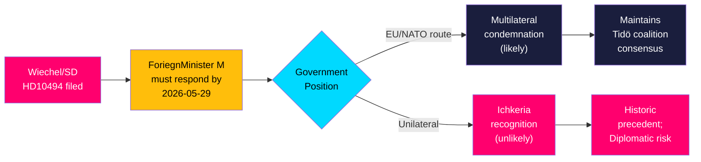

# Synthesis Summary: Swedish Foreign Policy Under Election-Season Pressure on Russia/Ichkeria

**dok_id coverage**: HD10494  
**Analysis date**: 2026-05-18  
**Admiralty confidence**: HIGH [B1]

## Core Intelligence Finding

Interpellation HD10494 reveals a structured foreign policy challenge to the Tidö government: Markus Wiechel (SD) is forcing a public, on-record ministerial position on (a) Chechen self-determination and Russian occupation doctrine and (b) Sweden's response to Russia's newly enacted extraterritorial military law. The interpellation is unlikely to shift government policy immediately but creates a documented record that will feature in election-campaign debates.

## Political Dynamics

The SD-M government coalition contains inherent tension on Russia policy. SD is consistently hawkish and has pushed for stronger unilateral Swedish signals on occupied peoples; M-led foreign policy favors EU and NATO coordination over unilateral moves. This interpellation exploits that fault line publicly, 118 days before the September 13, 2026 general election.



## Significance of Russia's New Law

The Russian State Duma law (April–May 2026) granting Putin authority to use military force abroad to "protect Russian citizens" from foreign legal proceedings is a threshold event:

1. **Legal architecture**: Russia now has a formal statutory basis for extraterritorial military operations — not just presidential decree
2. **Scope**: explicitly targets foreign courts or states that detain/prosecute Russian citizens
3. **Pattern**: analysts link to Georgia 2008 (protecting "Russian citizens" in South Ossetia), Crimea/Donbass 2014, and the 2022 full-scale Ukraine invasion — all involved "protecting Russians" as initial justification
4. **Nordic/Baltic risk**: countries with Russian-speaking minorities (Estonia, Latvia) or individuals subject to international warrants (Russian officials traveling) now face explicit statutory threat

Source: [A1] HD10494 full text (cites statsduman proceedings April–May 2026)

## Cross-Cutting Themes

- **International law vs. realpolitik**: Sweden's formal recognition of Ichkeria would invoke international law principle of self-determination but risk Russian diplomatic retaliation
- **NATO coherence**: Sweden's NATO membership requires coordinated responses; unilateral Ichkeria recognition without NATO/EU consensus could create alliance friction
- **Precedent risk**: recognizing Ichkeria could trigger analogous demands for other occupied peoples (Abkhazia, South Ossetia, Donetsk/Luhansk before 2022), though these are Russian-controlled rather than liberation movements
- **Electoral framing**: SD frames Russia hawkishness as a vote-winning platform; M frames multilateral coordination as responsible governance

## IMF Economic Context

IMF WEO Apr-2026 (vintage: 1 month, status: ok per pre-warm probe; individual weo-fetch: degraded-transient): Sweden GDP growth projected +0.8% (2026), +2.3% (2027). Fiscal balance -0.3% of GDP (2026). Government gross debt ~44% of GDP. This interpellation is a foreign/security policy matter — economic context is peripheral but relevant to Sweden's defense spending trajectory (2.5% of GDP target post-NATO accession) and diplomatic leverage.

⚠️ *IMF runtime fetch degraded (transient). WEO Apr-2026 vintage values used from pre-warm context. Vintage: WEO Apr-2026, NGDP_RPCH.*

## Economic Provenance

```json
{
  "economicProvenance": {
    "provider": "imf",
    "dataflow": "WEO",
    "indicator": "NGDP_RPCH",
    "vintage": "WEO-2026-04",
    "retrieved_at": "2026-05-18T07:51:25Z",
    "note": "Runtime fetch degraded-transient; pre-warm cache used. Sweden values: GDP growth +0.8% (2026), +2.3% (2027). Economic context peripheral to this foreign policy analysis."
  }
}
```
