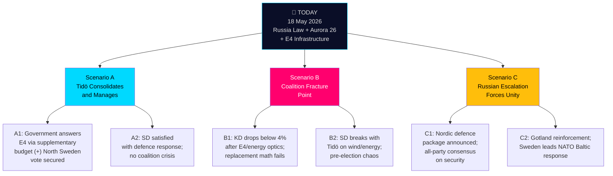

# Scenario Analysis — Realtime Pulse 18 May 2026

**Author**: James Pether Sörling | **Date**: 2026-05-18 | **Framework**: Tiered scenario tree per 04-analysis-pipeline.md §Scenario matrix

**Horizon scope**: T+72h to T+quarter (this realtime run covers the near-to-medium term)

## Scenario Tree

## Scenario Descriptions

### Scenario A: Tidö Consolidates (Probability: 55%)
**Conditions**: Government provides credible E4 supplementary financing; Busch successfully navigates SD energy pressure; defence questions managed as cross-party competence display  
**Indicators to watch**: KD response to HD11814 within 7 days; Busch scheduled next energy policy statement; Aurora 26 wrap-up briefing date  
**Electoral consequence**: Tidö enters September 2026 election with stable bloc above 50% (current polls: ~49–51%)  
**WEP**: LIKELY [horizon:month]

### Scenario B: Coalition Fracture Point (Probability: 25%)
**Conditions**: KD falls below 4% threshold in polls (currently ~4.8%); E4 PPP controversy compounds with energy disinformation allegations; SD sees opportunity to assert leadership  
**Indicators to watch**: KD poll numbers in late May 2026; SD public statements on Interp:448 outcome; any scheduled party leader meeting or press conference  
**Electoral consequence**: 4-party Tidö becomes 3-party; complex majority math; possible minority M government  
**WEP**: ROUGHLY EVEN given current KD risk [horizon:quarter]

### Scenario C: Security Rally-Round (Probability: 20%)
**Conditions**: Russian military activity near Baltic increases; Aurora 26 lessons generate cross-party security consensus; government announces major Nordic defence package  
**Indicators to watch**: Aurora 26 final exercise report date; any NATO Baltic reinforcement announcement; Russia Baltic fleet activity  
**Electoral consequence**: M/KD security competence narrative strengthened; opposition forced to support; election competitive but Tidö advantaged  
**WEP**: UNLIKELY but non-negligible given TH-1 [horizon:quarter]

## Wildcard Scenarios

**W-1: Northvolt restructuring collapses** — If Northvolt enters insolvency during E4 uncertainty period, northern Sweden industrial narrative becomes acute crisis for all parties. SD and S both benefit from government failures.

**W-2: Snap election speculation** — If Tidö confidence vote threatened (scenario B becomes acute), speculation about snap election before September could generate self-fulfilling instability.
