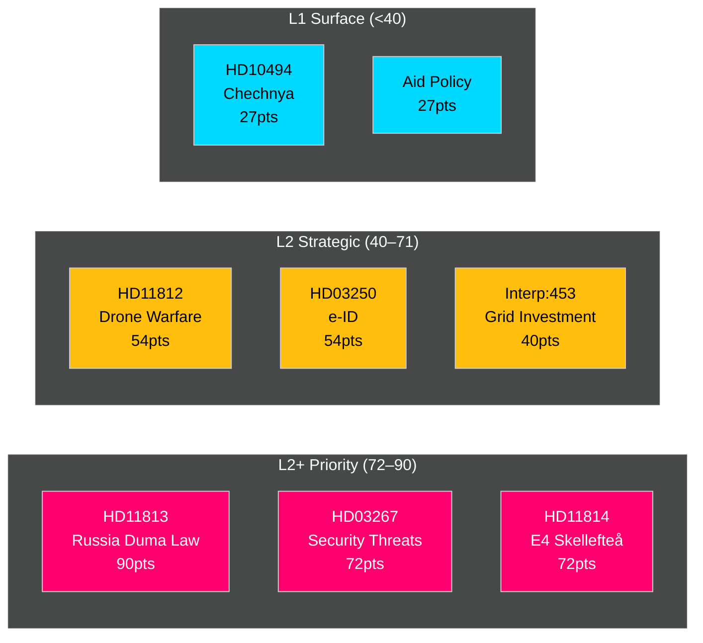

# Significance Scoring — Realtime Pulse 18 May 2026

**Author**: James Pether Sörling | **Date**: 2026-05-18 | **Methodology**: DIW (Detectability × Impact × Willingness) with 1.5× election-proximity multiplier (≤ 6 months: 2026-03-13 → 2026-09-13)

## Ranked Documents

| Rank | dok_id | Title | D | I | W | Raw | ×1.5 | Tier | Grade |
|------|--------|-------|---|---|---|-----|------|------|-------|
| 1 | HD11813 | Ny rysk lag om angrepp på andra länder | 3 | 5 | 4 | 60 | **90** | L2+ Priority | [A3] |
| 2 | HD03267 | Stärkt skydd mot utlänningar | 4 | 4 | 3 | 48 | **72** | L2+ Priority | [A2] |
| 3 | HD11814 | E4 Förbifart Skellefteå | 3 | 4 | 4 | 48 | **72** | L2+ Priority | [A2] |
| 4 | HD11812 | Drönarkrig (Aurora 26) | 3 | 4 | 3 | 36 | **54** | L2 Strategic | [A3] |
| 5 | HD03250 | En statlig e-legitimation | 3 | 4 | 3 | 36 | **54** | L2 Strategic | [A2] |
| 6 | Interp 2025/26:453 | Investeringar i elnät (Busch/Fransson) | 3 | 3 | 3 | 27 | **40.5** | L2 Strategic | [B2] |
| 7 | HD10494 | Erkännande tjetjenska republiken | 2 | 3 | 3 | 18 | **27** | L1 Surface | [B3] |
| 8 | HD10492-3 | Aid consequences (V → Dousa) | 2 | 3 | 3 | 18 | **27** | L1 Surface | [C2] |
| 9 | HD11812 | Moms på återlämnade förpackningar | 2 | 2 | 2 | 8 | **12** | L1 Surface | [D3] |

## Scoring Rationale

**HD11813 — Russia Duma law (90)**: Highest score because Russia's expansion of Putin's unilateral attack authority (adopted 13 May 2026) is a genuine threat-environment change. Impact on Swedish security doctrine and NATO coordination is structural. Detectability high (public Duma proceedings). Willingness of SD to use for defence-hardline narrative: high. Election proximity amplifies urgency. Source: `https://data.riksdagen.se/dokument/HD11813.html` [A3].

**HD03267 — Qualified security threats (72)**: New government proposition expanding deportation authority for security threats. Justitiedepartementet. High detectability (proposition), high impact on alien/security law, moderate willingness (government-initiated so SD/M coalition aligned). Source: `https://data.riksdagen.se/dokument/HD03267.html` [A2].

**HD11814 — E4 Förbifart Skellefteå (72)**: S opposition question targets KD Infrastructure Minister on removal of SEK 1.7 bn from national infrastructure plan. High electoral salience (northern Sweden industrial belt, Northvolt legacy). Source: `https://data.riksdagen.se/dokument/HD11814.html` [A2].

**Election-proximity note**: Every score above reflects the mandatory 1.5× multiplier per `04-analysis-pipeline.md §Election-proximity significance multiplier`. The next general election falls on 13 September 2026 (117 days). The multiplier window (≤6 months) opened 13 March 2026 and closes 13 September 2026. DIW = raw × 1.5 throughout this run.

## Mermaid Significance Map

