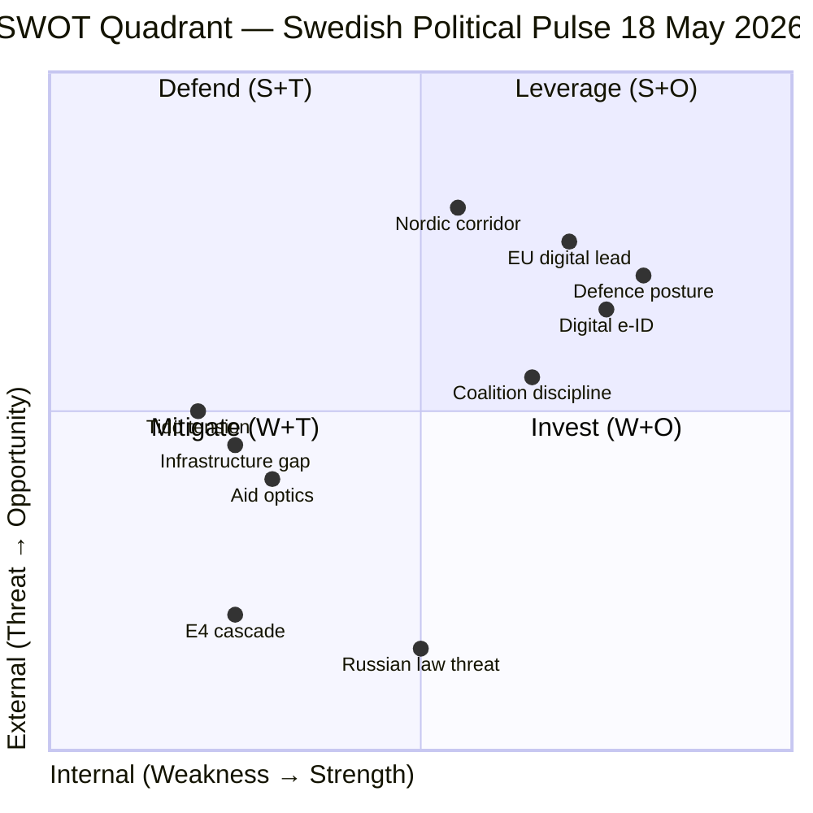

# SWOT Analysis — Swedish Political Landscape 18 May 2026

**Author**: James Pether Sörling | **Date**: 2026-05-18 | **Framework**: SWOT applied to Sweden's political-institutional landscape with electoral proximity lens

## Strengths

- **Defence posture strengthening**: Aurora 26 exercise (18,000 participants, April–May 2026, Gotland-centric) demonstrates NATO integration capability `[A3]`. Proposition HD03267 (security threat deportation) signals proactive security legislation.
- **Digital modernisation**: Proposition HD03250 (statlig e-legitimation) advances digital public infrastructure — positions Sweden competitively for EU digital single market `[A2]`.
- **Coalition management**: Busch absorbs SD energy interpellations (2025/26:453, :448) without conceding policy ground — demonstrates coalition discipline `[B2]`.
- **IMF economic baseline**: Sweden GDP growth forecast ~2.0% (WEO Apr-2026, NGDP_RPCH) — above EU average, provides fiscal headroom for both defence and infrastructure.

## Weaknesses

- **Infrastructure investment credibility gap**: E4 Förbifart Skellefteå PPP shift (HD11814) signals government reliance on private financing for strategic regional infrastructure — credibility risk in northern Sweden `[A2]`.
- **Aid policy optics**: Foreign-aid strategy overhaul (December 2023) now generating parliamentary questions about child welfare consequences (HD10492) — undermines Sweden's international human-rights positioning `[C2]`.
- **Tidö internal tensions**: SD's persistent wind-power scepticism (Interp:448) vs KD's energy-transition mandate risks visible policy contradiction entering the election period `[B2]`.
- **Skatteverket civil-registration gaps**: HD03261 acknowledges population register inaccuracies — governance competence question in election year `[A2]`.

## Opportunities

- **Northern Sweden industrial corridor**: Aurora 26 + Northvolt infrastructure questions create political space for a unified northern-development narrative, if government addresses E4 financing concerns `[A2]`.
- **Defence spending consensus**: Cross-party pressure (SD, S) on drone doctrine and Russia law creates legislative opportunity for defence capability investment package `[A3]`.
- **EU digital sovereignty**: State e-ID proposition aligns with EU Digital Identity framework — positions Sweden as implementation leader `[A2]`.
- **Nordic coordination**: Russia's Duma law likely to accelerate Nordic defence alignment discussions — Sweden as NATO-Nordic hub can assert leadership `[A3]`.

## Threats

- **Russian threat escalation**: Duma law (13 May 2026) expanding Putin's unilateral force authority is a structural deterioration of the security environment that may accelerate escalation scenarios beyond Sweden's planning timelines `[A3]`.
- **Infrastructure delay cascade**: E4 PPP delay risks compounding with Northvolt restructuring to undermine the northern-Sweden battery/EV corridor — economic and strategic threat `[A2]`.
- **Coalition fracture at election entry**: SD–KD energy tensions (Interp:448, :453), if unresolved, create attack surface for opposition and may reduce Tidö cohesion at the most critical electoral moment `[B2]`.
- **Aid strategy blowback**: International CSO criticism of Sweden's ODA reduction may affect EU partnership negotiations and UNSC candidacy credibility `[C2]`.

## SWOT Quadrant Map

