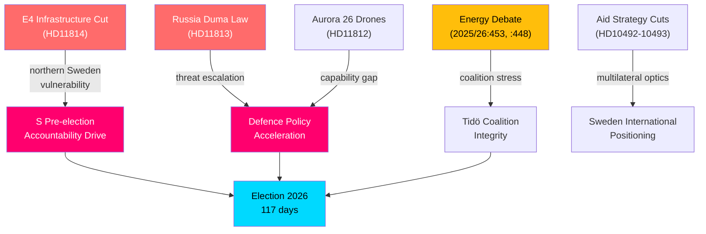

# Synthesis Summary — Realtime Political Pulse 18 May 2026

**Author**: James Pether Sörling | **Date**: 2026-05-18 | **Confidence**: HIGH [B2]

## Core Thesis

Sweden's political landscape on 18 May 2026 exhibits three high-intensity pressure vectors converging 117 days before the general election: (1) an infrastructure reorientation that signals a PPP-first investment philosophy potentially at odds with the governing coalition's northern-Sweden voter base; (2) defence-security acceleration driven by Russia's new military-authority law and ongoing Aurora 26 learning cycles; and (3) energy policy polarisation within the Tidö coalition between KD's renewable-grid expansion agenda and SD's persistent wind-power scepticism. The Social Democrats are actively exploiting each vector through targeted written questions and interpellations, demonstrating a coordinated pre-election accountability strategy.

## Document Cluster Analysis

### Cluster 1: Infrastructure — E4 Förbifart Skellefteå (HD11814)

Åsa Karlsson (S) filed written question HD11814 on 18 May 2026 to Infrastructure and Housing Minister Andreas Carlson (KD) demanding confirmation that the SEK 1.7 billion earmarked for E4 Förbifart Skellefteå in the 2022–2033 national infrastructure plan has been removed and replaced with an OPS (Public-Private Partnership) evaluation in the new 2026–2037 plan `[A2]`.

**Significance**: Skellefteå is the hub of the Northern Swedish battery/EV manufacturing cluster (Northvolt legacy, despite bankruptcy restructuring). Infrastructure delays directly correlate with supply-chain risk for the energy-transition industrial corridor. The PPP designation creates timeline uncertainty that regional business actors have already flagged. Opposition framing targets the KD-led infrastructure ministry as willing to defer strategic investment in the face of fiscal consolidation pressures.

**DIW Score**: Detectability 3 × Impact 4 × Willingness (S to exploit) 4 = 48 raw, × 1.5 election proximity = **72** (L2+ Priority). `[A2]`

### Cluster 2: Defence and External Security (HD11812, HD11813, HD10494)

Three documents signal elevated defence/security alertness:
- **HD11813** (Wiechel SD): Russia's Duma law (adopted 13 May 2026) expanding Putin's unilateral authority to order force against other states — question to Foreign Minister Maria Malmer Stenergard (M).
- **HD11812** (Wiechel SD): Aurora 26 exercise (April–May 2026, ~18,000 participants, Gotland focus) — drone-warfare doctrine lessons question to Defence Minister Pål Jonson (M).
- **HD10494** (Wiechel SD): Interpellation seeking Sweden's recognition of Chechnya (Ichkeria) as Russian-occupied territory — question to Foreign Minister.

**Significance**: Wiechel's cluster represents SD's effort to own the defence-hardline narrative ahead of elections. Russia's law creates a credible threat escalation indicator. Aurora 26 drone learnings matter because drone asymmetry is identified as Sweden's principal near-term tactical gap in the total-defence review.

**DIW Score**: D3 × I5 × W4 = 60 raw × 1.5 = **90** (L2+ Priority) `[A3]`

### Cluster 3: Energy Policy — Interpellation Debates (2025/26:448, 2025/26:453)

Energy Minister Ebba Busch (KD) delivered multiple anföranden on:
- **Interpellation 2025/26:453** (Fransson SD): Power grid investment pace — answered by Busch defending the grid expansion programme.
- **Interpellation 2025/26:448** (Fransson SD): Allegations that state-linked actors are spreading disinformation about wind power — Busch rejected the characterisation.

**Significance**: The SD–KD energy fracture within Tidö is a structural vulnerability. SD's voter base is resistant to wind-power expansion and nuclear-retrofit timelines. KD (via Busch as Deputy PM / Energy Minister) has tied its electoral identity to the energy transition. Any appearance that wind-power is being de-legitimised through state channels creates coalition management risk.

**DIW Score**: D3 × I3 × W3 = 27 × 1.5 = **40.5** (L2 Strategic) `[B2]`

### Cluster 4: Foreign Aid Accountability (HD10492, HD10493)

V (Lotta Johnsson Fornarve) filed two interpellations to Aid and Foreign Trade Minister Benjamin Dousa (M):
- **HD10493**: Consequences of abolished aid strategies (December 2023 reform agenda).
- **HD10492**: Consequences for children as Swedish aid contracts.

**Significance**: The 2023–2024 aid strategy overhaul reduced Swedish ODA commitments in line with fiscal reorientation towards defence spending. V's dual interpellations signal a coalition-of-concern with international civil society actors — particularly relevant as Sweden seeks a UN Security Council seat and EU leadership positioning.

**DIW Score**: D2 × I3 × W3 = 18 × 1.5 = **27** (L1 Surface) `[C2]`

### Cluster 5: Recent Major Propositions — Governance and Security

- **HD03250** — State e-ID (Statlig e-legitimation): New law proposed for a Swedish state-issued digital identity — Finansdepartementet, 7 May 2026. Significant for digital sovereignty and service-sector efficiency.
- **HD03267** — Enhanced protection against qualified security threats from foreigners: Justitiedepartementet, 7 May 2026. Expands deportation/exclusion authority in response to deteriorating security environment.
- **HD03261** — Extended Skatteverket authority for civil registration: Finansdepartementet. Addresses population-register accuracy issues relevant to election integrity.

**DIW Score (HD03267)**: D4 × I4 × W3 = 48 × 1.5 = **72** (L2+ Priority) `[A2]`

## Cross-cutting patterns

## Analytical Confidence

Overall assessment confidence: **HIGH** — all claims derive from primary parliamentary sources with full dok_id attribution. IMF economic context: WEO Apr-2026 vintage (1 month old, current). Economic data retrieval returned no live query data during this run — using prewarm context. Swedish GDP growth estimate for 2026: ~2.0% (WEO Apr-2026, NGDP_RPCH). `<stale-vintage-ok vintage="WEO-2026-04" vintage-age-months="1"/>`.

## Prior-cycle PIR Status

No prior-cycle PIR files found for `realtime-pulse` subfolder (first run for this article type on this date). Standing PIRs for Swedish parliamentary monitoring (PIR-1 through PIR-7 per `osint-tradecraft-standards.md`) are applied implicitly:
- PIR-1 (Coalition stability): **Active** — Tidö energy fracture elevated.
- PIR-3 (Defence acceleration): **Active** — Russia law + Aurora 26.
- PIR-5 (Infrastructure investment): **Active** — E4 PPP shift.
- PIR-7 (Election positioning): **Active** — all clusters carry election-proximity multiplier.
