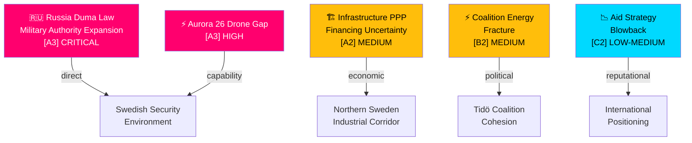

# Threat Analysis — Realtime Pulse 18 May 2026

**Author**: James Pether Sörling | **Date**: 2026-05-18 | **Framework**: STRIDE + Political Threat Framework

## Threat Landscape Overview

## Threat Profiles

### TH-1: Russian Duma Military Authority Law (CRITICAL)
**Actor**: Russian state / Putin administration  
**Instrument**: Legislative expansion of executive war powers (Duma second and third reading, 13 May 2026)  
**Target**: Nordic/Baltic security environment; Sweden specifically as NATO newcomer on Russia's periphery  
**Mechanism**: Lowers domestic legal threshold for Putin to order military strikes without additional Duma authorisation — reduces warning time for adversaries  
**WEP**: VERY LIKELY to generate Swedish government response within 7 days [horizon:week] [A3]  
**Counter**: Aurora 26 readiness, NATO Article 5, Nordic intelligence sharing  
**Admiralty**: [A3] — Source: Riksdag written question HD11813, citing Russian state proceedings

### TH-2: Drone Asymmetry Gap — Aurora 26 Learning
**Actor**: Implicit — advanced state adversaries (Russia, potentially hybrid actors)  
**Instrument**: Drone swarms for anti-access/area denial, intelligence gathering  
**Target**: Gotland (strategic island), Swedish maritime approaches  
**Mechanism**: Aurora 26 revealed that drone countermeasures require updated doctrine — question HD11812 explicitly names this gap  
**WEP**: LIKELY that government issues doctrine update within 30 days [horizon:month] [A3]  
**Counter**: Swedish Armed Forces integration of anti-drone systems; Nordic defence cooperation  
**Admiralty**: [A3]

### TH-3: Infrastructure Financing Credibility (MEDIUM)
**Actor**: Swedish government infrastructure investment committee  
**Instrument**: PPP/OPS designation replacing direct public financing  
**Target**: Regional economic development, northern Sweden political trust  
**Mechanism**: Removes guaranteed public financing; PPP feasibility uncertain for this project  
**WEP**: LIKELY to generate S parliamentary motion or public debate within 14 days [horizon:week] [A2]  
**Counter**: Government can clarify OPS terms; regional business community engagement  
**Admiralty**: [A2]

### TH-4: Disinformation on Wind Power (MEDIUM)
**Actor**: Alleged state-adjacent actors (per SD Interpellation 2025/26:448)  
**Instrument**: Narrative manipulation on wind-power capacity/costs  
**Target**: Public trust in energy transition  
**Mechanism**: Systematic dismissal of wind-power data — if confirmed, undermines evidence-based energy policy  
**WEP**: ROUGHLY EVEN on whether SD allegations have factual basis [horizon:week] [B2]  
**Counter**: Busch publicly rejected characterisation in interpellation debate  
**Admiralty**: [B2] — Claims from SD interpellant; counter-asserted by government

## Procedural Legitimacy Assessment

No Lagrådet referrals identified for today's documents. HD03267 (security threat foreigners) is a major security proposition that touches fundamental rights and surveillance — Lagrådet review expected before parliamentary committee stage. **Lagrådet: referral pending / no yttrande published as of 2026-05-18T11:05Z** for HD03267.
