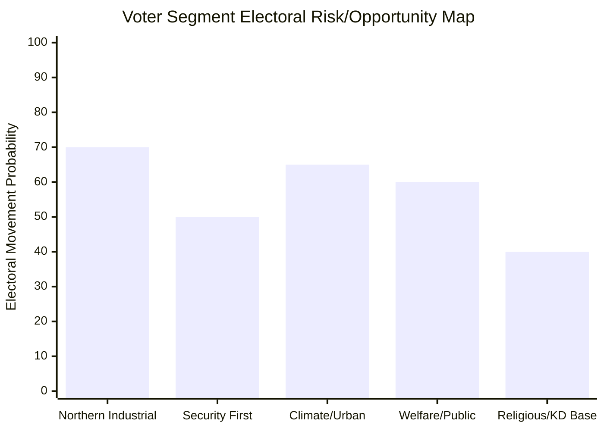

# Voter Segmentation — Realtime Pulse 18 May 2026

**Author**: James Pether Sörling | **Date**: 2026-05-18

## Key Voter Segments and Today's Relevance

### Segment 1: Northern Sweden Industrial Workers (HD11814 primary)
- **Profile**: Employed in mining, steel, battery/EV (Northvolt), forestry, traditional manufacturing
- **Geographic concentration**: Västerbotten, Norrbotten, Dalarna
- **Historical alignment**: S stronghold; some migration to SD post-2010
- **Today's relevance**: HD11814 E4 PPP directly affects regional development narrative. Northvolt association makes infrastructure investment a personal economic concern.
- **S opportunity**: "Government cuts investment in your region." **KD risk**: Cannot defend PPP shift without appearing anti-northern.
- **WEP**: LIKELY that this segment moves slightly toward S if E4 question becomes a campaign theme [horizon:month]

### Segment 2: Security-First Voters (HD11813, HD11812 primary)
- **Profile**: Concern about Russia/Ukraine; willing to increase defence spending; value NATO membership
- **Geographic concentration**: East coast, Stockholm suburbs, Gotland (symbolic), military family communities
- **Historical alignment**: M + SD main beneficiaries post-Ukraine war
- **Today's relevance**: Russia Duma law (HD11813) and Aurora 26 drone gap (HD11812) activate this segment
- **M/SD competition**: SD positioning on defence helps them — M must respond with tangible policy not just statements
- **WEP**: ROUGHLY EVEN on whether M or SD captures more of this segment [horizon:election]

### Segment 3: Climate/Urban Progressives (HD10491, HD10488 primary)
- **Profile**: University-educated, urban, climate-concerned, age 25–45
- **Geographic concentration**: Stockholm, Gothenburg, Malmö urban cores
- **Historical alignment**: MP, V, L (for liberal-educated subset)
- **Today's relevance**: Stockholm emissions plan (HD10491), climate adaptation law (HD10488) directly address this segment
- **MP opportunity**: Every unanswered climate question strengthens MP over L for this segment
- **WEP**: LIKELY MP gains within progressive urban segment if climate questions go unanswered [horizon:quarter]

### Segment 4: Public Sector/Welfare Voters (HD11807 primary)
- **Profile**: Public sector employees, healthcare, social services; value state institutions
- **Historical alignment**: S, V strong; some L for welfare-liberal subset
- **Today's relevance**: HD11807 (women's shelters) touches state welfare provision credibility
- **S/V reinforcement**: Welfare accountability questions reinforce left-bloc base
- **WEP**: LIKELY these questions strengthen S/V base consolidation [horizon:month]

### Segment 5: Religious-Conservative Values Voters (KD base)
- **Profile**: Practicing Christians, family-values conservatives, often suburban
- **Historical alignment**: KD primary, M secondary
- **Today's relevance**: KD under pressure on both E4 (fiscal responsibility challenged) and energy (green credentials)
- **KD risk**: Any credibility erosion in these secular-administrative controversies may not cost KD religious base directly but reduces KD's "capable Christian governance" appeal
- **WEP**: ROUGHLY EVEN on KD base retention [horizon:election]

## Segmentation Matrix

