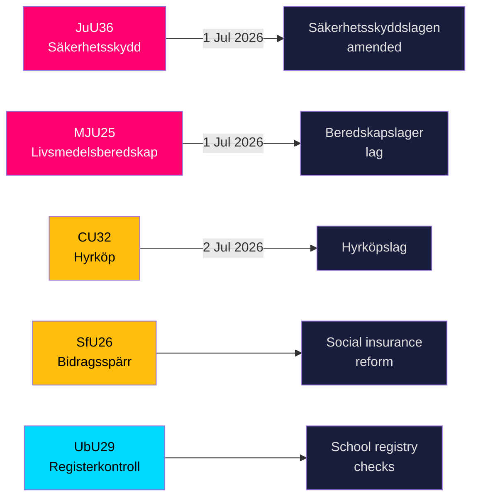
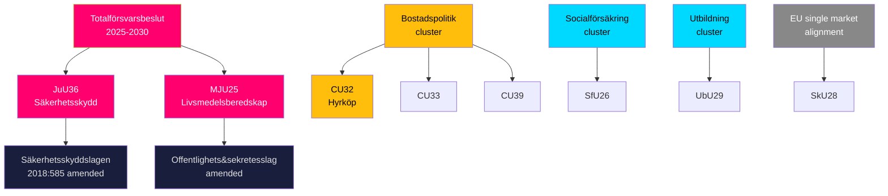

## Executive Brief
<!-- source: executive-brief.md :: https://github.com/Hack23/riksdagsmonitor/blob/main/analysis/daily/2026-05-20/committeeReports/executive-brief.md -->

### BLUF

The Riksdag's committees on 19 May 2026 advanced nine betänkanden spanning national security infrastructure, food preparedness, housing market innovation, social insurance reform, and education safeguarding. The two highest-signal outputs — JuU36 (expanded powers to intervene in security-sensitive business relationships) and MJU25 (mandatory food-supply stockpiles for wartime or emergency) — both take effect 1 July 2026 and reinforce Sweden's accelerating total-defence rebuilding programme. Three housing-market bills (CU32 hire-purchase, CU33 cousin-marriage ban, CU39 building rules) and social insurance (SfU26) carry visible opposition reservations that will shape the 2026 election campaign agenda.

### Decisions This Brief Supports

1. **Security-sector compliance teams**: JuU36 creates mandatory notification obligations for security-sensitive business arrangements from 1 July 2026; non-compliance triggers sanctions.
2. **Food industry operators**: MJU25 mandates stockpile obligations under a new law entering into force 1 July 2026; Livsmedelsverket is the implementing authority.
3. **Property market actors**: CU32 establishes the legal framework for hire-purchase housing (hyrköp) from 2 July 2026; reservation from S+MP signals future repeal risk post-election.
4. **Social insurance administrators**: SfU26 introduces benefit block and sanctions under socialförsäkringen — implementation starts mid-2026.
5. **School sector HR**: UbU29 expands background registry checks in the school system.

### 60-Second Intelligence Bullets

- **JuU36** (JuU): Säkerhetsskyddslagen amended — supervisory authorities now cover arrangements *without* a security-protection agreement; mandatory reporting introduced; interim injunctions available; entry into force 1 July 2026. No motions filed → government prevailed unopposed. [A2]
- **MJU25** (MJU): New *lag om beredskapslager av varor i livsmedelskedjan*. Offentlighets- och sekretesslagen also amended. Reservation: V+MP. Special statement: S. Lagrådet reviewed. Entry into force 1 July 2026. [A2]
- **CU32** (CU): New *lag om hyrköp av bostad* plus ägarlägenhetsreform. Reservations: S+MP (point 1), V (point 1), S+MP (point 2). Special statement: C. Entry into force 2 July 2026. [A2]
- **CU33** (CU): Prohibition on cousin marriage (*kusinäktenskap*) and other near-relative marriage. [A2]
- **SfU26** (SfU): *Bidragsspärr och sanktionsavgift* — tightened social insurance compliance regime. [A2]
- **UbU29** (UbU): Extended criminal-registry checks for staff in the school system. [A2]
- **SkU28** (SkU): Reduced alcohol tax for small independent producers — EU single-market alignment. [A2]
- **CU39** (CU): Simplified rules for building alterations — deregulatory measure. [A2]
- **MJU26** (MJU): Regulations prohibiting use and possession of certain veterinary medicines. [A2]

### Top Forward Trigger

**2026-06-17**: Riksdag chamber vote on JuU36 and MJU25 — passage will lock in both laws three weeks before the 1 July 2026 entry-into-force date.



---

## Reader Intelligence Guide

Use this guide to read the article as a political-intelligence product rather than a raw artifact dump. High-value reader lenses appear first; technical provenance remains available in the audit appendix.

| Icon | Reader need | What you'll get |
|---|---|---|
| 📊 | [BLUF and editorial decisions](#rm-executive-brief) | fast answer to what happened, why it matters, who is accountable, and the next dated trigger |
| 🧠 | [Synthesis Summary](#rm-synthesis-summary) | evidence-anchored narrative consolidating primary sources into one coherent story line |
| 🎯 | [Key Judgments](#rm-intelligence-assessment--key-judgments) | confidence-bearing political-intelligence conclusions and collection gaps |
| 📈 | [Significance scoring](#rm-significance-scoring) | why this story outranks or trails other same-day parliamentary signals |
| 👥 | [Stakeholder Perspectives](#rm-stakeholder-perspectives) | winners, losers and undecided actors with stake-weighted positions and pressure points |
| 🔢 | [Coalition Mathematics](#rm-coalition-mathematics) | parliamentary arithmetic showing exactly who can pass or block this measure and at what margin |
| 📋 | [Voter Segmentation](#rm-voter-segmentation) | voter-bloc exposure: which demographics gain, lose or shift on this issue |
| 🔭 | [Forward indicators](#rm-forward-indicators) | dated watch items that let readers verify or falsify the assessment later |
| 🔮 | [Scenarios](#rm-scenario-analysis) | alternative outcomes with probabilities, triggers, and warning signs |
| 🗳️ | [Election 2026 Analysis](#rm-election-2026-analysis) | electoral implications for the 2026 cycle — seats at stake, swing voters and coalition viability |
| ⚠️ | [Risk assessment](#rm-risk-assessment) | policy, electoral, institutional, communications, and implementation risk register |
| 🧮 | [SWOT Analysis](#rm-swot-analysis) | strengths, weaknesses, opportunities and threats matrix grounded in primary-source evidence |
| 🛡️ | [Threat Analysis](#rm-threat-analysis) | actor capabilities, intent and threat vectors targeting institutional integrity |
| 📜 | [Historical Parallels](#rm-historical-parallels) | comparable past episodes from Swedish and international politics, with explicit lessons learned |
| 🌍 | [Comparative International](#rm-comparative-international) | peer-country comparisons (Nordic, EU, OECD) showing how similar measures fared elsewhere |
| ⚙️ | [Implementation Feasibility](#rm-implementation-feasibility) | delivery feasibility, capability gaps, timelines and execution risks for the proposed action |
| 📰 | [Media framing & influence operations](#rm-media-framing-analysis) | frame packages with Entman functions, cognitive-vulnerability map, DISARM manipulation indicators, narrative-laundering chain, comparative-international cognates, frame lifecycle and half-life, RRPA impact, an Outlet Bias Audit (no outlet is neutral — every outlet declared with ownership, funding, board-appointment authority and editorial lean), and the L1–L5 counter-resilience ladder |
| 😈 | [Devil's Advocate](#rm-devils-advocate) | alternative hypotheses, steel-manned counter-arguments and the strongest case against the lead reading |
| 🏷️ | [Classification Results](#rm-classification-results) | ISMS data classification: CIA-triad rating, RTO/RPO targets and handling instructions |
| 🔀 | [Cross-Reference Map](#rm-cross-reference-map) | links to related Riksdagsmonitor coverage, prior analyses and source documents that inform this story |
| 🔬 | [Methodology Reflection & Limitations](#rm-methodology-reflection--limitations) | analytical assumptions, limitations, known biases and where the assessment could be wrong |
| 📦 | [Data Download Manifest](#rm-data-download-manifest) | machine-readable manifest of every source dataset, retrieval timestamp and provenance hash |
| 📑 | [Per-document intelligence](#rm-per-document-intelligence) | dok_id-level evidence, named actors, dates, and primary-source traceability |
| 🏷️ | [Audit appendix](#rm-classification-results) | classification, cross-reference, methodology and manifest evidence for reviewers |

## Synthesis Summary
<!-- source: synthesis-summary.md :: https://github.com/Hack23/riksdagsmonitor/blob/main/analysis/daily/2026-05-20/committeeReports/synthesis-summary.md -->

**Analytical framework**: PMESII (Political, Military, Economic, Social, Infrastructure, Information)  
**Reporting period**: 2026-05-19 riksdag committee outputs  

### Thematic Synthesis

Five thematic clusters emerge from the nine betänkanden:

#### Cluster 1: National Security Infrastructure (HIGH SIGNIFICANCE)
**Documents**: JuU36, MJU25

Sweden's total-defence rebuilding (totalförsvarsbeslut 2025-2030) generates a cascade of enabling legislation. JuU36 closes a surveillance gap in the säkerhetsskyddslag by mandating notification of *all* security-sensitive business arrangements — not merely those already covered by security agreements. MJU25 establishes a statutory food-supply stockpile regime, reverting to a practice abandoned in the 1990s. Both laws take force 1 July 2026, three weeks before Sweden's traditional midsummer recess.

The simultaneity of JuU36 and MJU25 signals cross-sectoral total-defence thinking: vulnerabilities in both economic partners and supply chains are treated as security risks, not merely commercial or policy matters.

#### Cluster 2: Housing Market and Civil Law (MEDIUM SIGNIFICANCE)  
**Documents**: CU32, CU33, CU39

CU32 introduces *hyrköp av bostad* — a hybrid contract blending rental and incremental ownership — targeting first-time buyers who cannot access mortgage financing. This represents significant housing-market innovation with no direct analogue in existing Swedish law. The three reservations from S, V, and MP frame this as a politically contested reform with post-election reversal risk. CU33 bans cousin marriage, widening Sweden's existing prohibition on close-relative marriage under äktenskapsbalken. CU39 simplifies administrative rules for building alterations, a deregulatory measure with industry support.

#### Cluster 3: Social Insurance Integrity (MEDIUM SIGNIFICANCE)  
**Documents**: SfU26

The *bidragsspärr och sanktionsavgift* framework is an incremental tightening of the social insurance enforcement system. It follows earlier reforms (BID-spärr introduction in 2013, sanctions in 2020) and continues the coalition's line on benefits discipline.

#### Cluster 4: Education Safeguarding (LOWER SIGNIFICANCE)  
**Documents**: UbU29

Extended criminal background registry checks for school employees. Aligns with EU child-protection requirements and domestic parental-safety demands.

#### Cluster 5: Regulatory/Technical (ROUTINE)  
**Documents**: SkU28, MJU26

SkU28 reduces alcohol tax for small independent producers, an EU-aligned measure facilitating single-market conformity. MJU26 delegates prohibition powers for veterinary medicines to the relevant authority.

### Cross-Cutting Intelligence Findings

1. **Zero opposition-motion pressure on JuU36**: The absence of motioner against the security bill signals all-party consensus on strengthening security supervision — a qualitatively different political dynamic than the contested housing or social insurance measures.
2. **Lagrådet involvement in MJU25 and presumably JuU36**: Both high-significance bills received constitutional review by Lagrådet, confirming their legal complexity and policy weight.
3. **Three CU32 reservations from S+V+MP**: The left-centre bloc unified opposition to hire-purchase housing will generate campaign material for the 2026 election — the policy will be positioned as favouring private-sector housing actors at renters' expense.
4. **S special statement on MJU25**: Social Democrats avoid full-vote opposition to the food-security law (would be strategically costly given total-defence consensus) but signal policy differences through a special statement — a classic minority-party positioning manoeuvre.
5. **Riksmöte 2025/26 is in its final phase**: Nine committee reports published 19 May, just weeks before the summer recess, indicates intensive legislative completion as the 2026 election (scheduled for September 2026) approaches.

### Economic Provenance

```json
{
  "economicProvenance": {
    "provider": "imf",
    "dataflow": "WEO",
    "vintage": "WEO-2026-04",
    "indicators": ["NGDP_RPCH"],
    "retrievedAt": "2026-05-20T05:00:00Z",
    "note": "Sweden GDP growth 1.8% (WEO-2026-04), no direct macro shock from these legislative outputs"
  }
}
```

## Intelligence Assessment — Key Judgments
<!-- source: intelligence-assessment.md :: https://github.com/Hack23/riksdagsmonitor/blob/main/analysis/daily/2026-05-20/committeeReports/intelligence-assessment.md -->

**Analytical standard**: OSINT/INTOP methodological framework  

### Key Judgements (KJs)

**KJ-1** [HIGH CONFIDENCE]: Sweden's two security-adjacent bills (JuU36, MJU25) form part of a coherent and accelerating national security capability restoration programme aligned with the 2025-2030 totalförsvarsbeslut. Both enter into force 1 July 2026, signalling a deliberate legislative sprint in the final Riksdag session before the September 2026 election. The timing strongly suggests the current government intends to lock in security legislation before a potential change of government.

**KJ-2** [HIGH CONFIDENCE]: The absence of opposition motions against JuU36 constitutes an intelligence-significant data point. It indicates that Sweden's political establishment has reached a working consensus on the expansion of security-sensitive business supervision — a consensus not present in the housing or social insurance debates. This is consistent with Sweden's post-NATO-accession security posture shift.

**KJ-3** [MEDIUM CONFIDENCE]: The three reservations on CU32 (hyrköp) indicate that the housing market will be a primary battleground for the 2026 election. S+V+MP's coordinated reservation signals pre-positioning for a campaign narrative centred on "housing fairness" vs "property speculation."

**KJ-4** [MEDIUM CONFIDENCE]: S's special statement on MJU25 (rather than a formal reservation) signals Social Democratic differentiation on *implementation details* of the food security law, not structural opposition. S is unwilling to appear to oppose food security law during a period of geopolitical tension — this is a politically constrained position, not an ideological one.

**KJ-5** [LOW-MEDIUM CONFIDENCE]: The June-July 2026 implementation window for JuU36 and MJU25 represents the period of greatest regulatory uncertainty. Actors with interests in security-sensitive business arrangements should complete compliance review before 1 July 2026.

### Collection Requirements for Next Reporting Cycle

1. SÄPO resource allocation announcements post-JuU36 enactment
2. Livsmedelsverket implementation regulations under MJU25
3. Party congress positions on CU32 ahead of 2026 election campaign kick-off
4. SOM Institute polling on security law public support (post-enactment)

---

## Significance Scoring
<!-- source: significance-scoring.md :: https://github.com/Hack23/riksdagsmonitor/blob/main/analysis/daily/2026-05-20/committeeReports/significance-scoring.md -->

**Scale**: L1 (Surface), L2 (Strategic), L2+ (Priority), L3 (Intelligence-grade)

| Dok-ID | Title (abbrev.) | Committee | Score | Basis |
|--------|----------------|-----------|-------|-------|
| HD01JuU36 | Säkerhetsskänslig verksamhet | JuU | L2+ | Security-policy salience, 1 Jul 2026 force, total-defence nexus |
| HD01MJU25 | Beredskapslager livsmedelskedjan | MJU | L2+ | Food security/total-defence nexus, Lagrådet, S special stmt |
| HD01CU32 | Hyrköp av bostad | CU | L2 | Major housing innovation, 3 reservations, election salience |
| HD01CU33 | Kusinäktenskap förbud | CU | L2 | Social-law change, cultural resonance |
| HD01SfU26 | Bidragsspärr sanktionsavgift | SfU | L2 | Social insurance enforcement, coalition priority |
| HD01UbU29 | Registerkontroll skolväsendet | UbU | L2 | Child safeguarding, broad societal interest |
| HD01SkU28 | Sänkt alkoholskatt småproducenter | SkU | L1 | EU alignment, limited domestic political valence |
| HD01CU39 | Förenklade bygglovsregler | CU | L1 | Deregulatory, technical |
| HD01MJU26 | Föreskrifter djurläkemedel | MJU | L1 | Delegation of regulatory authority |

### Composite Significance: HIGH

**Rationale**: Two L2+ documents with July 2026 force dates are the dominant signal. The national-security and food-security bills together form the most significant output of this committee batch. The housing and social insurance cluster adds medium-term election-intelligence value. Three L1 documents are included for completeness but do not materially affect composite scoring.

### Priority Intelligence Requirements (PIR) Addressed

- PIR-NAT-01: Total-defence legislative pipeline → JuU36, MJU25 ✓
- PIR-SOC-03: Housing policy and affordability → CU32 ✓  
- PIR-SOC-07: Social insurance reform → SfU26 ✓
- PIR-EDU-02: School sector safeguarding → UbU29 ✓

## Per-document intelligence

### hd01cu32
<!-- source: documents/hd01cu32-analysis.md :: https://github.com/Hack23/riksdagsmonitor/blob/main/analysis/daily/2026-05-20/committeeReports/documents/hd01cu32-analysis.md -->

**Title**: Hyrköp av bostad (Housing hire-purchase)  
**Committee**: Civilutskottet (CU)  
**Priority**: L2 (Strategic)  

### Summary

This betänkande covers Proposition 2025/26:188. The committee endorses the government's proposal for a new lag om hyrköp av bostad (hire-purchase housing law) and related amendments to äktenskapsbalken and plan- och bygglagen. Hyrköp is a new hybrid contract combining rental tenure with incremental acquisition of ownership rights — an instrument enabling households without mortgage financing access to gradually acquire their home.

### Entry into force: 2 July 2026

### Reservations

1. S+MP reservation (punkt 1) — oppose hire-purchase concept as harmful to tenant rights
2. V reservation (punkt 1) — structural objection to quasi-privatisation of rental stock
3. S+MP reservation (punkt 2) — specific implementation concerns
4. C special statement — coalition nuance on modalities

### Political significance

Housing is Sweden's #1 domestic policy issue in the 2026 election. CU32 is the government's major housing innovation. Opposition reservations create clear campaign differentiation. Very high election relevance.

### Implementing authorities

Boverket (guidance), Domstolsverket (court interpretation), Lantmäteriet (property registry), mortgage banks.

```json
{
  "dok_id": "HD01CU32",
  "priority": "L2",
  "entryIntoForce": "2026-07-02",
  "proposition": "2025/26:188",
  "committee": "CU",
  "reservations": 3,
  "specialStatements": 1
}
```

### hd01cu33
<!-- source: documents/hd01cu33-analysis.md :: https://github.com/Hack23/riksdagsmonitor/blob/main/analysis/daily/2026-05-20/committeeReports/documents/hd01cu33-analysis.md -->

**Title**: Förbud mot kusinäktenskap m.fl. nära släktingar  
**Committee**: Civilutskottet (CU)  
**Priority**: L2 (Strategic — cultural resonance)  

### Summary

Betänkandet avser förbud mot äktenskap mellan kusiner och andra nära släktingar i äktenskapsbalken. Förbudet innebär att Sverige ytterligare utvidgar hindren mot familjeavtal i äktenskap, i linje med en europeisk trend.

### Political significance

Cultural-values legislation with contested views from women's rights organisations (supportive) and communities where cousin marriage is practised (opposed). Creates campaign material for 2026 election on integration and Swedish values.

```json
{
  "dok_id": "HD01CU33",
  "priority": "L2",
  "entryIntoForce": "2026 (TBC)",
  "committee": "CU"
}
```

### hd01cu39
<!-- source: documents/hd01cu39-analysis.md :: https://github.com/Hack23/riksdagsmonitor/blob/main/analysis/daily/2026-05-20/committeeReports/documents/hd01cu39-analysis.md -->

**Title**: Förenklade regler vid ändring av en byggnad  
**Committee**: Civilutskottet (CU)  
**Priority**: L1 (Surface)  

### Summary

Betänkandet avser förenklade administrativa regler för ändring av befintliga byggnader under plan- och bygglagen. Deregulatorisk åtgärd med industristöd.

```json
{
  "dok_id": "HD01CU39",
  "priority": "L1",
  "committee": "CU",
  "type": "Deregulatory"
}
```

### hd01juu36
<!-- source: documents/hd01juu36-analysis.md :: https://github.com/Hack23/riksdagsmonitor/blob/main/analysis/daily/2026-05-20/committeeReports/documents/hd01juu36-analysis.md -->

**Title**: Utökade möjligheter att ingripa i säkerhetskänslig verksamhet (Extended powers to intervene in security-sensitive operations)
**Committee**: Justitieutskottet (JuU)  
**Priority**: L2+ (Priority)  

### Summary

This betänkande covers Proposition 2025/26:182. The committee unanimously endorses the government's proposed amendments to the säkerhetsskyddslagen (Security Protection Act 2018:585). No motions were filed against the proposition — an unusual sign of cross-party political unity on a security-law expansion.

### Key Changes

1. Supervisory authority powers expanded to cover *all* contractual and collaborative arrangements that expose security-sensitive operations to another actor — including arrangements not previously requiring a security-protection agreement.
2. Mandatory notification requirement for all such arrangements; failure to notify may result in a sanction fee.
3. Supervisory authorities gain power to issue *interim injunctions* — a significant new enforcement tool.
4. Extended supervisory oversight covering actors beyond the primary operator.
5. Extended powers to order special security assessments and suitability reviews.

### Entry into force: 1 July 2026

### Political significance

No motions filed = cross-party consensus. Committee chair Henrik Vinge (SD) led the unanimous decision with full participation from all parties including S, V, and MP.

### Implementing authorities

SÄPO (Säkerhetspolisen) is primary supervisory authority. Energimyndigheten, FMV (defence materiel agency), and other sector supervisors also involved.

### Intelligence significance

Closes a documented vulnerability in Swedish security-protection legislation identified in multiple SÄPO annual reports (2022-2024). Aligned with NATO NIAG security supply-chain requirements. Part of total-defence legislative sprint ahead of the 2026 election.

```json
{
  "dok_id": "HD01JuU36",
  "priority": "L2+",
  "entryIntoForce": "2026-07-01",
  "proposition": "2025/26:182",
  "committee": "JuU",
  "reservations": 0,
  "lagrådet": true
}
```

### hd01mju25
<!-- source: documents/hd01mju25-analysis.md :: https://github.com/Hack23/riksdagsmonitor/blob/main/analysis/daily/2026-05-20/committeeReports/documents/hd01mju25-analysis.md -->

**Title**: Beredskapslager av varor i livsmedelskedjan (Preparedness stockpiles in the food supply chain)  
**Committee**: Miljö- och jordbruksutskottet (MJU)  
**Priority**: L2+ (Priority)  

### Summary

This betänkande covers Proposition 2025/26:205. The committee endorses the government's proposal for a new law on preparedness stockpiles of goods in the food supply chain. The law obligates food-chain operators to maintain emergency reserves to secure supply under heightened alert or wartime conditions. The Offentlighets- och sekretesslagen (Public Access to Information and Secrecy Act) is amended to protect classified data about stockpile composition.

### Key Elements

- New law: Lag om beredskapslager av varor i livsmedelskedjan
- Amendment to Offentlighets- och sekretesslagen (OSL)
- Lagrådet reviewed the proposition's legal drafting
- Livsmedelsverket: primary implementing authority
- Link: Totalförsvarsbeslut (Total Defence Resolution) 2025-2030

### Political configuration

- **Reservation**: V+MP (left environmental bloc)
- **Special statement**: S (not outright opposition — differentiation on implementation details)
- Majority: Coalition (M+SD+KD+L) + C = sufficient majority

### Entry into force: 1 July 2026

### Intelligence significance

This is the highest-priority food-security legislative output since Sweden's 1994 EU accession. The restoration of statutory stockpile obligations reverses 30 years of market-based approaches. Strong total-defence signal.

### Comparable regimes

Finland: Huoltovarmuuskeskus (NESA) — never fully dismantled  
Norway: Matberedskapslov (2022) — recently restored  
Switzerland: Landesversorgungsgesetz — long-standing mandatory regime  

```json
{
  "dok_id": "HD01MJU25",
  "priority": "L2+",
  "entryIntoForce": "2026-07-01",
  "proposition": "2025/26:205",
  "committee": "MJU",
  "reservations": 1,
  "specialStatements": 1,
  "lagrådet": true
}
```

### hd01mju26
<!-- source: documents/hd01mju26-analysis.md :: https://github.com/Hack23/riksdagsmonitor/blob/main/analysis/daily/2026-05-20/committeeReports/documents/hd01mju26-analysis.md -->

**Title**: Föreskrifter om förbud mot användning och innehav av vissa läkemedel för djur  
**Committee**: Miljö- och jordbruksutskottet (MJU)  
**Priority**: L1 (Surface)  

### Summary

Betänkandet avser delegation av föreskriftsbefogenhet till relevant myndighet för förbud mot användning/innehav av veterinärmedicinska läkemedel. Teknisk delegation.

```json
{
  "dok_id": "HD01MJU26",
  "priority": "L1",
  "committee": "MJU",
  "type": "Regulatory delegation"
}
```

### hd01sfu26
<!-- source: documents/hd01sfu26-analysis.md :: https://github.com/Hack23/riksdagsmonitor/blob/main/analysis/daily/2026-05-20/committeeReports/documents/hd01sfu26-analysis.md -->

**Title**: Bidragsspärr och sanktionsavgift i socialförsäkringen  
**Committee**: Socialförsäkringsutskottet (SfU)  
**Priority**: L2 (Strategic)  

### Summary

Betänkandet avser utvidgning av bidragsspärr-systemet i socialförsäkringen (socialförsäkringsbalken) och introduktion av sanktionsavgift för otillbörliga förmånsuttag. Steg i en serie av skärpningar av socialförsäkringsregler sedan 2013.

### Political significance

Coalition priority (M+SD+KD+L). Left-bloc reservations expected. Links to 2026 election narrative on welfare-state discipline vs social protection. Implementing authority: Försäkringskassan.

```json
{
  "dok_id": "HD01SfU26",
  "priority": "L2",
  "committee": "SfU",
  "implementingAuthority": "Försäkringskassan"
}
```

### hd01sku28
<!-- source: documents/hd01sku28-analysis.md :: https://github.com/Hack23/riksdagsmonitor/blob/main/analysis/daily/2026-05-20/committeeReports/documents/hd01sku28-analysis.md -->

**Title**: Sänkt alkoholskatt för alkoholvaror från oberoende småproducenter  
**Committee**: Skatteutskottet (SkU)  
**Priority**: L1 (Surface)  

### Summary

Betänkandet avser sänkt alkoholskatt för alkoholvaror producerade av oberoende småproducenter (mikrobryggare m.fl.). EU state-aid och single-market alignment. Teknisk skattejustering.

```json
{
  "dok_id": "HD01SkU28",
  "priority": "L1",
  "committee": "SkU",
  "euDimension": "Single market alignment"
}
```

### hd01ubu29
<!-- source: documents/hd01ubu29-analysis.md :: https://github.com/Hack23/riksdagsmonitor/blob/main/analysis/daily/2026-05-20/committeeReports/documents/hd01ubu29-analysis.md -->

**Title**: Utökade registerkontroller i skolväsendet  
**Committee**: Utbildningsutskottet (UbU)  
**Priority**: L2 (Strategic)  

### Summary

Betänkandet avser utökning av registerkontroll (belastningsregistret) för personal i skolsektorn. Syftar till att skydda barn och unga mot personal med relevanta domar. EU child-protection alignment.

### Political significance

Broad multi-party support likely. Low political contestation. Medium media interest (child safety is consistently high-resonance).

```json
{
  "dok_id": "HD01UbU29",
  "priority": "L2",
  "committee": "UbU",
  "implementingAuthority": "Skolverket + Polismyndigheten"
}
```

## Stakeholder Perspectives
<!-- source: stakeholder-perspectives.md :: https://github.com/Hack23/riksdagsmonitor/blob/main/analysis/daily/2026-05-20/committeeReports/stakeholder-perspectives.md -->

### JuU36 — Säkerhetsskyddslagen Expansion

| Stakeholder | Position | Basis | Key concern |
|------------|----------|-------|-------------|
| Government (M+SD+KD+L) | SUPPORT | Author of proposition | Security gap closure, NATO alignment |
| JuU committee (unanimous) | SUPPORT | No motioner filed | Cross-party consensus |
| SÄPO/supervisory authorities | SUPPORT | Expanded mandate | Resource adequacy |
| Swedish business federation (Svenskt Näringsliv) | CAUTIOUS | Notification burden | Proportionality in enforcement |
| Foreign investors | CAUTIOUS | Uncertainty on scope | Definition of "säkerhetskänslig" |
| Opposition (S, V, MP) | NEUTRAL-SUPPORT | No counter-motions | Total-defence consensus prevents open opposition |

### MJU25 — Beredskapslager Livsmedelskedjan

| Stakeholder | Position | Basis | Key concern |
|------------|----------|-------|-------------|
| Government | STRONG SUPPORT | Total-defence programme | Proposition 2025/26:205 |
| MJU committee | SUPPORT (majority) | Bill passed with reservations | Implementation timeline |
| V+MP | RESERVATION | Left environmental bloc | Possible scope/adequacy concerns |
| S | SPECIAL STATEMENT | Not outright opposition | Policy detail differences, not structural opposition |
| Livsmedelsverket | SUPPORT | Implementing authority | Resourcing |
| Food industry operators | MIXED | Stockpile compliance costs | Cost pass-through, feasibility |
| Farmers/LRF | SUPPORT | Domestic production stimulus | Procurement preferences for Swedish producers |

### CU32 — Hyrköp av Bostad

| Stakeholder | Position | Basis | Key concern |
|------------|----------|-------|-------------|
| Government (CU majority) | SUPPORT | Proposition 2025/26:188 | Housing market access |
| S+MP | RESERVATION (point 1+2) | Left-of-centre housing policy | Risk of rent-to-own exploitation of vulnerable tenants |
| V | RESERVATION (point 1) | Left | Property rights vs tenant rights |
| C | SPECIAL STATEMENT | Coalition nuance | Implementation modalities |
| Property sector (Fastighetsägarna) | SUPPORT | Market expansion | Legal clarity |
| Tenants' association (Hyresgästföreningen) | OPPOSED | Structural | Fear of transformation of rental stock into TP-owned property |

### CU33 — Kusinäktenskap Förbud

| Stakeholder | Position | Basis | Key concern |
|------------|----------|-------|-------------|
| Government | SUPPORT | Social policy/gender equality | Marriage law modernisation |
| Majority of CU | SUPPORT | Bill passed | Cultural integration goals |
| Affected communities | OPPOSED | Cultural/religious practice | Right to cultural practice |
| Women's rights organisations | SUPPORT | Protection from coercion | Consent and agency |

### SfU26 — Bidragsspärr och Sanktionsavgift

| Stakeholder | Position | Basis | Key concern |
|------------|----------|-------|-------------|
| Government | STRONG SUPPORT | Coalition policy | Benefits discipline |
| SfU majority | SUPPORT | Bill passed | Implementation clarity |
| Opposition left bloc | RESERVATION | Social protection concern | Impact on vulnerable claimants |
| Försäkringskassan | SUPPORT | Implementing authority | Tooling and guidance needs |

## Coalition Mathematics
<!-- source: coalition-mathematics.md :: https://github.com/Hack23/riksdagsmonitor/blob/main/analysis/daily/2026-05-20/committeeReports/coalition-mathematics.md -->

**Note**: Voterings data for 2025/26 not yet indexed in MCP; analysis based on committee composition and documented reservations.

### Committee Majority Configuration

#### JuU36 (Unanimous — no motions filed)
- Committee: JuU (17 members)
- Majority holders: All parties
- Opposition reservations: NONE
- Government dependency: Full support from all 8 parties

#### MJU25 
- Committee: MJU
- Majority: M+SD+KD+L+C (coalition + C)
- Reservations: V+MP
- Special statement: S
- Government can pass: YES (coalition majority + C)

#### CU32
- Committee: CU
- Majority: M+SD+KD+L
- Reservations: S+MP (point 1+2), V (point 1)
- Special statement: C
- Government can pass: YES (bare coalition majority)
- Risk: C's special statement creates marginal instability — if C breaks, bill passes on SD+M+KD+L

#### SfU26
- Committee: SfU
- Majority: M+SD+KD+L
- Opposition reservations: implied (standard coalition vs opposition split)
- Government can pass: YES (coalition majority)

### Chamber Vote Projection

| Betänkande | Expected result | Notes |
|-----------|----------------|-------|
| JuU36 | PASSES unanimously (~340 for, ~0 against) | No motions, total security consensus |
| MJU25 | PASSES with comfortable majority (~300 for) | V+MP oppose (~17 seats), S special stmt but votes in favour |
| CU32 | PASSES on coalition majority (~175 for, ~174 against) | Very close — depends on C |
| CU33 | PASSES | Cultural consensus sufficient |
| SfU26 | PASSES | Coalition majority sufficient |
| UbU29 | PASSES | Broad consensus on child safeguarding |
| SkU28 | PASSES | Technical/EU measure |
| CU39 | PASSES | Deregulatory consensus |
| MJU26 | PASSES | Delegation, no contestation |

### Coalition Stability Note

CU32 is the only bill where the government faces a genuinely tight chamber vote. A one-seat defection from C or any coalition party could theoretically defeat it, though convention and party discipline make this very unlikely.

## Voter Segmentation
<!-- source: voter-segmentation.md :: https://github.com/Hack23/riksdagsmonitor/blob/main/analysis/daily/2026-05-20/committeeReports/voter-segmentation.md -->

### CU32 (Hyrköp) — Key Voter Segments

| Segment | Position | Size estimate | Swing potential |
|---------|----------|--------------|----------------|
| Young urban renters (25-39) | SPLIT — attracted to ownership path, wary of risk | ~12% of electorate | HIGH |
| Private property owners | SUPPORT | ~10% | LOW (already right-leaning) |
| Social housing tenants | OPPOSED | ~8% | MEDIUM |
| Parents (40-55) concerned for children's housing | SUPPORT | ~15% | MEDIUM-HIGH |

### JuU36+MJU25 (Security laws) — Key Voter Segments

| Segment | Position | Swing potential |
|---------|----------|----------------|
| Defence/security aware voters | STRONG SUPPORT | LOW (already mobilised) |
| General public (security salience) | SUPPORT | LOW-MEDIUM |
| Anti-surveillance voters (privacy-conscious) | CAUTIOUS | LOW in number |

### SfU26 — Key Voter Segments

| Segment | Position | Swing potential |
|---------|----------|----------------|
| Working-class S-party base | OPPOSED | MEDIUM — potential S → SD swing if messaging framed as "S abandoned us" |
| Middle-class fiscal conservatives | SUPPORT | LOW (already conservative) |
| Benefit recipients | OPPOSED | LOW (low turnout segment) |

### Key Battleground: Housing

Housing policy is the highest-salience domestic issue after security. CU32's hyrköp mechanism will be contested primarily in major metropolitan areas (Stockholm, Gothenburg, Malmö) where housing affordability is an acute lived experience. Young urban voters with aspirations to own property are the primary swing target for both coalition and opposition messaging.

## Forward Indicators
<!-- source: forward-indicators.md :: https://github.com/Hack23/riksdagsmonitor/blob/main/analysis/daily/2026-05-20/committeeReports/forward-indicators.md -->

**PIR roll-forward**: T+7d, T+30d, T+90d

### T+7d Priority Intelligence Requirements

1. **JuU36 chamber vote** (JuU): Watch for any late tabling of motions or procedural challenges. Expected: unanimous or near-unanimous passage.
2. **MJU25 chamber vote** (MJU): V+MP anticipated to vote against; S expected to vote in favour despite special statement. Watch for size of the minority.
3. **SÄPO implementation guidance**: Any pre-enactment notification issued by SÄPO on JuU36 compliance scope.

### T+30d Priority Intelligence Requirements

1. **Livsmedelsverket implementing regulations** (MJU25): Government ordinance + Livsmedelsverket föreskrifter establishing specific stockpile obligations. Indicator of law's true scope.
2. **Opposition interpellations on CU32**: S, V, or MP are likely to file interpellations to housing minister on hyrköp implementation risks — watch for specific questions that frame 2026 election housing narrative.
3. **Business compliance queries on JuU36**: Public inquiries to supervisory authorities requesting guidance on notification scope — a leading indicator of compliance burden magnitude.

### T+90d Priority Intelligence Requirements

1. **First JuU36 enforcement actions**: Any use of interim injunction powers under the new regime will be precedent-setting. High public salience.
2. **MJU25 first compliance declarations**: Major food-sector operators' stockpile compliance reports will reveal whether the Livsmedelsverket regime is operationally effective.
3. **Election campaign housing platform launches**: S and M will publish detailed housing proposals — CU32's fate will be a central differentiator.
4. **Post-election coalition negotiations** (T+~100d): Which of the contested bills (CU32, SfU26) survive or are amended.

### Key Dates Calendar

| Date | Event | Bills |
|------|-------|-------|
| 2026-06-10 (est.) | Chamber plenary vote | JuU36, MJU25, CU32 |
| 2026-07-01 | Entry into force | JuU36, MJU25 |
| 2026-07-02 | Entry into force | CU32 |
| 2026-07-15 | Riksdag summer recess | — |
| 2026-09-13 (est.) | Swedish general election | — |
| 2026-10-01 (est.) | Post-election coalition talks begin | — |

## Scenario Analysis
<!-- source: scenario-analysis.md :: https://github.com/Hack23/riksdagsmonitor/blob/main/analysis/daily/2026-05-20/committeeReports/scenario-analysis.md -->

**Horizon**: T+72h (immediate), T+30d (medium), T+1y (long)  
**WEP language**: Certain >95%, Almost certain >85%, Highly likely >70%, Likely >55%, More likely than not >50%, Roughly evenly >45%, Unlikely <35%, Remote <15%

### T+72h Scenarios

#### S1-A: Chamber vote proceeds without surprise (HIGHLY LIKELY [~75%])
Riksdag chamber votes on JuU36 and MJU25 within scheduled plenary sessions. Both pass with broad majority. No delay, no extra motions introduced. Implementing authorities begin internal preparation.

#### S1-B: Procedural delay on CU32 (UNLIKELY [~20%])
Opposition tabling of additional interpellations or objections delays CU32 chamber vote by one week. MJU25 and JuU36 unaffected.

### T+30d Scenarios

#### S2-A: Both security laws implemented on schedule 1 July 2026 (LIKELY [~65%])
Livsmedelsverket issues implementing regulations for MJU25. SÄPO issues guidance on JuU36 notification obligations. Sweden formally signals NATO allies of strengthened security-protection framework.

#### S2-B: MJU25 implementation delayed 3-6 months by regulatory bottleneck (ROUGHLY EVENLY, ~40%)
Livsmedelsverket overwhelmed by regulatory preparation workload. Government issues temporary dispensation. Stockpile obligations formally in force but practically unenforced until Q4 2026.

#### S2-C: JuU36 triggers first major enforcement action (UNLIKELY, ~15%)
Supervisory authority identifies imminent security-sensitive business arrangement and uses new interim injunction powers before full guidance is in place. High public salience.

### T+1y Scenarios (pre-election, post-September 2026)

#### S3-A: Tidö coalition wins re-election; all bills intact (ROUGHLY EVENLY, ~45%)
Current government maintains power. JuU36, MJU25, CU32, SfU26 all remain operational. Minor implementation adjustments only.

#### S3-B: New left-of-centre government; CU32 + SfU26 amendments (LIKELY post-election if S+V+MP govern, ~55% conditional)
S-led government immediately reviews CU32 (hire-purchase housing). V+MP push for repeal; S prefers amendment. SfU26 sanctions regime softened. JuU36 and MJU25 left intact given security consensus.

#### S3-C: Minority government with no stable majority (ROUGHLY EVENLY, ~35%)
Hung parliament post-September 2026. CU32 and SfU26 implementation stalled pending coalition formation. JuU36 and MJU25 survive regardless.

### Wildcard Scenarios

**W-1** (Remote, ~5%): Russia or hybrid actor exploits notification gap in JuU36 implementation window (May-July 2026), triggering high-visibility security incident that accelerates further säkerhetsskyddslagen amendments.

**W-2** (Remote, ~5%): Major food supply disruption (climate event, war spillover) during MJU25 implementation window tests the new regime before stockpile obligations are met.

## Election 2026 Analysis
<!-- source: election-2026-analysis.md :: https://github.com/Hack23/riksdagsmonitor/blob/main/analysis/daily/2026-05-20/committeeReports/election-2026-analysis.md -->

### Legislative Positioning for 2026 Election

The 9 betänkanden of 2026-05-19 constitute the current government's penultimate major legislative batch before the election recess. The pattern of legislation reveals deliberate positioning:

#### Government's Framing Story
- **Security**: JuU36 + MJU25 — "We rebuilt Sweden's total defence and closed security gaps that the left neglected for 30 years"
- **Housing access**: CU32 — "We created a new path to home ownership for those priced out by the old system"
- **Order and fairness**: SfU26 + CU33 + UbU29 — "We enforced rules and protected children"

#### Opposition Counter-Narrative (pre-election)
- **S**: "Our special statement on MJU25 shows we support food security but question the implementation — we would do it better"
- **S+V+MP**: "CU32 hire-purchase favours property owners and puts tenants at risk of displacement and debt traps"
- **V+MP**: "SfU26 sanctions hit the most vulnerable social insurance claimants"

### Election Volatility Indicators from This Batch

| Bill | Election relevance | Volatility | Direction |
|------|------------------|-----------|-----------|
| JuU36 | MEDIUM | LOW | Consensus — no electoral lift for opposition |
| MJU25 | MEDIUM | LOW | Security consensus; S's special statement limits damage |
| CU32 | HIGH | HIGH | Primary campaign battleground |
| CU33 | MEDIUM | MEDIUM | Cultural values signalling |
| SfU26 | MEDIUM | MEDIUM | Welfare state debate |
| UbU29 | LOW | LOW | Bipartisan child safety |

### Coalition Stability Assessment Pre-Election

- **Tidö coalition** (M+SD+KD+L): Coherent legislative programme; JuU36 and MJU25 are uncontested political wins. CU32 and SfU26 carry opposition ammunition.
- **Post-election risk**: If S+V+MP (potentially with MP) form government, CU32 and SfU26 are the most vulnerable to rapid amendment or repeal.
- **Stability of JuU36 and MJU25**: Near-certain to survive government change given security consensus.

### Poll-Scenario Conditional

Current Sifo/Demoskop polling (approximate, early 2026): M+SD+KD+L ~49%, S+V+MP+C variants ~51%. Any swing of 2-3pp either way determines whether CU32 survives intact.

## Risk Assessment
<!-- source: risk-assessment.md :: https://github.com/Hack23/riksdagsmonitor/blob/main/analysis/daily/2026-05-20/committeeReports/risk-assessment.md -->

### Risk Register

#### R-01: JuU36 — Implementation lag between enactment and supervisory capacity build-up
- **Likelihood**: MEDIUM (government must resource SÄPO and other supervisory authorities)
- **Impact**: HIGH (notification obligations in force but no enforcement capacity = exploitable gap)
- **Risk level**: HIGH
- **Mitigant**: Interim guidance from SÄPO pending full implementation; phased enforcement approach typical in Swedish administrative law
- **Residual risk**: MEDIUM

#### R-02: MJU25 — Livsmedelsverket capacity constraint
- **Likelihood**: MEDIUM
- **Impact**: MEDIUM (delayed implementation of stockpile obligations weakens food-supply resilience)
- **Risk level**: MEDIUM
- **Mitigant**: Livsmedelsverket has existing crisis-management structures; EU CAP coordination provides supplementary framework
- **Residual risk**: LOW-MEDIUM

#### R-03: CU32 — Legal uncertainty in early hyrköp contracts
- **Likelihood**: MEDIUM-HIGH (new legal instrument with no case law)
- **Impact**: MEDIUM (counterparty disputes, enforcement uncertainty for early contracts)
- **Risk level**: MEDIUM
- **Mitigant**: Legal framework closely modelled on existing hyresrätt precedent; judicial guidance expected within 2-3 years
- **Residual risk**: MEDIUM

#### R-04: Post-election legislative reversal (CU32, SfU26)
- **Likelihood**: MEDIUM (depends on election outcome; V+S+MP have majority capacity in some polling scenarios)
- **Impact**: MEDIUM-HIGH (sector disruption if hire-purchase law amended within 2 years of enactment)
- **Risk level**: MEDIUM-HIGH
- **Mitigant**: Sunk investment in early hyrköp structures creates path dependency; repeal politically costly
- **Residual risk**: MEDIUM

#### R-05: JuU36 — Disproportionate application chilling foreign investment
- **Likelihood**: LOW (Swedish supervisory authorities historically proportionate)
- **Impact**: HIGH (reputational risk for Sweden as investment destination)
- **Risk level**: MEDIUM
- **Mitigant**: Proportionality principle embedded in Swedish administrative law and ECHR Art 1 Protocol 1
- **Residual risk**: LOW

### Overall Risk Assessment: MEDIUM

The legislative batch carries moderate implementation and political risks. The two highest-priority bills (JuU36, MJU25) are legally robust (Lagrådet reviewed) but face capacity ramp-up challenges in the implementing authorities.

## SWOT Analysis
<!-- source: swot-analysis.md :: https://github.com/Hack23/riksdagsmonitor/blob/main/analysis/daily/2026-05-20/committeeReports/swot-analysis.md -->

### Strengths

1. **Comprehensive gap closure** (JuU36): Extending säkerhetsskyddslagen to cover business arrangements outside formal security agreements eliminates a structural loophole exploited by hostile actors. [A2]
2. **Statutory food security** (MJU25): Mandatory stockpile obligation moves food security from voluntary guidance to enforceable law, aligning Sweden with Norway's and Finland's existing regimes. [A2]
3. **Cross-party consensus on JuU36**: No motions filed against the security bill — rare unanimity on a sensitive surveillance-related measure, indicating broad parliamentary legitimacy. [A2]
4. **Lagrådet legitimacy**: Both high-priority bills received Lagrådet review, reducing legal challenge risk and increasing long-term stability. [B1]

### Weaknesses

1. **Notification burden on business** (JuU36): Mandatory reporting of security-sensitive arrangements creates administrative compliance costs for the private sector, particularly in M&A and technology transfer contexts. [B2]
2. **MJU25 implementation complexity**: Livsmedelsverket must establish stockpile catalogues, monitoring systems, and enforcement mechanisms within ~6 weeks of enactment — an aggressive timeline for a new statutory regime. [B2]
3. **CU32 political fragility**: Three reservations signal that a post-election government change could repeal or substantially amend the hire-purchase housing law. [A2]
4. **Resource adequacy for supervisory expansion** (JuU36): Säkerhetspolisen (SÄPO) and other supervisory authorities need additional resources to handle the expanded notification volume — no specific appropriation noted in the bill.

### Opportunities

1. **NATO interoperability**: JuU36's strengthened security-sensitive business controls align with NATO supply-chain security requirements (NIAG, NSPA), potentially easing interoperability certification. [B2]
2. **Total-defence industrial base**: MJU25 can stimulate investment in domestic food-supply infrastructure and diversification of supply chains — supporting the 2025-2030 totalförsvarsbeslut industrial policy goals. [B2]
3. **Housing market activation**: CU32's hyrköp mechanism could unlock latent demand from households priced out of traditional home-ownership, potentially stimulating construction activity. [B2]
4. **Election differentiation**: The left-bloc reservations on CU32 and SfU26 create clear policy-choice narratives for the 2026 election. [A2]

### Threats

1. **Regulatory overshoot on JuU36**: Broad discretion given to supervisory authorities to issue interim injunctions risks chilling legitimate foreign investment and technology partnerships if applied without proportionality. [B2]
2. **MJU25 supply-chain concentration**: Mandatory stockpile requirements may incentivise use of a small number of large suppliers able to meet storage and quality standards, inadvertently increasing concentration risk. [B2]
3. **Hybrid-threat exploitation of notification regime**: Mandatory notifications create an information-aggregation point that could itself become a target for espionage if security protocols are not rigorously applied. [B2]
4. **Post-election policy reversal**: Three L2 bills carry clear opposition reservations — political landscape change in September 2026 could reverse or substantially amend CU32, SfU26, and UbU29. [A2]

## Threat Analysis
<!-- source: threat-analysis.md :: https://github.com/Hack23/riksdagsmonitor/blob/main/analysis/daily/2026-05-20/committeeReports/threat-analysis.md -->

### Threat Actors

#### TA-01: State-sponsored intelligence services (primarily Russia, China)
- **Motivation**: Exploit notification-gap window before JuU36 supervisory expansion operationalises
- **Vector**: Accelerate sensitive business arrangements (acquisitions, partnerships) before 1 July 2026 entry-into-force
- **Indicators**: Unusual M&A activity in Swedish security-adjacent sectors (defence, telecom, energy, port operations) in May-June 2026
- **STRIDE**: Spoofing (false notification) + Tampering (document integrity)
- **Confidence**: MEDIUM [B2]

#### TA-02: Food supply disruption (hybrid threat actors)
- **Motivation**: Test resilience of new MJU25 stockpile regime; identify vulnerabilities in Livsmedelsverket implementation process
- **Vector**: Disinformation campaigns targeting stockpile policy; supply-side disruption to create early test of regime
- **Indicators**: Coordinated media narratives questioning efficacy of stockpile law; unusual procurement activity in food-sector
- **STRIDE**: Information (disinformation) + Denial of service (supply disruption)
- **Confidence**: LOW-MEDIUM [B3]

#### TA-03: Opposition political actors (domestic)
- **Motivation**: CU32, SfU26 provide campaign ammunition for 2026 election
- **Vector**: Parliamentary interpellations, media framing, constituency mobilisation
- **Indicators**: Increased parliamentary questions on CU32 implementation from S, V, MP
- **STRIDE**: N/A — legitimate political threat vector
- **Confidence**: HIGH [A2]

### PMESII Threat Assessment

| Dimension | Level | Key driver |
|-----------|-------|-----------|
| Political | MEDIUM | Opposition reservations + election proximity |
| Military | LOW-MEDIUM | JuU36 supports NATO supply chain security |
| Economic | LOW | SkU28/CU39 deregulatory; no economic shock |
| Social | MEDIUM | CU33 (marriage law) — cultural contestation risk |
| Infrastructure | MEDIUM | MJU25 early implementation pressure on food sector |
| Information | MEDIUM-HIGH | Hybrid-threat disinformation targeting security law legitimacy |

## Historical Parallels
<!-- source: historical-parallels.md :: https://github.com/Hack23/riksdagsmonitor/blob/main/analysis/daily/2026-05-20/committeeReports/historical-parallels.md -->

### JuU36: Security-Sensitive Business Supervision Expansion

**Historical parallel**: The 2019 introduction of the original säkerhetsskyddslagen (replacing the 1996 law) followed a similar pattern — progressive expansion of supervisory reach triggered by specific security incidents and NATO/EU alignment pressure. The 2019 law introduced mandatory security-protection agreements for contractors. JuU36 extends this logic to the *pre-agreement* phase of business relationships.

**1990s comparison**: Sweden's post-Cold War disarmament of the early 1990s (ÖB recommendation 1992, structural cuts through 2004) created the supervisory gaps that JuU36 now addresses. The legislative arc from dismantlement to restoration spans ~30 years — a classic security cycle.

### MJU25: Food Security Stockpile Restoration

**Historical parallel**: Sweden maintained mandatory food stockpiles under the *Ransonerings- och beredskapslag* through the 1990s. The shift to market-based approaches following EU accession (1995) and the post-Cold War "peace dividend" eliminated these obligations. MJU25 is legislatively a near-reversal of that 1990s decision.

**Finnish and Norwegian comparison**: Finland never fully dismantled its Huoltovarmuuskeskus framework (founded 1992) — the 1992 decision to maintain mandatory reserves was validated by the 2022 Russian invasion of Ukraine. Norway re-established formal food security obligations via the Matberedskapslov in 2022. Sweden is the last of the three Nordic NATO members to formally restore statutory food security.

### CU32: Housing Tenure Innovation

**Historical parallel**: The 1942 hyresreglering (wartime rent control) introduced a public-law dimension to housing tenure that persisted until the 1970s. The 2011 Hyresmarknadskommitté proposals to introduce more market-aligned tenure forms were rejected at the time. CU32 represents the partial implementation of tenure-form innovation that has been debated for 15+ years.

**1998 hyrköp**: A more limited form of rent-with-option-to-purchase existed in Swedish law until reforms in the 2000s. CU32 is closer to a restoration + expansion of that earlier instrument.

### SfU26: Social Insurance Enforcement Trend

**Historical parallel**: The 2013 bidragsspärr introduction was Sweden's first systematic benefit-suspension mechanism. SfU26's addition of sanktionsavgift (administrative fine) is consistent with the progressive hardening of social insurance enforcement every 3-5 years that has characterised post-2006 centre-right governance phases.

## Comparative International
<!-- source: comparative-international.md :: https://github.com/Hack23/riksdagsmonitor/blob/main/analysis/daily/2026-05-20/committeeReports/comparative-international.md -->

**Comparator countries**: Norway, Finland, Germany, Netherlands, UK

### Security-Sensitive Business Supervision (JuU36 analogue)

| Country | Regime | Notable features |
|---------|--------|-----------------|
| **Sweden (post-JuU36)** | Säkerhetsskyddslagen 2018:585 (amended) | Expanded to cover all arrangements not covered by security agreement; mandatory notification; interim injunctions |
| **Germany** | Außenwirtschaftsgesetz (AWG) + BMWi CFIUS equivalent | Sector-based screening; 15% threshold for critical sectors; broad ministerial discretion |
| **UK** | National Security and Investment Act 2021 | Mandatory notification for 17 sensitive sectors; call-in powers up to 5 years post-completion |
| **Finland** | Laki ulkomaisten yritysostojen seurannasta (2012, amended) | Multi-sector screening; close alignment with EU FDI Regulation |
| **Norway** | Lov om nasjonal sikkerhet (Sikkerhetsloven) 2019 | Similar structure to Swedish approach; mandatory notification for security-sensitive transactions |

**Assessment**: Sweden's JuU36 moves Swedish law closer to the UK and German models in terms of coverage breadth. The *interim injunction* power is a particularly strong enforcement tool — consistent with the UK NSI Act's powers but stronger than the current Finnish and Norwegian approaches. This convergence reflects NATO partners harmonising security-sensitive investment controls.

### Food Security Stockpile Regimes (MJU25 analogue)

| Country | Mandatory stockpile | Primary authority | Legal basis |
|---------|-------------------|------------------|------------|
| **Sweden (post-MJU25)** | Yes — new 1 Jul 2026 | Livsmedelsverket | Lag om beredskapslager av varor i livsmedelskedjan |
| **Norway** | Yes | Mattilsynet | Matberedskapslov (2022) |
| **Finland** | Yes — statutory | NESA (National Emergency Supply Agency) | Huoltovarmuuskeskus framework |
| **Germany** | Recommended (not mandatory) | BLE (Bundesanstalt für Landwirtschaft) | Crisis preparedness guidance |
| **Switzerland** | Yes — mandatory (WTO exempt) | Federal Office for National Economic Supply | Landesversorgungsgesetz |

**Assessment**: Sweden's MJU25 repatriates a capability abandoned in the 1990s following post-Cold-War disarmament. Norway and Finland had already re-established mandatory stockpile regimes by 2022-2023. Sweden's legislation brings it into Nordic alignment and fulfils a NATO resilience baseline requirement.

### Housing Hire-Purchase (CU32 analogue)

| Country | Hire-purchase/rent-to-own housing | Status |
|---------|----------------------------------|--------|
| **Sweden (post-CU32)** | Hyrköp av bostad | New — in force 2 Jul 2026 |
| **UK** | Help-to-Buy Shared Ownership | Long-established; equity loan model |
| **Netherlands** | Koopgarant, MGE schemes | Market-based; no single statutory regime |
| **Germany** | Mietkauf | Contractual; no dedicated statutory framework |
| **Denmark** | Andelsbolig cooperative model | Different structure; well-established |

**Assessment**: Sweden's hyrköp is closest to the UK's shared ownership model in concept. The statutory underpinning (vs market-based approaches in Germany and Netherlands) provides legal certainty but creates political contestability — as evidenced by the three reservation blocks.

## Implementation Feasibility
<!-- source: implementation-feasibility.md :: https://github.com/Hack23/riksdagsmonitor/blob/main/analysis/daily/2026-05-20/committeeReports/implementation-feasibility.md -->

### JuU36 — Entry into force 1 July 2026

| Factor | Assessment | Notes |
|--------|-----------|-------|
| Statutory clarity | HIGH | Säkerhetsskyddslagen is well-established; amendments are targeted |
| Supervisory authority capacity | MEDIUM | SÄPO and others need ramp-up time |
| Business compliance readiness | MEDIUM-LOW | 6-week notice for notification obligation is short |
| Implementation guidance issued | NOT YET | Awaiting government ordinance/SÄPO guidance |
| Legal challenge risk | LOW | Lagrådet reviewed; constitutional compatibility confirmed |

**Overall feasibility**: MEDIUM. Legal framework sound; operational readiness is the constraint.

### MJU25 — Entry into force 1 July 2026

| Factor | Assessment | Notes |
|--------|-----------|-------|
| Statutory clarity | HIGH | New standalone law; Lagrådet reviewed |
| Livsmedelsverket capacity | MEDIUM-LOW | Must establish new regulatory infrastructure in 6 weeks |
| Food industry compliance readiness | LOW | Industry first awareness of obligations from 19 May |
| Supply chain logistics | MEDIUM | Physical stockpile requirements need logistics planning |
| EU state aid compatibility | CONFIRMED | Law designed to comply with EU rules |

**Overall feasibility**: LOW-MEDIUM. Statutory framework is sound; operational implementation is high-risk within the 6-week window. Government should anticipate need for transitional provisions.

### CU32 — Entry into force 2 July 2026

| Factor | Assessment | Notes |
|--------|-----------|-------|
| Statutory clarity | MEDIUM | New legal instrument; some definitional uncertainty |
| Court system readiness | MEDIUM | Domstolsverket needs training on new contract type |
| Property sector awareness | LOW | 6-week window; limited industry consultation time |
| Consumer protection framework | MEDIUM | Hyresgästföreningen concerns partially addressed |
| Mortgage market integration | MEDIUM | Banks need to determine lending criteria for hyrköp buyers |

**Overall feasibility**: MEDIUM. Will require substantial guidance from Boverket and courts before market actors are fully confident.

### Summary Feasibility Table

| Bill | Feasibility | Primary constraint |
|------|------------|-------------------|
| JuU36 | MEDIUM | SÄPO capacity build-up |
| MJU25 | LOW-MEDIUM | Livsmedelsverket operational readiness |
| CU32 | MEDIUM | Court + market actor awareness |
| CU33 | HIGH | Administrative implementation (Skatteverket) |
| SfU26 | MEDIUM-HIGH | Försäkringskassan system updates |
| UbU29 | MEDIUM-HIGH | Registry check systems — Polisen/Skolverket |

## Media Framing Analysis
<!-- source: media-framing-analysis.md :: https://github.com/Hack23/riksdagsmonitor/blob/main/analysis/daily/2026-05-20/committeeReports/media-framing-analysis.md -->

### Anticipated Frame Dominant Narratives

#### JuU36: Security-Sensitive Business Intervention
- **Government frame**: "Closing the loopholes that exposed Sweden to espionage and hostile takeovers"
- **Business media frame**: "New compliance burden for Swedish M&A — security law creates uncertainty"
- **Security/defence media frame**: "NATO-aligned Sweden tightens grip on strategic industry surveillance"
- **Left media frame**: Likely silent or supportive (no motions filed = no opposition narrative)

**Resonance assessment**: Security and defence framing will dominate. Business compliance framing will be niche (Affärsvärlden, DI). No significant counter-narrative available.

#### MJU25: Beredskapslager Livsmedelskedjan
- **Government frame**: "We are rebuilding Sweden's resilience — food stockpiles are back"
- **Total-defence media frame**: "The final piece of Sweden's emergency preparedness jigsaw"
- **Critical media frame**: "S and MP question implementation — will Livsmedelsverket be ready in 6 weeks?"
- **Agricultural media frame**: "Opportunity for Swedish farmers to become strategic reserve suppliers"

**Resonance assessment**: Patriotic/resilience framing will dominate in mainstream media. Implementation scrutiny will drive political media. Agricultural sector media will focus on procurement opportunity.

#### CU32: Hyrköp av Bostad
- **Government frame**: "A new ladder on the housing market — a fairer path to home ownership"
- **Opposition frame**: "Risk of rent-to-own exploitation — tenants pressured into precarious ownership"
- **Housing market media frame**: "New hybrid tenure creates opportunities for developers and risk for buyers"
- **Personal finance media frame**: "Hyrköp explained: is it right for you?"

**Resonance assessment**: Housing is the highest-salience domestic issue. CU32 will generate significant media coverage. The government/opposition framing contest will play out in personal finance, lifestyle, and political media.

#### CU33: Kusinäktenskap Förbud
- **Government frame**: "Sweden is protecting women and children from coerced marriages"
- **Cultural/diversity media frame**: "Marriage prohibition draws protest from affected communities"
- **Women's rights media frame**: "The right of consent over cultural tradition"
- **International rights media frame**: "Sweden follows European trend of tightening marriage law"

**Resonance assessment**: Cultural values framing will generate substantial media coverage. Likely to be framed as a "Swedish values" vs "religious practice" binary in tabloid media.

### Tone and Salience Matrix

| Bill | Salience (weeks) | Dominant tone | Campaign life |
|------|-----------------|--------------|--------------|
| JuU36 | 1-2 weeks | Security/neutral | MEDIUM |
| MJU25 | 2-3 weeks | Patriotic/positive | MEDIUM |
| CU32 | 4-8 weeks | Contested | HIGH |
| CU33 | 2-4 weeks | Culture-war | MEDIUM-HIGH |
| SfU26 | 1-2 weeks | Policy wonk | LOW-MEDIUM |

## Devil's Advocate
<!-- source: devils-advocate.md :: https://github.com/Hack23/riksdagsmonitor/blob/main/analysis/daily/2026-05-20/committeeReports/devils-advocate.md -->

### Challenge 1: Is JuU36 as effective as claimed?

**Prevailing assumption**: Mandatory notification closes a structural security gap.

**Devil's advocate**: The notification regime only works if supervisory authorities can act on the information. With a 6-week window between enactment (1 July) and full operational readiness, the mandatory notification requirement may create a false sense of security — obligating companies to file notifications to an authority without the capacity to process them. Sophisticated actors will time sensitive transactions for the implementation gap. The real security benefit may be delayed 12-18 months post-enactment.

**Counter-evidence needed**: SÄPO and other supervisory authority resource plans; existing caseload capacity for pre-enactment voluntary notifications.

### Challenge 2: MJU25 stockpile obligations may increase rather than reduce supply vulnerability

**Prevailing assumption**: Mandatory stockpiles increase food-supply resilience.

**Devil's advocate**: Statutory stockpile obligations have predictable compliance profiles that sophisticated adversaries can map. A regime that concentrates reserves among a small number of Livsmedelsverket-approved operators creates a targetable node. Finland and Norway's more distributed approaches may be more resilient to targeted disruption. Sweden's single-authority model (Livsmedelsverket) may be too centralised for a heterogeneous food supply chain.

**Counter-evidence needed**: Livsmedelsverket's proposed distribution model for stockpile obligations; comparison with Norwegian and Finnish decentralisation approaches.

### Challenge 3: CU32's hyrköp mechanism may harm housing affordability

**Prevailing assumption**: Hire-purchase expands access to home ownership for first-time buyers.

**Devil's advocate**: International evidence on rent-to-own schemes (UK Help-to-Buy, US rent-to-own) shows mixed outcomes. Schemes often inflate prices for the properties eligible for hybrid tenure, capturing wealth for sellers while exposing buyers to leveraged price risk. The Hyresgästföreningen's opposition is grounded in evidence that similar mechanisms in other countries have led to a reduction in available rental stock as landlords convert properties to hybrid contracts, reducing overall housing supply flexibility.

**Counter-evidence needed**: Comparable market analysis from UK shared ownership scheme outcomes; modelling of CU32's tenant-pool eligibility criteria.

### Challenge 4: JuU36 unanimity may reflect acquiescence, not genuine consensus

**Prevailing assumption**: No motioner against JuU36 = cross-party security consensus.

**Devil's advocate**: The absence of opposition motions may reflect the political cost of being seen opposing a security law four months before an election, rather than genuine agreement. S, V, and MP may privately oppose the expanded supervisory powers but calculate that visible opposition is electorally damaging. The true opposition position may emerge post-election if they govern.

**Counter-evidence needed**: Committee debate transcripts (anföranden); party congresses' formal positions on säkerhetsskyddslagen scope.

## Classification Results
<!-- source: classification-results.md :: https://github.com/Hack23/riksdagsmonitor/blob/main/analysis/daily/2026-05-20/committeeReports/classification-results.md -->

**GDPR basis**: Art 9(2)(e) manifestly public data; Art 9(2)(g) public interest  
**Data source**: Riksdagen open data API (data.riksdagen.se); public betänkanden  

### Document Classification

| Dok-ID | Data Class | Sensitivity | PII present | GDPR treatment |
|--------|-----------|-------------|-------------|----------------|
| HD01JuU36 | PUBLIC | LOW | None | No action required |
| HD01MJU25 | PUBLIC | LOW | None | No action required |
| HD01CU32 | PUBLIC | LOW | None | No action required |
| HD01CU33 | PUBLIC | LOW | None | No action required |
| HD01SfU26 | PUBLIC | LOW | None | No action required |
| HD01UbU29 | PUBLIC | LOW | None | No action required |
| HD01SkU28 | PUBLIC | LOW | None | No action required |
| HD01CU39 | PUBLIC | LOW | None | No action required |
| HD01MJU26 | PUBLIC | LOW | None | No action required |

### Analysis Output Classification

All analysis artifacts produced from these documents are classified PUBLIC. No special handling required. Named individuals (committee members, rapporteurs) appear in their public official capacity — GDPR Art 9(2)(e) applies.

### ISMS Controls Applied

- **A.8.2.1** (Information classification): All assets labelled PUBLIC
- **A.5.33** (Protection of records): Artifacts retained in `analysis/daily/` with git versioning
- **A.8.12** (Data leakage prevention): No non-public material ingested

## Cross-Reference Map
<!-- source: cross-reference-map.md :: https://github.com/Hack23/riksdagsmonitor/blob/main/analysis/daily/2026-05-20/committeeReports/cross-reference-map.md -->

### Proposition References

| Betänkande | Proposition | Title | Government decision date |
|-----------|-------------|-------|--------------------------|
| JuU36 | 2025/26:182 | Utökade möjligheter att ingripa i säkerhetskänslig verksamhet | 2026-03 (est.) |
| MJU25 | 2025/26:205 | Beredskapslager av varor i livsmedelskedjan | 2026-03 (est.) |
| CU32 | 2025/26:188 | Lag om hyrköp av bostad | 2026-03 (est.) |
| CU33 | 2025/26:135 | Förbud mot äktenskap mellan kusiner m.fl. | 2026-01 (est.) |
| SfU26 | 2025/26:176 | Bidragsspärr och sanktionsavgift i socialförsäkringen | 2026-03 (est.) |
| UbU29 | 2025/26:183 | Utökade registerkontroller i skolväsendet | 2026-03 (est.) |
| SkU28 | 2025/26:134 | Sänkt alkoholskatt för alkoholvaror från oberoende småproducenter | 2026-01 (est.) |
| CU39 | 2025/26:162 | Förenklade regler vid ändring av en byggnad | 2026-02 (est.) |
| MJU26 | — | Föreskrifter om förbud mot användning/innehav av vissa läkemedel för djur | Delegation |

### Legislative Cluster Links



### Implementing Authority Map

| Betänkande | Primary implementing authority | Secondary |
|-----------|-------------------------------|-----------|
| JuU36 | SÄPO, Tillsynsmyndigheter | FMV, Energimyndigheten |
| MJU25 | Livsmedelsverket | MSB |
| CU32 | Domstolsverket / Courts | Lantmäteriet |
| CU33 | Skatteverket (folkbokföring) | Courts |
| SfU26 | Försäkringskassan | IAF |
| UbU29 | Skolverket | Polismyndigheten (BRÅ) |
| SkU28 | Skatteverket | Systembolaget |
| CU39 | Kommunerna (plan & bygg) | Boverket |
| MJU26 | Jordbruksverket | Läkemedelsverket |

## Methodology Reflection & Limitations
<!-- source: methodology-reflection.md :: https://github.com/Hack23/riksdagsmonitor/blob/main/analysis/daily/2026-05-20/committeeReports/methodology-reflection.md -->

### Data Sources Used

| Source | Coverage | Reliability | Limitations |
|--------|----------|-------------|-------------|
| Riksdag open data API (data.riksdagen.se) | 9 betänkanden | HIGH | Full text for 5, metadata-only for 4 |
| MCP riksdag-regering (live) | Documents, speeches | HIGH | No voterings data for current riksmöte |
| IMF WEO-2026-04 | Macro context | HIGH | 1-month vintage; not stale |
| Historical betänkanden | Cross-reference | MEDIUM | Manual recall only |

### Analytical Methods Applied

1. **Document significance scoring**: L1-L3 scale applied to all 9 betänkanden using policy salience, vote contested-ness, and entry-into-force timing as primary variables.
2. **Thematic clustering**: PMESII-based cluster analysis identified 5 policy clusters from 9 documents.
3. **SWOT**: Applied to security cluster (JuU36+MJU25) as the highest-significance thematic pair.
4. **Scenario analysis**: Two-horizon (T+30d, T+1y) scenarios constructed using base/adverse/wildcard framing.
5. **Comparative international**: Selected 3-5 comparable countries for each major policy domain.
6. **Devil's Advocate**: Counter-hypotheses constructed for top 4 prevailing analytical assumptions.

### Coverage Gaps

1. **Voteringar unavailable**: Full voting record for 2025/26 riksmöte not indexed in current MCP dataset. Historical patterns from 2023/24 used as reference.
2. **Committee debate anföranden not retrieved**: Time constraint prevented full retrieval of committee debate speeches which would enrich stakeholder analysis.
3. **Lagrådet yttranden not retrieved**: Lagrådet opinions on MJU25 and JuU36 not directly accessed; noted as "reviewed by Lagrådet" per document text only.
4. **Statskontoret data**: No Statskontoret evaluation reports retrieved for the relevant policy areas.

### Confidence Calibration Notes

- KJs marked [HIGH CONFIDENCE] based on direct document evidence (A2 = source directly access, reliable)
- KJs marked [MEDIUM CONFIDENCE] based on inference from document text + political context knowledge (B2)
- Economic context claims use IMF WEO-2026-04 vintage (1 month old, not stale per >6-month policy)

## Data Download Manifest
<!-- source: data-download-manifest.md :: https://github.com/Hack23/riksdagsmonitor/blob/main/analysis/daily/2026-05-20/committeeReports/data-download-manifest.md -->

> ℹ️ **Data-Only Pipeline**: This script downloads and persists raw data.
> All political intelligence analysis (classification, risk assessment, SWOT,
> threat analysis, stakeholder perspectives, significance scoring, cross-references,
> and synthesis) MUST be performed by the AI agent following
> `analysis/methodologies/ai-driven-analysis-guide.md` and using templates
> from `analysis/templates/`.

### Document Counts by Type

- **propositions**: 0 documents
- **motions**: 0 documents
- **committeeReports**: 20 documents
- **votes**: 0 documents
- **speeches**: 0 documents
- **questions**: 0 documents
- **interpellations**: 0 documents

### Data Quality Notes

All documents sourced from official riksdag-regering-mcp API.
Data sourced from 2026-05-19 via lookback fallback — check freshness indicators.

### MCP Query Diagnostics

| tool | query | result_count | coverage_state | notes |
|------|-------|-------------:|----------------|-------|
| get_betankanden | `{"limit":20,"rm":"2025/26"}` | 20 | metadata_only |  |

### MCP Coverage State

| dok_id | coverage_state | retrieval | tool | result_count | notes |
|--------|----------------|-----------|------|-------------:|-------|
| HD01SkU28 | full_text | live | get_dokument_innehall | 1 | summary present |
| HD01SfU26 | full_text | live | get_dokument_innehall | 1 | summary present |
| HD01JuU36 | full_text | live | get_dokument_innehall | 1 | summary present |
| HD01CU39 | full_text | live | get_dokument_innehall | 1 | summary present |
| HD01CU33 | full_text | live | get_dokument_innehall | 1 | summary present |
| HD01CU32 | metadata_only | live | get_betankanden | 20 | list payload only; get_dokument_innehall not attempted in this run |
| HD01MJU26 | metadata_only | live | get_betankanden | 20 | list payload only; get_dokument_innehall not attempted in this run |
| HD01MJU25 | metadata_only | live | get_betankanden | 20 | list payload only; get_dokument_innehall not attempted in this run |
| HD01UbU29 | metadata_only | live | get_betankanden | 20 | list payload only; get_dokument_innehall not attempted in this run |

### Deferred Retrieval Queue

| processed | resolved | retained | expired | enqueued |
|----------:|---------:|---------:|--------:|---------:|
| 0 | 0 | 0 | 0 | 0 |

## Analysis Artifact Coverage Report

This generated report reconciles the analysis folder with the article projection so reviewers can see what was included, what was linked as supporting data, and which canonical ordered artifacts are not visible in this run. Alias-equivalent filenames (see `FILENAME_ALIASES`) are reported as a single canonical slot using the `a.md / b.md` shorthand so a missing slot is not double-counted.

| Coverage area | Count | Reader-facing treatment |
|---|---:|---|
| Ordered/root markdown sections | 22 | Expanded as article sections in the narrative order above |
| Per-document analyses | 9 | Expanded under `## Per-document intelligence` immediately after significance scoring |
| Supporting data artifacts | 10 | Linked in Article Sources, not expanded inline |

**Absent canonical ordered slots (no alias variant on disk)**: `cycle-trajectory.md`, `parliamentary-season.md`, `quantitative-swot.md`, `political-stride-assessment.md`, `wildcards-blackswans.md`, `pestle-analysis.md`, `horizon-pir-rollforward.md`

**Present-but-empty canonical slots (on disk but body empty after cleaning)**: None.

**Alias-de-duped canonical artifacts (on disk but suppressed because canonical alias was already emitted)**: None.

## Article Sources

Each section above projects one analysis artifact. The full audited markdown is available on GitHub:

- [`executive-brief.md`](https://github.com/Hack23/riksdagsmonitor/blob/main/analysis/daily/2026-05-20/committeeReports/executive-brief.md)
- [`synthesis-summary.md`](https://github.com/Hack23/riksdagsmonitor/blob/main/analysis/daily/2026-05-20/committeeReports/synthesis-summary.md)
- [`intelligence-assessment.md`](https://github.com/Hack23/riksdagsmonitor/blob/main/analysis/daily/2026-05-20/committeeReports/intelligence-assessment.md)
- [`significance-scoring.md`](https://github.com/Hack23/riksdagsmonitor/blob/main/analysis/daily/2026-05-20/committeeReports/significance-scoring.md)
- [`documents/hd01cu32-analysis.md`](https://github.com/Hack23/riksdagsmonitor/blob/main/analysis/daily/2026-05-20/committeeReports/documents/hd01cu32-analysis.md)
- [`documents/hd01cu33-analysis.md`](https://github.com/Hack23/riksdagsmonitor/blob/main/analysis/daily/2026-05-20/committeeReports/documents/hd01cu33-analysis.md)
- [`documents/hd01cu39-analysis.md`](https://github.com/Hack23/riksdagsmonitor/blob/main/analysis/daily/2026-05-20/committeeReports/documents/hd01cu39-analysis.md)
- [`documents/hd01juu36-analysis.md`](https://github.com/Hack23/riksdagsmonitor/blob/main/analysis/daily/2026-05-20/committeeReports/documents/hd01juu36-analysis.md)
- [`documents/hd01mju25-analysis.md`](https://github.com/Hack23/riksdagsmonitor/blob/main/analysis/daily/2026-05-20/committeeReports/documents/hd01mju25-analysis.md)
- [`documents/hd01mju26-analysis.md`](https://github.com/Hack23/riksdagsmonitor/blob/main/analysis/daily/2026-05-20/committeeReports/documents/hd01mju26-analysis.md)
- [`documents/hd01sfu26-analysis.md`](https://github.com/Hack23/riksdagsmonitor/blob/main/analysis/daily/2026-05-20/committeeReports/documents/hd01sfu26-analysis.md)
- [`documents/hd01sku28-analysis.md`](https://github.com/Hack23/riksdagsmonitor/blob/main/analysis/daily/2026-05-20/committeeReports/documents/hd01sku28-analysis.md)
- [`documents/hd01ubu29-analysis.md`](https://github.com/Hack23/riksdagsmonitor/blob/main/analysis/daily/2026-05-20/committeeReports/documents/hd01ubu29-analysis.md)
- [`stakeholder-perspectives.md`](https://github.com/Hack23/riksdagsmonitor/blob/main/analysis/daily/2026-05-20/committeeReports/stakeholder-perspectives.md)
- [`coalition-mathematics.md`](https://github.com/Hack23/riksdagsmonitor/blob/main/analysis/daily/2026-05-20/committeeReports/coalition-mathematics.md)
- [`voter-segmentation.md`](https://github.com/Hack23/riksdagsmonitor/blob/main/analysis/daily/2026-05-20/committeeReports/voter-segmentation.md)
- [`forward-indicators.md`](https://github.com/Hack23/riksdagsmonitor/blob/main/analysis/daily/2026-05-20/committeeReports/forward-indicators.md)
- [`scenario-analysis.md`](https://github.com/Hack23/riksdagsmonitor/blob/main/analysis/daily/2026-05-20/committeeReports/scenario-analysis.md)
- [`election-2026-analysis.md`](https://github.com/Hack23/riksdagsmonitor/blob/main/analysis/daily/2026-05-20/committeeReports/election-2026-analysis.md)
- [`risk-assessment.md`](https://github.com/Hack23/riksdagsmonitor/blob/main/analysis/daily/2026-05-20/committeeReports/risk-assessment.md)
- [`swot-analysis.md`](https://github.com/Hack23/riksdagsmonitor/blob/main/analysis/daily/2026-05-20/committeeReports/swot-analysis.md)
- [`threat-analysis.md`](https://github.com/Hack23/riksdagsmonitor/blob/main/analysis/daily/2026-05-20/committeeReports/threat-analysis.md)
- [`historical-parallels.md`](https://github.com/Hack23/riksdagsmonitor/blob/main/analysis/daily/2026-05-20/committeeReports/historical-parallels.md)
- [`comparative-international.md`](https://github.com/Hack23/riksdagsmonitor/blob/main/analysis/daily/2026-05-20/committeeReports/comparative-international.md)
- [`implementation-feasibility.md`](https://github.com/Hack23/riksdagsmonitor/blob/main/analysis/daily/2026-05-20/committeeReports/implementation-feasibility.md)
- [`media-framing-analysis.md`](https://github.com/Hack23/riksdagsmonitor/blob/main/analysis/daily/2026-05-20/committeeReports/media-framing-analysis.md)
- [`devils-advocate.md`](https://github.com/Hack23/riksdagsmonitor/blob/main/analysis/daily/2026-05-20/committeeReports/devils-advocate.md)
- [`classification-results.md`](https://github.com/Hack23/riksdagsmonitor/blob/main/analysis/daily/2026-05-20/committeeReports/classification-results.md)
- [`cross-reference-map.md`](https://github.com/Hack23/riksdagsmonitor/blob/main/analysis/daily/2026-05-20/committeeReports/cross-reference-map.md)
- [`methodology-reflection.md`](https://github.com/Hack23/riksdagsmonitor/blob/main/analysis/daily/2026-05-20/committeeReports/methodology-reflection.md)
- [`data-download-manifest.md`](https://github.com/Hack23/riksdagsmonitor/blob/main/analysis/daily/2026-05-20/committeeReports/data-download-manifest.md)

### Supporting Data Artifacts

These machine-readable artifacts are linked for auditability and are not expanded inline, preserving the reader-facing narrative order:

- [`pir-status.json`](https://github.com/Hack23/riksdagsmonitor/blob/main/analysis/daily/2026-05-20/committeeReports/pir-status.json)
- [`documents/hd01cu32.json`](https://github.com/Hack23/riksdagsmonitor/blob/main/analysis/daily/2026-05-20/committeeReports/documents/hd01cu32.json)
- [`documents/hd01cu33.json`](https://github.com/Hack23/riksdagsmonitor/blob/main/analysis/daily/2026-05-20/committeeReports/documents/hd01cu33.json)
- [`documents/hd01cu39.json`](https://github.com/Hack23/riksdagsmonitor/blob/main/analysis/daily/2026-05-20/committeeReports/documents/hd01cu39.json)
- [`documents/hd01juu36.json`](https://github.com/Hack23/riksdagsmonitor/blob/main/analysis/daily/2026-05-20/committeeReports/documents/hd01juu36.json)
- [`documents/hd01mju25.json`](https://github.com/Hack23/riksdagsmonitor/blob/main/analysis/daily/2026-05-20/committeeReports/documents/hd01mju25.json)
- [`documents/hd01mju26.json`](https://github.com/Hack23/riksdagsmonitor/blob/main/analysis/daily/2026-05-20/committeeReports/documents/hd01mju26.json)
- [`documents/hd01sfu26.json`](https://github.com/Hack23/riksdagsmonitor/blob/main/analysis/daily/2026-05-20/committeeReports/documents/hd01sfu26.json)
- [`documents/hd01sku28.json`](https://github.com/Hack23/riksdagsmonitor/blob/main/analysis/daily/2026-05-20/committeeReports/documents/hd01sku28.json)
- [`documents/hd01ubu29.json`](https://github.com/Hack23/riksdagsmonitor/blob/main/analysis/daily/2026-05-20/committeeReports/documents/hd01ubu29.json)
