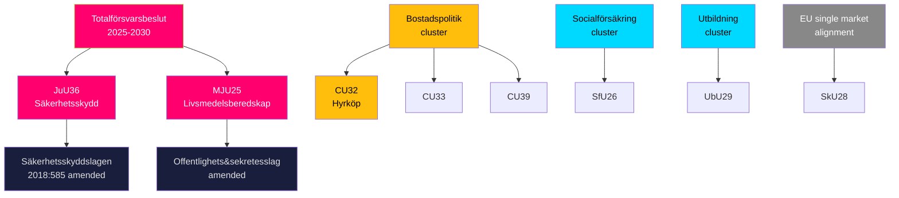

# Cross-Reference Map — Committee Reports 2026-05-19

**Date**: 2026-05-20

## Proposition References

| Betänkande | Proposition | Title | Government decision date |
|-----------|-------------|-------|--------------------------|
| JuU36 | 2025/26:182 | Utökade möjligheter att ingripa i säkerhetskänslig verksamhet | 2026-03 (est.) |
| MJU25 | 2025/26:205 | Beredskapslager av varor i livsmedelskedjan | 2026-03 (est.) |
| CU32 | 2025/26:188 | Lag om hyrköp av bostad | 2026-03 (est.) |
| CU33 | 2025/26:135 | Förbud mot äktenskap mellan kusiner m.fl. | 2026-01 (est.) |
| SfU26 | 2025/26:176 | Bidragsspärr och sanktionsavgift i socialförsäkringen | 2026-03 (est.) |
| UbU29 | 2025/26:183 | Utökade registerkontroller i skolväsendet | 2026-03 (est.) |
| SkU28 | 2025/26:134 | Sänkt alkoholskatt för alkoholvaror från oberoende småproducenter | 2026-01 (est.) |
| CU39 | 2025/26:162 | Förenklade regler vid ändring av en byggnad | 2026-02 (est.) |
| MJU26 | — | Föreskrifter om förbud mot användning/innehav av vissa läkemedel för djur | Delegation |

## Legislative Cluster Links

## Implementing Authority Map

| Betänkande | Primary implementing authority | Secondary |
|-----------|-------------------------------|-----------|
| JuU36 | SÄPO, Tillsynsmyndigheter | FMV, Energimyndigheten |
| MJU25 | Livsmedelsverket | MSB |
| CU32 | Domstolsverket / Courts | Lantmäteriet |
| CU33 | Skatteverket (folkbokföring) | Courts |
| SfU26 | Försäkringskassan | IAF |
| UbU29 | Skolverket | Polismyndigheten (BRÅ) |
| SkU28 | Skatteverket | Systembolaget |
| CU39 | Kommunerna (plan & bygg) | Boverket |
| MJU26 | Jordbruksverket | Läkemedelsverket |
