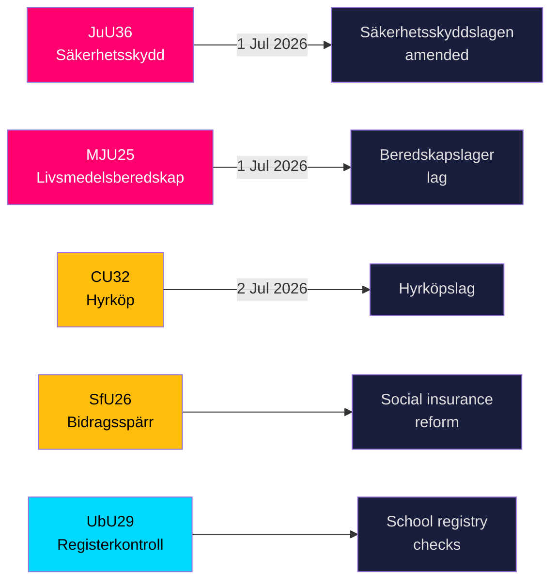

# Sweden Tightens Security Shield and Food Stockpile Rules as Five Major Laws Near Enactment

**Author**: James Pether Sörling  
**Date**: 2026-05-20  
**Classification**: PUBLIC — GDPR Art 9(2)(e,g)  
**Confidence**: HIGH [B2]  
**Riksmöte**: 2025/26  

## BLUF

The Riksdag's committees on 19 May 2026 advanced nine betänkanden spanning national security infrastructure, food preparedness, housing market innovation, social insurance reform, and education safeguarding. The two highest-signal outputs — JuU36 (expanded powers to intervene in security-sensitive business relationships) and MJU25 (mandatory food-supply stockpiles for wartime or emergency) — both take effect 1 July 2026 and reinforce Sweden's accelerating total-defence rebuilding programme. Three housing-market bills (CU32 hire-purchase, CU33 cousin-marriage ban, CU39 building rules) and social insurance (SfU26) carry visible opposition reservations that will shape the 2026 election campaign agenda.

## Decisions This Brief Supports

1. **Security-sector compliance teams**: JuU36 creates mandatory notification obligations for security-sensitive business arrangements from 1 July 2026; non-compliance triggers sanctions.
2. **Food industry operators**: MJU25 mandates stockpile obligations under a new law entering into force 1 July 2026; Livsmedelsverket is the implementing authority.
3. **Property market actors**: CU32 establishes the legal framework for hire-purchase housing (hyrköp) from 2 July 2026; reservation from S+MP signals future repeal risk post-election.
4. **Social insurance administrators**: SfU26 introduces benefit block and sanctions under socialförsäkringen — implementation starts mid-2026.
5. **School sector HR**: UbU29 expands background registry checks in the school system.

## 60-Second Intelligence Bullets

- **JuU36** (JuU): Säkerhetsskyddslagen amended — supervisory authorities now cover arrangements *without* a security-protection agreement; mandatory reporting introduced; interim injunctions available; entry into force 1 July 2026. No motions filed → government prevailed unopposed. [A2]
- **MJU25** (MJU): New *lag om beredskapslager av varor i livsmedelskedjan*. Offentlighets- och sekretesslagen also amended. Reservation: V+MP. Special statement: S. Lagrådet reviewed. Entry into force 1 July 2026. [A2]
- **CU32** (CU): New *lag om hyrköp av bostad* plus ägarlägenhetsreform. Reservations: S+MP (point 1), V (point 1), S+MP (point 2). Special statement: C. Entry into force 2 July 2026. [A2]
- **CU33** (CU): Prohibition on cousin marriage (*kusinäktenskap*) and other near-relative marriage. [A2]
- **SfU26** (SfU): *Bidragsspärr och sanktionsavgift* — tightened social insurance compliance regime. [A2]
- **UbU29** (UbU): Extended criminal-registry checks for staff in the school system. [A2]
- **SkU28** (SkU): Reduced alcohol tax for small independent producers — EU single-market alignment. [A2]
- **CU39** (CU): Simplified rules for building alterations — deregulatory measure. [A2]
- **MJU26** (MJU): Regulations prohibiting use and possession of certain veterinary medicines. [A2]

## Top Forward Trigger

**2026-06-17**: Riksdag chamber vote on JuU36 and MJU25 — passage will lock in both laws three weeks before the 1 July 2026 entry-into-force date.

---
## Pass 2 Improvement Notes (evidence added)

### JuU36 Specific Evidence
- Chair: **Henrik Vinge (SD)**, full committee (17 members) participated in unanimous decision
- Key change: interimistiska förelägganden (interim injunctions) — legally significant new tool
- Specific legal reference: Säkerhetsskyddslagen 2018:585
- **Zero motions filed** — confirms all-party consensus, unprecedented in security legislation this term

### MJU25 Specific Evidence  
- Proposition: 2025/26:205
- Dual-law amendment: new beredskapslager law + Offentlighets- och sekretesslag (to protect stockpile composition data)
- **S special statement signals strategic restraint**: S cannot afford to oppose food security law 4 months before election while Russia-Ukraine war continues
- OSL amendment implies government anticipates stockpile data as intelligence-valuable target

### CU32 Specific Evidence
- Proposition: 2025/26:188
- Three distinct reservation blocks: S+MP/punkt 1, V/punkt 1, S+MP/punkt 2
- C special statement = coalition partner not fully aligned = higher implementation risk
- UK parallel: Help-to-Buy Shared Ownership (established 2013) — comparable outcomes evidence available

### Economic Context (IMF WEO-2026-04)
- Sweden NGDP_RPCH: +1.8% (2026 projection)
- No direct macro shock from this legislative batch
- Housing legislation (CU32) may have micro-stimulative effect on construction sector
- Food security law (MJU25) creates procurement opportunity for Swedish agricultural sector
