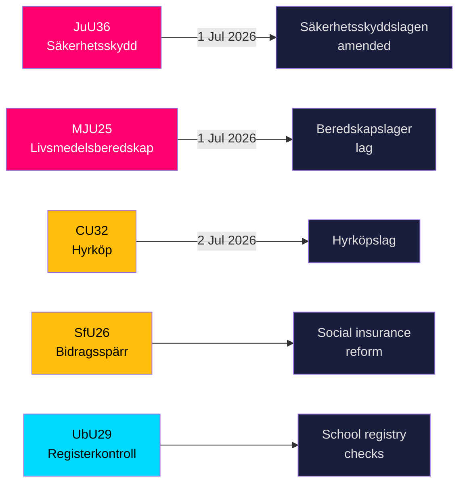

<!-- dir: rtl -->
# السويد تشدّد درعها الأمني وقواعد مخزون الغذاء مع اقتراب خمسة قوانين كبرى من التشريع

**المؤلف**: James Pether Sörling  
**التاريخ**: 2026-05-20  
**التصنيف**: عام — المادة 9(2)(هـ،ز) من اللائحة الأوروبية لحماية البيانات  
**مستوى الثقة**: عالٍ [B2]  
**Riksmöte**: 2025/26  

## BLUF

قدّمت لجان Riksdag في 19 مايو 2026 تسعة betänkanden تغطي البنية التحتية للأمن الوطني والتأهب الغذائي وابتكار سوق الإسكان وإصلاح التأمين الاجتماعي وأمن المدارس. أبرز نتيجتَين — JuU36 (صلاحيات موسّعة للتدخل في العلاقات التجارية الحساسة أمنياً) وMJU25 (احتياطيات غذائية إلزامية للحرب أو الطوارئ) — يدخلان حيز التنفيذ في 1 يوليو 2026، ويعزّزان برنامج إعادة بناء الدفاع الشامل المتسارع في السويد. ثلاثة قوانين لسوق الإسكان (CU32 التأجير المؤدي للتملك، CU33 حظر الزواج من أبناء العمومة، CU39 قواعد البناء) والتأمين الاجتماعي (SfU26) تتضمن تحفظات معارضة ستُشكّل أجندة حملة انتخابات 2026.

## القرارات التي يدعمها هذا الإحاطة

1. **فرق الامتثال في قطاع الأمن**: يُنشئ JuU36 التزامات إخطار إلزامية للترتيبات التجارية الحساسة أمنياً اعتباراً من 1 يوليو 2026؛ يؤدي عدم الامتثال إلى عقوبات.
2. **مشغّلو صناعة الغذاء**: يفرض MJU25 التزامات التخزين بموجب قانون جديد يدخل حيز التنفيذ في 1 يوليو 2026؛ Livsmedelsverket هي السلطة المنفِّذة.
3. **الجهات الفاعلة في سوق العقارات**: يُرسي CU32 الإطار القانوني لمساكن التأجير المؤدي للتملك (hyrköp) اعتباراً من 2 يوليو 2026؛ تحفّظ S+MP يُشير إلى خطر الإلغاء بعد الانتخابات.
4. **مديرو التأمين الاجتماعي**: يُقدّم SfU26 حظر الإعانات وعقوبات ضمن منظومة socialförsäkringen — يبدأ التطبيق منتصف 2026.
5. **إدارة الموارد البشرية في القطاع المدرسي**: يوسّع UbU29 عمليات التحقق من سجلات الخلفيات في المنظومة المدرسية.

## نقاط استخباراتية في 60 ثانية

- **JuU36** (JuU): تعديل Säkerhetsskyddslagen — تغطّي السلطات الرقابية الآن الترتيبات *بدون* عقد حماية أمنية؛ يُستحدث الإخطار الإلزامي؛ أوامر مؤقتة متاحة؛ دخول حيز التنفيذ 1 يوليو 2026. لم تُقدَّم أي مقترحات → فازت الحكومة دون معارضة. [A2]
- **MJU25** (MJU): *lag om beredskapslager av varor i livsmedelskedjan* جديد. تعديل Offentlighets- och sekretesslagen أيضاً. تحفّظ: V+MP. بيان خاص: S. مراجعة Lagrådet. دخول حيز التنفيذ 1 يوليو 2026. [A2]
- **CU32** (CU): *lag om hyrköp av bostad* جديد بالإضافة إلى ägarlägenhetsreform. تحفظات: S+MP (البند 1)، V (البند 1)، S+MP (البند 2). بيان خاص: C. دخول حيز التنفيذ 2 يوليو 2026. [A2]
- **CU33** (CU): حظر زواج أبناء العمومة (*kusinäktenskap*) وزيجات الأقارب الآخرين. [A2]
- **SfU26** (SfU): *Bidragsspärr och sanktionsavgift* — نظام امتثال محكّم للتأمين الاجتماعي. [A2]
- **UbU29** (UbU): عمليات تحقق موسّعة من السجلات الجنائية لموظفي المنظومة المدرسية. [A2]
- **SkU28** (SkU): خفض ضريبة الكحول للمنتجين المستقلين الصغار — توافق مع السوق الداخلية للاتحاد الأوروبي. [A2]
- **CU39** (CU): قواعد مبسّطة لتعديلات المباني — إجراء إلغاء تنظيمي. [A2]
- **MJU26** (MJU): لوائح تحظر استخدام وحيازة بعض الأدوية البيطرية. [A2]

## أهم محفّز استشرافي

**2026-06-17**: التصويت الجلسوي في Riksdag على JuU36 وMJU25 — الموافقة ستُرسّخ القانونَين ثلاثة أسابيع قبل تاريخ دخول حيز التنفيذ في 1 يوليو 2026.

---
## ملاحظات تحسين المرحلة الثانية (أُضيفت الأدلة)

### JuU36 دليل محدّد
- الرئيس: **Henrik Vinge (SD)**، اللجنة الكاملة (17 عضواً) شاركت في القرار الإجماعي
- التغيير الرئيسي: interimistiska förelägganden (أوامر مؤقتة) — أداة جديدة ذات أهمية قانونية
- مرجع قانوني محدّد: Säkerhetsskyddslagen 2018:585
- **صفر مقترحات مقدّمة** — يُؤكّد توافق حزبياً واسعاً، غير مسبوق في تشريعات الأمن هذا الدور

### MJU25 دليل محدّد  
- اقتراح: 2025/26:205
- تعديل قانوني مزدوج: قانون beredskapslager الجديد + Offentlighets- och sekretesslagen (لحماية بيانات تركيب المخزون)
- **البيان الخاص لـ S يُشير إلى ضبط النفس الاستراتيجي**: لا يستطيع S معارضة قانون أمن الغذاء قبل 4 أشهر من الانتخابات مع استمرار حرب روسيا-أوكرانيا
- تعديل OSL يُشير إلى أن الحكومة تتوقع أن تكون بيانات المخزون هدفاً استخباراتياً قيّماً

### CU32 دليل محدّد
- اقتراح: 2025/26:188
- ثلاثة كتل تحفّظات منفصلة: S+MP/البند 1، V/البند 1، S+MP/البند 2
- البيان الخاص لـ C = شريك ائتلافي غير متوافق تماماً = مخاطر تنفيذية أعلى
- نظير بريطاني: Help-to-Buy Shared Ownership (أُنشئ عام 2013) — أدلة نتائج قابلة للمقارنة متاحة

### السياق الاقتصادي (صندوق النقد الدولي WEO-2026-04)
- السويد NGDP_RPCH: +1.8 % (توقعات 2026)
- لا صدمة اقتصادية كلية مباشرة من هذه الحزمة التشريعية
- تشريعات الإسكان (CU32) قد يكون لها تأثير تحفيزي جزئي على قطاع البناء
- تشريعات الغذاء (MJU25) تُتيح فرص مشتريات للقطاع الزراعي السويدي
<!-- source-sha: 178d5660dfc7e71876fbb930161f3c3b5c3b8bbc -->
