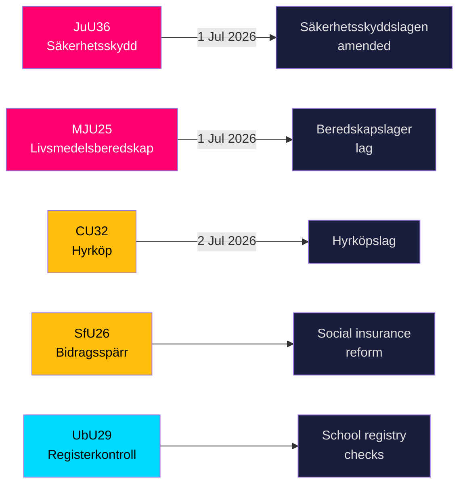

# Sverige styrker sikkerhedsskjoldet og reglerne for fødevarelagre, da fem store love nærmer sig vedtagelse

**Forfatter**: James Pether Sörling  
**Dato**: 2026-05-20  
**Klassificering**: OFFENTLIG — GDPR Art 9(2)(e,g)  
**Konfidens**: HØJ [B2]  
**Riksmöte**: 2025/26  

## BLUF

Riksdagens udvalg fremlagde den 19. maj 2026 ni betänkanden inden for national sikkerhedsinfrastruktur, fødevareberedskab, boligmarkedsinnovation, socialforsikringsreform og skolesikkerhed. De to mest signifikante resultater — JuU36 (udvidede beføjelser til at gribe ind i sikkerhedsfølsomme forretningsforhold) og MJU25 (obligatoriske fødevarelagre til krig eller nødsituation) — træder begge i kraft den 1. juli 2026 og styrker Sveriges accelererende totalforsvarsoprustning. Tre boligmarkedslove (CU32 lejeindkøb, CU33 forbud mod fætter-kusine-ægteskab, CU39 bygningsregler) og socialforsikring (SfU26) indeholder synlige oppositionsforbehold, som vil præge 2026-valgkampens dagsorden.

## Beslutninger dette briefing understøtter

1. **Sikkerhedssektorens efterlevningsteams**: JuU36 indfører obligatorisk anmeldelsespligt for sikkerhedsfølsomme forretningsordninger fra 1. juli 2026; manglende overholdelse udløser sanktioner.
2. **Fødevarevirksomheder**: MJU25 pålægger lageropbevaringspligter i henhold til en ny lov, der træder i kraft 1. juli 2026; Livsmedelsverket er den ansvarlige myndighed.
3. **Ejendomsmarkedets aktører**: CU32 fastlægger den retlige ramme for lejeindkøbsboliger (hyrköp) fra 2. juli 2026; forbehold fra S+MP signalerer risiko for ophævelse efter valget.
4. **Socialforsikringsadministratorer**: SfU26 indfører ydelsesblokering og sanktioner under socialförsäkringen — implementering påbegyndes midt i 2026.
5. **Skolesektorens HR**: UbU29 udvider baggrundsjournalkontrollen i skolesystemet.

## 60-sekunders efterretningspunkter

- **JuU36** (JuU): Säkerhetsskyddslagen ændret — tilsynsmyndigheder dækker nu ordninger *uden* en sikkerhedsbeskyttelsesaftale; obligatorisk anmeldelse indføres; foreløbige påbud tilgængelige; ikrafttræden 1. juli 2026. Ingen motioner indgivet → regeringen vandt uimodsagt. [A2]
- **MJU25** (MJU): Ny *lag om beredskapslager av varor i livsmedelskedjan*. Offentlighets- och sekretesslagen også ændret. Forbehold: V+MP. Særlig udtalelse: S. Lagrådet gennemgået. Ikrafttræden 1. juli 2026. [A2]
- **CU32** (CU): Ny *lag om hyrköp av bostad* samt ägarlägenhetsreform. Forbehold: S+MP (punkt 1), V (punkt 1), S+MP (punkt 2). Særlig udtalelse: C. Ikrafttræden 2. juli 2026. [A2]
- **CU33** (CU): Forbud mod fætter-kusine-ægteskab (*kusinäktenskap*) og andre nærtbeslægtede ægteskaber. [A2]
- **SfU26** (SfU): *Bidragsspärr och sanktionsavgift* — skærpet efterlevningsregime for socialforsikringen. [A2]
- **UbU29** (UbU): Udvidede strafferegisterkontroller af personale i skolesystemet. [A2]
- **SkU28** (SkU): Nedsat alkoholafgift for små uafhængige producenter — tilpasning til EU's indre marked. [A2]
- **CU39** (CU): Forenklede regler for bygningsændringer — dereguleringforanstaltning. [A2]
- **MJU26** (MJU): Regler der forbyder brug og besiddelse af visse veterinærlægemidler. [A2]

## Vigtigste fremadrettede udløser

**2026-06-17**: Riksdagens plenumsvote om JuU36 og MJU25 — vedtagelse vil fastlåse begge love tre uger inden ikrafttrædelsesdatoen den 1. juli 2026.

---
## Pass 2-forbedringer (beviser tilføjet)

### JuU36 Specifikt bevis
- Formand: **Henrik Vinge (SD)**, hele udvalget (17 medlemmer) deltog i den enstemmige beslutning
- Nøgleændring: interimistiska förelägganden (foreløbige påbud) — et juridisk vigtigt nyt instrument
- Specifik lovhenvisning: Säkerhetsskyddslagen 2018:585
- **Nul indgivne motioner** — bekræfter bred partikonsensus, enestående inden for sikkerhedslovgivning dette parlamentsår

### MJU25 Specifikt bevis  
- Proposition: 2025/26:205
- Dobbeltlovsændring: ny beredskapslager-lov + Offentlighets- och sekretesslagen (for at beskytte data om lagersammensætning)
- **S's særlige udtalelse signalerer strategisk tilbageholdenhed**: S kan ikke modsætte sig en fødevaresikkerhedslov 4 måneder før valget, mens krigen i Ukraine/Rusland fortsætter
- OSL-ændringen antyder, at regeringen forventer lagerdata som et efterretningsrelevant mål

### CU32 Specifikt bevis
- Proposition: 2025/26:188
- Tre separate forbeholdsblokke: S+MP/punkt 1, V/punkt 1, S+MP/punkt 2
- C's særlige udtalelse = koalitionspartner ikke fuldt ud på linje = højere implementeringsrisiko
- Britisk parallel: Help-to-Buy Shared Ownership (etableret 2013) — sammenlignelige udfaldsbevis tilgængelige

### Økonomisk kontekst (IMF WEO-2026-04)
- Sverige NGDP_RPCH: +1,8 % (prognose 2026)
- Ingen direkte makroøkonomisk chok fra dette lovgivningspakke
- Boliglovgivning (CU32) kan have mikroøkonomisk stimulerende effekt på byggesektoren
- Fødevarelovgivning (MJU25) skaber indkøbsmuligheder for den svenske landbrugssektor
<!-- source-sha: 178d5660dfc7e71876fbb930161f3c3b5c3b8bbc -->
