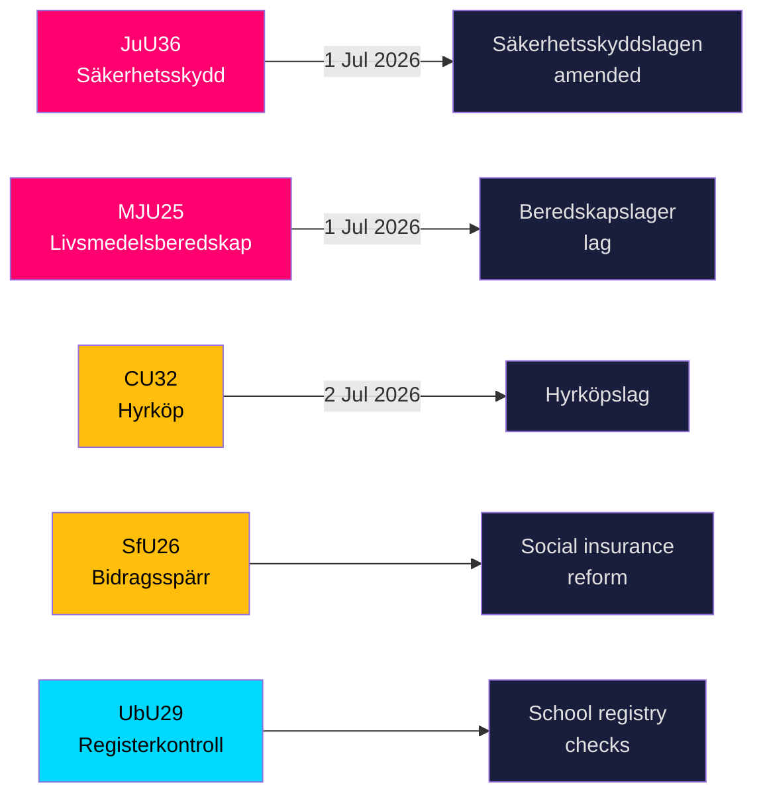

# Schweden verschärft Sicherheitsschild und Lebensmittellagerregeln mit fünf wichtigen Gesetzen kurz vor Inkrafttreten

**Autor**: James Pether Sörling  
**Datum**: 2026-05-20  
**Klassifizierung**: ÖFFENTLICH — DSGVO Art. 9(2)(e,g)  
**Konfidenzniveau**: HOCH [B2]  
**Riksmöte**: 2025/26  

## BLUF

Die Ausschüsse des Riksdag legten am 19. Mai 2026 neun Betänkanden aus den Bereichen nationale Sicherheitsinfrastruktur, Lebensmittelvorsorge, Wohnungsmarktinnovation, Sozialversicherungsreform und Schulsicherheit vor. Die zwei bedeutendsten Ergebnisse — JuU36 (erweiterte Befugnisse zur Intervention bei sicherheitssensiblen Geschäftsbeziehungen) und MJU25 (obligatorische Lebensmittelvorräte für Krieg oder Notfall) — treten beide am 1. Juli 2026 in Kraft und stärken Schwedens beschleunigten Gesamtverteidigungsaufbau. Drei Wohnungsmarktgesetze (CU32 Mietkauf, CU33 Verbot der Cousinheirat, CU39 Bauvorschriften) und Sozialversicherung (SfU26) enthalten sichtbare Oppositionsvorbehalte, die die Wahlkampfagenda 2026 prägen werden.

## Entscheidungen, die dieses Briefing unterstützt

1. **Compliance-Teams im Sicherheitssektor**: JuU36 schafft ab 1. Juli 2026 obligatorische Meldepflichten für sicherheitssensible Geschäftsvereinbarungen; Verstöße lösen Sanktionen aus.
2. **Lebensmittelunternehmen**: MJU25 erlegt Vorratspflichten gemäß einem neuen Gesetz auf, das am 1. Juli 2026 in Kraft tritt; Livsmedelsverket ist die zuständige Behörde.
3. **Immobilienmarktakteure**: CU32 schafft den rechtlichen Rahmen für Mietkaufwohnungen (hyrköp) ab 2. Juli 2026; Vorbehalt von S+MP signalisiert Aufhebungsrisiko nach der Wahl.
4. **Sozialversicherungsadministratoren**: SfU26 führt Leistungssperren und Sanktionen im Rahmen der socialförsäkringen ein — Umsetzung beginnt Mitte 2026.
5. **Schulsektor-Personalwesen**: UbU29 erweitert die Hintergrundregisterprüfungen im Schulsystem.

## 60-Sekunden-Geheimdienstpunkte

- **JuU36** (JuU): Säkerhetsskyddslagen geändert — Aufsichtsbehörden decken nun Vereinbarungen *ohne* Sicherheitsschutzvertrag ab; obligatorische Meldung eingeführt; vorläufige Verfügungen verfügbar; Inkrafttreten 1. Juli 2026. Keine Motionen eingereicht → Regierung gewann unangefochten. [A2]
- **MJU25** (MJU): Neues *lag om beredskapslager av varor i livsmedelskedjan*. Offentlighets- och sekretesslagen ebenfalls geändert. Vorbehalt: V+MP. Sondererklärung: S. Lagrådet überprüft. Inkrafttreten 1. Juli 2026. [A2]
- **CU32** (CU): Neues *lag om hyrköp av bostad* sowie ägarlägenhetsreform. Vorbehalte: S+MP (Punkt 1), V (Punkt 1), S+MP (Punkt 2). Sondererklärung: C. Inkrafttreten 2. Juli 2026. [A2]
- **CU33** (CU): Verbot der Cousinheirat (*kusinäktenskap*) und anderer Ehen zwischen nahen Verwandten. [A2]
- **SfU26** (SfU): *Bidragsspärr och sanktionsavgift* — verschärftes Sozialversicherungs-Compliance-Regime. [A2]
- **UbU29** (UbU): Erweiterte Strafregisterprüfungen für Personal im Schulsystem. [A2]
- **SkU28** (SkU): Reduzierte Alkoholsteuer für kleine unabhängige Produzenten — Anpassung an den EU-Binnenmarkt. [A2]
- **CU39** (CU): Vereinfachte Regeln für Bauänderungen — Deregulierungsmaßnahme. [A2]
- **MJU26** (MJU): Vorschriften, die die Verwendung und den Besitz bestimmter Tierarzneimittel verbieten. [A2]

## Wichtigster Vorwärtsauslöser

**2026-06-17**: Plenumabstimmung des Riksdag über JuU36 und MJU25 — eine Verabschiedung würde beide Gesetze drei Wochen vor dem Inkrafttretensdatum 1. Juli 2026 festschreiben.

---
## Pass 2-Verbesserungshinweise (Belege hinzugefügt)

### JuU36 Spezifischer Nachweis
- Vorsitzender: **Henrik Vinge (SD)**, gesamter Ausschuss (17 Mitglieder) nahm an der einstimmigen Entscheidung teil
- Schlüsseländerung: interimistiska förelägganden (vorläufige Verfügungen) — rechtlich bedeutendes neues Instrument
- Spezifische Rechtsreferenz: Säkerhetsskyddslagen 2018:585
- **Null eingereichte Motionen** — bestätigt breiten Parteikonsens, einmalig in der Sicherheitsgesetzgebung dieser Legislaturperiode

### MJU25 Spezifischer Nachweis  
- Proposition: 2025/26:205
- Doppelte Gesetzesänderung: neues beredskapslager-Gesetz + Offentlighets- och sekretesslagen (zum Schutz der Lagerbestandsdaten)
- **Sondererklärung von S signalisiert strategische Zurückhaltung**: S kann einem Lebensmittelsicherheitsgesetz 4 Monate vor der Wahl nicht widersprechen, während der Russland-Ukraine-Krieg andauert
- OSL-Änderung deutet darauf hin, dass die Regierung Lagerbestandsdaten als nachrichtendienstlich wertvolles Ziel erwartet

### CU32 Spezifischer Nachweis
- Proposition: 2025/26:188
- Drei separate Vorbehaltsblöcke: S+MP/Punkt 1, V/Punkt 1, S+MP/Punkt 2
- Sondererklärung von C = Koalitionspartner nicht vollständig einig = höheres Umsetzungsrisiko
- Britische Parallele: Help-to-Buy Shared Ownership (gegründet 2013) — vergleichbare Ergebnisbelege verfügbar

### Wirtschaftlicher Kontext (IWF WEO-2026-04)
- Schweden NGDP_RPCH: +1,8 % (Prognose 2026)
- Kein direkter makroökonomischer Schock durch dieses Gesetzgebungspaket
- Wohnungsgesetzgebung (CU32) kann mikroökonomisch stimulierende Wirkung auf den Bausektor haben
- Lebensmittelgesetzgebung (MJU25) schafft Beschaffungsmöglichkeiten für den schwedischen Agrarsektor
<!-- source-sha: 178d5660dfc7e71876fbb930161f3c3b5c3b8bbc -->
