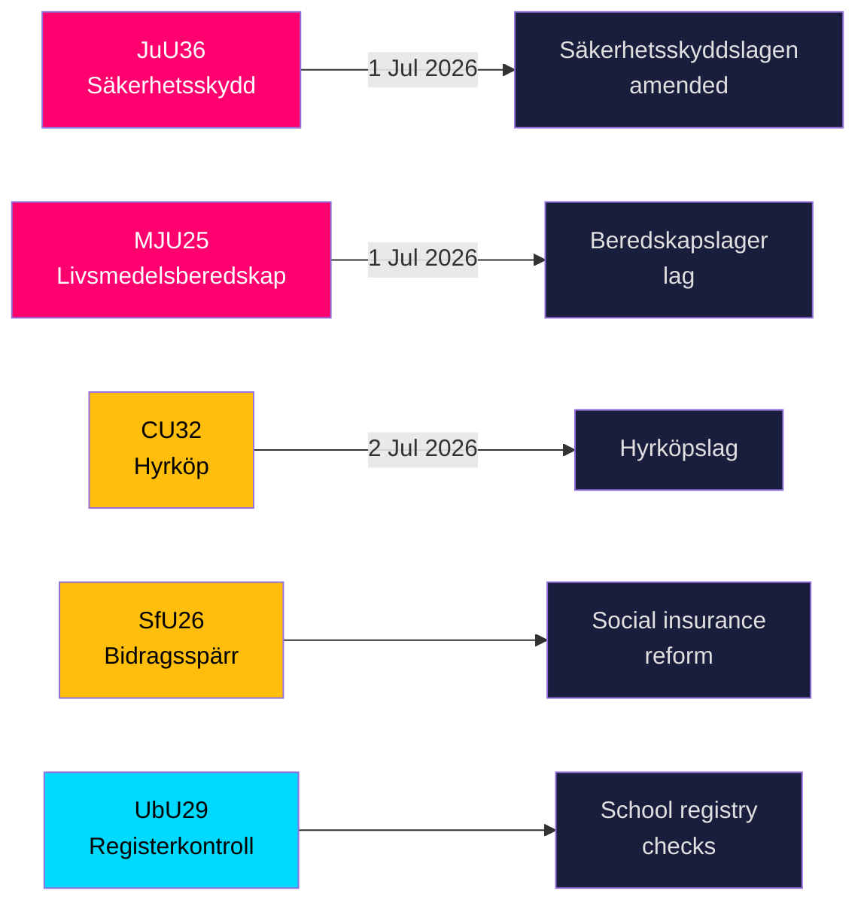

# Suecia refuerza su escudo de seguridad y las normas de almacenamiento alimentario mientras cinco grandes leyes se acercan a su aprobación

**Autor**: James Pether Sörling  
**Fecha**: 2026-05-20  
**Clasificación**: PÚBLICO — RGPD Art. 9(2)(e,g)  
**Nivel de confianza**: ALTO [B2]  
**Riksmöte**: 2025/26  

## BLUF

Las comisiones del Riksdag presentaron el 19 de mayo de 2026 nueve betänkanden en los ámbitos de infraestructura de seguridad nacional, preparación alimentaria, innovación en el mercado de vivienda, reforma del seguro social y seguridad escolar. Los dos resultados de mayor relevancia — JuU36 (poderes ampliados para intervenir en relaciones comerciales sensibles a la seguridad) y MJU25 (reservas obligatorias de alimentos para guerra o emergencia) — entran en vigor el 1 de julio de 2026 y refuerzan el acelerado programa sueco de reconstrucción de la defensa total. Tres leyes del mercado de vivienda (CU32 compra en arrendamiento, CU33 prohibición del matrimonio entre primos, CU39 normas de construcción) y el seguro social (SfU26) contienen reservas visibles de la oposición que configurarán la agenda de campaña electoral de 2026.

## Decisiones que apoya este briefing

1. **Equipos de cumplimiento del sector de seguridad**: JuU36 crea obligaciones de notificación obligatoria para acuerdos comerciales sensibles a la seguridad a partir del 1 de julio de 2026; el incumplimiento desencadena sanciones.
2. **Operadores de la industria alimentaria**: MJU25 impone obligaciones de almacenamiento en virtud de una nueva ley que entra en vigor el 1 de julio de 2026; Livsmedelsverket es la autoridad de aplicación.
3. **Actores del mercado inmobiliario**: CU32 establece el marco jurídico para viviendas de compra en arrendamiento (hyrköp) desde el 2 de julio de 2026; la reserva de S+MP señala riesgo de derogación tras las elecciones.
4. **Administradores del seguro social**: SfU26 introduce bloqueo de prestaciones y sanciones en el marco del socialförsäkringen — la implementación comienza a mediados de 2026.
5. **RRHH del sector educativo**: UbU29 amplía las comprobaciones del registro de antecedentes en el sistema escolar.

## Puntos de inteligencia en 60 segundos

- **JuU36** (JuU): Säkerhetsskyddslagen modificada — las autoridades supervisoras ahora cubren acuerdos *sin* contrato de protección de seguridad; se introduce notificación obligatoria; órdenes cautelares disponibles; entrada en vigor el 1 de julio de 2026. No se presentaron mociones → el gobierno prevaleció sin oposición. [A2]
- **MJU25** (MJU): Nueva *lag om beredskapslager av varor i livsmedelskedjan*. Offentlighets- och sekretesslagen también modificada. Reserva: V+MP. Declaración especial: S. Lagrådet revisado. Entrada en vigor el 1 de julio de 2026. [A2]
- **CU32** (CU): Nueva *lag om hyrköp av bostad* más ägarlägenhetsreform. Reservas: S+MP (punto 1), V (punto 1), S+MP (punto 2). Declaración especial: C. Entrada en vigor el 2 de julio de 2026. [A2]
- **CU33** (CU): Prohibición del matrimonio entre primos (*kusinäktenskap*) y otros matrimonios entre parientes cercanos. [A2]
- **SfU26** (SfU): *Bidragsspärr och sanktionsavgift* — régimen de cumplimiento del seguro social más estricto. [A2]
- **UbU29** (UbU): Comprobaciones ampliadas del registro penal para personal del sistema escolar. [A2]
- **SkU28** (SkU): Reducción del impuesto sobre el alcohol para pequeños productores independientes — alineación con el mercado único de la UE. [A2]
- **CU39** (CU): Reglas simplificadas para modificaciones de construcción — medida de desregulación. [A2]
- **MJU26** (MJU): Reglamentos que prohíben el uso y la posesión de ciertos medicamentos veterinarios. [A2]

## Desencadenante prospectivo principal

**2026-06-17**: Votación plenaria del Riksdag sobre JuU36 y MJU25 — la aprobación consolidará ambas leyes tres semanas antes de la fecha de entrada en vigor del 1 de julio de 2026.

---
## Notas de mejora del Paso 2 (evidencias añadidas)

### JuU36 Evidencia específica
- Presidente: **Henrik Vinge (SD)**, toda la comisión (17 miembros) participó en la decisión unánime
- Cambio clave: interimistiska förelägganden (órdenes cautelares) — nuevo instrumento jurídicamente significativo
- Referencia legal específica: Säkerhetsskyddslagen 2018:585
- **Cero mociones presentadas** — confirma amplio consenso entre partidos, sin precedentes en legislación de seguridad de esta legislatura

### MJU25 Evidencia específica  
- Proposición: 2025/26:205
- Enmienda legislativa doble: nueva ley beredskapslager + Offentlighets- och sekretesslagen (para proteger datos sobre composición de reservas)
- **La declaración especial de S señala moderación estratégica**: S no puede oponerse a una ley de seguridad alimentaria 4 meses antes de las elecciones mientras la guerra Rusia-Ucrania continúa
- La enmienda OSL sugiere que el gobierno prevé que los datos de almacenamiento son un objetivo de valor de inteligencia

### CU32 Evidencia específica
- Proposición: 2025/26:188
- Tres bloques de reservas distintos: S+MP/punto 1, V/punto 1, S+MP/punto 2
- Declaración especial de C = socio de coalición no totalmente alineado = mayor riesgo de implementación
- Paralelo británico: Help-to-Buy Shared Ownership (creado en 2013) — evidencias de resultados comparables disponibles

### Contexto económico (FMI WEO-2026-04)
- Suecia NGDP_RPCH: +1,8 % (proyección 2026)
- Sin shock macroeconómico directo de este paquete legislativo
- La legislación de vivienda (CU32) puede tener efecto micro-estimulante en el sector de la construcción
- La legislación alimentaria (MJU25) crea oportunidades de adquisición para el sector agrícola sueco
<!-- source-sha: 178d5660dfc7e71876fbb930161f3c3b5c3b8bbc -->
