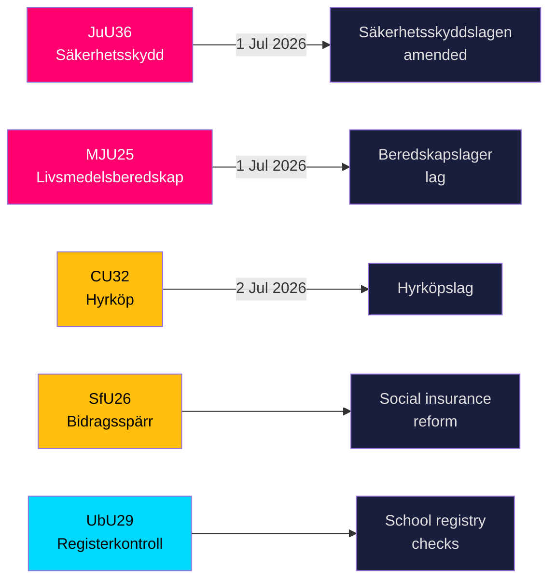

# Ruotsi tiukentaa turvallisuuskilpeään ja elintarvikevarastojen sääntöjä viiden suuren lain lähestyessä voimaantuloa

**Tekijä**: James Pether Sörling  
**Päivämäärä**: 2026-05-20  
**Luokittelu**: JULKINEN — GDPR Art 9(2)(e,g)  
**Luottamustaso**: KORKEA [B2]  
**Riksmöte**: 2025/26  

## BLUF

Riksdagenin valiokunnat esittelivät 19. toukokuuta 2026 yhdeksän betänkandea kansallisen turvallisuusinfrastruktuurin, elintarvikehuoltovarmuuden, asuntomarkkinainnovaation, sosiaalivakuutusuudistuksen ja kouluturvallisuuden alalta. Kaksi merkittävintä tulosta — JuU36 (laajennetut valtuudet puuttua turvallisuusarkaluonteisiin liikesuhteisiin) ja MJU25 (pakolliset elintarvikevarannot sodan tai hätätilan varalta) — tulevat molemmat voimaan 1. heinäkuuta 2026 ja vahvistavat Ruotsin kiihtyvää kokonaisturvallisuusohjelmaa. Kolmessa asuntomarkkinalaissa (CU32 vuokraosto, CU33 serkusavioliittojen kielto, CU39 rakennusmääräykset) ja sosiaalivakuutuksessa (SfU26) on näkyviä oppositiovaraumia, jotka muovaavat vuoden 2026 vaalikampanja-agendaa.

## Päätökset, joita tämä tilannekatsaus tukee

1. **Turvallisuusalan vaatimustenmukaisuustiimit**: JuU36 luo pakollisia ilmoitusvelvollisuuksia turvallisuusarkaluonteisille liiketoimintajärjestelyille alkaen 1. heinäkuuta 2026; noudattamatta jättäminen johtaa seuraamuksiin.
2. **Elintarvikealan toimijat**: MJU25 asettaa varastointivelvollisuuksia 1. heinäkuuta 2026 voimaan tulevassa uudessa laissa; Livsmedelsverket on toteuttava viranomainen.
3. **Kiinteistömarkkinatoimijat**: CU32 luo oikeudellisen kehyksen vuokraostamistalon (hyrköp) ostamiselle 2. heinäkuuta 2026 alkaen; S+MP:n varauma osoittaa vaalien jälkeistä kumoamisriskiä.
4. **Sosiaalivakuutushallinnot**: SfU26 ottaa käyttöön etuuseston ja seuraamusmaksut socialförsäkringenin piirissä — toteutus alkaa vuoden 2026 puolivälissä.
5. **Koulutoimen henkilöstöhallinto**: UbU29 laajentaa koulujen taustastarkastusten rekisterikyselyitä.

## 60 sekunnin tiedustelutiivistelmä

- **JuU36** (JuU): Säkerhetsskyddslagen muutettu — valvontaviranomaiset kattavat nyt järjestelyt *ilman* turvallisuussuojaussopimusta; pakollinen ilmoittaminen otetaan käyttöön; väliaikaiset kieltomääräykset saatavilla; voimaantulo 1. heinäkuuta 2026. Ei yhtään motionia — hallitus voitti vastustuksetta. [A2]
- **MJU25** (MJU): Uusi *lag om beredskapslager av varor i livsmedelskedjan*. Offentlighets- och sekretesslagen muutettu myös. Varauma: V+MP. Erityislausuma: S. Lagrådet tarkistanut. Voimaantulo 1. heinäkuuta 2026. [A2]
- **CU32** (CU): Uusi *lag om hyrköp av bostad* sekä ägarlägenhetsreform. Varaumat: S+MP (kohta 1), V (kohta 1), S+MP (kohta 2). Erityislausuma: C. Voimaantulo 2. heinäkuuta 2026. [A2]
- **CU33** (CU): Serkusavioliittojen (*kusinäktenskap*) ja muiden lähisukulaisten avioliittojen kielto. [A2]
- **SfU26** (SfU): *Bidragsspärr och sanktionsavgift* — tiukennettu sosiaalivakuutuksen noudattamisjärjestelmä. [A2]
- **UbU29** (UbU): Laajennetut rikosrekisteritarkastukset kouluhenkilöstölle. [A2]
- **SkU28** (SkU): Alennettu alkoholivero pienille itsenäisille tuottajille — EU:n sisämarkkinoiden mukaistaminen. [A2]
- **CU39** (CU): Yksinkertaistetut säännöt rakennusmuutoksille — sääntelyn purkamistoimi. [A2]
- **MJU26** (MJU): Tiettyjen eläinlääkkeiden käyttöä ja hallussapitoa kieltävät määräykset. [A2]

## Tärkein tulevaisuuden laukaisuindikaattori

**2026-06-17**: Riksdagenin täysistuntoäänestys JuU36:sta ja MJU25:stä — hyväksyminen lukitsee molemmat lait kolme viikkoa ennen 1. heinäkuuta 2026 voimaantuloa.

---
## Pass 2 -parannushuomiot (lisätty todisteet)

### JuU36 Erityinen todiste
- Puheenjohtaja: **Henrik Vinge (SD)**, koko valiokunta (17 jäsentä) osallistui yksimieliseen päätökseen
- Keskeinen muutos: interimistiska förelägganden (väliaikaiset kieltomääräykset) — oikeudellisesti merkittävä uusi väline
- Erityinen lainviittaus: Säkerhetsskyddslagen 2018:585
- **Nolla motionia** — vahvistaa laajan puoluekonsensuksen, ennennäkemätön turvallisuuslainsäädännössä tällä vaalikaudella

### MJU25 Erityinen todiste  
- Ehdotus: 2025/26:205
- Kaksinkertainen lakimuutos: uusi beredskapslager-laki + Offentlighets- och sekretesslagen (lagerkoostumustietojen suojaamiseksi)
- **S:n erityislausuma osoittaa strategista pidättyvyyttä**: S ei voi vastustaa elintarviketurvallisuuslakia 4 kuukautta ennen vaaleja Venäjä-Ukraina-sodan jatkuessa
- OSL-muutos viittaa siihen, että hallitus odottaa varastotietojen olevan tiedusteluarvokas kohde

### CU32 Erityinen todiste
- Ehdotus: 2025/26:188
- Kolme erillistä varaumalohkoa: S+MP/kohta 1, V/kohta 1, S+MP/kohta 2
- C:n erityislausuma = koalitionpuolue ei täysin yhteneväinen = korkeampi toteutusriski
- Brittiläinen analogia: Help-to-Buy Shared Ownership (perustettu 2013) — vertailukelpoinen tulostutkimus saatavilla

### Taloudellinen konteksti (IMF WEO-2026-04)
- Ruotsi NGDP_RPCH: +1,8 % (ennuste 2026)
- Ei suoraa makrotaloudellista sokkia tästä lainsäädäntöpaketista
- Asuntolainsäädäntö (CU32) voi olla mikrotaloudellisesti stimuloiva rakentamissektorille
- Elintarvikelainsäädäntö (MJU25) luo hankintamahdollisuuksia Ruotsin maatalousalan toimijoille
<!-- source-sha: 178d5660dfc7e71876fbb930161f3c3b5c3b8bbc -->
