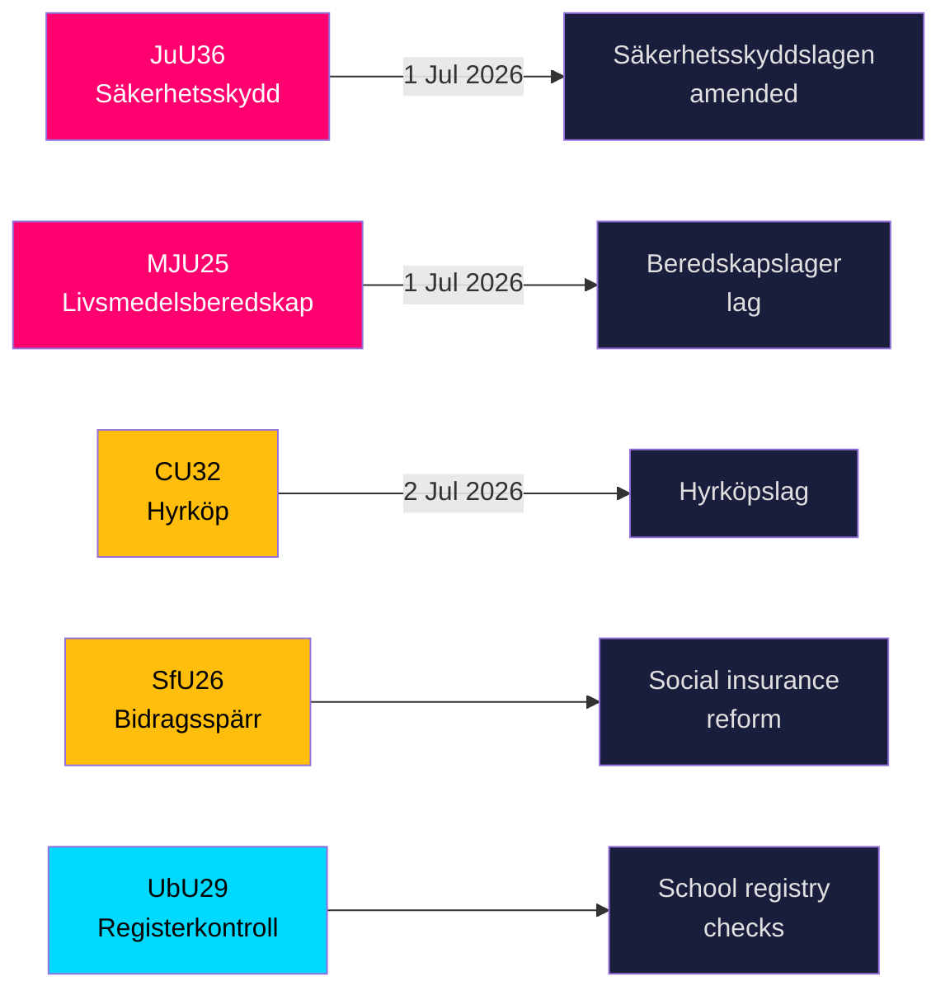

# La Suède renforce son bouclier sécuritaire et les règles de stockage alimentaire alors que cinq grandes lois approchent de l'adoption

**Auteur**: James Pether Sörling  
**Date**: 2026-05-20  
**Classification**: PUBLIC — RGPD Art. 9(2)(e,g)  
**Niveau de confiance**: ÉLEVÉ [B2]  
**Riksmöte**: 2025/26  

## BLUF

Les commissions du Riksdag ont le 19 mai 2026 présenté neuf betänkanden couvrant l'infrastructure de sécurité nationale, la préparation alimentaire, l'innovation sur le marché du logement, la réforme de l'assurance sociale et la sécurité scolaire. Les deux résultats les plus significatifs — JuU36 (pouvoirs élargis d'intervention dans les relations commerciales sensibles à la sécurité) et MJU25 (stocks alimentaires obligatoires en cas de guerre ou d'urgence) — entrent tous deux en vigueur le 1er juillet 2026 et renforcent le programme de reconstruction accéléré de la défense totale de la Suède. Trois lois sur le marché du logement (CU32 location-achat, CU33 interdiction du mariage entre cousins, CU39 règles de construction) et l'assurance sociale (SfU26) comportent des réserves de l'opposition qui façonneront l'agenda de la campagne électorale de 2026.

## Décisions soutenues par ce briefing

1. **Équipes de conformité dans le secteur de la sécurité**: JuU36 crée des obligations de notification obligatoires pour les arrangements commerciaux sensibles à la sécurité à partir du 1er juillet 2026 ; le non-respect entraîne des sanctions.
2. **Opérateurs de l'industrie alimentaire**: MJU25 impose des obligations de stockage en vertu d'une nouvelle loi entrant en vigueur le 1er juillet 2026 ; Livsmedelsverket est l'autorité chargée de la mise en œuvre.
3. **Acteurs du marché immobilier**: CU32 établit le cadre juridique pour les logements en location-achat (hyrköp) à compter du 2 juillet 2026 ; la réserve de S+MP signale un risque d'abrogation après les élections.
4. **Administrateurs de l'assurance sociale**: SfU26 introduit le blocage des prestations et des sanctions dans le cadre du socialförsäkringen — la mise en œuvre démarre mi-2026.
5. **RH du secteur scolaire**: UbU29 étend les vérifications des registres de casier judiciaire dans le système scolaire.

## Points de renseignement en 60 secondes

- **JuU36** (JuU): Säkerhetsskyddslagen amendée — les autorités de contrôle couvrent désormais les arrangements *sans* accord de protection de sécurité ; déclaration obligatoire introduite ; injonctions provisoires disponibles ; entrée en vigueur le 1er juillet 2026. Aucune motion déposée → le gouvernement l'a emporté sans opposition. [A2]
- **MJU25** (MJU): Nouvelle *lag om beredskapslager av varor i livsmedelskedjan*. Offentlighets- och sekretesslagen également amendée. Réserve : V+MP. Déclaration particulière : S. Lagrådet examiné. Entrée en vigueur le 1er juillet 2026. [A2]
- **CU32** (CU): Nouvelle *lag om hyrköp av bostad* ainsi qu'une ägarlägenhetsreform. Réserves : S+MP (point 1), V (point 1), S+MP (point 2). Déclaration particulière : C. Entrée en vigueur le 2 juillet 2026. [A2]
- **CU33** (CU): Interdiction du mariage entre cousins (*kusinäktenskap*) et d'autres mariages entre proches parents. [A2]
- **SfU26** (SfU): *Bidragsspärr och sanktionsavgift* — régime de conformité de l'assurance sociale renforcé. [A2]
- **UbU29** (UbU): Contrôles élargis du registre des antécédents judiciaires pour le personnel du système scolaire. [A2]
- **SkU28** (SkU): Réduction de la taxe sur l'alcool pour les petits producteurs indépendants — alignement sur le marché unique européen. [A2]
- **CU39** (CU): Règles simplifiées pour les modifications de construction — mesure de déréglementation. [A2]
- **MJU26** (MJU): Réglementations interdisant l'utilisation et la possession de certains médicaments vétérinaires. [A2]

## Déclencheur prospectif principal

**2026-06-17**: Vote en séance plénière du Riksdag sur JuU36 et MJU25 — l'adoption ancrerait les deux lois trois semaines avant la date d'entrée en vigueur du 1er juillet 2026.

---
## Notes d'amélioration Pass 2 (preuves ajoutées)

### JuU36 Preuve spécifique
- Président: **Henrik Vinge (SD)**, toute la commission (17 membres) a participé à la décision unanime
- Changement clé: interimistiska förelägganden (injonctions provisoires) — nouvel instrument juridiquement significatif
- Référence légale spécifique: Säkerhetsskyddslagen 2018:585
- **Zéro motion déposée** — confirme un large consensus entre partis, sans précédent dans la législation de sécurité de cette législature

### MJU25 Preuve spécifique  
- Proposition: 2025/26:205
- Double amendement législatif: nouvelle loi beredskapslager + Offentlighets- och sekretesslagen (pour protéger les données sur la composition des stocks)
- **La déclaration particulière de S signale une retenue stratégique**: S ne peut pas s'opposer à une loi sur la sécurité alimentaire 4 mois avant les élections alors que la guerre Russie-Ukraine se poursuit
- L'amendement OSL suggère que le gouvernement anticipe que les données de stockage constituent une cible de valeur renseignementielle

### CU32 Preuve spécifique
- Proposition: 2025/26:188
- Trois blocs de réserves distincts: S+MP/point 1, V/point 1, S+MP/point 2
- Déclaration particulière de C = partenaire de coalition pas entièrement aligné = risque de mise en œuvre plus élevé
- Parallèle britannique: Help-to-Buy Shared Ownership (créé en 2013) — preuves de résultats comparables disponibles

### Contexte économique (FMI WEO-2026-04)
- Suède NGDP_RPCH: +1,8 % (prévision 2026)
- Aucun choc macroéconomique direct de ce paquet législatif
- La législation sur le logement (CU32) peut avoir un effet micro-stimulant sur le secteur de la construction
- La législation alimentaire (MJU25) crée des opportunités d'approvisionnement pour le secteur agricole suédois
<!-- source-sha: 178d5660dfc7e71876fbb930161f3c3b5c3b8bbc -->
