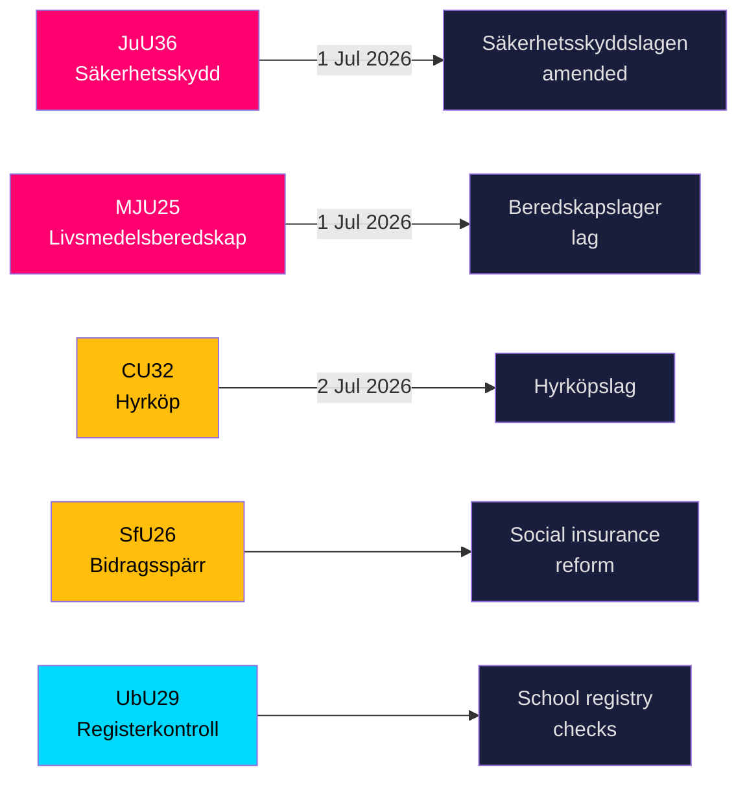

<!-- dir: rtl -->
# שוודיה מחמירה את מגן האבטחה שלה ואת כללי מאגרי המזון עם חמישה חוקים גדולים בדרכם לאישור

**מחבר**: James Pether Sörling  
**תאריך**: 2026-05-20  
**סיווג**: ציבורי — תקנת GDPR סעיף 9(2)(ה,ז)  
**רמת אמינות**: גבוהה [B2]  
**Riksmöte**: 2025/26  

## BLUF

ועדות ה-Riksdag הציגו ב-19 במאי 2026 תשעה betänkanden המכסים תשתית ביטחון לאומי, מוכנות מזון, חדשנות בשוק הדיור, רפורמה בביטוח הסוציאלי ואבטחת בתי ספר. שתי התוצאות הבולטות — JuU36 (סמכויות מורחבות להתערב ביחסים עסקיים רגישים ביטחונית) ו-MJU25 (מאגרי מזון חובה למלחמה או חירום) — נכנסות שתיהן לתוקף ב-1 ביולי 2026 ומחזקות את תוכנית בניית ההגנה הכוללת המואצת של שוודיה. שלושה חוקי שוק הדיור (CU32 שכירות-רכישה, CU33 איסור נישואי בני דודים, CU39 כללי בנייה) והביטוח הסוציאלי (SfU26) מכילים הסתייגויות גלויות מהאופוזיציה שיעצבו את אג'נדת מסע הבחירות 2026.

## החלטות שתדריך זה תומך בהן

1. **צוותי ציות בסקטור הביטחון**: JuU36 יוצר חובות הודעה חובה עבור הסדרים עסקיים רגישים ביטחונית החל מ-1 ביולי 2026; אי-ציות מוביל לסנקציות.
2. **מפעילי תעשיית המזון**: MJU25 מטיל חובות אחסנה מכוח חוק חדש הנכנס לתוקף ב-1 ביולי 2026; Livsmedelsverket היא הרשות המבצעת.
3. **שחקני שוק הנדל"ן**: CU32 מבסס את המסגרת המשפטית לדירות שכירות-רכישה (hyrköp) החל מ-2 ביולי 2026; הסתייגות S+MP מאותתת על סיכון ביטול לאחר הבחירות.
4. **מנהלי הביטוח הסוציאלי**: SfU26 מציג חסימת קצבאות וסנקציות במסגרת ה-socialförsäkringen — יישום מתחיל באמצע 2026.
5. **משאבי אנוש בסקטור בתי הספר**: UbU29 מרחיב בדיקות רישום רקע בבתי הספר.

## נקודות מודיעין בן 60 שניות

- **JuU36** (JuU): Säkerhetsskyddslagen תוקן — רשויות הפיקוח כוללות כעת הסדרים *ללא* הסכם הגנת ביטחון; הודעה חובה הוכנסה; צווים זמניים זמינים; כניסה לתוקף 1 ביולי 2026. לא הוגשו מתנגדים → הממשלה ניצחה ללא התנגדות. [A2]
- **MJU25** (MJU): *lag om beredskapslager av varor i livsmedelskedjan* חדש. Offentlighets- och sekretesslagen תוקן גם כן. הסתייגות: V+MP. הצהרה מיוחדת: S. Lagrådet בדק. כניסה לתוקף 1 ביולי 2026. [A2]
- **CU32** (CU): *lag om hyrköp av bostad* חדש בנוסף ל-ägarlägenhetsreform. הסתייגויות: S+MP (סעיף 1), V (סעיף 1), S+MP (סעיף 2). הצהרה מיוחדת: C. כניסה לתוקף 2 ביולי 2026. [A2]
- **CU33** (CU): איסור נישואי בני דודים (*kusinäktenskap*) ונישואי קרובי משפחה אחרים. [A2]
- **SfU26** (SfU): *Bidragsspärr och sanktionsavgift* — משטר ציות מחמיר לביטוח הסוציאלי. [A2]
- **UbU29** (UbU): בדיקות רישום פלילי מורחבות לצוות בתי הספר. [A2]
- **SkU28** (SkU): הפחתת מס אלכוהול ליצרנים עצמאיים קטנים — התאמה לשוק הפנימי האירופי. [A2]
- **CU39** (CU): כללים פשוטים לשינויי בנייה — צעד ביטול רגולציה. [A2]
- **MJU26** (MJU): תקנות האוסרות שימוש והחזקה של תרופות וטרינריות מסוימות. [A2]

## הטריגר העתידי החשוב ביותר

**2026-06-17**: הצבעה מליאה ב-Riksdag על JuU36 ו-MJU25 — אישור יקבע את שני החוקים שלושה שבועות לפני תאריך הכניסה לתוקף ב-1 ביולי 2026.

---
## הערות שיפור שלב 2 (נוספו ראיות)

### JuU36 ראיה ספציפית
- יו"ר: **Henrik Vinge (SD)**, הוועדה המלאה (17 חברים) השתתפה בהחלטה הפה אחד
- שינוי מפתח: interimistiska förelägganden (צווים זמניים) — כלי חדש בעל חשיבות משפטית
- הפניה חוקית ספציפית: Säkerhetsskyddslagen 2018:585
- **אפס הצעות שהוגשו** — מאשר קונצנזוס רחב בין מפלגות, יוצא דופן בחקיקת ביטחון בתקופת כהונה זו

### MJU25 ראיה ספציפית  
- הצעת חוק: 2025/26:205
- תיקון חוק כפול: חוק beredskapslager חדש + Offentlighets- och sekretesslagen (להגנה על נתוני הרכב המאגרים)
- **ההצהרה המיוחדת של S מאותתת על איפוק אסטרטגי**: S אינו יכול להתנגד לחוק ביטחון מזון 4 חודשים לפני הבחירות בזמן שמלחמת רוסיה-אוקראינה נמשכת
- תיקון OSL מרמז שהממשלה מצפה שנתוני המאגרים יהיו יעד בעל ערך מודיעיני

### CU32 ראיה ספציפית
- הצעת חוק: 2025/26:188
- שלושה בלוקי הסתייגות נפרדים: S+MP/סעיף 1, V/סעיף 1, S+MP/סעיף 2
- הצהרה מיוחדת של C = שותף קואליציה לא מיושר לחלוטין = סיכון יישום גבוה יותר
- מקביל בריטי: Help-to-Buy Shared Ownership (הוקם ב-2013) — ראיות תוצאות ניתנות להשוואה זמינות

### הקשר כלכלי (קרן המטבע הבינלאומית WEO-2026-04)
- שוודיה NGDP_RPCH: +1.8 % (תחזית 2026)
- ללא זעזוע מאקרו-כלכלי ישיר מחבילת חקיקה זו
- חקיקת דיור (CU32) עשויה להיות בעלת אפקט ממריץ מיקרו-כלכלי על ענף הבנייה
- חקיקת מזון (MJU25) יוצרת הזדמנויות רכש לסקטור החקלאי השוודי
<!-- source-sha: 178d5660dfc7e71876fbb930161f3c3b5c3b8bbc -->
