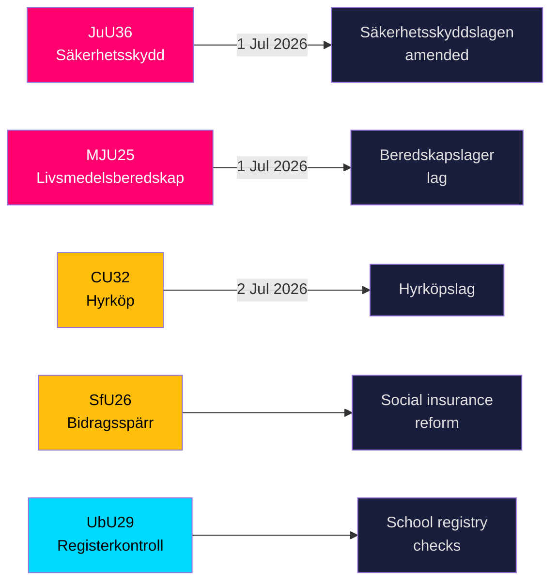

# スウェーデン、5つの主要法案の成立に向けてセキュリティ強化と食料備蓄規制を引き締め

**著者**: James Pether Sörling  
**日付**: 2026-05-20  
**分類**: 公開情報 — GDPR 第9条(2)(e,g)  
**信頼度**: 高 [B2]  
**Riksmöte**: 2025/26  

## BLUF

Riksdag（スウェーデン議会）の各委員会は2026年5月19日、国家安全保障インフラ、食料安全保障、住宅市場革新、社会保険改革、学校安全に関する9件のbetänkandenを提出しました。最も重要な2つの成果 — JuU36（安全保障上センシティブな取引関係への介入権限の拡大）とMJU25（戦争または非常事態に向けた食料備蓄の義務化）— はいずれも2026年7月1日に施行され、スウェーデンの加速する総合防衛再建プログラムを強化します。3つの住宅市場法（CU32 レント・トゥ・オウン、CU33 従妹婚禁止、CU39 建設規制）と社会保険（SfU26）には、2026年選挙キャンペーンの議題を形成する目立った野党留保事項が含まれています。

## このブリーフィングが支援する決定

1. **セキュリティ分野のコンプライアンスチーム**: JuU36は2026年7月1日から安全保障上センシティブな取引上の取り決めに対して強制通知義務を設ける。不遵守には制裁が科せられます。
2. **食品業界の事業者**: MJU25は2026年7月1日に施行される新しい法律に基づき備蓄義務を課します。Livsmedelsverket（食品庁）が実施機関となります。
3. **不動産市場の関係者**: CU32は2026年7月2日からレント・トゥ・オウン住宅（hyrköp）の法的枠組みを確立します。S+MPの留保は選挙後の廃止リスクを示唆しています。
4. **社会保険管理者**: SfU26はsocialförsäkringen内に給付停止と制裁措置を導入します — 実施は2026年半ばから開始。
5. **学校部門の人事**: UbU29は学校制度における背景調査登録を拡大します。

## 60秒インテリジェンス・ポイント

- **JuU36** (JuU): Säkerhetsskyddslagen改正 — 監督当局が安全保障保護協定*なしの*取り決めも対象に。強制報告導入、暫定命令が利用可能。施行2026年7月1日。動議なし → 政府は無反対で勝利。[A2]
- **MJU25** (MJU): 新たな*lag om beredskapslager av varor i livsmedelskedjan*。Offentlighets- och sekretesslagenも改正。留保: V+MP。特別声明: S。Lagrådet審査済み。施行2026年7月1日。[A2]
- **CU32** (CU): 新たな*lag om hyrköp av bostad*およびägarlägenhetsreform。留保: S+MP（第1点）、V（第1点）、S+MP（第2点）。特別声明: C。施行2026年7月2日。[A2]
- **CU33** (CU): 従妹婚（*kusinäktenskap*）およびその他近親者間の婚姻禁止。[A2]
- **SfU26** (SfU): *Bidragsspärr och sanktionsavgift* — 社会保険コンプライアンス体制の強化。[A2]
- **UbU29** (UbU): 学校制度の職員に対する前歴調査登録の拡大。[A2]
- **SkU28** (SkU): 中小独立生産者向け酒税引き下げ — EU単一市場への適合。[A2]
- **CU39** (CU): 建設変更に関する規制の簡素化 — 規制緩和措置。[A2]
- **MJU26** (MJU): 特定の動物用医薬品の使用・所持を禁止する規制。[A2]

## 最重要な将来トリガー

**2026-06-17**: JuU36とMJU25に関するRiksdagの本会議投票 — 可決により両法律が2026年7月1日の施行日3週間前に確定します。

---
## パス2改善ノート（証拠追加）

### JuU36 具体的証拠
- 委員長: **Henrik Vinge (SD)**、委員会全員（17名）が全会一致の決定に参加
- 主要変更点: interimistiska förelägganden（暫定命令）— 法的に重要な新しいツール
- 具体的な法律参照: Säkerhetsskyddslagen 2018:585
- **動議ゼロ件** — 今期の安全保障立法において前例のない幅広い党派のコンセンサスを確認

### MJU25 具体的証拠  
- 法案: 2025/26:205
- 二重法改正: 新beredskapslager法 + Offentlighets- och sekretesslagen（備蓄組成データ保護のため）
- **Sの特別声明は戦略的自制を示す**: ロシア・ウクライナ戦争継続中、選挙4ヶ月前に食料安全保障法に反対することはできない
- OSL改正は政府が備蓄データを情報価値の高い標的と見なすことを示唆

### CU32 具体的証拠
- 法案: 2025/26:188
- 3つの異なる留保ブロック: S+MP/第1点、V/第1点、S+MP/第2点
- Cの特別声明 = 連立パートナーが完全に一致していない = 実施リスクが高い
- 英国の類似例: Help-to-Buy Shared Ownership（2013年設立）— 比較可能な成果証拠あり

### 経済的背景（IMF WEO-2026-04）
- スウェーデン NGDP_RPCH: +1.8%（2026年予測）
- この立法パッケージによる直接的なマクロ経済ショックなし
- 住宅法（CU32）は建設セクターにマイクロ刺激効果をもたらす可能性あり
- 食料法（MJU25）はスウェーデン農業セクターに調達機会を創出
<!-- source-sha: 178d5660dfc7e71876fbb930161f3c3b5c3b8bbc -->
