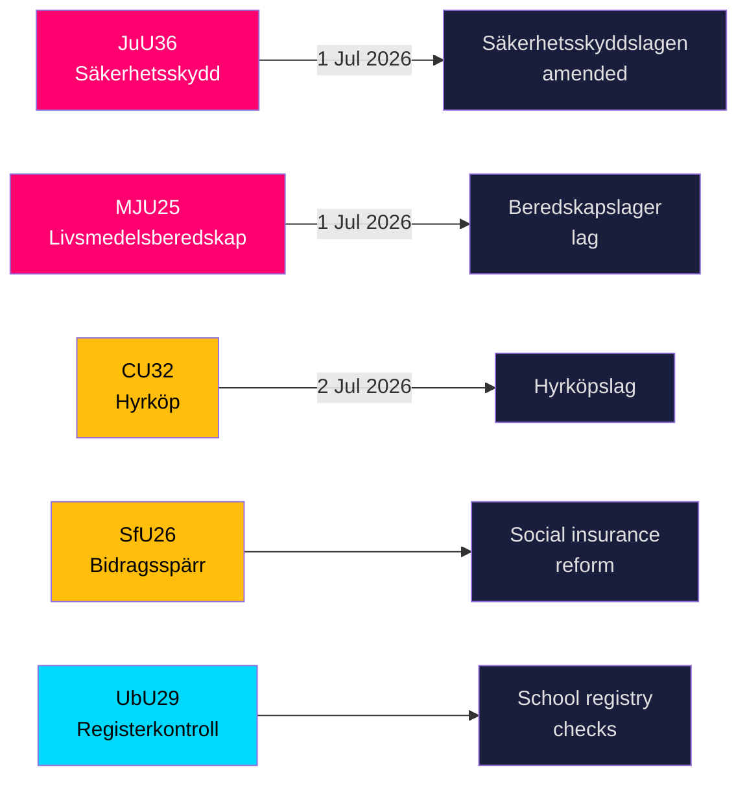

# 스웨덴, 5개 주요 법안 발효를 앞두고 보안 방패와 식량 비축 규정 강화

**저자**: James Pether Sörling  
**날짜**: 2026-05-20  
**분류**: 공개 — GDPR 제9조(2)(e,g)  
**신뢰도**: 높음 [B2]  
**Riksmöte**: 2025/26  

## BLUF

Riksdag(스웨덴 의회) 위원회들은 2026년 5월 19일 국가 안보 인프라, 식량 준비, 주택 시장 혁신, 사회 보험 개혁, 학교 안전을 아우르는 9건의 betänkanden을 제출했습니다. 가장 중요한 두 결과 — JuU36(보안에 민감한 사업 관계에 개입하는 확대된 권한)과 MJU25(전쟁 또는 비상사태를 위한 의무적 식량 비축) — 은 모두 2026년 7월 1일 발효되어 스웨덴의 가속화된 총방위 재건 프로그램을 강화합니다. 세 가지 주택 시장 법안(CU32 임대구매, CU33 사촌 결혼 금지, CU39 건축 규정)과 사회 보험(SfU26)에는 2026년 선거 캠페인 의제를 형성할 야당의 뚜렷한 유보사항이 포함되어 있습니다.

## 이 브리핑이 지원하는 결정

1. **보안 분야 컴플라이언스 팀**: JuU36은 2026년 7월 1일부터 보안에 민감한 사업 약정에 대한 강제 신고 의무를 신설합니다. 미준수 시 제재가 부과됩니다.
2. **식품 산업 운영자**: MJU25는 2026년 7월 1일 발효되는 새 법률에 따라 비축 의무를 부과합니다. Livsmedelsverket이 시행 기관입니다.
3. **부동산 시장 관계자**: CU32는 2026년 7월 2일부터 임대구매 주택(hyrköp)의 법적 체계를 확립합니다. S+MP의 유보는 선거 후 폐지 위험을 시사합니다.
4. **사회 보험 관리자**: SfU26은 socialförsäkringen 체계 내에 급여 차단과 제재를 도입합니다 — 시행은 2026년 중반부터 시작됩니다.
5. **학교 부문 인사**: UbU29는 학교 시스템의 배경 조회 등록 검사를 확대합니다.

## 60초 정보 요점

- **JuU36** (JuU): Säkerhetsskyddslagen 개정 — 감독 기관이 이제 보안 보호 협정 *없이도* 약정을 포함합니다. 강제 신고 도입, 임시 명령 가능. 발효 2026년 7월 1일. 발의 없음 → 정부가 반대 없이 승리. [A2]
- **MJU25** (MJU): 새로운 *lag om beredskapslager av varor i livsmedelskedjan*. Offentlighets- och sekretesslagen도 개정. 유보: V+MP. 특별 성명: S. Lagrådet 검토 완료. 발효 2026년 7월 1일. [A2]
- **CU32** (CU): 새로운 *lag om hyrköp av bostad* 및 ägarlägenhetsreform. 유보: S+MP(제1항), V(제1항), S+MP(제2항). 특별 성명: C. 발효 2026년 7월 2일. [A2]
- **CU33** (CU): 사촌 결혼(*kusinäktenskap*) 및 기타 근친 결혼 금지. [A2]
- **SfU26** (SfU): *Bidragsspärr och sanktionsavgift* — 강화된 사회 보험 준수 체계. [A2]
- **UbU29** (UbU): 학교 시스템 직원에 대한 형사 기록 등록 검사 확대. [A2]
- **SkU28** (SkU): 소규모 독립 생산자에 대한 주세 인하 — EU 단일시장 정합성. [A2]
- **CU39** (CU): 건축 변경에 대한 간소화된 규정 — 규제 완화 조치. [A2]
- **MJU26** (MJU): 특정 동물용 의약품의 사용 및 소지를 금지하는 규정. [A2]

## 가장 중요한 미래 트리거

**2026-06-17**: JuU36과 MJU25에 관한 Riksdag 본회의 표결 — 통과 시 2026년 7월 1일 발효일 3주 전에 두 법률이 확정됩니다.

---
## 패스 2 개선 메모(증거 추가)

### JuU36 구체적 증거
- 의장: **Henrik Vinge (SD)**, 위원회 전원(17명)이 만장일치 결정에 참여
- 핵심 변경사항: interimistiska förelägganden(임시 명령) — 법적으로 중요한 새로운 도구
- 구체적 법적 참조: Säkerhetsskyddslagen 2018:585
- **발의 건수 0** — 이번 임기 안보 법안에서 전례 없는 광범위한 당파 합의 확인

### MJU25 구체적 증거  
- 법안: 2025/26:205
- 이중 법 개정: 새 beredskapslager 법 + Offentlighets- och sekretesslagen(비축 구성 데이터 보호)
- **S의 특별 성명은 전략적 자제를 시사**: 러시아-우크라이나 전쟁이 지속되는 가운데 선거 4개월 전에 식량안보법에 반대할 수 없음
- OSL 개정은 정부가 비축 데이터를 정보 가치 있는 표적으로 예상함을 시사

### CU32 구체적 증거
- 법안: 2025/26:188
- 3개의 별도 유보 블록: S+MP/제1항, V/제1항, S+MP/제2항
- C의 특별 성명 = 연립 파트너가 완전히 일치하지 않음 = 더 높은 시행 위험
- 영국 유사 사례: Help-to-Buy Shared Ownership(2013년 설립) — 비교 가능한 결과 증거 이용 가능

### 경제적 맥락(IMF WEO-2026-04)
- 스웨덴 NGDP_RPCH: +1.8%(2026년 전망)
- 이 입법 패키지로 인한 직접적인 거시경제 충격 없음
- 주택 법안(CU32)이 건설 분야에 미시경제적 자극 효과를 가져올 수 있음
- 식량 법안(MJU25)이 스웨덴 농업 분야에 조달 기회 창출
<!-- source-sha: 178d5660dfc7e71876fbb930161f3c3b5c3b8bbc -->
