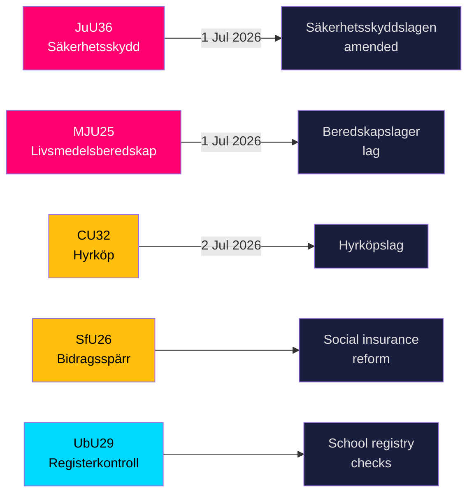

# Zweden versterkt zijn veiligheidsschild en voedseloproegelregels terwijl vijf grote wetten naderbij komen

**Auteur**: James Pether Sörling  
**Datum**: 2026-05-20  
**Classificatie**: OPENBAAR — AVG Art. 9(2)(e,g)  
**Betrouwbaarheidsniveau**: HOOG [B2]  
**Riksmöte**: 2025/26  

## BLUF

De commissies van de Riksdag presenteerden op 19 mei 2026 negen betänkanden op het gebied van nationale veiligheidsinfrastructuur, voedselzekerheid, innovatie op de woningmarkt, hervorming van de sociale zekerheid en schoolveiligheid. De twee meest significante uitkomsten — JuU36 (uitgebreide bevoegdheden om in te grijpen in veiligheidsgevoelige zakelijke relaties) en MJU25 (verplichte voedselopslag voor oorlog of noodgevallen) — treden beide in werking op 1 juli 2026 en versterken Zwedens versneld totaleverdedigingsprogramma. Drie woningmarktwetten (CU32 huurkoop, CU33 verbod op neven-nichtentrouwen, CU39 bouwregels) en sociale zekerheid (SfU26) bevatten zichtbare oppositievoorbehouden die de agenda van de verkiezingscampagne van 2026 zullen bepalen.

## Beslissingen die dit briefing ondersteunt

1. **Compliance-teams in de veiligheidssector**: JuU36 creëert verplichte meldingsverplichtingen voor veiligheidsgevoelige zakelijke regelingen vanaf 1 juli 2026; niet-naleving leidt tot sancties.
2. **Voedselbedrijven**: MJU25 legt opslagverplichtingen op op grond van een nieuwe wet die op 1 juli 2026 in werking treedt; Livsmedelsverket is de uitvoerende autoriteit.
3. **Actoren op de vastgoedmarkt**: CU32 stelt het juridisch kader vast voor huurkoopwoningen (hyrköp) vanaf 2 juli 2026; voorbehoud van S+MP signaleert risico op intrekking na de verkiezingen.
4. **Sociale zekerheidsbeheerders**: SfU26 introduceert uitkeringsblokkering en sancties in het kader van de socialförsäkringen — implementatie start medio 2026.
5. **HR in de schoolsector**: UbU29 breidt achtergrondregistercontroles in het schoolsysteem uit.

## 60-seconden inlichtingenpunten

- **JuU36** (JuU): Säkerhetsskyddslagen gewijzigd — toezichthouders dekken nu regelingen *zonder* een beveiligingsbeschermingsovereenkomst; verplichte melding ingevoerd; voorlopige injecties beschikbaar; inwerkingtreding 1 juli 2026. Geen moties ingediend → de regering won onaangeroerd. [A2]
- **MJU25** (MJU): Nieuwe *lag om beredskapslager av varor i livsmedelskedjan*. Offentlighets- och sekretesslagen ook gewijzigd. Voorbehoud: V+MP. Bijzondere verklaring: S. Lagrådet beoordeeld. Inwerkingtreding 1 juli 2026. [A2]
- **CU32** (CU): Nieuwe *lag om hyrköp av bostad* plus ägarlägenhetsreform. Voorbehouden: S+MP (punt 1), V (punt 1), S+MP (punt 2). Bijzondere verklaring: C. Inwerkingtreding 2 juli 2026. [A2]
- **CU33** (CU): Verbod op neven-nichtentrouwen (*kusinäktenskap*) en andere huwelijken tussen naaste verwanten. [A2]
- **SfU26** (SfU): *Bidragsspärr och sanktionsavgift* — aangescherpt sociaalzekerheidsnaleefregime. [A2]
- **UbU29** (UbU): Uitgebreide strafregistercontroles voor personeel in het schoolsysteem. [A2]
- **SkU28** (SkU): Verlaagde alcoholaccijns voor kleine onafhankelijke producenten — aanpassing aan de EU-interne markt. [A2]
- **CU39** (CU): Vereenvoudigde regels voor bouwwijzigingen — dereguleringmaatregel. [A2]
- **MJU26** (MJU): Regelgeving die het gebruik en bezit van bepaalde diergeneesmiddelen verbiedt. [A2]

## Belangrijkste vooruitblikkende trigger

**2026-06-17**: Plenumsstemming in de Riksdag over JuU36 en MJU25 — een aanname zou beide wetten vastleggen drie weken voor de inwerkingstredingsdatum van 1 juli 2026.

---
## Pass 2-verbeteringen (bewijzen toegevoegd)

### JuU36 Specifiek bewijs
- Voorzitter: **Henrik Vinge (SD)**, de voltallige commissie (17 leden) nam deel aan de unaniem beslissing
- Sleutelwijziging: interimistiska förelägganden (voorlopige bevelen) — juridisch significant nieuw instrument
- Specifieke wettelijke verwijzing: Säkerhetsskyddslagen 2018:585
- **Nul ingediende moties** — bevestigt brede partijconsensus, ongekend in veiligheidswetgeving in dit parlement

### MJU25 Specifiek bewijs  
- Propositie: 2025/26:205
- Dubbele wetswijziging: nieuwe beredskapslager-wet + Offentlighets- och sekretesslagen (ter bescherming van voorraadcompositorische gegevens)
- **S's bijzondere verklaring signaleert strategische terughoudendheid**: S kan een voedselveiligheidswet 4 maanden voor de verkiezingen niet tegenwerken terwijl de Rusland-Oekraïne-oorlog doorgaat
- OSL-wijziging suggereert dat de overheid voorraadgegevens als een inlichtingswaardevol doelwit verwacht

### CU32 Specifiek bewijs
- Propositie: 2025/26:188
- Drie afzonderlijke voorbehoudsblokken: S+MP/punt 1, V/punt 1, S+MP/punt 2
- C's bijzondere verklaring = coalitiegenoot niet volledig op één lijn = hoger implementatierisico
- Britse parallel: Help-to-Buy Shared Ownership (opgericht in 2013) — vergelijkbare uitkomstenbewijzen beschikbaar

### Economische context (IMF WEO-2026-04)
- Zweden NGDP_RPCH: +1,8 % (prognose 2026)
- Geen directe macro-economische schok van dit wetgevingspakket
- Woningwetgeving (CU32) kan micro-economisch stimulerend effect hebben op de bouwsector
- Voedselwetgeving (MJU25) creëert aanbestedingskansen voor de Zweedse landbouwsector
<!-- source-sha: 178d5660dfc7e71876fbb930161f3c3b5c3b8bbc -->
