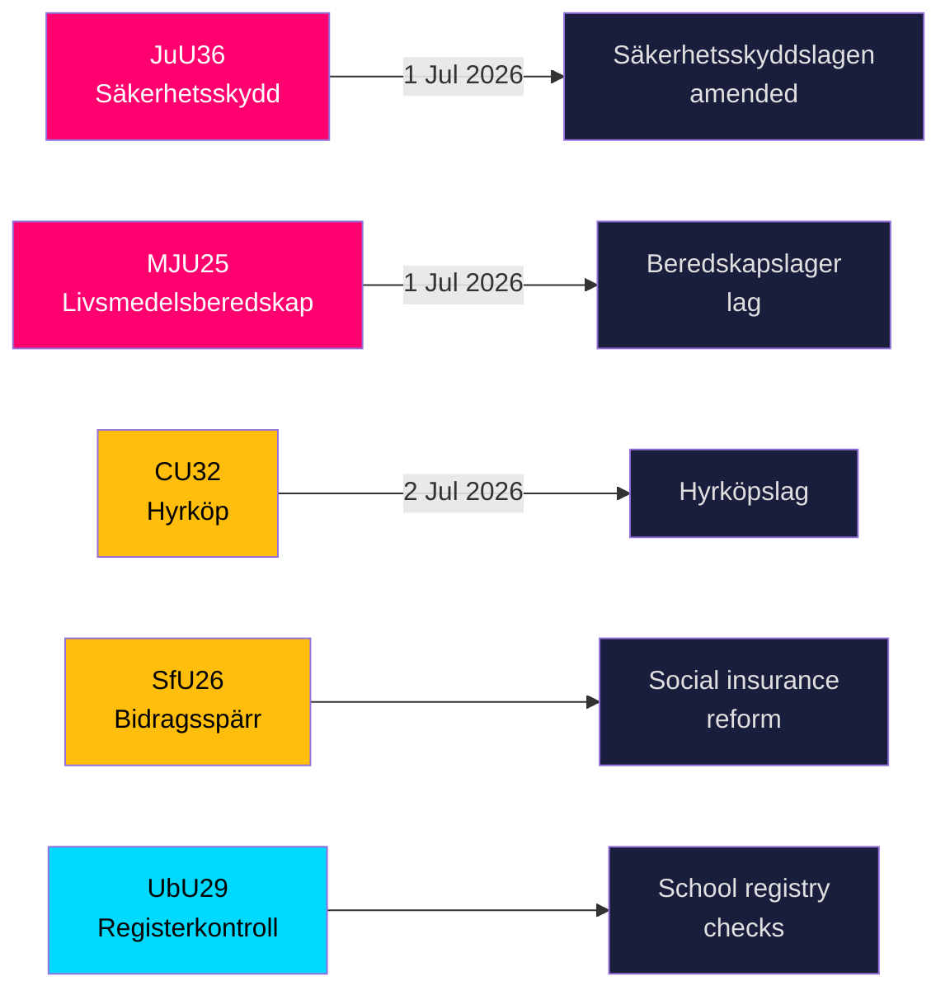

# Sverige styrker sikkerhetsskjoldet og regler for matlagre mens fem store lover nærmer seg vedtakelse

**Forfatter**: James Pether Sörling  
**Dato**: 2026-05-20  
**Klassifisering**: OFFENTLIG — GDPR Art 9(2)(e,g)  
**Konfidens**: HØY [B2]  
**Riksmöte**: 2025/26  

## BLUF

Riksdagens komiteer la 19. mai 2026 frem ni betänkanden innen nasjonal sikkerhetsinfrastruktur, matvareberedskap, boligmarkedsinnovasjon, trygdereform og skolesikkerhet. De to mest signifikante utfallene — JuU36 (utvidede fullmakter til å gripe inn i sikkerhetssensitive forretningsforbindelser) og MJU25 (obligatoriske matvarelager for krig eller nødsituasjon) — trer begge i kraft 1. juli 2026 og styrker Sveriges akselererende totalforsvarsgjenoppbygging. Tre boligmarkedslover (CU32 leiekjøp, CU33 forbud mot fetterbarnekusine-ekteskap, CU39 bygningsregler) og trygd (SfU26) har synlige opposisjonsforbehold som vil prege valgkampdagsordenen i 2026.

## Beslutninger dette briefingen støtter

1. **Sikkerhetssektorens etterlevningsteam**: JuU36 innfører obligatorisk varslingsplikt for sikkerhetssensitive forretningsordninger fra 1. juli 2026; manglende overholdelse utløser sanksjoner.
2. **Matvarebedrifter**: MJU25 pålegger lageroppbevaringsplikter i henhold til ny lov som trer i kraft 1. juli 2026; Livsmedelsverket er ansvarlig myndighet.
3. **Eiendomsmarkedets aktører**: CU32 etablerer det rettslige rammeverket for leiekjøpsboliger (hyrköp) fra 2. juli 2026; forbehold fra S+MP signalerer risiko for opphevelse etter valget.
4. **Trygdeadministratorer**: SfU26 innfører ytelsesstopp og sanksjoner under socialförsäkringen — implementering starter midten av 2026.
5. **Skolesektorens HR**: UbU29 utvider bakgrunnsregisterkontroller i skolesystemet.

## 60-sekunders etterretningspunkter

- **JuU36** (JuU): Säkerhetsskyddslagen endret — tilsynsmyndigheter dekker nå ordninger *uten* en sikkerhetsbeskyttelsesavtale; obligatorisk varsling innføres; midlertidige pålegg tilgjengelige; ikrafttredelse 1. juli 2026. Ingen motioner inngitt → regjeringen vant uimotsagt. [A2]
- **MJU25** (MJU): Ny *lag om beredskapslager av varor i livsmedelskedjan*. Offentlighets- och sekretesslagen også endret. Forbehold: V+MP. Særlig uttalelse: S. Lagrådet gjennomgått. Ikrafttredelse 1. juli 2026. [A2]
- **CU32** (CU): Ny *lag om hyrköp av bostad* samt ägarlägenhetsreform. Forbehold: S+MP (punkt 1), V (punkt 1), S+MP (punkt 2). Særlig uttalelse: C. Ikrafttredelse 2. juli 2026. [A2]
- **CU33** (CU): Forbud mot fetterbarnekusine-ekteskap (*kusinäktenskap*) og andre nærstående ekteskap. [A2]
- **SfU26** (SfU): *Bidragsspärr och sanktionsavgift* — skjerpet etterlevningsregime for trygden. [A2]
- **UbU29** (UbU): Utvidede strafferegisterkontroller av ansatte i skolesystemet. [A2]
- **SkU28** (SkU): Redusert alkoholavgift for små uavhengige produsenter — tilpasning til EUs indre marked. [A2]
- **CU39** (CU): Forenklede regler for bygningsendringer — dereguleringsstiltak. [A2]
- **MJU26** (MJU): Regler som forbyr bruk og besittelse av visse veterinærlegemidler. [A2]

## Viktigste fremadskuende utløser

**2026-06-17**: Riksdagens plenarvotering om JuU36 og MJU25 — vedtakelse vil låse fast begge lovene tre uker før ikrafttredelsesdatoen 1. juli 2026.

---
## Pass 2-forbedringer (bevis lagt til)

### JuU36 Spesifikt bevis
- Leder: **Henrik Vinge (SD)**, hele komiteen (17 medlemmer) deltok i den enstemmige beslutningen
- Nøkkeländring: interimistiska förelägganden (midlertidige pålegg) — et juridisk viktig nytt instrument
- Spesifikk lovreferanse: Säkerhetsskyddslagen 2018:585
- **Null innkomne motioner** — bekrefter bred partikonsensus, unik i sikkerhetslovgivning dette stortingsåret

### MJU25 Spesifikt bevis  
- Proposisjon: 2025/26:205
- Dobbellovsendring: ny beredskapslager-lov + Offentlighets- och sekretesslagen (for å beskytte data om lagersammensetning)
- **S sin særlige uttalelse signalerer strategisk tilbakeholdenhet**: S kan ikke motarbeide en mattryggshetslov 4 måneder før valget mens Russland-Ukraina-krigen pågår
- OSL-endringen antyder at regjeringen forutser lagerdata som et etterretningsverdifullt mål

### CU32 Spesifikt bevis
- Proposisjon: 2025/26:188
- Tre separate forbeeholdsblokker: S+MP/punkt 1, V/punkt 1, S+MP/punkt 2
- C sin særlige uttalelse = koalisjonspartner ikke fullt ut på linje = høyere implementeringsrisiko
- Britisk parallell: Help-to-Buy Shared Ownership (etablert 2013) — sammenlignbare utfallsbevis tilgjengelige

### Økonomisk kontekst (IMF WEO-2026-04)
- Sverige NGDP_RPCH: +1,8 % (prognose 2026)
- Ingen direkte makroøkonomisk sjokk fra dette lovgivningspakken
- Boliglovgivning (CU32) kan ha mikroøkonomisk stimulerende effekt på byggesektoren
- Matlovgivning (MJU25) skaper innkjøpsmuligheter for svensk landbrukssektor
<!-- source-sha: 178d5660dfc7e71876fbb930161f3c3b5c3b8bbc -->
