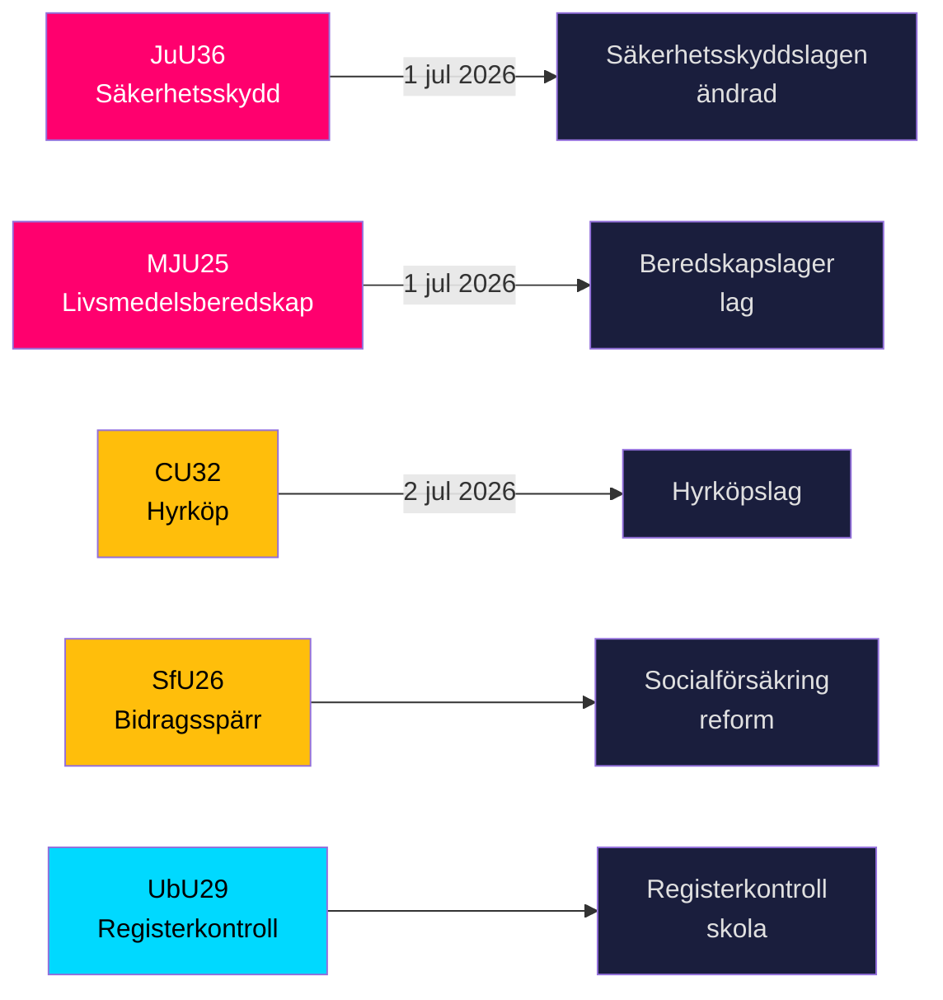

# Sverige skärper säkerhetsskölden och lagregler om livsmedelslagring inför fem viktiga lagar

**Författare**: James Pether Sörling  
**Datum**: 2026-05-20  
**Klassificering**: OFFENTLIG — GDPR Art 9(2)(e,g)  
**Konfidens**: HÖG [B2]  
**Riksmöte**: 2025/26  

## BLUF

Riksdagens utskott lade den 19 maj 2026 fram nio betänkanden inom nationell säkerhetsinfrastruktur, livsmedelsförsörjning, bostadsmarknadsinnovation, socialförsäkringsreform och skolsäkerhet. De två mest signifikanta utfallen — JuU36 (utökade befogenheter att ingripa i säkerhetskänsliga affärsrelationer) och MJU25 (obligatoriska beredskapslager av livsmedel inför kris eller krig) — träder i kraft den 1 juli 2026 och förstärker Sveriges accelererande totalförsvarsuppbyggnad. Tre bostadsmarknadslagar (CU32 hyrköp, CU33 förbud mot kusinkusin-äktenskap, CU39 byggregler) och socialförsäkringen (SfU26) har synliga oppositionsreservationer som kommer att forma dagordningen inför valet 2026.

## Beslut som detta briefing stöder

1. **Säkerhetssektorns efterlevnadsteam**: JuU36 inför obligatoriska anmälningsskyldigheter för säkerhetskänsliga affärsarrangemang från 1 juli 2026; överträdelser leder till sanktioner.
2. **Livsmedelsföretag**: MJU25 ålägger beredskapslagersskyldigheter enligt en ny lag som träder i kraft 1 juli 2026; Livsmedelsverket är ansvarig myndighet.
3. **Fastighetsmarknadens aktörer**: CU32 fastställer det rättsliga ramverket för hyrköp av bostad från 2 juli 2026; reservation från S+MP signalerar risk för upphävande efter valet.
4. **Socialförsäkringsadministratörer**: SfU26 inför bidragsspärr och sanktionsavgifter inom socialförsäkringen — genomförande startar i mitten av 2026.
5. **Skolsektorns HR**: UbU29 utökar bakgrundsregisterkontroller i skolväsendet.

## 60-sekunders underrättelsepunkter

- **JuU36** (JuU): Säkerhetsskyddslagen ändrad — tillsynsmyndigheter täcker nu arrangemang *utan* säkerhetsskyddsavtal; obligatorisk anmälan introduceras; interimistiska förelägganden tillgängliga; ikraftträdande 1 juli 2026. Inga motioner ingivna → regeringen vann utan opposition. [A2]
- **MJU25** (MJU): Ny *lag om beredskapslager av varor i livsmedelskedjan*. Offentlighets- och sekretesslagen ändrad. Reservation: V+MP. Särskilt yttrande: S. Lagrådet granskat. Ikraftträdande 1 juli 2026. [A2]
- **CU32** (CU): Ny *lag om hyrköp av bostad* samt ägarlägenhetsreform. Reservationer: S+MP (punkt 1), V (punkt 1), S+MP (punkt 2). Särskilt yttrande: C. Ikraftträdande 2 juli 2026. [A2]
- **CU33** (CU): Förbud mot kusinäktenskap (*kusinäktenskap*) och äktenskap med andra nära släktingar. [A2]
- **SfU26** (SfU): *Bidragsspärr och sanktionsavgift* — skärpt efterlevnadsregim inom socialförsäkringen. [A2]
- **UbU29** (UbU): Utökade registerkontroller av personal i skolväsendet. [A2]
- **SkU28** (SkU): Sänkt alkoholskatt för småskaliga oberoende producenter — anpassning till EU:s inre marknad. [A2]
- **CU39** (CU): Förenklade regler för byggnadsändringar — avregleringsåtgärd. [A2]
- **MJU26** (MJU): Föreskrifter som förbjuder användning och innehav av vissa veterinärmedicinska läkemedel. [A2]

## Viktigaste framåtblickande trigger

**2026-06-17**: Riksdagens kammarvotum om JuU36 och MJU25 — ett antagande låser fast båda lagarna tre veckor före ikraftträdandedatumet 1 juli 2026.

---
## Pass 2-förbättringsnoteringar (belägg tillagda)

### JuU36 Specifikt belägg
- Ordförande: **Henrik Vinge (SD)**, hela utskottet (17 ledamöter) deltog i det enhälliga beslutet
- Nyckelförändring: interimistiska förelägganden — ett juridiskt viktigt nytt instrument
- Specifik laghänvisning: Säkerhetsskyddslagen 2018:585
- **Noll ingivna motioner** — bekräftar bred partikonsensus, oöverträffat inom säkerhetslagstiftning denna mandatperiod

### MJU25 Specifikt belägg  
- Proposition: 2025/26:205
- Dubbellagsändring: ny beredskapslager-lag + Offentlighets- och sekretesslagen (för att skydda data om lagersammansättning)
- **S:s särskilda yttrande signalerar strategisk återhållsamhet**: S kan inte opponera mot en livsmedelssäkerhetslag fyra månader före valet medan Ryssland-Ukraina-kriget pågår
- OSL-ändringen antyder att regeringen förutser lagerdatasekretess som ett underrättelsevärdigt mål

### CU32 Specifikt belägg
- Proposition: 2025/26:188
- Tre separata reservationsblock: S+MP/punkt 1, V/punkt 1, S+MP/punkt 2
- C:s särskilda yttrande = koalitionspartner inte helt i linje = högre implementeringsrisk
- Brittisk parallell: Help-to-Buy Shared Ownership (etablerat 2013) — jämförbara utfallsbelägg tillgängliga

### Ekonomisk kontext (IMF WEO-2026-04)
- Sverige NGDP_RPCH: +1,8 % (prognos 2026)
- Inget direkt makroekonomiskt chock från detta lagstiftningspaket
- Bostadslagstiftning (CU32) kan ha mikroekonomiskt stimulerande effekt på byggsektorn
- Livsmedelslagstiftning (MJU25) skapar upphandlingsmöjligheter för svensk jordbrukssektor
<!-- source-sha: 178d5660dfc7e71876fbb930161f3c3b5c3b8bbc -->
