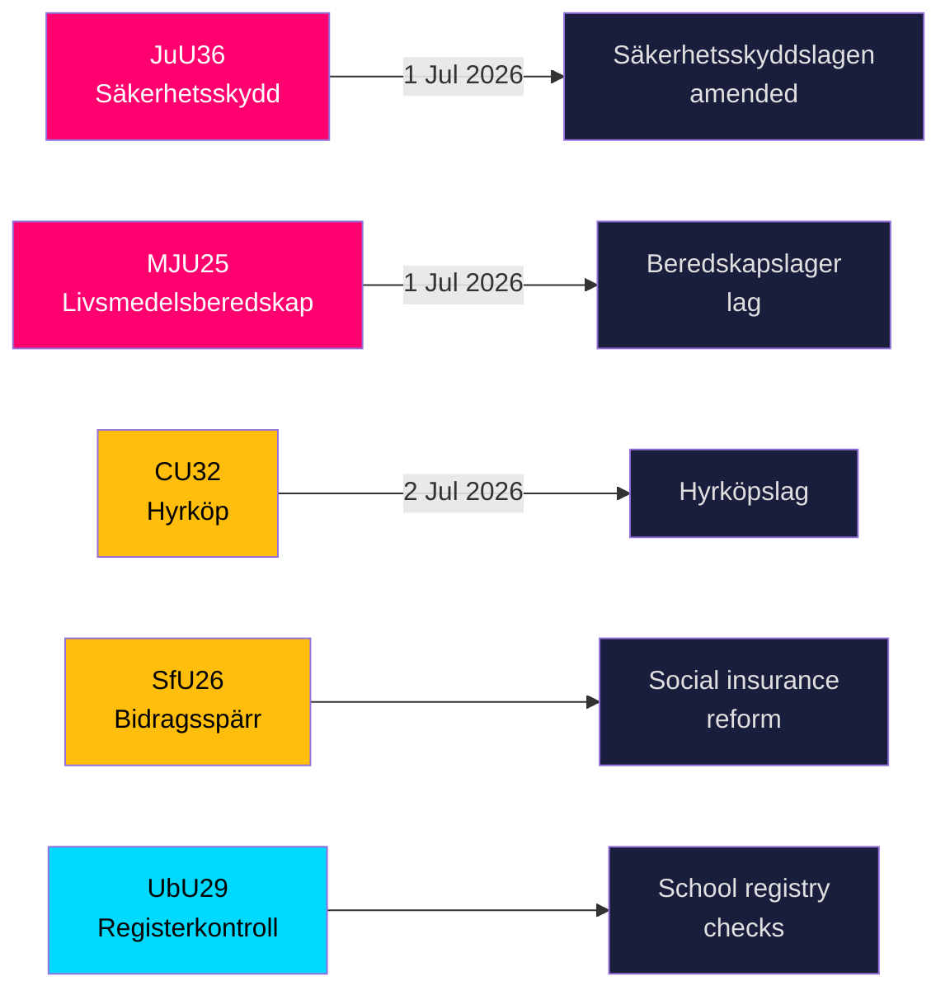

# 瑞典在五项重大法律临近生效之际强化安全防护与食品储备规则

**作者**: James Pether Sörling  
**日期**: 2026-05-20  
**分类**: 公开 — GDPR第9(2)(e,g)条  
**可信度**: 高 [B2]  
**Riksmöte**: 2025/26  

## BLUF

瑞典议会（Riksdag）各委员会于2026年5月19日提交了九份betänkanden，涵盖国家安全基础设施、食品备战、住房市场创新、社会保险改革和学校安全等领域。最具信号意义的两项结果——JuU36（扩大干预安全敏感商业关系的权力）和MJU25（战争或紧急状态下的强制食品储备）——均于2026年7月1日生效，进一步强化了瑞典加速推进的全面防卫重建计划。三项住房市场法案（CU32租购、CU33禁止表亲通婚、CU39建筑规则）和社会保险（SfU26）带有明显的反对党保留意见，将左右2026年竞选议程。

## 本简报所支持的决策

1. **安全领域合规团队**：JuU36自2026年7月1日起为安全敏感商业安排设立强制申报义务；不合规将触发制裁。
2. **食品行业运营商**：MJU25依据2026年7月1日生效的新法律规定储备义务；Livsmedelsverket为执行当局。
3. **房地产市场参与者**：CU32自2026年7月2日起为租购住房（hyrköp）建立法律框架；S+MP的保留意见预示选后废除风险。
4. **社会保险管理机构**：SfU26在socialförsäkringen框架内引入福利封锁和制裁——实施自2026年中期开始。
5. **学校部门人力资源**：UbU29扩大学校系统背景登记核查范围。

## 60秒情报要点

- **JuU36** (JuU)：Säkerhetsskyddslagen修订——监管机构现在覆盖*无需*安全保护协议的安排；引入强制报告；临时禁令可用；生效日期2026年7月1日。未提交任何议案→政府无对手获胜。[A2]
- **MJU25** (MJU)：新颁*lag om beredskapslager av varor i livsmedelskedjan*。Offentlighets- och sekretesslagen亦经修订。保留意见：V+MP。特别声明：S。Lagrådet已审议。生效日期2026年7月1日。[A2]
- **CU32** (CU)：新颁*lag om hyrköp av bostad*及ägarlägenhetsreform。保留意见：S+MP（第1条）、V（第1条）、S+MP（第2条）。特别声明：C。生效日期2026年7月2日。[A2]
- **CU33** (CU)：禁止表亲通婚（*kusinäktenskap*）及其他近亲婚姻。[A2]
- **SfU26** (SfU)：*Bidragsspärr och sanktionsavgift*——社会保险合规机制收紧。[A2]
- **UbU29** (UbU)：扩大学校系统工作人员犯罪记录核查范围。[A2]
- **SkU28** (SkU)：降低小型独立生产商的酒税——与欧盟单一市场接轨。[A2]
- **CU39** (CU)：简化建筑改造规则——放松管制措施。[A2]
- **MJU26** (MJU)：禁止使用和持有某些兽医药品的法规。[A2]

## 最重要的前瞻性触发因素

**2026-06-17**：Riksdag全体投票表决JuU36和MJU25——通过将在2026年7月1日生效日三周前确立两项法律。

---
## 第二轮改进说明（已添加证据）

### JuU36 具体证据
- 主席：**Henrik Vinge (SD)**，全体委员（17人）参与一致通过的决定
- 关键变化：interimistiska förelägganden（临时禁令）——具有重要法律意义的新工具
- 具体法律参考：Säkerhetsskyddslagen 2018:585
- **零动议提交**——证实本届议会安全立法中前所未有的广泛党派共识

### MJU25 具体证据  
- 法案：2025/26:205
- 双重法律修订：新beredskapslager法 + Offentlighets- och sekretesslagen（保护储备构成数据）
- **S的特别声明表明战略克制**：在俄乌战争持续背景下，选举前4个月S无法反对粮食安全法
- OSL修订表明政府预期储备数据将成为具有情报价值的目标

### CU32 具体证据
- 法案：2025/26:188
- 三个独立保留意见模块：S+MP/第1条、V/第1条、S+MP/第2条
- C的特别声明 = 联合政府伙伴立场未完全一致 = 更高的实施风险
- 英国案例：Help-to-Buy Shared Ownership（2013年设立）——可比较的结果证据可用

### 经济背景（IMF WEO-2026-04）
- 瑞典NGDP_RPCH：+1.8%（2026年预测）
- 此立法包不产生直接宏观经济冲击
- 住房立法（CU32）可能对建筑行业产生微观刺激效应
- 食品立法（MJU25）为瑞典农业部门创造采购机会
<!-- source-sha: 178d5660dfc7e71876fbb930161f3c3b5c3b8bbc -->
