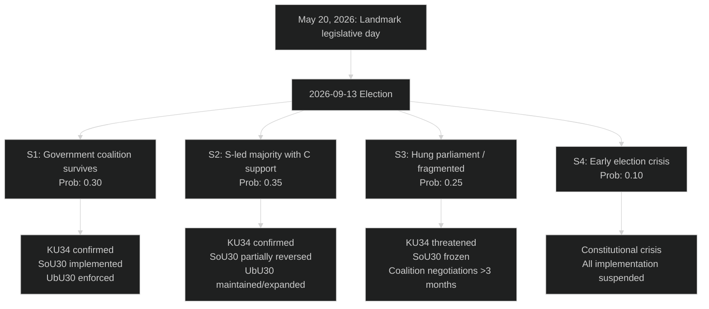

# Scenario Analysis — Evening Analysis 2026-05-20

**Framework**: Four scenarios × three horizon bands (T+90d / T+365d / T+1460d)  
**Date**: 2026-05-20  
**Horizon anchor**: 2026-09-13 election  
**WEP confidence language applied**

---

## Scenario Tree Structure

---

## Scenario 1 — Continuation: Government Survives (Probability: 0.30)
**"Legacy confirmed"**

**Trigger conditions**: M+SD+KD+L maintain 175+ seats; SD holds polling above 18%.

**Welfare**: SoU29/30 full implementation by January 2027. Early data (Q3 2026) shows reduced caseloads in pilot municipalities — government uses as campaign evidence. No court injunctions succeed at Constitutional Court level.

**Constitutional**: KU34 second reading passes in October 2026 (first session of new Riksdag). Constitutional abortion right becomes permanent. Sweden joins a small group of nations with constitutional abortion protection (US-pre Dobbs framework replicated at more stable constitutional level).

**Education**: UbU30 enforcement begins Q1 2027. 15-20% of friskolor fail new approval standards; orderly wind-downs. L protests but remains in government.

**International**: UU4 Nordic/Arctic strategy becomes binding framework for next defence review. MJU22 recommendations implemented — Sweden's climate investment effectiveness rating improves.

**IMF economic context**: Sweden GDP growth 2.5% (2027E, WEO Apr-2026 projection). Welfare reforms contribute to slight labour supply increase (estimated +40,000 activated welfare recipients entering labour market by 2027).

---

## Scenario 2 — Change: S-led Majority (Probability: 0.35)
**"Social democratic restoration"**

**Trigger conditions**: S+MP+V+C reach 175+ seats; C agrees to passive support without SD demands.

**Welfare**: SoU29/30 partially reversed in autumn 2026 budget. Activity requirements remain but bidragstak suspended pending review. New SOU launched on "dignified welfare." Implementation costs already incurred by municipalities (SEK 2-3bn) are not recoverable.

**Constitutional**: KU34 second reading passes — S supported the first reading and will confirm abortion right. This is the one element of the Busch government's legacy that S would preserve.

**Education**: UbU30 maintained and potentially extended under Education Minister from S or MP. Friskola sector restrictions become permanent policy direction.

**International**: ODA levels restored toward 1% GNI target. UU3 recommendations implemented in full. MJU22 climate investments methodology overhauled. Nordic/Arctic UU4 framework continued under new government (bipartisan security consensus).

**Honour violence (JuU43)**: Law maintained. S adds resource package for specialist police and prosecutors.

**IMF economic context**: Welfare reversal creates fiscal cost (SEK 3-5bn), manageable within Sweden's fiscal space (~38% debt/GDP). IMF notes increased social spending in 2027 Art. IV consultation.

---

## Scenario 3 — Stalemate: Hung Parliament (Probability: 0.25)
**"Constitutional uncertainty"**

**Trigger conditions**: Neither bloc reaches 175 seats; SD fractures or L falls below threshold.

**Critical risk**: KU34 second reading uncertain — a hung parliament may delay the new Riksdag's organisation for weeks, and the second reading requires a formal vote. Constitutional convention creates strong pressure but is not legally binding.

**Welfare**: SoU30 implementation proceeds under caretaker government but courts receive multiple challenges. Municipal variation increases — some municipalities suspend benefit cap pending new government direction.

**Education**: UbU30 enforcement delayed pending government formation.

**Coalition negotiations**: Expected 3-4 months (precedent: 2018 formation took 134 days). All reforms enter an implementation freeze.

**WEP confidence**: Implementation feasibility MEDIUM-LOW in this scenario. The legal uncertainty created by government formation extends beyond the welfare reform to the constitutional process.

---

## Scenario 4 — Crisis: Pre-Election Disruption (Probability: 0.10)
**"Constitutional stress test"**

**Trigger conditions**: Major SoU30 implementation failure leads to no-confidence motion; coalition collapse before September.

**Probability distribution**: Very LOW — Sweden's parliamentary system and the constitutional schedule make this scenario unlikely, but not impossible given municipal SKR warnings on SoU30 readiness.

**Consequences**: Emergency election scheduled alongside or shortly after September 13. All legislation in limbo. International attention on Swedish democratic stability.

**Historical note**: Sweden has not had an early election since 1958. The closest recent parallel was the December 2014 SD-triggered budget crisis, resolved by the December Agreement. A similar cross-party deal is the more likely outcome of any near-crisis.

---

## Wildcard Events (5 High-Impact Low-Probability)

| Wildcard | Probability | Impact if occurs |
|----------|-------------|-----------------|
| SD withdraws KU34 second-reading support | 0.08 | Constitutional chaos; international attention |
| Major honour violence fatality before election | 0.12 | JuU43 effectiveness narrative; M/S conflict on resource allocation |
| Russian Arctic incident involving Sweden | 0.06 | NATO activation; elections postponed (extreme unlikely) |
| Supreme Administrative Court strikes SoU30 | 0.10 | SoU30 suspended; government electoral crisis |
| Riksdag speaker resignation / procedural crisis | 0.04 | Constitutional process interrupted |
