  

# 🏷️ Classification Results — Opposition Motions · 2026-05-20

**📋 Classification:** Public | **📅 Analysis date:** 2026-05-20

---

## Document classification

| dok_id | Type | Subtype | Policy domain | Ideology | Party | Horizon |
|--------|------|---------|---------------|---------|-------|---------|
| HD024184 | Kommittémotion | Following motion (med anledning av prop.) | Constitutional law / Democracy / Party financing | Liberal-centrist; civil liberties emphasis | C (Centerpartiet) | T+30d (KU vote expected) |

---

## Policy domain taxonomy

```mermaid
%%{init: {'theme': 'dark', 'themeVariables': {'primaryColor': '#00d9ff', 'primaryTextColor': '#e0e0e0', 'lineColor': '#ffbe0b', 'background': '#0a0e27', 'mainBkg': '#1a1e3d'}}}%%
graph LR
    ROOT[HD024184] --> D1[Democracy & Transparency]
    ROOT --> D2[Civil Liberties]
    ROOT --> D3[Labor Law]
    D1 --> D1A[Party financing reform]
    D1 --> D1B[Lobbying register]
    D2 --> D2A[Freedom of association]
    D2 --> D2B[ECHR compliance]
    D3 --> D3A[Union-to-party donations]
    style ROOT fill:#1a1e3d,stroke:#00d9ff
    style D1 fill:#0a3322,stroke:#00d9ff
    style D2 fill:#330011,stroke:#ff006e
    style D3 fill:#2a1a00,stroke:#ffbe0b
    classDef domain fill:#1a1e3d,stroke:#00d9ff
```

---

## Ideological classification

| Dimension | Assessment | Evidence |
|-----------|-----------|----------|
| Left-Right axis | Center (3/10 — neither strongly market nor state-interventionist) | C's dual acceptance/rejection preserves liberal-democratic center position |
| GAL-TAN axis | GAL (Green-Alternative-Libertarian) leaning on civil liberties | Strong freedom of association argument, ECHR invocation |
| State-society axis | Society-first on associational freedom; state-first on transparency | Nuanced: pro-regulation of political finance, anti-regulation of internal union affairs |

---

## Riksdag committee routing

| Committee | Relevance | Why |
|-----------|----------|-----|
| KU (Konstitutionsutskottet) | PRIMARY | Already referred — constitutional law domain |
| AU (Arbetsmarknadsutskottet) | SECONDARY | Labor organization governance implications |

---

## Cross-party position mapping

| Party | Expected position on HD024184's rejection demand | Evidence/basis |
|-------|-----------------------------------------------|----------------|
| C | Propose rejection of labor org law | HD024184 |
| S | Will also likely oppose the labor org law (favors LO-S nexus) | Political alignment |
| V | Likely oppose the labor org law (pro-labor) | Political alignment |
| MP | Likely oppose (civil liberties emphasis similar to C) | Political alignment |
| M | Will reject C's motion (support full Prop. 258) | Government party |
| KD | Will reject C's motion (support full Prop. 258) | Government party |
| L | Possible sympathy with freedom of association argument but likely supports government | L historically defends civil liberties |
| SD | Will reject C's motion (SD supports Tidö agenda on LO-S disruption) | Confidence and supply agreement |

---

## Evidence anchors

| Claim | Evidence | Retrieved | Confidence |
|-------|----------|-----------|------------|
| Kommittémotion by C | HD024184 header | 2026-05-20 | VERY HIGH |
| KU referred | HD024184 processing history "HÄN 2026-05-20" | 2026-05-20 | VERY HIGH |
| C center-liberal ideology | Party platform; ECHR invocation in motion text | 2026-05-20 | HIGH |

