  

# 🧮 Coalition Mathematics — Opposition Motions · 2026-05-20

**📋 Classification:** Public | **📅 Analysis date:** 2026-05-20

---

## Parliamentary arithmetic — Riksdag 2022-26

| Party | Seats | Government/Opposition | Position on HD024184's demand |
|-------|-------|----------------------|------------------------------|
| S | 107 | Opposition | Likely oppose labor org law (inferred) |
| M | 68 | Government | Reject C's motion — support full Prop. |
| SD | 73 | Confidence & supply | Reject C's motion — support full Prop. |
| C | 24 | Opposition (external) | SUPPORTS own motion |
| V | 24 | Opposition | Likely oppose labor org law (inferred) |
| KD | 19 | Government | Reject C's motion |
| L | 16 | Government | Likely reject — may have internal sympathy |
| MP | 18 | Opposition | Likely oppose labor org law (inferred) |
| **Total** | **349** | | |

---

## Vote arithmetic on HD024184

| Block | Seats | Expected vote on C's demand | Notes |
|-------|-------|---------------------------|-------|
| Government bloc (M+KD+L) | 103 | Reject C's motion | Coalition discipline |
| SD | 73 | Reject C's motion | Tidöavtalet alignment |
| **For rejection of C's motion** | **176** | Majority needed = 175 | Government wins |
| S | 107 | Would vote for C's demand | Defends LO-S |
| V | 24 | Would vote for C's demand | Pro-labor |
| C | 24 | Files the motion | Own demand |
| MP | 18 | Would likely vote for C's demand | Civil liberties |
| **Against full Prop. (labor org section)** | **173** | Minority | Cannot block |

**Conclusion:** The government has a working majority of **176 vs. 173** on the labor org contributions law. C's motion will fail. The margin is **3 seats** — within L defection range.

---

## L defection scenario

If 2 or more L MPs vote with C on the labor org section:

| Scenario | For C's demand | Against C's demand | Outcome |
|----------|---------------|-------------------|---------|
| No L defection | 173 | 176 | C loses |
| 1 L defector | 174 | 175 | C loses by 1 |
| 2 L defectors | 175 | 174 | **C wins by 1** |
| 3+ L defectors | 176+ | ≤173 | C wins |

L has 16 seats. Even 2 defections changes the outcome. **This is why L's position is the critical intelligence gap.**

---

## Post-election coalition implications

C's motion may signal its post-election coalition preferences:
- By opposing the labor org law, C maintains the option of coalition with S (if S accepts C's pro-market positions)
- C preserves distance from SD to remain viable as a center party across coalition boundaries

```mermaid
%%{init: {'theme': 'dark', 'themeVariables': {'primaryColor': '#00d9ff', 'primaryTextColor': '#e0e0e0', 'lineColor': '#ffbe0b', 'background': '#0a0e27', 'mainBkg': '#1a1e3d'}}}%%
graph LR
    subgraph PRE2026["Pre-election 2026"]
        C1[C opposes labor org law]
    end
    subgraph POST2026["Post-election coalition options"]
        B1[Center-right without SD: M+L+KD+C]
        B2[Broad center: S+C+L+MP]
        B3[Status quo: M+KD+L with SD support]
    end
    C1 -->|Maintains option| B1
    C1 -->|Opens option| B2
    C1 -->|Distances from| B3
    style C1 fill:#1a1e3d,stroke:#00d9ff
    style B2 fill:#0a3322,stroke:#00d9ff
    classDef scenario fill:#1a1e3d,stroke:#00d9ff
```

---

## Evidence anchors

| Claim | Evidence | Retrieved | Confidence |
|-------|----------|-----------|------------|
| Seat distribution | 2022 Riksdag election results | 2026-05-20 | VERY HIGH |
| Government 176-seat working majority | Arithmetic from seat counts | 2026-05-20 | HIGH |
| L defection threshold = 2 seats | Arithmetic | 2026-05-20 | VERY HIGH |

