  

# 🗺️ Cross-Reference Map — Opposition Motions · 2026-05-20

**📋 Classification:** Public | **📅 Analysis date:** 2026-05-20

---

## Document relationships

```mermaid
%%{init: {'theme': 'dark', 'themeVariables': {'primaryColor': '#00d9ff', 'primaryTextColor': '#e0e0e0', 'lineColor': '#ffbe0b', 'background': '#0a0e27', 'mainBkg': '#1a1e3d'}}}%%
graph TD
    SOU[SOU 2025:52\nMay 2025 committee report\nDid NOT recommend labor org law]
    PROP[Prop. 2025/26:258\nÖkad insyn i politiska processer\nGovernment proposition]
    MOT[HD024184\n2025/26:4184\nC motion by Malin Björk m.fl.]
    LAG[Lagrådet opinion\n2026-03-24\n'bräckligt']
    LAG18[Lag 2018:90\nom insyn i finansiering av partier\nAmended by Prop.]
    LOBBYREG[New lobbying register law\nKammarkollegiet\nAccepted by C]
    LABORLAW[New labor org contributions law\nRejected by C]
    KU[KU committee\nReferred 2026-05-20\nVote pending]
    SOU -->|Basis for| PROP
    LAG -->|Criticizes| PROP
    PROP --> LAG18
    PROP --> LOBBYREG
    PROP --> LABORLAW
    MOT -->|Responds to| PROP
    MOT -->|Cites| LAG
    MOT -->|Cites| SOU
    MOT -->|Accepts| LAG18
    MOT -->|Accepts| LOBBYREG
    MOT -->|Rejects| LABORLAW
    KU -->|Processes| PROP
    KU -->|Considers| MOT
    style SOU fill:#1a1e3d,stroke:#00d9ff
    style LAG fill:#2a0022,stroke:#ff006e
    style LABORLAW fill:#330011,stroke:#ff006e
    style LOBBYREG fill:#0a3322,stroke:#00d9ff
    style LAG18 fill:#0a3322,stroke:#00d9ff
    classDef accepted fill:#0a3322,stroke:#00d9ff
    classDef rejected fill:#330011,stroke:#ff006e
```

---

## Legislative chain

| Document | Type | Date | Relationship to HD024184 |
|----------|------|------|--------------------------|
| SOU 2025:52 | Parliamentary committee report | May 2025 | Background — committee did NOT recommend labor org law |
| Prop. 2025/26:258 | Government proposition | ~April 2026 | Parent document — HD024184 is a "med anledning av" motion |
| Lagrådet opinion | Advisory Council on Legislation | 2026-03-24 | Co-cited authority — "bräckligt" verdict on labor org law |
| Lag (2018:90) | Existing law on party finance transparency | 2018 | Being amended by Prop. — C accepts the amendments |
| HD024184 | Kommittémotion | 2026-05-15 | Subject of this analysis |

---

## Riksdag cross-reference

| Riksdag element | Relevance |
|----------------|-----------|
| KU (Konstitutionsutskottet) | Committee processing HD024184 and Prop. 2025/26:258 |
| Kammarkollegiet | Administrative body for new lobbying register |
| IMY (Integritetsskyddsmyndigheten) | Potential GDPR enforcement authority |
| ECHR (European Court of Human Rights) | Potential challenge venue post-enactment |

---

## Evidence anchors

| Cross-reference | Evidence | Retrieved | Confidence |
|----------------|----------|-----------|------------|
| SOU 2025:52 cited | HD024184 § "Om ärendets beredning" | 2026-05-20 | HIGH |
| Lagrådet 2026-03-24 cited | HD024184 text | 2026-05-20 | HIGH |
| Lag 2018:90 identified | HD024184 § "Motivering" para 1 | 2026-05-20 | VERY HIGH |
| KU referral confirmed | HD024184 processing history | 2026-05-20 | VERY HIGH |

