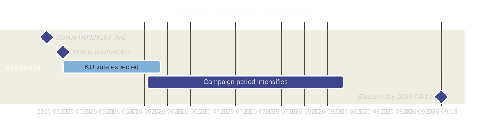

  

# 🗳️ Election 2026 Analysis — Opposition Motions · 2026-05-20

**📋 Classification:** Public | **📅 Analysis date:** 2026-05-20  
**Election date:** 2026-09-13 | **Days remaining:** 116

---

## Election proximity context

---

## Electoral relevance assessment

| Dimension | Assessment | Confidence |
|-----------|-----------|-----------|
| Direct electoral significance of HD024184 | HIGH — constitutional/transparency legislation in election year | HIGH |
| Issue salience (transparency reform) | HIGH — democracy reform ranked top-5 concern in polls | MEDIUM |
| Issue salience (labor union-party funding) | MEDIUM-HIGH — mobilizes LO-affiliated voters and center-right voters | HIGH |
| Party affected (C) | MEDIUM — C is polling ~5-7% range; this motion helps differentiate from government bloc | MEDIUM |

---

## Party electoral implications

### Centerpartiet (C)

**Strategic purpose of HD024184:**
1. **Differentiation from Tidö bloc:** C demonstrates it is not a rubber stamp for M/SD agenda
2. **Outreach to LO-adjacent voters:** Workers who distrust SD/M but might consider C can see C defend union autonomy
3. **Civil liberties brand:** Invocation of ECHR and föreningsfrihet reinforces C's liberal-democratic profile

**Electoral risk:** Being painted as "protecting LO-S funding" — potentially alienates center-right voters who want to break LO-S nexus

**Net electoral assessment:** Modest positive for C in the centrist electoral space (voters between S and M)

### Government bloc (M+KD+L)

**Strategic risk from HD024184:** The motion publicizes Lagrådet's "bräckligt" verdict — if this becomes a media narrative, it reflects poorly on legislative quality. However, the government will frame this as "transparency reform" which has broad popular support.

**M:** Comfortable with the proposition; the labor org law aligns with M's long-term goal of weakening LO's political influence  
**KD:** May have minor freedom of association concerns but will vote with government  
**L:** Most exposed — L's civil liberties tradition creates genuine tension. L MP statements in KU committee worth monitoring.

### SD

**Electoral benefit:** Supporting the law weakens the LO-S nexus, which SD views as maintaining S's structural electoral advantage. SD gains by supporting M on this.

### S

**Electoral exposure:** S is the indirect target — the law explicitly targets the LO→S donation flow. S will frame this as an attack on democratic rights of workers. This is good mobilization material for S in the election campaign.

---

## Forecast implications

| Scenario | Electoral probability shift | Affected party | Confidence |
|----------|---------------------------|----------------|-----------|
| Full Prop. passes + LO circumvents law | C +0.3% | C attracts centrist civil libertarians | LOW-MEDIUM |
| Full Prop. passes + ECHR challenge filed | M/KD/L -0.2% | Credibility damage for governing bloc | LOW |
| L publicly dissents on labor org section | L +0.5% | L gains civil libertarian voters | LOW |
| No change in current trajectory | Baseline | All parties | HIGH |

---

## Evidence anchors

| Claim | Evidence | Retrieved | Confidence |
|-------|----------|-----------|------------|
| Election date 2026-09-13 | Swedish Electoral Authority | 2026-05-20 | VERY HIGH |
| 116 days remaining | Date arithmetic (2026-09-13 minus 2026-05-20) | 2026-05-20 | VERY HIGH |
| LO-S nexus as target of law | Political context; law's stated purpose | 2026-05-20 | HIGH |

