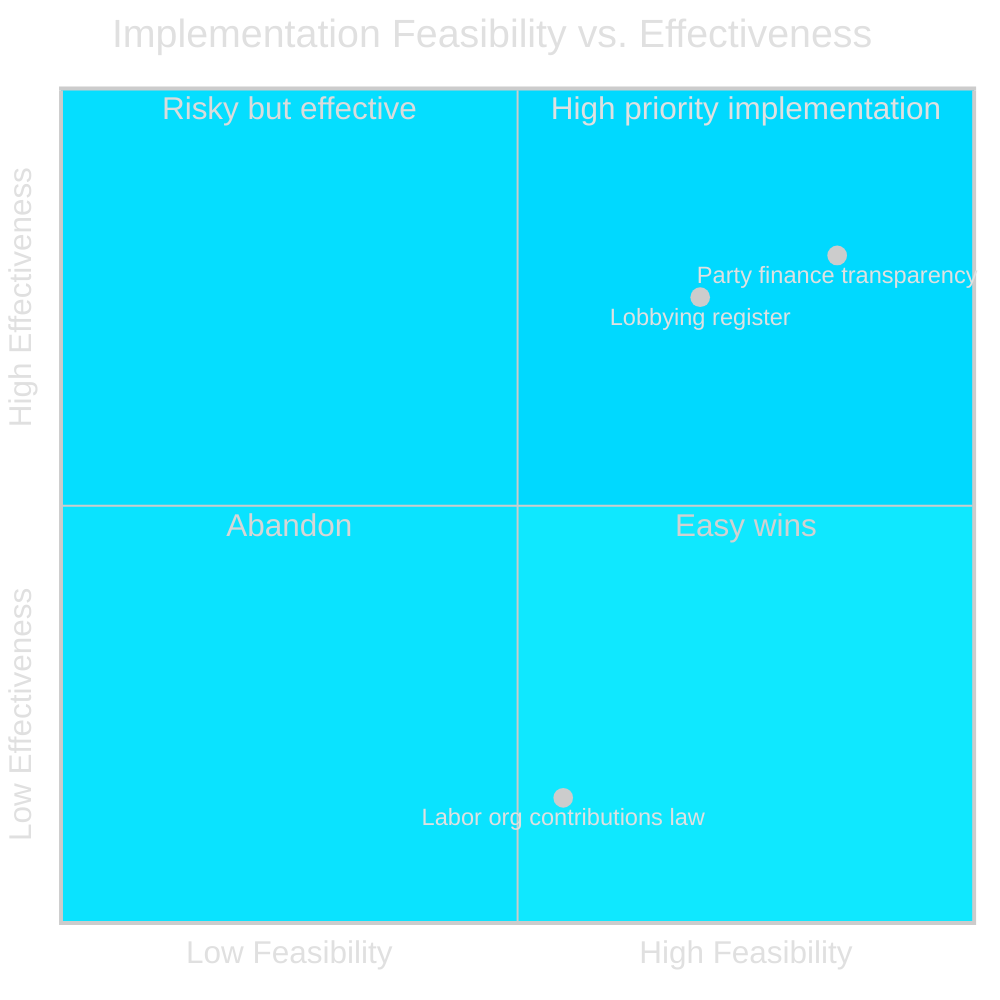

  

# ⚙️ Implementation Feasibility — Opposition Motions · 2026-05-20

**📋 Classification:** Public | **📅 Analysis date:** 2026-05-20

---

## Component-by-component feasibility assessment

### Component 1: Party finance transparency amendments (Lag 2018:90)

| Dimension | Assessment | Confidence |
|-----------|-----------|-----------|
| Technical feasibility | HIGH — builds on existing reporting framework | HIGH |
| Institutional capacity | HIGH — Kammarkollegiet already administers party finance reporting | HIGH |
| Legal basis | HIGH — incremental amendment of established law | HIGH |
| Political feasibility | VERY HIGH — accepted by both government and C | VERY HIGH |
| **Overall: Component 1** | **FEASIBLE** | HIGH |

### Component 2: Lobbying register (new Lag om insyn i kommunikation)

| Dimension | Assessment | Confidence |
|-----------|-----------|-----------|
| Technical feasibility | MEDIUM-HIGH — requires new registry system at Kammarkollegiet | HIGH |
| Institutional capacity | MEDIUM — Kammarkollegiet requires new mandate and resources | MEDIUM |
| Legal basis | HIGH — no constitutional obstacles identified | HIGH |
| Political feasibility | HIGH — broad support including C | HIGH |
| Compliance burden on lobbyists | MEDIUM — new registration and disclosure obligations | MEDIUM |
| **Overall: Component 2** | **FEASIBLE with implementation costs** | MEDIUM-HIGH |

### Component 3: Labor org contributions law (C opposes)

| Dimension | Assessment | Confidence |
|-----------|-----------|-----------|
| Technical feasibility | LOW — no sanctions, easy to circumvent as C and Lagrådet note | HIGH |
| Institutional capacity | LOW — auditor role creates new data processing obligations without operational benefit | HIGH |
| Legal basis | MEDIUM-LOW — ECHR Art.11 risk unresolved; GDPR Art.9 implications unclear | HIGH |
| Political feasibility | MEDIUM — government bloc can pass it but at reputational cost | HIGH |
| Effectiveness in achieving stated purpose | VERY LOW — Lagrådet: "enkelt att kringgå" | HIGH |
| **Overall: Component 3** | **NOMINALLY FEASIBLE but likely ineffective** | HIGH |

---

## Implementation risk matrix

---

## Key implementation requirements

| Requirement | Timeline | Authority | Status |
|-------------|---------|---------|--------|
| Kammarkollegiet lobbying registry system | 12-18m post-enactment | Kammarkollegiet | Requires budget and IT investment |
| Auditor certification for labor org opt-outs | 6m post-enactment | SRF/FAR (auditor bodies) | Requires guidance development |
| IMY GDPR assessment for auditor personal data processing | Pre-enactment | IMY | Not confirmed as completed |
| ECHR compatibility assessment | Immediately | Government/Riksdag | Lagrådet raised concerns but no formal incompatibility finding |

---

## Evidence anchors

| Claim | Evidence | Retrieved | Confidence |
|-------|----------|-----------|------------|
| Component 3 easily circumvented | HD024184 + Lagrådet citation | 2026-05-20 | HIGH |
| Kammarkollegiet is designated authority | HD024184 text | 2026-05-20 | HIGH |
| GDPR Art.9 concern | HD024184 text on sensitive personal data | 2026-05-20 | HIGH |

