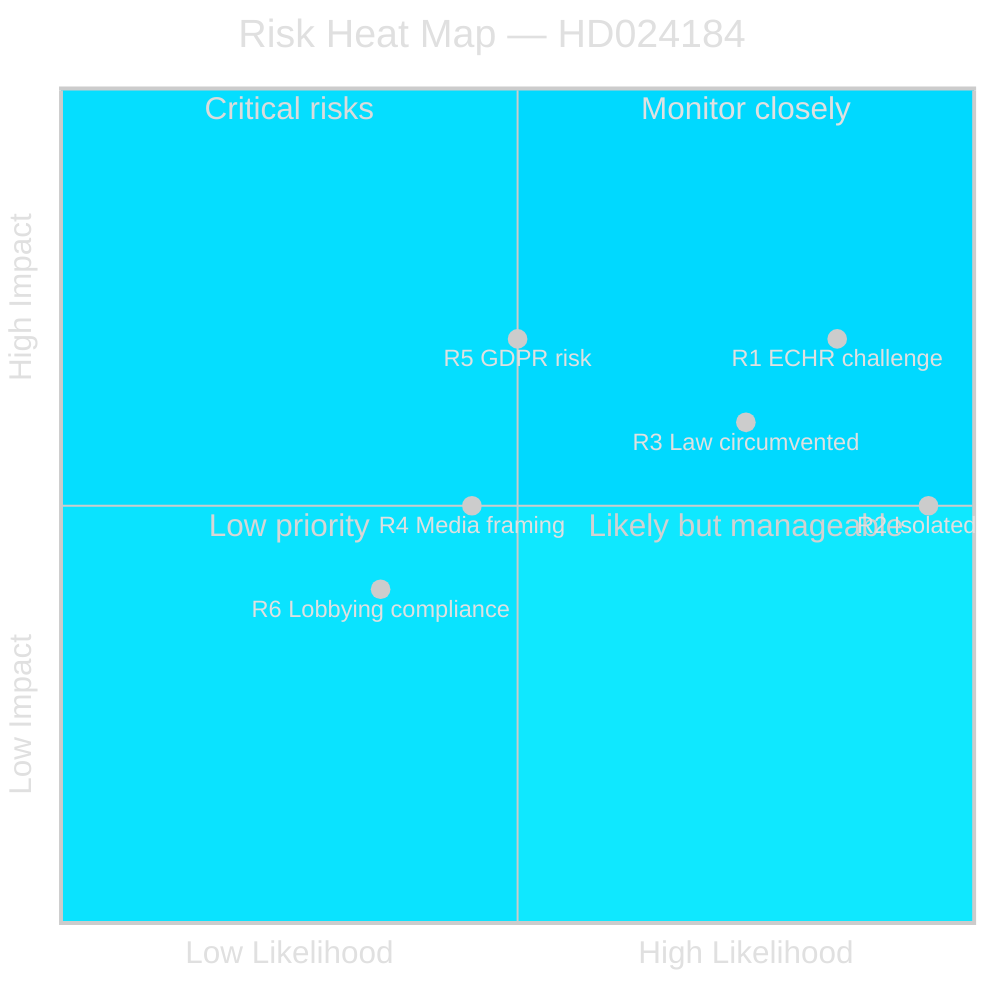

  

# ⚠️ Risk Assessment — Opposition Motions · 2026-05-20

**📋 Classification:** Public | **📅 Analysis date:** 2026-05-20

---

## Risk register

| Risk ID | Risk | Likelihood | Impact | Combined | Time horizon | Mitigation |
|---------|------|-----------|--------|----------|-------------|------------|
| R1 | Law passes with weak legislative basis, later faces ECHR challenge | HIGH (0.85) | HIGH (7) | 5.95 | T+6–18m (post-election) | Government should redraft with proper sanctions and consult more broadly |
| R2 | C's motion isolated — no other parties file motions challenging the labor org law in this cycle | VERY HIGH (0.95) | MEDIUM (5) | 4.75 | T+30d (KU vote) | C could seek informal alignment with S/V in committee stage |
| R3 | Law circumvented by LO from day 1 — renders legislation politically embarrassing | HIGH (0.75) | MEDIUM (6) | 4.50 | T+12m (post-enactment) | Requires amendment; damages government credibility |
| R4 | Media frames C as defending LO-S donations → C loses right-of-center voters | MEDIUM (0.45) | MEDIUM (5) | 2.25 | T+30d | C communication team must emphasize ECHR/föreningsfrihet angle |
| R5 | GDPR compliance issue if law requires auditors to process sensitive personal data on political opinions | MEDIUM (0.50) | HIGH (7) | 3.50 | T+0d (if enacted) | Data Protection Authority (IMY) review recommended |
| R6 | Lobbying register (accepted by C) creates new compliance burden on civil society organizations | LOW-MEDIUM (0.35) | MEDIUM (4) | 1.40 | T+12m | Kammarkollegiet guidance needed |

---

## Risk heat map

---

## Top risk: R1 — ECHR challenge post-enactment

The most consequential risk is that the law on labor organizations' contributions passes despite its identified weaknesses, and subsequently faces a challenge before the European Court of Human Rights under Art.11 (freedom of association). Lagrådet's "bräckligt" opinion strengthens such a challenge's admissibility prospects. A successful ECHR challenge 12–24 months post-enactment would:

1. Require legislative reversal — embarrassing for the government that pushed it through
2. Potentially trigger compensation claims from affected organizations
3. Validate C's constitutional argument, with electoral credit flowing to C in a future cycle

**Confidence that R1 is a genuine risk:** HIGH (Lagrådet's opinion provides authoritative legal basis)

---

## Evidence anchors

| Claim | Evidence | Retrieved | Confidence |
|-------|----------|-----------|------------|
| ECHR Art.11 risk | HD024184 explicit citation of Europakonventionen | 2026-05-20 | HIGH |
| GDPR risk identified | HD024184 text on sensitive personal data processing | 2026-05-20 | HIGH |
| Law easy to circumvent (R3) | HD024184 citing Lagrådet — no sanctions | 2026-05-20 | HIGH |
| Lagrådet "bräckligt" | HD024184 § "Om ärendets beredning" | 2026-05-20 | HIGH |

