  

# 🔭 Scenario Analysis — Opposition Motions · 2026-05-20

**📋 Classification:** Public | **📅 Analysis date:** 2026-05-20  
**Horizon bands:** T+30d (KU vote) · T+90d (election) · T+365d (post-election)

---

## Scenario tree

```mermaid
%%{init: {'theme': 'dark', 'themeVariables': {'primaryColor': '#00d9ff', 'primaryTextColor': '#e0e0e0', 'lineColor': '#ffbe0b', 'background': '#0a0e27', 'mainBkg': '#1a1e3d'}}}%%
graph TD
    ROOT[KU processes Prop. 2025/26:258]
    ROOT -->|P=0.85| S1[Government passes full Prop. incl. labor org law]
    ROOT -->|P=0.10| S2[L/KD shift — labor org section dropped or amended]
    ROOT -->|P=0.05| S3[Prop. delayed past election June-August 2026]
    S1 -->|P=0.60| S1A[Law enacted; LO finds structural workaround]
    S1 -->|P=0.25| S1B[Law enacted; ECHR challenge filed within 24m]
    S1 -->|P=0.15| S1C[Law enacted; IMY investigates auditor GDPR practice]
    S2 -->|P=0.70| S2A[Amended proposition passes — labor org section dropped]
    S2 -->|P=0.30| S2B[Amended proposition: sanctions added, making law effective]
    style ROOT fill:#1a1e3d,stroke:#00d9ff
    style S1 fill:#330011,stroke:#ff006e
    style S2 fill:#0a3322,stroke:#00d9ff
    style S3 fill:#2a2a00,stroke:#ffbe0b
    classDef leaf fill:#0a0e27,stroke:#00d9ff
```

---

## Scenario detail

### S1: Government passes full proposition (P=0.85)

**Trigger conditions:** Government bloc (M+KD+L) + SD vote together in KU and chamber; no significant L defection  
**Confidence:** HIGH  
**Evidence:** Seat arithmetic — government + SD holds ≥175/349 seats; Tidöavtalet covers this reform area

**Sub-scenarios:**
- **S1A (P=0.60):** LO finds structural workarounds — creates shell funding vehicles not covered by the law's scope. The law becomes symbolic, validating C's prediction. Politically embarrassing for government.
- **S1B (P=0.25):** One or more affected union members file ECHR Art.11 complaint. Challenge takes 3–7 years at Strasbourg. Post-election government faces international legal scrutiny.
- **S1C (P=0.15):** IMY (Integritetsskyddsmyndigheten) investigates auditor practices required by the law — finds GDPR Art.9 violation. Forces legislative amendment.

**Implications for C's electoral positioning:** In all S1 sub-scenarios, C can claim: (a) it warned the government, (b) the law has failed as predicted, (c) C defended civil liberties while M/SD imposed ideological legislation. This is a strong platform for the September 2026 election.

### S2: L or KD break ranks on labor org section (P=0.10)

**Trigger conditions:** L in particular has a strong civil liberties tradition (historically affiliated with the International Centre for Law and Democracy); if L MPs raise Lagrådet's "bräckligt" verdict publicly, coalition arithmetic changes  
**Confidence:** LOW-MEDIUM  
**Evidence:** L's ideological DNA; Lagrådet's unusually pointed criticism provides political cover

**Sub-scenarios:**
- **S2A:** Labor org section dropped from proposition — C vindicated, but lobbying register and party finance transparency still pass. Government loses face on this provision.
- **S2B:** Labor org section amended to include sanctions — law becomes more enforceable but still touches freedom of association concerns.

### S3: Proposition delayed past election (P=0.05)

**Trigger conditions:** Parliamentary calendar congestion; extreme L/KD resistance; snap dissolution (unlikely given 2026 election on schedule)  
**Confidence:** VERY LOW  
**Assessment:** Unlikely given government's strong legislative timeline intent.

---

## Forward watch triggers

| Trigger | Time horizon | Scenario implications |
|---------|-------------|----------------------|
| KU committee reports out Prop. 2025/26:258 | T+30d | Which sub-scenario materializes |
| L public statement on labor org section | T+14d | S2 probability rises if L dissents |
| LO legal advice memo on compliance strategy | T+60d | S1A probability |
| ECHR admissibility if challenge filed | T+24m | S1B |

---

## Evidence anchors

| Claim | Evidence | Retrieved | Confidence |
|-------|----------|-----------|------------|
| S1 probability 0.85 | Seat arithmetic 2022-26 | 2026-05-20 | HIGH |
| LO structural workaround risk | HD024184 text "enkelt att kringgå" | 2026-05-20 | HIGH |
| ECHR Art.11 challenge admissibility | HD024184 citing Europakonventionen | 2026-05-20 | HIGH |
| L civil liberties tradition | L party platform history | 2026-05-20 | MEDIUM |

