  

# 👥 Stakeholder Perspectives — Opposition Motions · 2026-05-20

**📋 Classification:** Public | **📅 Analysis date:** 2026-05-20

---

## Primary stakeholders

### 1. Centerpartiet (C) — Motion filer

**Position:** Partial acceptance of Prop. 2025/26:258; demand rejection of labor org contributions law  
**Key interests:** Civil liberties; constitutional integrity; electoral positioning for 2026 election  
**Named actors:**
- Malin Björk (C, intressent_id 0770363683317) — KU specialist
- Muharrem Demirok (C, intressent_id 0251136832626) — former party leader, signals C-wide consensus
- Kerstin Lundgren (C, intressent_id 0155487380917) — senior foreign/constitution MP
- Daniel Bäckström, Mikael Larsson, Anna Lasses, Ulrika Liljeberg, Helena Vilhelmsson (all C)

**Confidence:** VERY HIGH (all from HD024184 signatory list)

### 2. Government (M+KD+L) — Proposition sponsor

**Position:** Full support for Prop. 2025/26:258 including the labor org contributions law  
**Key interests:** Breaking LO-S institutional funding link; pro-transparency branding; Tidöavtalet implementation  
**Assessment:** Will seek KU committee majority to pass the proposition with only minor technical amendments. The government explicitly did not invite broad remiss comment on the labor org section — suggesting awareness that the provision would face pushback.

**Confidence:** HIGH

### 3. SD (Sverigedemokraterna) — Confidence and supply

**Position:** Expected to support government on this issue  
**Key interests:** Weakening trade union influence in Swedish politics aligns with SD's anti-establishment agenda  
**Assessment:** SD will vote with the government bloc, securing the parliamentary majority needed to pass the full proposition over C's objection.

**Confidence:** HIGH

### 4. S (Socialdemokraterna) — Principal institutional target

**Position:** Likely oppose the labor org contributions law (defends LO-S nexus)  
**Key interests:** Protecting party financing through labor movement channels  
**Assessment:** S will probably file its own committee reservations in KU, but since the motion cycle shows no S motion in this batch, it may rely on committee reservation rather than separate motion. S and C will not formally coordinate but will find themselves on the same side in the KU vote.

**Confidence:** MEDIUM-HIGH (inferred from political alignment)

### 5. LO (Landsorganisationen) — Direct institutional target

**Position:** Strongly opposed to the law — it targets their donation practices  
**Key interests:** Preserve ability to support S through political contributions  
**Assessment:** LO is the real-world target of the law. As C notes, the law can easily be circumvented — LO's legal teams will find structural workarounds. However, even a symbolic law creates reputational and compliance burdens.

**Confidence:** HIGH

### 6. Lagrådet — Constitutional referee

**Position:** Critical opinion (2026-03-24) — "bräckligt" evidential basis  
**Key interests:** Constitutional quality of legislation  
**Assessment:** Lagrådet's unusually pointed criticism — noting that the government did not specifically invite comment on this section and that SOU 2025:52 did not recommend it — provides C's motion with strong institutional backing.

**Confidence:** VERY HIGH (Lagrådet opinion cited in HD024184)

### 7. Kammarkollegiet — Administrative implementer

**Position:** Designated registration authority for the new lobbying register (accepted by C)  
**Key interests:** Operational feasibility of lobbying register  
**Assessment:** Kammarkollegiet will need to build new registry systems. No controversy flagged in the motion regarding this role.

**Confidence:** HIGH

---

## Stakeholder alignment map

```mermaid
%%{init: {'theme': 'dark', 'themeVariables': {'primaryColor': '#00d9ff', 'primaryTextColor': '#e0e0e0', 'lineColor': '#ffbe0b', 'background': '#0a0e27', 'mainBkg': '#1a1e3d'}}}%%
graph LR
    subgraph OPPOSE_LAB["Oppose labor org law"]
        C[Centerpartiet C]
        S[Socialdemokraterna S inferred]
        V[Vänsterpartiet V inferred]
        LO[LO - institutional target]
        LAG[Lagrådet - institutional critique]
    end
    subgraph SUPPORT_LAB["Support full Prop. 258"]
        M[Moderaterna M]
        KD[Kristdemokraterna KD]
        L[Liberalerna L]
        SD[Sverigedemokraterna SD]
    end
    style OPPOSE_LAB fill:#330011,stroke:#ff006e
    style SUPPORT_LAB fill:#0a3322,stroke:#00d9ff
    classDef c fill:#1a1e3d,stroke:#00d9ff
    classDef opp fill:#2a0022,stroke:#ff006e
```

---

## Evidence anchors

| Claim | Evidence | Retrieved | Confidence |
|-------|----------|-----------|------------|
| All 8 C signatories confirmed | HD024184 signatory list | 2026-05-20 | VERY HIGH |
| Lagrådet opinion 2026-03-24 | HD024184 § "Om ärendets beredning" | 2026-05-20 | VERY HIGH |
| Government did not invite broad remiss | HD024184 explicit statement | 2026-05-20 | HIGH |
| LO-S nexus is implicit target | Political context; law's stated purpose | 2026-05-20 | HIGH |

