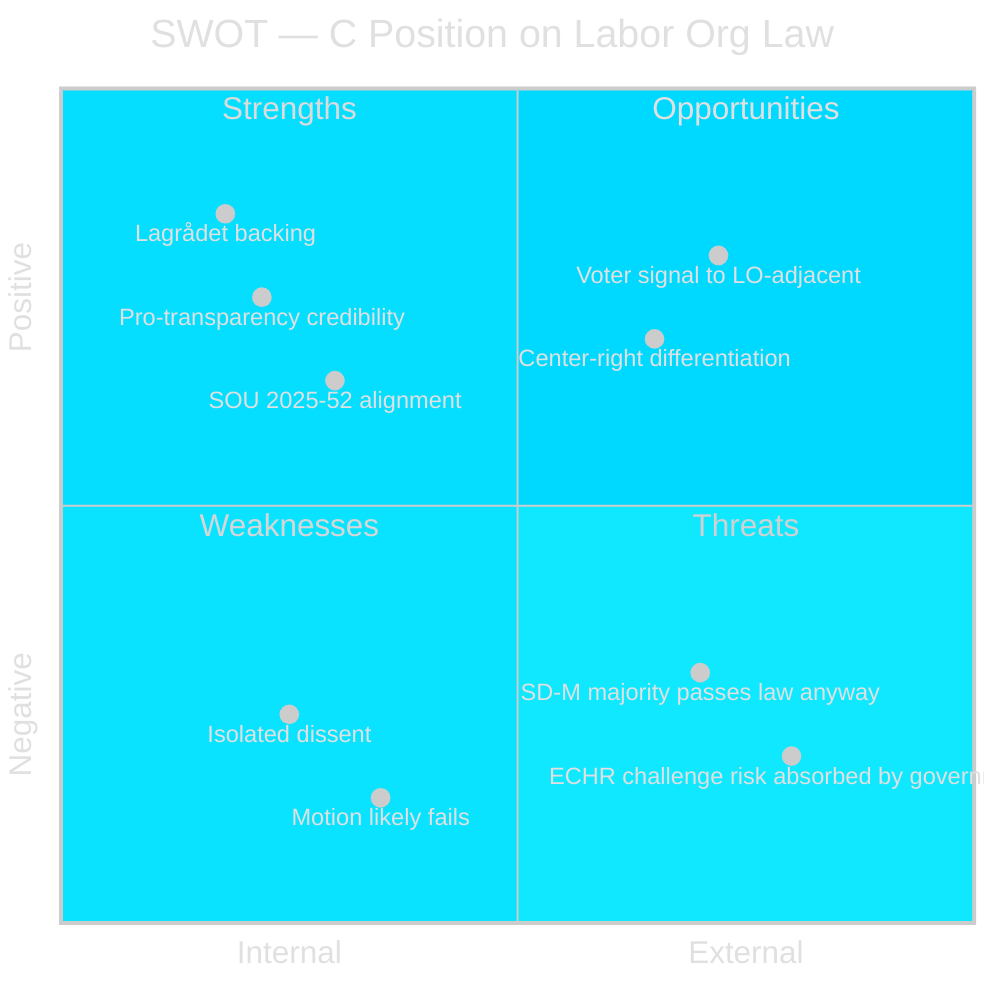

  

# ⚖️ SWOT Analysis — Opposition Motions · 2026-05-20

**📋 Classification:** Public | **📅 Analysis date:** 2026-05-20

---

## SWOT: Centerpartiet's position on Prop. 2025/26:258

---

## Strengths

| Strength | Evidence | Confidence |
|----------|----------|-----------|
| Institutional backing: Lagrådet (2026-03-24) independently called the proposal "bräckligt" — C can cite a non-partisan legal authority | HD024184 full text | HIGH |
| Principled consistency: C accepts the transparency components (party finance, lobbying), undermining government's framing that opponents of the labor org law oppose transparency | HD024184 §§ 1-2 | HIGH |
| Former C leader Muharrem Demirok co-signed — signals party-wide consensus, not a minority faction | HD024184 signatory list | HIGH |
| Legal precision: C cites ECHR Art.11, GDPR, and RF föreningsfrihet — demonstrates constitutional competence in KU domain | HD024184 full text | HIGH |

---

## Weaknesses

| Weakness | Evidence | Confidence |
|----------|----------|-----------|
| Motion is almost certain to fail: government bloc (M+KD+L) + SD holds 175+ seats, C + opposition cannot block | Swedish Riksdag seat distribution 2022-26 | HIGH |
| Single-party isolation: HD024184 is the only KU motion in this cycle — no S, V, or MP counter-filing that C could align with formally | riksdag-regering search results | HIGH |
| Perceived political alignment with S/LO interest by some voters even though C's argument is principled | Political framing risk | MEDIUM |

---

## Opportunities

| Opportunity | Evidence | Confidence |
|-------------|----------|-----------|
| Attract LO-adjacent centrist voters frustrated with right-wing attacks on union autonomy | Election 2026-09-13; C poll trajectory | MEDIUM |
| Force L/KD to publicly defend constitutionally questionable legislation — potential rupture within governing bloc | Lagrådet's "bräckligt" verdict creates ongoing pressure | MEDIUM |
| Position for post-election coalition negotiations: C demonstrates independence from SD-M agenda without breaking from right-of-center economics | Long-term coalition positioning | MEDIUM |
| If law passes and faces ECHR challenge post-election, C can claim vindication | ECHR Art.11 risk assessed | LOW-MEDIUM |

---

## Threats

| Threat | Evidence | Confidence |
|--------|----------|-----------|
| Government passes the law with SD majority — C loses the legislative battle regardless | Seat arithmetic | HIGH |
| Media framing as "C defends LO funding of S" oversimplifies the constitutional argument | Predictable government communications strategy | HIGH |
| L or KD quietly support C's position in committee but publicly back the government — C gets neither coalition credit nor opposition solidarity | Possible | MEDIUM |

---

## Evidence anchors

| Claim | Evidence | Retrieved | Confidence |
|-------|----------|-----------|------------|
| Lagrådet called proposal "bräckligt" | HD024184 citing Lagrådet 2026-03-24 | 2026-05-20 | HIGH |
| Government bloc + SD majority | 2022 Riksdag election results; Tidöavtalet | 2026-05-20 | VERY HIGH |
| Demirok co-signed | HD024184 signatory list | 2026-05-20 | VERY HIGH |

