  

# 🔍 Synthesis Summary — Opposition Motions · 2026-05-20

**📋 Classification:** Public | **📅 Analysis date:** 2026-05-20 | **Cycle:** motions

---

## Overview

The sole motion in this cycle (HD024184) is a Centerpartiet kommittémotion by 8 party MPs, responding to Prop. 2025/26:258 "Ökad insyn i politiska processer." The motion presents a **selective acceptance** strategy: C endorses two of the three legislative components in the proposition while demanding rejection of the third.

---

## Accepted components

| Component | C Position | Evidence |
|-----------|-----------|----------|
| Amendments to Lag (2018:90) om insyn i finansiering av partier — banning anonymous/foreign donations, expanding reporting, tightening compliance oversight | **SUPPORT** | HD024184 § "Motivering" para 1 |
| New Lag om insyn i kommunikation med syfte att påverka politiska beslut (lobbying register at Kammarkollegiet) | **SUPPORT** | HD024184 § "Motivering" para 2 |

## Rejected component

| Component | C Position | Key Objections | Evidence |
|-----------|-----------|----------------|----------|
| New Lag med bestämmelser om arbetsmarknadsorganisationers bidrag för partipolitiska ändamål | **REJECT** | No sanctions; easy circumvention; freedom of association violation; ECHR incompatibility; GDPR risks; poor legislative process | HD024184 full text |

---

## Analytical synthesis

```mermaid
%%{init: {'theme': 'dark', 'themeVariables': {'primaryColor': '#00d9ff', 'primaryTextColor': '#e0e0e0', 'primaryBorderColor': '#ff006e', 'lineColor': '#ffbe0b', 'secondaryColor': '#1a1e3d', 'tertiaryColor': '#0a0e27', 'background': '#0a0e27', 'mainBkg': '#1a1e3d', 'nodeBorder': '#00d9ff'}}}%%
graph TD
    A[Prop. 2025/26:258] --> B[Party finance transparency]
    A --> C[Lobbying register]
    A --> D[Labor org contributions law]
    B -->|C SUPPORTS| E[✅ Accepted]
    C -->|C SUPPORTS| F[✅ Accepted]
    D -->|C REJECTS| G[❌ Rejected]
    G --> H1[No sanctions]
    G --> H2[Freedom of association]
    G --> H3[Lagrådet criticism]
    G --> H4[ECHR risk]
    style A fill:#1a1e3d,stroke:#00d9ff
    style D fill:#ff006e,stroke:#ff006e,color:#fff
    style G fill:#ff006e,stroke:#ff006e,color:#fff
    style E fill:#0a0e27,stroke:#00d9ff
    style F fill:#0a0e27,stroke:#00d9ff
    classDef accepted fill:#0a3322,stroke:#00d9ff
    classDef rejected fill:#330011,stroke:#ff006e
    classDef neutral fill:#1a1e3d,stroke:#00d9ff
```

### The labor organizations law — why it is contested

The proposed law on labor organizations' contributions to parties is constitutionally and politically the most charged component of Prop. 2025/26:258. Its ostensible purpose — allowing union members to opt out of political contributions — serves a secondary agenda: disrupting the institutional funding link between LO (Landsorganisationen) and the Social Democrats (S).

**Five structural weaknesses identified by C:**

1. **No sanctions:** The law contains no enforcement mechanism. An organization can simply note the opt-out count (reported anonymously by an auditor) and proceed with contributions regardless.
2. **Opt-out mechanism bypasses the organization:** Member declarations go to an external auditor, not the organization itself — rendering the opt-out cosmetic rather than effective.
3. **Overreach:** The law applies even to organizations that don't tie contributions directly to member dues, creating unnecessary GDPR-sensitive personal data processing.
4. **Freedom of association:** The law interferes with the internal governance of voluntary associations (föreningsfrihet), a fundamental right under the Swedish Instrument of Government (RF 2:1) and ECHR Art. 11.
5. **Poor legislative process:** Lagrådet (2026-03-24) found the proposal "bräckligt," noting that few remiss bodies were consulted (the government did not specifically invite comment on this section) and that the SOU 2025:52 parliamentary committee itself did not recommend enacting this law.

### Political significance

Centerpartiet's stance exposes an ideological fault line within the Swedish center-right. While M and SD strongly favor weakening the LO-S nexus, C is unwilling to use constitutionally suspect legislation to achieve that goal. This creates an interesting electoral dynamic 116 days before the September 2026 election: C is claiming the "principled center" ground on both democracy (accepting transparency reforms) and civil liberties (rejecting what it considers an overreach).

---

## Key actors

| Actor | Role | Confidence |
|-------|------|-----------|
| Malin Björk (C, intressent_id 0770363683317) | Lead author, KU member | VERY HIGH |
| Muharrem Demirok (C, intressent_id 0251136832626) | Co-author, former party leader — signals party-wide consensus | HIGH |
| Kerstin Lundgren (C, intressent_id 0155487380917) | Senior C foreign/constitution expert, co-author | HIGH |
| Lagrådet | Advisory Council on Legislation — issued critical opinion 2026-03-24 | VERY HIGH |
| Kammarkollegiet | Designated registration authority for lobbying (per both C-accepted parts) | HIGH |

---

## Evidence anchors

| Claim | Evidence | Retrieved | Confidence |
|-------|----------|-----------|------------|
| C accepts party finance transparency amendments | HD024184 § "Motivering" para 1 | 2026-05-20 | VERY HIGH |
| C accepts lobbying register | HD024184 § "Motivering" para 2 | 2026-05-20 | VERY HIGH |
| C rejects labor org contributions law | HD024184 § "Förslag till riksdagsbeslut" | 2026-05-20 | VERY HIGH |
| Law has no sanctions — easy to circumvent | HD024184 citing Lagrådet "enkelt att kringgå" | 2026-05-20 | HIGH |
| Freedom of association violation — ECHR risk | HD024184 citing Europakonventionen | 2026-05-20 | HIGH |
| Muharrem Demirok co-signed (former C leader) | HD024184 signatory list; intressent_id 0251136832626 | 2026-05-20 | VERY HIGH |

