  

# 🛡️ Threat Analysis — Opposition Motions · 2026-05-20

**📋 Classification:** Public | **📅 Analysis date:** 2026-05-20

---

## STRIDE-mapped threat analysis (political-STRIDE)

| Threat type | Political equivalent | Instance | Severity | Evidence |
|-------------|---------------------|----------|----------|----------|
| Spoofing | Misrepresenting legislative intent | Government frames the labor org law as "transparency" when SOU 2025:52 found no need for it | HIGH | HD024184 citing SOU 2025:52 |
| Tampering | Altering democratic process integrity | Government overrides its own parliamentary committee recommendation to pursue policy goal | HIGH | HD024184 citing SOU 2025:52 |
| Repudiation | Deniability of constitutional risk | Government bypassed standard remiss process, limiting formal legal objection footprint | MEDIUM | HD024184 § "Om ärendets beredning" |
| Information disclosure | Sensitive data exposure | Auditors required to process members' political opinions (GDPR Art.9 sensitive data) | MEDIUM-HIGH | HD024184 text |
| Denial of service | Blocking democratic participation | Members' formal opt-outs routed to auditors (not organizations) — makes participation functionally meaningless | MEDIUM | HD024184 analysis |
| Elevation of privilege | Disproportionate state power | Law regulates internal affairs of voluntary associations far beyond its stated purpose | HIGH | HD024184 citing ECHR |

---

## Political threat assessment

```mermaid
%%{init: {'theme': 'dark', 'themeVariables': {'primaryColor': '#00d9ff', 'primaryTextColor': '#e0e0e0', 'lineColor': '#ffbe0b', 'background': '#0a0e27', 'mainBkg': '#1a1e3d'}}}%%
graph TD
    A[Prop. 2025/26:258 labor org law] --> B{Threat vectors}
    B --> T1[Föreningsfrihet violation]
    B --> T2[ECHR Art.11 challenge]
    B --> T3[GDPR Art.9 breach]
    B --> T4[Circumvention by organizations]
    B --> T5[Legitimacy of opt-out mechanism]
    T1 -->|Severity: HIGH| R1[Legislative reversal required]
    T2 -->|Severity: HIGH| R2[International legal challenge]
    T3 -->|Severity: MEDIUM| R3[IMY enforcement risk]
    T4 -->|Severity: MEDIUM| R4[Law rendered symbolic]
    T5 -->|Severity: MEDIUM| R5[Democratic credibility loss]
    style A fill:#1a1e3d,stroke:#00d9ff
    style B fill:#330011,stroke:#ff006e
    classDef threat fill:#330011,stroke:#ff006e
    classDef risk fill:#1a1e3d,stroke:#ffbe0b
```

---

## Threat actors

| Actor | Threat | Mechanism | Confidence |
|-------|--------|-----------|------------|
| Lagrådet | Institutional legitimacy threat to the labor org law | Published "bräckligt" opinion 2026-03-24 — available for legal challengers to cite | VERY HIGH |
| LO (Landsorganisationen) | Legislative target and likely circumventer | Will find legal structures to maintain S funding flow | HIGH |
| ECHR applicants | Post-enactment challenge | Any affected union member could file a complaint to European Court of Human Rights | MEDIUM-HIGH |
| IMY (Integritetsskyddsmyndigheten) | GDPR enforcement | May issue guidance or enforcement decision on auditors processing political opinion data | MEDIUM |

---

## Evidence anchors

| Claim | Evidence | Retrieved | Confidence |
|-------|----------|-----------|------------|
| Lagrådet opinion 2026-03-24 | HD024184 explicit citation | 2026-05-20 | VERY HIGH |
| ECHR Art.11 risk | HD024184 text on Europakonventionen | 2026-05-20 | HIGH |
| GDPR Art.9 sensitivity | HD024184 text on känsliga personuppgifter | 2026-05-20 | HIGH |
| Government overrode SOU 2025:52 | HD024184 § "Om ärendets beredning" | 2026-05-20 | HIGH |

