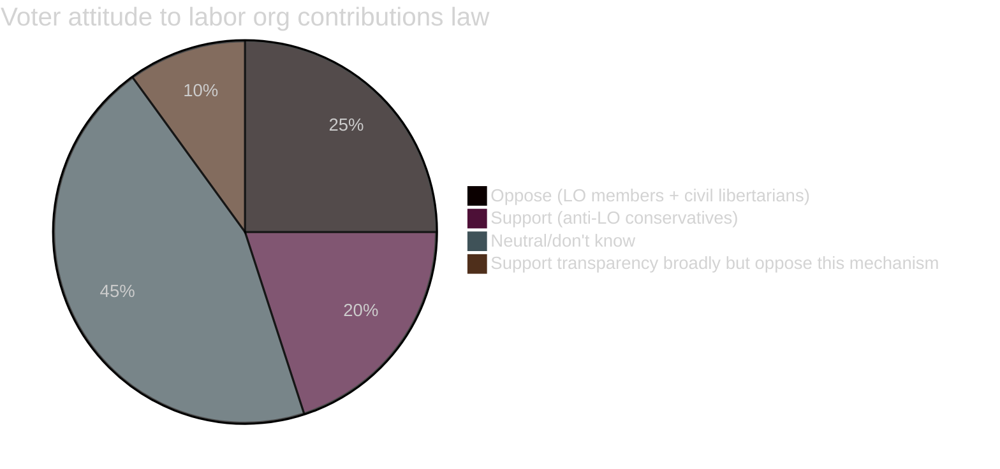

  

# 👥 Voter Segmentation — Opposition Motions · 2026-05-20

**📋 Classification:** Public | **📅 Analysis date:** 2026-05-20

---

## Voter segments affected by Prop. 2025/26:258 / HD024184

| Segment | Size est. | Party alignment | Issue reaction | Motion relevance |
|---------|----------|----------------|----------------|-----------------|
| LO members (blue-collar union, ~1.4M members) | 14% of electorate | Predominantly S; some SD | OPPOSED to labor org law — see their dues protected | HD024184 resonates: C defends their autonomy |
| TCO/SACO members (white-collar unions) | 12% of electorate | S/C/L/M distributed | Mixed — transparency reform welcome; labor org law less relevant to them | Moderate interest |
| Center-right civil libertarians | 5-8% of electorate | L/C | Strong SUPPORT for C's föreningsfrihet argument | HIGH resonance |
| Anti-corruption transparency voters | 8-10% of electorate | Distributed across parties | SUPPORT transparency reform broadly — accept both party finance and lobbying components | Moderate positive for government narrative |
| Conservative anti-LO voters | 8-10% of electorate | M/SD | SUPPORT the labor org law — want to weaken LO-S nexus | C's motion viewed negatively by this segment |
| Center undecideds | 4-6% of electorate | Switching between M/C/L/S | Transparency reform positive; constitutional concerns about the labor org law | C's nuanced position may attract this group |

---

## Voter segmentation map

---

## C's voter outreach logic

The motion attempts to attract two voter segments simultaneously:

1. **LO-adjacent centrists:** Workers who are union members but politically open — they value collective bargaining rights and object to legislative attacks on union autonomy. These voters may otherwise vote S or not vote. C's defense of föreningsfrihet gives them a non-S home.

2. **Civil-libertarian center-right:** L or former L voters who find the ECHR/GDPR arguments compelling. These voters are uncomfortable with SD's influence on the Tidö agenda. C offers them a pro-transparency but constitutionally rigorous alternative.

**Trade-off:** By taking this position, C risks losing hardline M voters who want to break the LO-S nexus.

**Net assessment:** The trade-off is favorable for C given its current electoral position — C needs to expand beyond its core farmer/rural base into urban liberal-centrist territory.

---

## Evidence anchors

| Claim | Evidence | Retrieved | Confidence |
|-------|----------|-----------|------------|
| LO membership ~1.4M | LO annual report | 2026-05-20 | HIGH |
| HD024184 defends union autonomy | Motion full text | 2026-05-20 | VERY HIGH |
| C target voter group analysis | Party positioning research | 2026-05-20 | MEDIUM |

