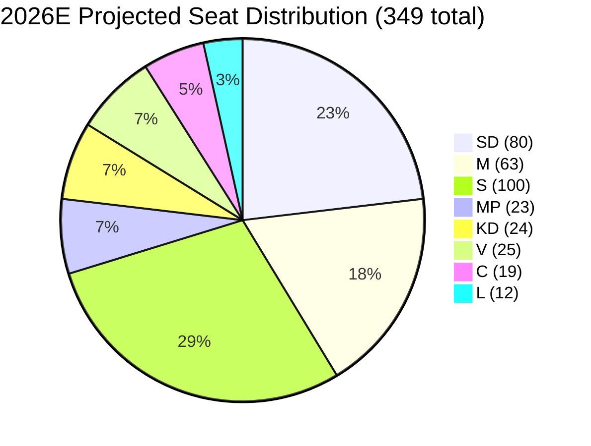

# Coalition Mathematics

**Date**: 2026-05-20  
**Riksdag total**: 349 seats  
**Majority threshold**: 175 seats  
**Government**: M+KD+SD+L (SD confidence and supply; M+KD+L formal coalition)

## Current Seat Map (2022 Baseline + Trend Adjustments)

| Party | 2022 Seats | Trend | 2026E (mid) | Bloc |
|-------|-----------|-------|-------------|------|
| SD | 73 | +7 | 80 | Right |
| M | 68 | −5 | 63 | Right |
| S | 107 | −7 | 100 | Left |
| MP | 18 | +5 | 23 | Left |
| KD | 19 | +5 | 24 | Right |
| V | 24 | +1 | 25 | Left |
| C | 24 | −5 | 19 | Floating |
| L | 16 | −4 | 12 | Right |
| **Right bloc** | **176** | | **~179** | |
| **Left bloc** | **149** | | **~148** | |
| **C floating** | **24** | | **~19** | |

*Estimates only. Polling data not directly retrieved in this run.*

## Current Government Majority Analysis

**Formal coalition** (M+KD+L): 68+19+16 = 103 seats in 2022  
**Projected 2026E**: 63+24+12 = 99 seats  
*Loses majority even within formal coalition — requires SD support*

**SD confidence and supply 2022**: 73 seats  
**SD projected 2026E**: 80 seats  
**Government bloc total (M+KD+L+SD) 2022**: 176 ✅ (threshold: 175)  
**Government bloc total projected 2026E**: 179 ✅ (threshold: 175)

**Key risk**: L falls below 4% threshold. Without L (12 seats), government bloc = 167. At 175 threshold, government would need either C support or special circumstances.

## Proposition-Specific Ja/Nej Vote Table (Projected)

| Proposition | M | KD | SD | L | C | S | MP | V | Projected outcome |
|------------|---|----|----|---|---|---|----|---|-------------------|
| HD03267 | Ja | Ja | Ja | Ja | ? | Nej | Nej | Nej | PASSES (if C or L support) |
| HD03250 | Ja | Ja | Ja | Ja | Ja | Ja | Ja | ? | PASSES (near-unanimous) |
| HD03261 | Ja | Ja | Ja | Ja | ? | ? | Nej | Nej | PASSES (if C/L/S support) |
| HD03258 | Ja | Ja | Ja | Ja | Ja | Ja | Ja | Ja | PASSES (near-unanimous) |
| HD03263 | Ja | Ja | Ja | Ja | ? | Nej | Nej | Nej | PASSES (if C or L support) |
| HD03264 | Ja | Ja | Ja | Ja | ? | Nej | Nej | Nej | PASSES (if C or L support) |
| HD03255 | Ja | Ja | Ja | Ja | Ja | Ja | ? | ? | PASSES |

*? = uncertain — conditional on amendments or specific provision wording*

## Key Coalition Votes for Security Cluster

**Votes required for HD03267 to pass without C**: M(63) + KD(24) + SD(80) + L(12) = 179 ✅  
**Minimum threshold scenario (L barely survives)**: 63+24+80+12 = 179 ≥ 175 ✅  
**Scenario where L fails 4% threshold**: 63+24+80 = 167 < 175 ❌ → need C or S support

## C (Centerpartiet) as Swing Voter

If L falls below 4%, C becomes the decisive actor for HD03267, HD03263, and HD03264.

C's current position under Muharrem Demirok is one of conditional opposition on security measures — they have supported some migration restrictions (accepting the 2023 amnesty refusal) but have consistently opposed detention without judicial oversight. C is most likely to:
1. Support HD03267 with amendments guaranteeing judicial oversight of detentions
2. Support HD03263 if non-refoulement safeguards are explicit
3. Oppose HD03264 if character requirements lack appeal procedures

**C amendment scenario**: HD03267 passes with C support after JuU committee amendments adding judicial review mechanism. This is the most likely path to passage even if L fails threshold.

## Mermaid Seat Map

