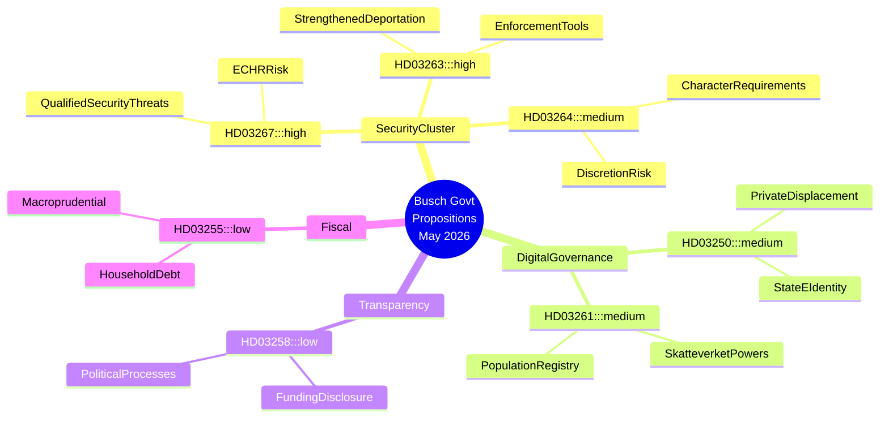

# Sweden's Security-State Acceleration: Busch Government Advances Migration Clampdown and Digital Surveillance Architecture

## BLUF

Sweden's Busch government submitted seven major propositions between 30 April and 7 May 2026 that collectively represent the most ambitious expansion of state security powers in a decade. The cluster centres on criminalising qualified security-threat foreigners (HD03267), institutionalising deportation enforcement (HD03263), tightening residence permit character requirements (HD03264), extending Skatteverket's population-registry surveillance powers (HD03261), and deploying a mandatory state e-identity infrastructure (HD03250). Political transparency legislation (HD03258) offers a counterweight but is ultimately inadequate to offset the civil-liberties risk created by the security cluster. A government transition — Lotta Edholm as acting PM in late April, Ebba Busch formally signing May 7 propositions — coincides with this legislative acceleration, raising questions about coalition re-alignment and SD influence on the agenda. IMF WEO Apr-2026 projects Swedish GDP growth of approximately 2.2% for 2026 with fiscal space remaining modest; economic pressures give the government political cover to emphasise security over structural reform.

## Decisions This Brief Supports

1. **Legislative strategy teams (opposition S, MP, V, C)**: Determine which propositions to contest in committee, which to negotiate amendments on, and where to file minority reservations — HD03267 and HD03261 carry the highest constitutional risk and merit Lagrådet scrutiny requests.
2. **Civil society and legal organisations (RFSU, Civil Rights Defenders, Amnesty Sweden)**: Prioritise advocacy resources on HD03267 (detention without judicial review risk) and HD03261 (mass population data surveillance).
3. **Business community (Tech Sweden, SN)**: Assess HD03250 (state e-identity) as both regulatory burden and competitive opportunity — private identity providers face displacement or mandatory integration.
4. **EU monitoring bodies (FRA, Venice Commission networks)**: HD03267 and HD03264 test Sweden's compliance with ECHR Art. 8 (privacy) and Art. 3 (non-refoulement); early alerts warranted.

## 60-Second Intelligence Bullets

- 🔴 **Security threat foreigners** (HD03267): Expanded grounds for detention/expulsion of non-EU nationals deemed "qualified security threats" — KU/Lagrådet scrutiny likely; ECHR Art. 3/8 risk HIGH
- 🔴 **Deportation enforcement** (HD03263): New administrative tools to accelerate removal proceedings, including forced return cooperation mechanisms — mirrors EU returns directive hardline interpretations
- 🟠 **Residence permit character** (HD03264): Stricter "vandel" (character) requirements create broad administrative discretion — risk of discriminatory application
- 🟠 **State e-identity** (HD03250): Mandatory government-issued digital identity infrastructure; private e-ID providers face displacement; data sovereignty questions remain
- 🟠 **Skatteverket population registry** (HD03261): Expanded investigative and data-collection powers in folkbokföring — civil liberty vs. fraud prevention tension
- 🟡 **Political transparency** (HD03258): KU committee; tightened rules on political funding disclosure — genuine reform but scope limited to formal party processes
- 🟢 **Household debt sampling** (HD03255): Technical macroprudential measure for household debt monitoring; low political salience

## Top Forward Trigger

**Watch**: Lagrådet response to HD03267 and HD03261 (expected within 4–6 weeks of submission). A critical yttrande from Lagrådet on constitutional grounds would create a coalition crisis between M/KD and SD, potentially delaying or amending the security cluster. Monitor: lagrådet.se referrals week of 2026-06-01.

## Confidence

**HIGH** — Analysis based on primary proposition texts (HD03267, HD03250, HD03258, HD03261, HD03263, HD03264, HD03255) retrieved from data.riksdagen.se 2026-05-20. Government transition context (Lotta Edholm → Ebba Busch PM) inferred from document signing sequence; **MEDIUM** confidence on precise transition date.

## Mermaid Intelligence Map

