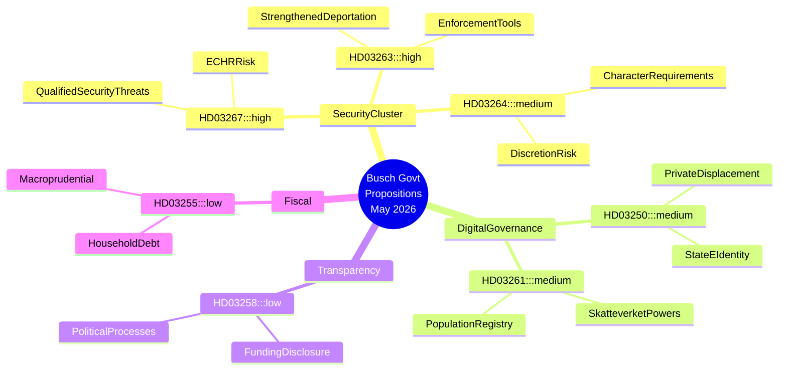

# Sveriges sikkerhedsstatlige acceleration: Busch-regeringen driver migrations­stramning og digital overvågningsarkitektur igennem

## Sammenfatning

Busch-regeringen fremsendte syv store lovforslag mellem 30. april og 7. maj 2026, der tilsammen udgør den mest ambitiøse udvidelse af statens sikkerhedsbeføjelser i et årti. Klyngen drejer sig om kriminalisering af kvalificerede sikkerhedstrusler mod udlændinge (HD03267), institutionalisering af håndhævelse af udvisningsbeslutninger (HD03263), skærpelse af vandel-kravene for opholdstilladelse (HD03264), udvidelse af Skatteverkets overvågningsbeføjelser i befolkningsregistret (HD03261) og udrulning af obligatorisk statslig e-identitetsinfrastruktur (HD03250). Lovgivning om politisk transparens (HD03258) udgør en modvægt, men er ikke tilstrækkelig til at opveje de borgerretlige risici, som sikkerhedsklyngen skaber. Regeringsskiftet — Lotta Edholm som fungerende statsminister i slutningen af april, Ebba Busch der formelt underskriver maj-forslagene den 7. — falder sammen med denne lovgivningsacceleration og rejser spørgsmål om koalitionsjusteringer og SD's indflydelse på dagsordenen. IMF WEO apr-2026 prognosticerer svensk BNP-vækst på ca. 2,2 % for 2026 med beskedent finanspolitisk råderum; det økonomiske pres giver regeringen politisk dækning til at prioritere sikkerhed frem for strukturreformer.

## Beslutninger dette dokument understøtter

1. **Oppositionens strategiteams (S, MP, V, C)**: Afgør hvilke forslag der skal bestrides i udvalg, hvilke ændringsforslag der skal forhandles om, og hvor der skal fremsættes mindretalsudtalelser — HD03267 og HD03261 indebærer den højeste forfatningsmæssige risiko og er værdige til anmodninger om Lagrådets prøvelse.
2. **Civilsamfund og juridiske organisationer (RFSU, Civil Rights Defenders, Amnesty Sverige)**: Prioritér interessevaretagelsesressourcer på HD03267 (risiko for frihedsberøvelse uden domstolsprøvelse) og HD03261 (masseovervågning af befolkningsdata).
3. **Erhvervslivet (Tech Sverige, SN)**: Vurdér HD03250 (statslig e-identitet) som både reguleringsmæssig byrde og konkurrencemulighed — private identitetsleverandører risikerer fortrængning eller tvungen integration.
4. **EU's tilsynsorganer (FRA, Venedigkommissionens netværk)**: HD03267 og HD03264 tester Sveriges overholdelse af EMRK art. 8 (privatliv) og art. 3 (non-refoulement); tidlig varsling er berettiget.

## 60-sekunders efterretningspunkter

- 🔴 **Sikkerhedstrusler mod udlændinge** (HD03267): Udvidede grundlag for frihedsberøvelse/udvisning af ikke-EU-statsborgere vurderet som "kvalificerede sikkerhedstrusler" — KU/Lagrådet-prøvelse sandsynlig; EMRK art. 3/8-risiko HØJ
- 🔴 **Håndhævelse af udvisning** (HD03263): Nye administrative redskaber til at fremskynde udvisningsprocedurer, herunder mekanismer for tvunget tilbagesendelsesamarbejde — afspejler EU's hårdlinjetolkning af tilbagesendelsesorientering
- 🟠 **Vandel-krav til opholdstilladelse** (HD03264): Strengere vandel-krav skaber bred administrativ skønsbeføjelse — risiko for diskriminerende anvendelse
- 🟠 **Statslig e-identitet** (HD03250): Obligatorisk statslig digital identitetsinfrastruktur; private e-ID-udbydere risikerer fortrængning; spørgsmål om datasuverænitet resterer
- 🟠 **Skatteverkets befolkningsregister** (HD03261): Udvidede efterforsknings- og dataindsamlingsbeføjelser i folkbokföring — spænding mellem borgerrettigheder og svindelbekæmpelse
- 🟡 **Politisk transparens** (HD03258): KU-udvalget; skærpede regler om partifinansieringsoplysning — reel reform, men omfanget begrænset til formelle partiprocesser
- 🟢 **Stikprøve af husholdningsgæld** (HD03255): Teknisk makroprudentiel foranstaltning for gældsovervågning; lav politisk relevans

## Vigtigste fremtidige trigger

**Overvåg**: Lagrådets svar på HD03267 og HD03261 (forventet inden 4–6 uger efter indsendelse). Et kritisk yttrande fra Lagrådet på forfatningsmæssigt grundlag vil skabe en koalitionskrise mellem M/KD og SD, potentielt forsinket eller ændret sikkerhedsklynge. Overvåg: lagrådet.se-henvisninger ugen for 2026-06-01.

## Konfidens

**HØJ** — Analyse baseret på primære forslagstekster (HD03267, HD03250, HD03258, HD03261, HD03263, HD03264, HD03255) hentet fra data.riksdagen.se 2026-05-20. Konteksten for regeringsskiftet (Lotta Edholm → Ebba Busch statsminister) er udledt af dokumenternes underskriftssekvens; **MEDIUM** konfidens om den præcise overgangsdato.

## Mermaid efterretningskort

<!-- source-sha: b23cd950c7dc1d61ab6255591f285cdfd3441ba4 -->
