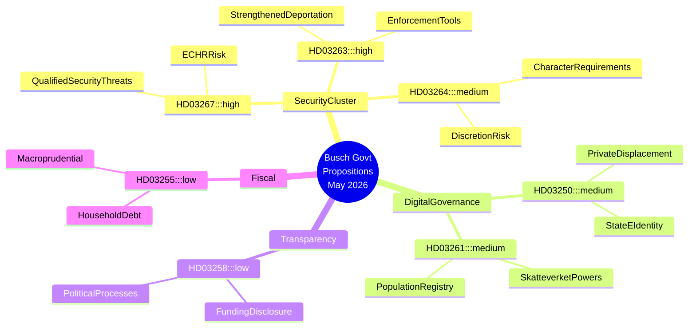

# Schwedens sicherheitsstaatliche Beschleunigung: Die Busch-Regierung treibt Migrationsverschärfung und digitale Überwachungsarchitektur voran

## Zusammenfassung

Schwedens Busch-Regierung legte zwischen dem 30. April und dem 7. Mai 2026 sieben große Regierungspropositionen vor, die zusammen die ambitionierteste Ausweitung staatlicher Sicherheitsbefugnisse seit einem Jahrzehnt darstellen. Das Cluster konzentriert sich auf die Kriminalisierung qualifizierter Sicherheitsbedrohungen durch Ausländer (HD03267), die Institutionalisierung der Vollstreckung von Abschiebungsentscheidungen (HD03263), die Verschärfung der Leumund-Anforderungen für Aufenthaltsgenehmigungen (HD03264), die Erweiterung der Überwachungsbefugnisse des Skatteverket im Bevölkerungsregister (HD03261) sowie den Aufbau einer obligatorischen staatlichen E-Identitätsinfrastruktur (HD03250). Die Gesetzgebung zur politischen Transparenz (HD03258) bietet ein Gegengewicht, reicht aber letztlich nicht aus, um die bürgerrechtlichen Risiken des Sicherheitsclusters aufzuwiegen. Der Regierungswechsel — Lotta Edholm als geschäftsführende Premierministerin Ende April, Ebba Busch unterzeichnet die Mai-Propositionen formal am 7. — fällt mit dieser Gesetzgebungsbeschleunigung zusammen und wirft Fragen zur Koalitionsneuausrichtung und zum SD-Einfluss auf die Agenda auf. Der IWF-Weltwirtschaftsausblick vom April 2026 prognostiziert ein schwedisches BIP-Wachstum von ca. 2,2 % für 2026 bei bescheidenem fiskalischen Spielraum; der wirtschaftliche Druck gibt der Regierung politischen Rückenwind, Sicherheit vor Strukturreformen zu priorisieren.

## Entscheidungen, die dieses Dokument unterstützt

1. **Strategieteams der Opposition (S, MP, V, C)**: Bestimmen Sie, welche Propositionen im Ausschuss angefochten werden, über welche Änderungsanträge verhandelt wird und wo Minderheitenvorbehalte einzulegen sind — HD03267 und HD03261 tragen das höchste verfassungsrechtliche Risiko und verdienen Anträge auf Lagrådet-Prüfung.
2. **Zivilgesellschaft und Rechtsorganisationen (RFSU, Civil Rights Defenders, Amnesty Schweden)**: Priorisieren Sie Lobbyressourcen auf HD03267 (Risiko der Inhaftierung ohne Gerichtskontrolle) und HD03261 (Massenüberwachung von Bevölkerungsdaten).
3. **Wirtschaft (Tech Sverige, SN)**: Bewerten Sie HD03250 (staatliche E-Identität) sowohl als Regulierungsbelastung als auch als Wettbewerbschance — private Identitätsanbieter drohen verdrängt oder zu Pflichtintegrationen gezwungen zu werden.
4. **EU-Überwachungsorgane (FRA, Netzwerke der Venedig-Kommission)**: HD03267 und HD03264 testen Schwedens Einhaltung von EMRK Art. 8 (Privatsphäre) und Art. 3 (Non-Refoulement); eine frühzeitige Warnung ist angebracht.

## 60-Sekunden-Geheimdienstpunkte

- 🔴 **Sicherheitsbedrohungen durch Ausländer** (HD03267): Erweiterte Haft-/Ausweisungsgründe für Nicht-EU-Bürger, die als „qualifizierte Sicherheitsbedrohungen" eingestuft werden — KU/Lagrådet-Prüfung wahrscheinlich; EMRK Art. 3/8-Risiko HOCH
- 🔴 **Abschiebungsvollstreckung** (HD03263): Neue Verwaltungsinstrumente zur Beschleunigung von Ausweisungsverfahren, einschließlich Mechanismen für erzwungene Rückkehrkooperation — spiegelt die harte Auslegung der EU-Rückführungsrichtlinie wider
- 🟠 **Leumund-Anforderungen für Aufenthaltsgenehmigungen** (HD03264): Strengere Leumund-Anforderungen schaffen einen weiten Verwaltungsspielraum — Risiko diskriminierender Anwendung
- 🟠 **Staatliche E-Identität** (HD03250): Obligatorische staatlich ausgegebene digitale Identitätsinfrastruktur; private E-Identitätsanbieter drohen verdrängt zu werden; Fragen der Datensouveränität bleiben offen
- 🟠 **Skatteverket-Bevölkerungsregister** (HD03261): Erweiterte Ermittlungs- und Datenerhebungsbefugnisse im Einwohnermelderegister — Spannung zwischen Bürgerrechten und Betrugsbekämpfung
- 🟡 **Politische Transparenz** (HD03258): KU-Ausschuss; verschärfte Regeln zur Offenlegung von Parteienfinanzierung — echte Reform, aber Umfang auf formale Parteiprozesse beschränkt
- 🟢 **Haushaltsverschuldungsstichprobe** (HD03255): Technische makroprudenzielle Maßnahme zur Schuldenüberwachung; geringe politische Bedeutung

## Wichtigster künftiger Auslöser

**Beobachten**: Lagrådet-Reaktion auf HD03267 und HD03261 (erwartet innerhalb von 4–6 Wochen nach Einreichung). Ein kritisches Yttrande des Lagrådet aus verfassungsrechtlichen Gründen würde eine Koalitionskrise zwischen M/KD und SD auslösen und das Sicherheitscluster möglicherweise verzögern oder verändern. Überwachen: lagrådet.se-Überweisungen in der Woche vom 2026-06-01.

## Vertrauensniveau

**HOCH** — Analyse auf Grundlage primärer Propositionstexte (HD03267, HD03250, HD03258, HD03261, HD03263, HD03264, HD03255), abgerufen von data.riksdagen.se am 2026-05-20. Der Kontext des Regierungswechsels (Lotta Edholm → Ebba Busch Premierministerin) wurde aus der Unterzeichnungsreihenfolge der Dokumente erschlossen; **MITTEL**-Vertrauen bezüglich des genauen Übergangsdatums.

## Mermaid-Geheimdienstkarte

<!-- source-sha: b23cd950c7dc1d61ab6255591f285cdfd3441ba4 -->
