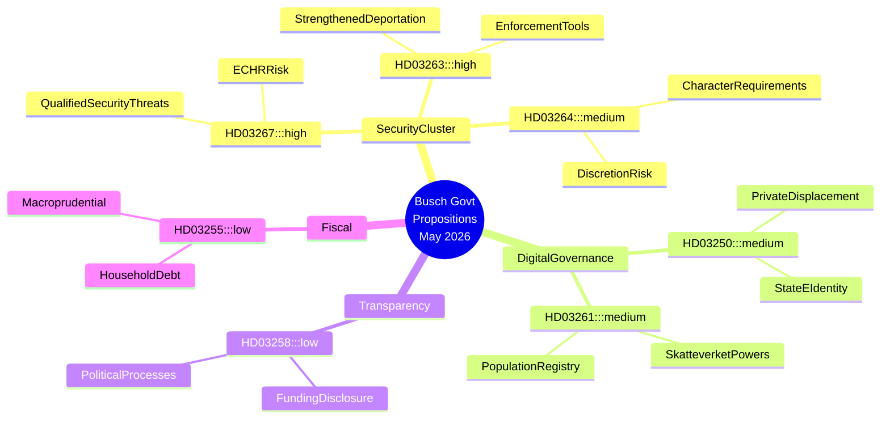

# La aceleración del Estado de seguridad de Suecia: el gobierno Busch impulsa el endurecimiento migratorio y la arquitectura de vigilancia digital

## Resumen

El gobierno Busch de Suecia presentó siete proposiciones legislativas importantes entre el 30 de abril y el 7 de mayo de 2026, que representan colectivamente la expansión más ambiciosa de los poderes de seguridad del Estado en una década. El clúster se centra en la criminalización de extranjeros que representan amenazas de seguridad cualificadas (HD03267), la institucionalización de la ejecución de decisiones de deportación (HD03263), el endurecimiento de los requisitos de conducta para los permisos de residencia (HD03264), la ampliación de los poderes de vigilancia del Skatteverket en el registro de población (HD03261) y el despliegue de una infraestructura de identidad electrónica estatal obligatoria (HD03250). La legislación sobre transparencia política (HD03258) ofrece un contrapeso, pero resulta insuficiente para compensar el riesgo para las libertades civiles creado por el clúster de seguridad. El cambio de gobierno — Lotta Edholm como Primera Ministra en funciones a finales de abril, Ebba Busch firmando formalmente las proposiciones de mayo el día 7 — coincide con esta aceleración legislativa, planteando preguntas sobre la realineación de la coalición y la influencia del SD en la agenda. Las Perspectivas de la Economía Mundial del FMI de abril de 2026 proyectan un crecimiento del PIB sueco de aproximadamente el 2,2 % para 2026 con un espacio fiscal modesto; las presiones económicas dan al gobierno cobertura política para priorizar la seguridad sobre las reformas estructurales.

## Decisiones que este documento apoya

1. **Equipos de estrategia de la oposición (S, MP, V, C)**: Determinar qué proposiciones impugnar en comité, sobre cuáles negociar enmiendas y dónde presentar reservas minoritarias — HD03267 y HD03261 conllevan el mayor riesgo constitucional y merecen solicitudes de revisión por parte del Lagrådet.
2. **Sociedad civil y organizaciones jurídicas (RFSU, Civil Rights Defenders, Amnesty Suecia)**: Priorizar los recursos de incidencia en HD03267 (riesgo de detención sin control judicial) y HD03261 (vigilancia masiva de datos de población).
3. **Comunidad empresarial (Tech Sverige, SN)**: Evaluar HD03250 (identidad electrónica estatal) tanto como carga regulatoria como oportunidad competitiva — los proveedores de identidad privados se enfrentan al desplazamiento o a la integración obligatoria.
4. **Órganos de supervisión de la UE (FRA, redes de la Comisión de Venecia)**: HD03267 y HD03264 ponen a prueba el cumplimiento de Suecia con el CEDH art. 8 (privacidad) y art. 3 (no devolución); se justifican alertas tempranas.

## Puntos de inteligencia en 60 segundos

- 🔴 **Amenazas de seguridad extranjeras** (HD03267): Motivos ampliados para la detención/expulsión de nacionales no comunitarios considerados «amenazas de seguridad cualificadas» — revisión KU/Lagrådet probable; riesgo CEDH art. 3/8 ALTO
- 🔴 **Ejecución de deportaciones** (HD03263): Nuevas herramientas administrativas para acelerar los procedimientos de expulsión, incluyendo mecanismos de cooperación de retorno forzoso — refleja interpretaciones de línea dura de la directiva de retorno de la UE
- 🟠 **Requisitos de conducta para permisos de residencia** (HD03264): Requisitos de conducta más estrictos crean una amplia discrecionalidad administrativa — riesgo de aplicación discriminatoria
- 🟠 **Identidad electrónica estatal** (HD03250): Infraestructura de identidad digital obligatoria emitida por el Estado; los proveedores de e-ID privados se enfrentan al desplazamiento; las cuestiones de soberanía de datos permanecen
- 🟠 **Registro de población del Skatteverket** (HD03261): Poderes de investigación y recopilación de datos ampliados en el folkbokföring — tensión entre libertades civiles y prevención del fraude
- 🟡 **Transparencia política** (HD03258): Comité KU; reglas reforzadas sobre divulgación de financiación política — reforma genuina pero alcance limitado a procesos formales de partidos
- 🟢 **Muestreo de deuda de hogares** (HD03255): Medida macroprudencial técnica para la supervisión de la deuda; baja relevancia política

## Principal desencadenante futuro

**Vigilar**: Respuesta del Lagrådet a HD03267 y HD03261 (esperada dentro de 4–6 semanas tras la presentación). Un yttrande crítico del Lagrådet por motivos constitucionales crearía una crisis de coalición entre M/KD y SD, retrasando o modificando potencialmente el clúster de seguridad. Supervisar: las remisiones de lagrådet.se la semana del 2026-06-01.

## Nivel de confianza

**ALTO** — Análisis basado en los textos primarios de las proposiciones (HD03267, HD03250, HD03258, HD03261, HD03263, HD03264, HD03255) recuperados de data.riksdagen.se el 2026-05-20. El contexto del cambio de gobierno (Lotta Edholm → Ebba Busch Primera Ministra) se infiere de la secuencia de firma de documentos; **MEDIO** nivel de confianza sobre la fecha exacta de la transición.

## Mapa de inteligencia Mermaid

<!-- source-sha: b23cd950c7dc1d61ab6255591f285cdfd3441ba4 -->
