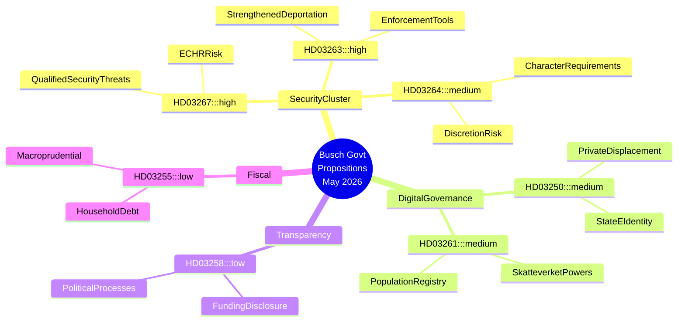

<!-- dir: rtl -->
# האצת מדינת הביטחון של שוודיה: ממשלת בוש מקדמת הידוק מדיניות ההגירה וארכיטקטורת המעקב הדיגיטלי

## תמצית מנהלים

ממשלת בוש השוודית הגישה שבע הצעות חוק מרכזיות בין ה-30 באפריל ל-7 במאי 2026, המהוות יחד את ההרחבה הנועזת ביותר של סמכויות הביטחון הממלכתיות בעשור. הצרור מתמקד בהפללת זרים המהווים איומי ביטחון מוכשרים (HD03267), במיסוד אכיפת החלטות גירוש (HD03263), בהחמרת דרישות ההתנהגות לאשרות שהייה (HD03264), בהרחבת סמכויות המעקב של רשות המסים (Skatteverket) במרשם האוכלוסין (HD03261), ובהטמעת תשתית זהות אלקטרונית ממלכתית חובה (HD03250). חקיקת שקיפות פוליטית (HD03258) מציעה משקל נגד, אך אינה מספקת לאזן את הסיכונים לחירויות האזרח שהצרור הביטחוני יוצר. החלפת הממשלה — לוטה אדהולם כראשת ממשלה בפועל בסוף אפריל, אבה בוש חותמת רשמית על הצעות מאי ב-7 בו — חופפת להאצה חקיקתית זו ומעלה שאלות לגבי יישור מחדש של הקואליציה והשפעת SD על סדר היום. תחזיות הכלכלה העולמית של קרן המטבע הבינלאומית מאפריל 2026 צופות צמיחת תמ"ג שוודית של כ-2.2% לשנת 2026 עם מרחב פיסקלי מצומצם; לחץ כלכלי מעניק לממשלה כיסוי פוליטי לתת עדיפות לביטחון על פני רפורמות מבניות.

## החלטות שמסמך זה תומך בהן

1. **צוותי אסטרטגיה של האופוזיציה (S, MP, V, C)**: קביעת אילו הצעות לערער עליהן בוועדה, על אילו תיקונים לנהל משא ומתן, והיכן להגיש הסתייגויות מיעוט — HD03267 ו-HD03261 נושאות את הסיכון החוקתי הגבוה ביותר וראויות לבקשות בחינת המועצה המחוקקת (Lagrådet).
2. **אזרחי החברה וארגונים משפטיים (RFSU, Civil Rights Defenders, אמנסטי שוודיה)**: מיקוד משאבי עריכת דין ב-HD03267 (סיכון למעצר ללא ביקורת שיפוטית) וב-HD03261 (מעקב המוני אחר נתוני אוכלוסין).
3. **קהילת העסקים (Tech Sverige, SN)**: הערכת HD03250 (זהות אלקטרונית ממלכתית) כנטל רגולטורי וכהזדמנות תחרותית כאחד — ספקי זהות פרטיים עלולים להיות מוחלפים או לעמוד בפני אינטגרציה חובה.
4. **גופי ניטור של האיחוד האירופי (FRA, רשתות ועדת ונציה)**: HD03267 ו-HD03264 בוחנות את עמידתה של שוודיה באמנה האירופית לזכויות האדם סעיף 8 (פרטיות) וסעיף 3 (אי-הרחקה); אזהרות מוקדמות מוצדקות.

## נקודות מודיעין ב-60 שניות

- 🔴 **איומי ביטחון זרים** (HD03267): הרחבת עילות מעצר/גירוש של אזרחי מדינות שאינן באיחוד האירופי המוגדרים "איומי ביטחון מוכשרים" — בחינת KU/Lagrådet סבירה; סיכון ECHR סעיפים 3/8 **גבוה**
- 🔴 **אכיפת גירוש** (HD03263): כלים מנהליים חדשים לזירוז הליכי הרחקה, כולל מנגנוני שיתוף פעולה בהחזרה כפויה — משקף פרשנויות קו קשה של הנחיית ההחזרה האירופית
- 🟠 **דרישות התנהגות לאשרת שהייה** (HD03264): דרישות נהגות מחמירות יוצרות שיקול דעת מנהלי רחב — סיכון ליישום מפלה
- 🟠 **זהות אלקטרונית ממלכתית** (HD03250): תשתית זהות דיגיטלית ממלכתית חובה; ספקי זהות אלקטרונית פרטיים עלולים להיות מוחלפים; שאלות ריבונות נתונים נותרות פתוחות
- 🟠 **מרשם האוכלוסין של Skatteverket** (HD03261): הרחבת סמכויות חקירה וגביית נתונים ב-folkbokföring — מתח בין חירויות אזרח ומניעת הונאה
- 🟡 **שקיפות פוליטית** (HD03258): ועדת KU; כללים מחמירים לגילוי מימון פוליטי — רפורמה אמיתית אך היקפה מוגבל לתהליכי מפלגות פורמליים
- 🟢 **דגימת חוב משקי בית** (HD03255): אמצעי מקרו-פרודנציאלי טכני לניטור חוב; חשיבות פוליטית נמוכה

## הדק עתידי מרכזי

**לנטר**: תגובת Lagrådet ל-HD03267 ו-HD03261 (צפויה תוך 4–6 שבועות מהגשה). yttrande ביקורתי מ-Lagrådet על בסיס חוקתי יוצר משבר קואליציוני בין M/KD ו-SD, עלול לעכב או לשנות את הצרור הביטחוני. לנטר: הפניות lagrådet.se בשבוע של 2026-06-01.

## רמת אמינות

**גבוהה** — ניתוח מבוסס על טקסטי הצעות ראשוניים (HD03267, HD03250, HD03258, HD03261, HD03263, HD03264, HD03255) שנשלפו מ-data.riksdagen.se ב-2026-05-20. הקשר החלפת הממשלה (לוטה אדהולם → אבה בוש ראשת ממשלה) מוסק מרצף חתימות המסמכים; **בינוני** אמינות לגבי תאריך המעבר המדויק.

## מפת מודיעין Mermaid

<!-- source-sha: b23cd950c7dc1d61ab6255591f285cdfd3441ba4 -->
