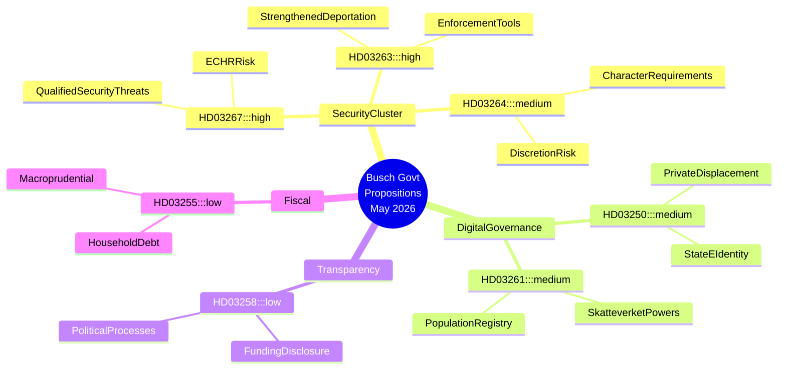

# Zweden's veiligheidsstaat versnelt: regering-Busch drijft migratieverscherping en digitale bewakingsarchitectuur door

## Samenvatting

De Busch-regering van Zweden diende tussen 30 april en 7 mei 2026 zeven grote proposities in die gezamenlijk de meest ambitieuze uitbreiding van staatsveiligheidsbevoegdheden in een decennium vormen. Het cluster richt zich op de criminalisering van buitenlanders die als gekwalificeerde veiligheidsbedreiging worden beschouwd (HD03267), de institutionalisering van de handhaving van uitwijzingsbeslissingen (HD03263), de aanscherping van de levenswandel-eisen voor verblijfsvergunningen (HD03264), de uitbreiding van de toezichtsbevoegdheden van de Skatteverket in het bevolkingsregister (HD03261) en de uitrol van een verplichte staatse e-identiteitsinfrastructuur (HD03250). Wetgeving over politieke transparantie (HD03258) biedt een tegenwicht, maar volstaat uiteindelijk niet om de risico's voor de burgerrechten die het veiligheidscluster met zich meebrengt, te compenseren. De regeringswisseling — Lotta Edholm als waarnemend premier eind april, Ebba Busch die de mei-proposities formeel op de 7e ondertekent — valt samen met deze wetgevingsversnelling en roept vragen op over coalitieheroriëntering en de invloed van SD op de agenda. Het IMF Wereld Economisch Vooruitzicht van april 2026 projecteert een Zweedse bbp-groei van circa 2,2 % voor 2026 met beperkte begrotingsruimte; de economische druk geeft de regering politieke dekking om veiligheid boven structurele hervormingen te stellen.

## Beslissingen die dit document ondersteunt

1. **Strategieteams van de oppositie (S, MP, V, C)**: Bepaal welke proposities in commissie betwist worden, over welke amendementen onderhandeld wordt en waar minderheidsbehouden worden ingediend — HD03267 en HD03261 dragen het hoogste constitutionele risico en verdienen verzoeken om Lagrådet-toetsing.
2. **Maatschappelijk middenveld en juridische organisaties (RFSU, Civil Rights Defenders, Amnesty Zweden)**: Prioriteer lobbyresources op HD03267 (risico op detentie zonder rechterlijke toetsing) en HD03261 (massabewaking van bevolkingsgegevens).
3. **Bedrijfsleven (Tech Sverige, SN)**: Beoordeel HD03250 (staatse e-identiteit) zowel als regulatoire last als als concurrentiemogelijkheid — private identiteitsaanbieders lopen het risico te worden verdrongen of verplicht te integreren.
4. **EU-toezichthouders (FRA, netwerken van de Commissie van Venetië)**: HD03267 en HD03264 testen de naleving door Zweden van EVRM art. 8 (privacy) en art. 3 (non-refoulement); vroege waarschuwingen zijn gerechtvaardigd.

## 60-seconden inlichtingenpunten

- 🔴 **Veiligheidsbedreigende buitenlanders** (HD03267): Uitgebreide gronden voor detentie/uitzetting van niet-EU-onderdanen die als "gekwalificeerde veiligheidsbedreigingen" worden beschouwd — KU/Lagrådet-toetsing waarschijnlijk; EVRM art. 3/8-risico HOOG
- 🔴 **Handhaving uitzetting** (HD03263): Nieuwe administratieve instrumenten om uitwijzingsprocedures te versnellen, inclusief mechanismen voor gedwongen terugkeersamenwerking — weerspiegelt harde interpretaties van de EU-terugkeerrichtlijn
- 🟠 **Levenswandel-eisen verblijfsvergunning** (HD03264): Strengere levenswandel-eisen creëren ruime administratieve beoordelingsruimte — risico op discriminerende toepassing
- 🟠 **Staatse e-identiteit** (HD03250): Verplichte staatelijk uitgegeven digitale identiteitsinfrastructuur; private e-ID-aanbieders lopen het risico te worden verdrongen; vragen over datasoevereiniteit blijven
- 🟠 **Skatteverket bevolkingsregister** (HD03261): Uitgebreide onderzoeks- en gegevensverzamelingsbevoegdheden in de folkbokföring — spanning tussen burgerrechten en fraudebestrijding
- 🟡 **Politieke transparantie** (HD03258): KU-commissie; aangescherpte regels voor openbaarmaking van politieke financiering — echte hervorming maar reikwijdte beperkt tot formele partijprocessen
- 🟢 **Steekproef huishoudsschulden** (HD03255): Technische macroprudentiële maatregel voor schuldbewaking; lage politieke relevantie

## Belangrijkste toekomstige trigger

**Monitor**: Lagrådet-reactie op HD03267 en HD03261 (verwacht binnen 4–6 weken na indiening). Een kritisch yttrande van het Lagrådet op constitutionele gronden zou een coalitiecrisis tussen M/KD en SD veroorzaken, wat mogelijk leidt tot vertraging of wijziging van het veiligheidscluster. Monitor: lagrådet.se-verwijzingen in de week van 2026-06-01.

## Betrouwbaarheidsniveau

**HOOG** — Analyse gebaseerd op primaire propositieteksten (HD03267, HD03250, HD03258, HD03261, HD03263, HD03264, HD03255) opgehaald van data.riksdagen.se op 2026-05-20. De context van de regeringswisseling (Lotta Edholm → Ebba Busch premier) is afgeleid uit de ondertekeningssequentie van documenten; **MEDIUM** betrouwbaarheid over de exacte overgansdatum.

## Mermaid inlichtingenkaart

<!-- source-sha: b23cd950c7dc1d61ab6255591f285cdfd3441ba4 -->
