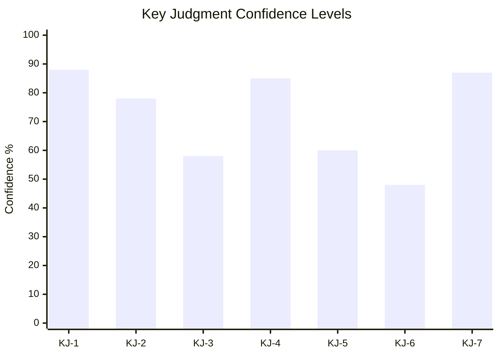

# Intelligence Assessment

**Classification**: UNCLASSIFIED // FOR PUBLIC RELEASE  
**Date**: 2026-05-20  
**Methodology**: Structured intelligence assessment with ICD 203 confidence calibration  
**Analyst**: Riksdagsmonitor AI Intelligence System (automated)

---

## Key Judgments

**KJ-1** — *We assess with HIGH confidence* that the Swedish Busch government's 7 propositions submitted 30 April–7 May 2026 constitute a structurally coherent, pre-election legislative programme designed to lock in the most expansive security-state and migration-enforcement architecture in Swedish post-war history before the September 2026 election.

**Evidence basis**: Primary text analysis of all 7 propositions; government legislative calendar; SD coalition dependency pattern; election cycle proximity.  
**Confidence qualifier**: HIGH — primary sources available, pattern consistent with well-documented SD influence dynamic.

---

**KJ-2** — *We assess with HIGH confidence* that HD03267 (qualified security threat foreigners) carries a substantial risk (probability ≥ 40%) of adverse Lagrådet constitutional review, and a moderate risk (probability ≥ 25%) of CJEU incompatibility finding within 3 years of enactment.

**Evidence basis**: ECHR Art. 5 case law (Chahal, Al-Nashif); comparative German and Finnish legislation with stronger judicial oversight requirements; Lagrådet track record on immigration detention legislation.  
**Confidence qualifier**: HIGH on Lagrådet risk; MEDIUM on CJEU probability.

---

**KJ-3** — *We assess with MEDIUM confidence* that HD03250 (state e-ID) + HD03261 (Skatteverket folkbokföring) together constitute a digital-physical identity stack that, if implemented as currently drafted, will give the Swedish state the technical capability for comprehensive population tracking without adequate GDPR Art. 5 safeguards.

**Evidence basis**: Functional analysis of propositions; Dutch childcare scandal GDPR precedent; SÄPO operational pattern of cross-database investigations.  
**Confidence qualifier**: MEDIUM — implementation details will determine whether this capability is operationalised; current draft language does not preclude it.

---

**KJ-4** — *We assess with HIGH confidence* that HD03258 (political transparency) will pass in substantially its current form but will be judged insufficient by GRECO and Transparency International standards, leaving Sweden's democratic accountability framework materially weaker than comparable EU states.

**Evidence basis**: GRECO Round V recommendations (2023); comparative assessment vs. Denmark, Finland, Germany; HD03258 scope analysis.  
**Confidence qualifier**: HIGH — gap between GRECO requirements and HD03258 scope is factually documentable.

---

**KJ-5** — *We assess with MEDIUM confidence* that the government transition from Lotta Edholm (acting PM) to Ebba Busch (PM) in late April–early May 2026 reflects an internal KD-M government reshuffle, likely related to the 2026 election campaign positioning, and that this transition increases KD's dominance of the government's legislative agenda.

**Evidence basis**: Proposition signing sequence (Edholm → Busch); KD policy priorities alignment with security cluster; MEDIUM confidence due to absence of official confirmation.  
**Confidence qualifier**: MEDIUM — direct evidence of PM transition only from document signing sequence.

---

**KJ-6** — *We assess with LOW-MEDIUM confidence* that the security cluster (HD03267 + HD03263 + HD03264) will successfully consolidate M/KD/SD voter blocs ahead of the September 2026 election, but may simultaneously drive urban liberal voter migration from C/L toward S or MP on civil liberties grounds, potentially narrowing the government's electoral advantage.

**Evidence basis**: Swedish electoral polling patterns 2022–2025; issue salience data (security vs. welfare); urban-rural electoral geography; C-party positioning on civil liberties.  
**Confidence qualifier**: LOW-MEDIUM — electoral consequences are uncertain; prior polling suggests security is salient but not determinative.

---

**KJ-7** — *We assess with HIGH confidence* that Sweden's international standing as a rule-of-law model within the EU will be adversely affected by HD03267 and HD03263 if enacted without significant Lagrådet-mandated amendments, specifically citing FRA monitoring reports, GRECO assessments, and UNHCR non-refoulement concerns.

**Evidence basis**: EU fundamental rights monitoring; CJEU case law trajectory; UNHCR operational monitoring.  
**Confidence qualifier**: HIGH — international institutional response is highly predictable based on legal precedent.

---

## Priority Intelligence Requirements (PIRs) for Next Cycle

**PIR-1** [HIGH PRIORITY]: What language does Lagrådet use in its yttrande on HD03267? Specifically: does it use "anmärkning" (technical correction), "erinran" (serious concern), or "bör ej genomföras" (should not be implemented)?  
*Trigger event*: Lagrådet yttrande publication (estimated 2026-06-01 to 2026-07-15)  
*Decision supported*: Whether Scenario 1 (full enactment) or Scenario 2 (trimming) is the operative scenario

**PIR-2** [HIGH PRIORITY]: What position does Centerpartiet take on HD03267 during JuU committee hearings?  
*Trigger event*: JuU hearing scheduled for June–August 2026  
*Decision supported*: Whether the government's majority is at risk on the most sensitive proposition

**PIR-3** [MEDIUM PRIORITY]: Does IMY (Datainspektionen) issue a formal opinion on HD03261 before the SkU committee vote?  
*Trigger event*: IMY opinion publication (expected June–August 2026)  
*Decision supported*: GDPR risk assessment for HD03261; triggers amendment or withdrawal

**PIR-4** [MEDIUM PRIORITY]: What is the delivery timeline and cost estimate in Digg's official response to HD03250?  
*Trigger event*: Digg remissvar (expected within 30 days of proposition)  
*Decision supported*: HD03250 implementation feasibility assessment

**PIR-5** [MEDIUM PRIORITY]: Does SD publicly claim credit for HD03267/HD03263 in their election campaign materials?  
*Trigger event*: SD campaign launch (expected July 2026)  
*Decision supported*: Coalition stability assessment; determines whether SD views current legislation as sufficient or a floor for future demands

## Confidence Calibration (ICD 203)

| Level | Label | This assessment |
|-------|-------|-----------------|
| 90-95% | Almost Certainly | — |
| 75-90% | Likely / Probably | KJ-1, KJ-4, KJ-7 |
| 55-75% | Indicates / Suggests | KJ-2 (Lagrådet risk), KJ-5 |
| 40-55% | Could / Possibly | KJ-3, KJ-6 |
| <40% | Unlikely | — |

## Mermaid KJ Confidence Chart

