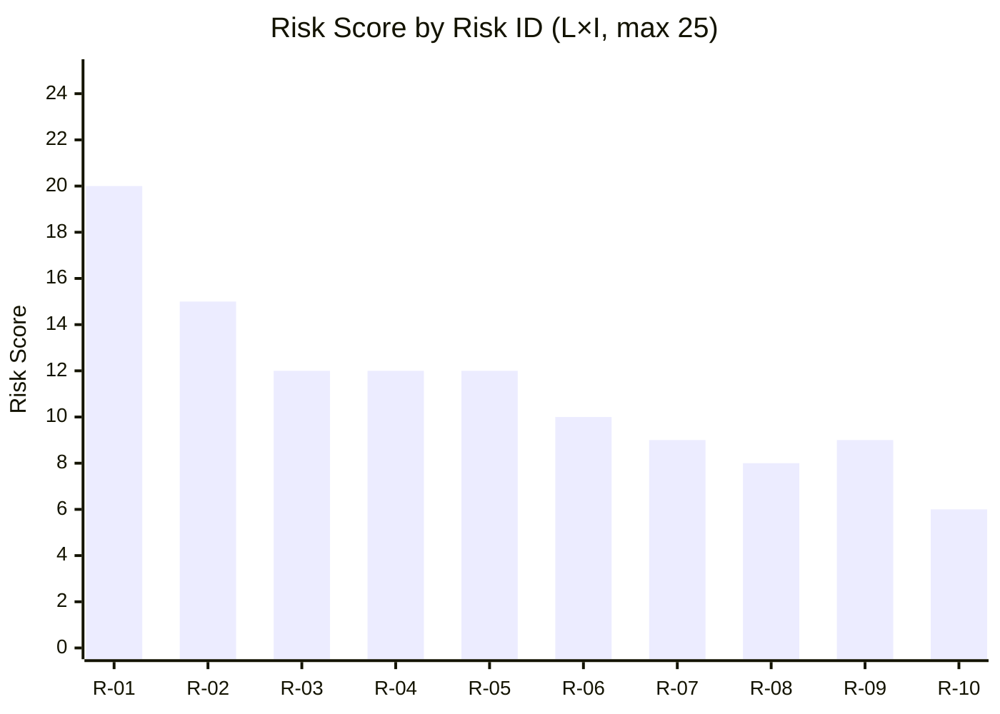

# Risk Assessment

**Framework**: 5-Dimension Legislative Risk Register  
**Scale**: Likelihood (L) × Impact (I) — each 1–5; Risk Score = L × I  
**Date**: 2026-05-20

## Risk Register

| Risk ID | Risk Description | Affected Propositions | L (1-5) | I (1-5) | Score | Category |
|---------|-----------------|----------------------|---------|---------|-------|----------|
| R-01 | Lagrådet issues critical yttrande on HD03267 citing ECHR Art. 5 incompatibility | HD03267 | 4 | 5 | **20** | Constitutional |
| R-02 | CJEU preliminary ruling invalidates key detention provision in HD03267 post-enactment | HD03267 | 3 | 5 | **15** | Legal/EU |
| R-03 | HD03250 state e-ID implementation fails to meet eIDAS 2 deadline (end-2026) | HD03250 | 3 | 4 | **12** | Delivery |
| R-04 | HD03261 challenged under GDPR Art. 5(1)(c) data minimisation principle | HD03261 | 3 | 4 | **12** | Legal |
| R-05 | SD demands further amendments to HD03263/HD03264 beyond Lagrådet-cleared scope | HD03263, HD03264 | 4 | 3 | **12** | Coalition |
| R-06 | Data breach in HD03250 infrastructure during implementation triggers public trust collapse | HD03250 | 2 | 5 | **10** | Operational |
| R-07 | Opposition (S+MP+V) successfully frames package as "surveillance state" — swing voter loss | All | 3 | 3 | **9** | Political |
| R-08 | HD03261 expansion of Skatteverket powers triggers civil society constitutional complaint (RF Chapter 2) | HD03261 | 2 | 4 | **8** | Constitutional |
| R-09 | HD03258 transparency scope judged inadequate by GRECO (Council of Europe anti-corruption body) | HD03258 | 3 | 3 | **9** | International |
| R-10 | HD03255 household debt data reveals systemic vulnerability, triggering premature financial stability concerns | HD03255 | 2 | 3 | **6** | Macroprudential |

## Top-5 Risk Narratives

**R-01 (Score 20 — Critical)**: The qualified security threat threshold in HD03267 risks crossing the line established by ECtHR in *Chahal v UK* and *Al-Nashif v Bulgaria* — specifically the requirement that detention must be subject to effective judicial review even when classified intelligence is the basis. If Lagrådet finds that HD03267 allows executive-branch detention without adequate judicial oversight, the government will either need to amend fundamentally (delaying by 6–12 months, beyond the election) or risk passing legally vulnerable legislation that will be challenged in Swedish courts immediately upon enactment.

**R-02 (Score 15 — High)**: Sweden's courts have a tradition of referring EU law questions to CJEU when migration law conflicts with EU Charter Art. 47 (effective remedy). HD03267 combined with HD03263 creates a dual-track system that could face challenge within 12–24 months of enactment, resulting in EU law primacy overriding the national legislation.

**R-03 (Score 12 — High)**: The state e-ID (HD03250) requires coordination between Bolagsverket (operator), Digg (standards), eSam (government interoperability), and banking sector APIs. The EU's eIDAS 2 wallet deadline (end-2026/early-2027) creates a hard external constraint. Swedish government IT procurement has a poor track record (Arbetsförmedlingen SPS 2022, Polisen IT 2020, Migrationsverket 2019 — all delayed/over-budget). Cost overrun probability HIGH; timeline slippage MEDIUM-HIGH.

**R-04 (Score 12 — High)**: Skatteverket's expanded data collection in HD03261 requires processing of sensitive personal data (address, family structure, immigration status) for purposes beyond the original folkbokföring mandate. GDPR Art. 5(1)(b) purpose limitation and Art. 5(1)(c) data minimisation create a compliance challenge. The Data Protection Authority (IMY) may issue a critical opinion before the proposition reaches its committee stage.

**R-05 (Score 12 — High)**: SD has a demonstrated pattern of using government-dependency leverage to extract legislative concessions beyond what coalition agreements specify. With an election approaching, SD will assess whether the current security package is sufficient to satisfy their voter base. If polling shows SD losing voters to more extreme parties, SD may demand HD03263/HD03264 amendments that M/KD find constitutionally unacceptable.

## Mermaid Risk Matrix

## Risk Mitigation Options

| Risk ID | Recommended Mitigation | Responsible Actor | Timeframe |
|---------|------------------------|-------------------|-----------|
| R-01 | Pre-submit informal Lagrådet consultation; insert explicit judicial review safeguard | Justice Ministry | Before formal submission |
| R-02 | Add compatibility clause referencing CJEU Art. 6 CFR baseline | Justice Ministry + Legal Affairs | Committee stage |
| R-03 | Commission independent delivery assurance review; publish milestone timeline | Finance Ministry + Digg | Within 30 days of proposition |
| R-04 | Request IMY (Data Protection Authority) formal opinion before committee vote | Finance Ministry | Immediately |
| R-05 | Pre-emptive coalition agreement addendum locking SD to current package scope | PMO | Before committee stage |
