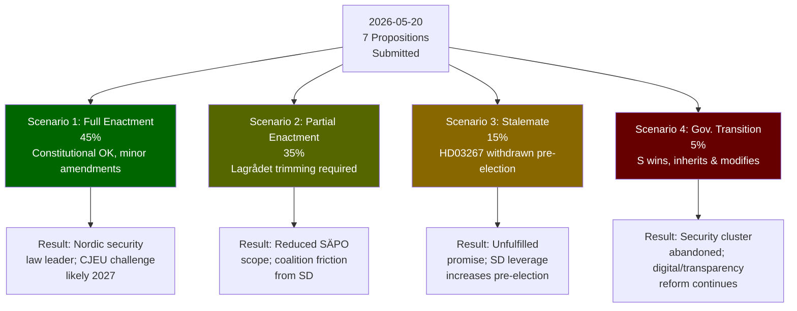

# Scenario Analysis

**Framework**: Scenario Tree — 2026-05-20 Propositions  
**Horizon**: T+12 months (to 2027-05)  
**Probability**: All scenarios sum to 100%  
**Date**: 2026-05-20

## Scenario Tree

### Scenario 1: Full Enactment — Security State Consolidation (45%)

**Premise**: Lagrådet raises technical objections to HD03267 but not fatal ones; government accepts minor amendments. All 7 propositions pass with small modifications in autumn 2026. Ebba Busch wins re-election or enters caretaker period. Implementation begins 2027.

**Key conditions required**:
- Lagrådet does not issue a fatal constitutional finding (>60% probability)
- SD does not escalate demands beyond current scope (>70% probability)
- No major security incident that backfires (e.g., security threat designation misapplied to activist)
- S wins election but cannot form majority → legislation already enacted

**Observable indicators**:
- JuU committee publishes betänkande with majority recommendation by October 2026
- No HD03267 minority reservation from C
- Lagrådet yttrande published with "no fundamental objection" language

**Consequences**:
- Sweden has the most restrictive qualified security threat legislation in Nordic region
- Skatteverket and Migrationsverket integration begins 2027
- State e-ID operational by late 2027
- CJEU challenge likely filed by MP/civil society by 2027

---

### Scenario 2: Partial Enactment — Constitutional Trimming (35%)

**Premise**: Lagrådet issues a critical yttrande on HD03267, requiring government to amend the detention threshold significantly. HD03261 faces IMY challenge forcing GDPR compliance amendments. Result: security cluster passes in diluted form; HD03250 and HD03258 pass unchanged; HD03261 amended significantly.

**Key conditions required**:
- Lagrådet finds specific HD03267 provisions incompatible with RF Chapter 2 or ECHR
- IMY issues formal opinion on HD03261 scope
- Government accepts amendments to avoid full delay

**Observable indicators**:
- Lagrådet yttrande uses "anmärkning" (critical observation) language on HD03267 detention provisions
- JuU committee hearing includes constitutional law professors via KU referral
- Finance Ministry requests IMY opinion within 30 days

**Consequences**:
- HD03267 passes with lower detention threshold; SÄPO capability reduced but not eliminated
- HD03261 passes with data minimisation additions; Skatteverket expansion constrained
- Government faces "watered down security" criticism from SD
- C (Centerpartiet) votes for amended package — effective majority widens slightly

---

### Scenario 3: Legislative Stalemate — Election-Year Delay (15%)

**Premise**: Lagrådet issues a severe critical yttrande (kritisk anmärkning) on HD03267 that would require fundamental reworking. Government decides not to pursue amendments given election timeline. HD03267 is withdrawn and resubmitted for next riksmöte. HD03258 and HD03250 pass. HD03261 modified. Weaker migration package enacted.

**Key conditions required**:
- Lagrådet finds HD03267 incompatible with ECHR Art. 5 in a way that cannot be patched with minor amendments
- Strömmer decides reputational cost of overriding Lagrådet exceeds cost of delay
- SD accepts the delay as a "promise for next term" rather than triggering a confidence crisis

**Observable indicators**:
- Lagrådet yttrande uses "bör ej genomföras" (should not be implemented) language
- Government press conference reframes timeline: "We will strengthen this in the next term"
- SD leader statement of "understanding" rather than "support" for delay

**Consequences**:
- Government enters election with unfulfilled security promise — risk of SD voter leakage
- HD03250 and HD03258 become the government's legacy achievements
- S gains narrative: "M/KD promised security, delivered bureaucracy"

---

### Scenario 4: Government Transition — S-led Government Inherits Propositions (5%)

**Premise**: Ebba Busch government falls (confidence motion or election loss) before propositions are enacted. S leads a new government. S withdraws HD03267 and significantly modifies HD03261 and HD03264. HD03250, HD03258, HD03255 adopted by new government.

**Key conditions required**:
- S wins September 2026 election with sufficient margin to form government with MP+V+C
- S government withdraws security cluster propositions
- Digital and transparency propositions adopted as cross-partisan reforms

**Observable indicators**:
- Polls showing S+MP+V+C exceeding 175 seats from July 2026
- S election manifesto explicitly pledges to "revise" HD03267 and HD03263

**Consequences**:
- Security legislation indefinitely delayed or substantially rewritten
- Sweden rebalances toward European mainstream on migration enforcement
- HD03250 (state e-ID) adopted by S government as their own digital agenda
- FRA/UNHCR commend Swedish course correction

---

### Scenario 5: Accelerated Enactment — Emergency Framing (0%)

*(Not assigned probability — contingent on major security incident; structurally possible)*

**Premise**: A major security incident before committee completion (e.g., terrorist attack attributed to a "qualified security threat" individual not covered by current law) triggers emergency legislative procedures. All propositions accelerated to urgent first reading. HD03267 enacted within 30 days under RF Chapter 7 expedited procedures.

---

## Mermaid Scenario Tree

